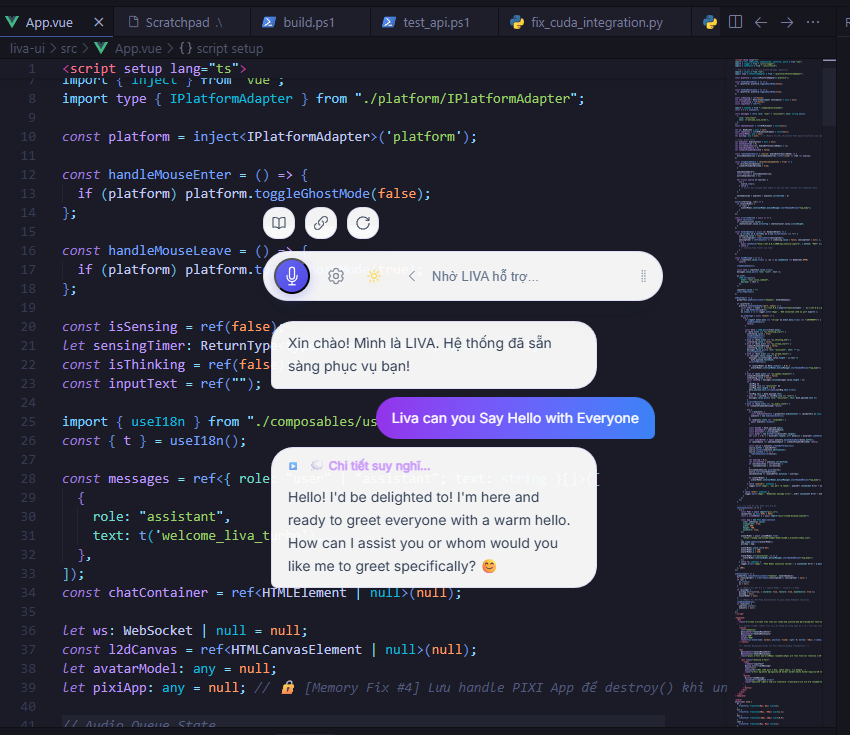
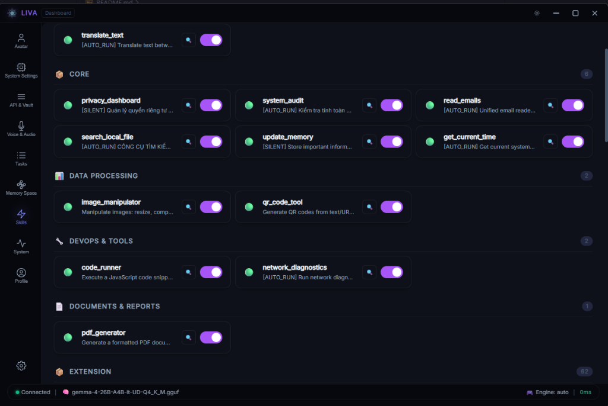
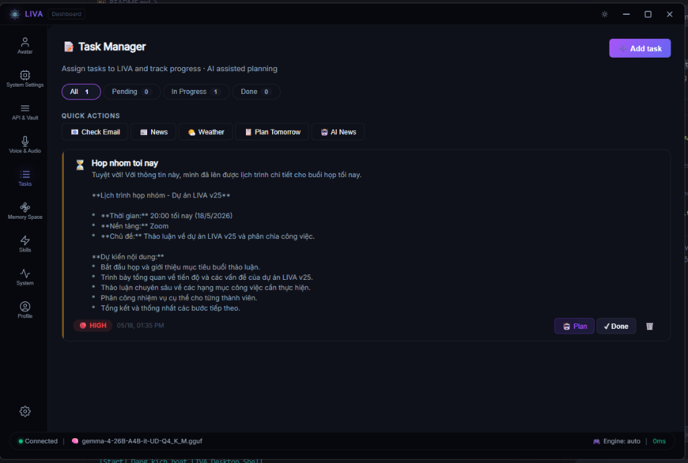
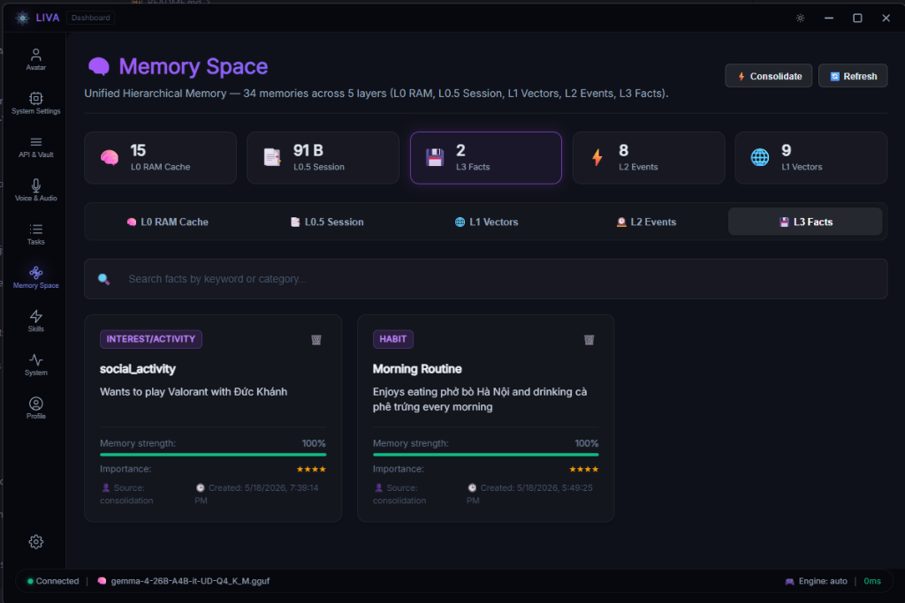
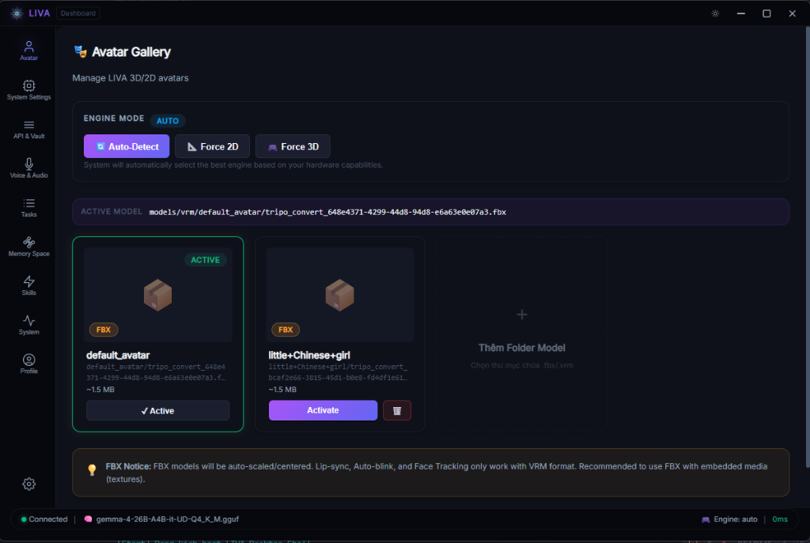

<div align="center">

  # LIVA - The AI Assistant 🧠
  *A Versatile Personal Assistant (Jarvis) - A Foundation for a Cognitive OS*

  [](https://github.com/DuongNAD/LIVA/stargazers)
  [](https://github.com/DuongNAD/LIVA/network/members)
  [](LICENSE)

</div>

## 👨‍💻 About the Author
Hello! I'm **Nguyen Anh Duong**, currently a student at **FPT University Hanoi**. 
**LIVA** is currently a Personal AI Assistant (inspired by Jarvis from Iron Man). This project is my passion and marks my first steps on the journey to research and build a true **Cognitive Operating System (Cognitive OS)** in the future.

Since this is a large-scale project built by a single individual, there will inevitably be shortcomings. I highly appreciate and welcome support, feedback, and **code contributions (Pull Requests)** from the community to jointly optimize, upgrade, and perfect this project!

---

## 🚀 Technical Highlights
LIVA is built with cutting-edge technologies to deliver the experience of a "living assistant" rather than a sluggish response bot:

- ⚡ **Zero-Latency Architecture:** By completely decoupling the mutex locks (`_engine_mutex` and `_embed_mutex`) inside the Native Engine, LIVA can simultaneously call Embedding functions to store memory and Stream text responses to the user. This technique entirely eliminates bottlenecks, achieving a Time-To-First-Token (TTFT) of **less than 100ms**.
- 👁️ **Ghost Mode UI:** Utilizing Tauri v2 and Rust, LIVA runs on the operating system as a transparent Overlay. Users can monitor the AI working while still being able to click through the AI window to interact with other software underneath.
- 🧠 **Memory Dashboard:** A 2D graphical interface that visualizes data flowing through RAM (L0), Session (L1), and Facts (L2) in real-time via WebSockets. You can literally "see" LIVA's chain of thought and memory processes.
- 🎙️ **Native Speech:** Deeply integrated with Whisper (Speech-to-Text) and Kokoro (Text-to-Speech) models for natural voice communication without relying on external network APIs.

---

## 🖼️ System Screenshots
<p align="center">
  
  
</p>
<p align="center">
  
  
</p>
<p align="center">
  
  
</p>

---

## 🧩 Multi-tier Memory System
One of the most defining and proudest core features of LIVA is its **Brain-Simulating Memory Architecture**. Instead of stuffing the entire chat history into a Prompt (which consumes Tokens, causes lag, and confuses the AI), LIVA divides its memory into 5 distinct tiers managed by the ultra-lightweight `SQLite-Vec` vector database:

1. **Tier L0 (Working RAM):** 
   - **Function:** Acts as a temporary buffer, similar to human working memory.
   - **Mechanism:** Stores temporary variables, open UI states, and currently executing commands. Data in this tier is completely "invisible" to the Prompt and is flushed immediately when a task finishes to save resources.

2. **Tier L0.5 (Context Buffer):**
   - **Function:** The bridge between temporary buffer and short-term memory.
   - **Mechanism:** Retains crucial information from recently completed tasks or Tool Calls (e.g., web search results, system analysis data). This helps the AI maintain its Chain-of-Thought instantly without dumping raw data back into the main chat history.

3. **Tier L1 (Session Memory):**
   - **Function:** Stores the context of the current conversation.
   - **Mechanism:** Retains the last 10-20 exchanges. When L1 is full or the session ends, LIVA triggers a background process (Reflection Daemon) to distill key points, extract learnings, and push them down to Tier L2. This keeps the Context Window optimal and lightning-fast.

4. **Tier L2 (Semantic Vector Memory):**
   - **Function:** Permanent memory containing "Facts," user preferences, and learned system knowledge.
   - **Mechanism:** All data is encoded into multidimensional Vectors (Embeddings) and stored in SQLite files. When a user asks about a past topic, the Semantic Router performs a Similarity Search to retrieve that exact memory fragment from L2 and injects it into the current context with millisecond latency.

5. **Tier L3 (Consolidation Archive):**
   - **Function:** Compresses and structures knowledge to form core cognition.
   - **Mechanism:** Usually runs in the background at night (Nightly Cron) or when idle. The AI reviews the entire L2, connects fragmented pieces of information, recognizes user habits, and archives them securely as a Knowledge Graph.

---

## 🏗️ Modern Monorepo Architecture
The project is strictly designed following the **Single Responsibility Principle (SRP)** and is divided into 4 main modules:

### 1. `liva-gateway` (Node.js / TypeScript)
- Acts as the "Central Brain" orchestrating all processes. Manages the Decision Loop (`AgentLoop`) and memory administration (`StructuredMemory`).
- Houses a massive ecosystem of **78+ skills** following the **Model Context Protocol (MCP)**, allowing the AI to search the internet, send emails, perform RPA, and even code autonomously.
- **Self-Correction:** When a tool fails, the system automatically analyzes the error code, deduces the root cause, and finds alternative solutions without crashing.

### 2. `liva-ai-engine` (Python / C++)
- The "Core Engine" (Native AI Engine) optimized to run directly on personal computers. Uses `llama.cpp` (C++) to maximize inference performance using GPU VRAM.
- Achieves **Zero-Latency** memory writing while speaking by isolating thread locks.

### 3. `liva-desktop` (Tauri v2 / Rust / Vue 3)
- An ultra-lightweight Desktop application providing a real-time 2D Memory Dashboard.
- Offers interactive Widgets and supports "Ghost Mode" (click-through transparency).

### 4. `packages/liva-common`
- A shared library containing Type definitions and Interfaces synced between Frontend and Backend.

---

## 🧰 MCP Skills Ecosystem
LIVA is equipped with a massive ecosystem of over **78+ skills** running under the **Model Context Protocol (MCP)**. This system transforms the AI from a standard chatbot into an **Agentic AI** capable of manipulating the real world:

### 1. 💻 OS & File System Management
- **Advanced File Operations:** `read_file`, `write_file`, `list_dir`, `grep_search`.
- **Code Editor:** Supports `replace_file_content` and `multi_replace_file_content` for smart source code modification.
- **System Execution:** `ExecuteCommand` allows running any Terminal/PowerShell command.
- 🛡️ **HITL (Human-in-the-Loop) Security:** All file deletion or dangerous execution operations are automatically blocked until the user types `y/yes` in the terminal to confirm.

### 2. 🤖 AI Software Engineer
Inspired by *The AI Scientist*, LIVA can act as a Senior Developer:
- **GitNexus Automation:** Automatically evaluates code modification risks (Blast Radius) using `gitnexus_impact` before altering any function.
- **Self-Correction Loop:** Runs Tests/Lints, reads error logs, reflects on the cause, and rewrites broken code until it works.
- **Planning & Reporting:** Uses `PlanWriter` to break down large features and `ReportWriter` to generate Markdown documentation.

### 3. 💬 RPA Communication
- **Zalo RPA (Exclusive):** Auto-reads unread messages, classifies customers, and replies based on scripts.
- **Facebook Messenger:** Extracts contact information and auto-replies to comments/messages.
- **Email Management:** Connects via IMAP/SMTP to read inboxes, summarize long emails, filter spam, and draft professional replies.

### 4. 📊 Google Workspace Ecosystem
- **Google Sheets:** Auto-reads, updates data, and formats spreadsheets.
- **Google Docs & Drive:** Auto-inserts text, drafts contracts, searches and manages cloud files.
- **Local Data Analysis:** Uses `pdf_parser` and `csv_analyzer` to extract data from internal reports.

### 5. 🌐 Web Mining
- **Real-time Web Search:** Queries up-to-date news, gold prices, and stocks.
- **Headless Browser:** Opens a stealth browser to click buttons, fill forms, and scrape data from complex websites.

---

## 🛠 Step-by-Step Installation & Usage Guide

### Step 1: Prerequisites
- **Node.js**: Version 22.x or higher (ESM support).
- **Python**: Version 3.10 or 3.11 (ensure "Add Python to PATH" is checked).
- **Browser**: Google Chrome installed (for RPA control).
- **Hardware**: Minimum 16GB RAM.
- **GPU**: NVIDIA (CUDA supported) with **minimum 8GB VRAM (12GB Recommended)** for smooth Native Engine inference.
- **Dual-Model Architecture**: The project uses a dual-model routing architecture (in `.gguf` format) to optimize both speed and reasoning depth:
  - **Model Router (Fast Logic & Navigation):** Recommended `Gemma 4 E4B`.
  - **Model Heavy (Deep Reasoning & Communication):** Recommended `Gemma 26B`.

### Step 2: Download and Install
Open Terminal / PowerShell and run:

```bash
# 1. Clone the repository
git clone https://github.com/DuongNAD/LIVA.git
cd LIVA

# 2. Install Node.js packages for the entire Monorepo
npm install

# 3. Install Python dependencies for the AI Engine
cd liva-ai-engine
pip install -r requirements.txt
cd ..
```

### Step 3: Environment Variables
1. Navigate to the `liva-gateway/` directory.
2. Copy `.env.example` to `.env`.
3. Fill in the required API Keys (e.g., `OPENAI_API_KEY`, `ANTHROPIC_API_KEY`, or local Model paths).

### Step 4: Run the System
Return to the project root (`LIVA/`), open PowerShell as **Administrator** (required for OS window management), and execute:

```powershell
.\start.ps1
```

**The startup process is fully automated:**
1. Creates a Python virtual environment (`venv`) and installs `requirements.txt`.
2. Checks and frees necessary network ports (8082, 8100, 5173).
3. Initializes Whisper STT, C++ Native AI Engine, and Kokoro Voice Engine.
4. Launches the LIVA Tauri Desktop UI.

### Step 5: How to Use
- **Basic Interaction:** Click the chat bar to type commands or use the Microphone to talk.
- **Memory Dashboard:** Open the Dashboard on the UI to observe data flowing between L1 and L2. You can see what the AI is thinking and which Tools it's using in the background.
- **Ghost Mode:** The interface is transparent. You can interact with other applications underneath LIVA without interruption.

---

## 🤝 Contributing
Transforming **LIVA** from a personal assistant into a complete **Cognitive OS** is a long journey. I highly welcome and appreciate any support from the developer community:

- **Issues:** If you encounter bugs, please open an Issue.
- **Optimization:** Help is needed to improve Rust (Tauri) performance, refine System Prompts, or optimize `llama.cpp` speed and memory management.
- **Pull Requests:** Write new MCP Skills (e.g., Smarthome control, new API integrations) or upgrade the 2D Dashboard.

### How to contribute
If you want to propose upgrades or modify the source code, please follow the standard open-source workflow:
1. **Fork** this project to your GitHub account.
2. Create a new branch for your feature: `git checkout -b feature/AmazingFeature`
3. Commit your changes: `git commit -m 'feat: Add AmazingFeature'`
4. Push to your branch: `git push origin feature/AmazingFeature`
5. Open a **Pull Request (PR)** to the original LIVA repository. I will review, discuss, and merge your code into the main project!

*(Despite some commercial restrictions, you are completely free to contribute code back to this main repository so we can build a stronger LIVA together!)*

---

## 🛡️ License
This project is the intellectual property of **Nguyen Anh Duong** and is protected under a **Personal & Internal Use License**.
- You are **PERMITTED** to download, use, learn, upgrade, and modify for personal purposes.
- You are **STRICTLY PROHIBITED** from republishing, copying to share publicly as a new project, commercializing, selling, or providing it as a Service (SaaS).

For specific details, please read the [`LICENSE`](LICENSE) file.

---

## 🙏 Acknowledgments
The LIVA project is built on the inheritance of and standing on the shoulders of giants. A deep thank you to the open-source communities, scientific paper authors, and amazing projects that provided the foundational technology or code snippets that inspired LIVA, notably:

**Research Papers:**
- Strongly inspired by the research paper *"The AI Scientist: Towards Fully Automated Open-Ended Scientific Discovery"*, which helped shape and build the Autonomous Coding loop (AI Scientist) for the project.
- In-depth research on **Cognitive Architecture**, **Self-Reflection**, and **Semantic Memory**, laying the groundwork for the L0-L3 multi-tier memory system.

**Open-Source Core:**
- The **llama.cpp** community for an ultra-fast AI Engine maximizing local hardware.
- The **Tauri** and **Vue 3** teams for the ultra-lightweight Desktop UI framework.
- The **SQLite-Vec** source code supporting the local Vector query system.
- Open-source AI models from **Google (Gemma)**, **Qwen**, **Meta**.
- And countless other small open-source libraries that contributed to the massive ecosystem of LIVA today.
