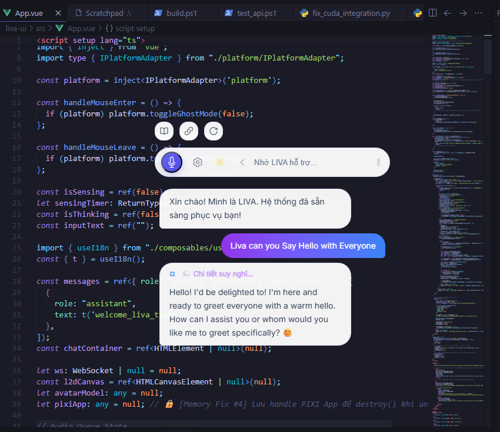
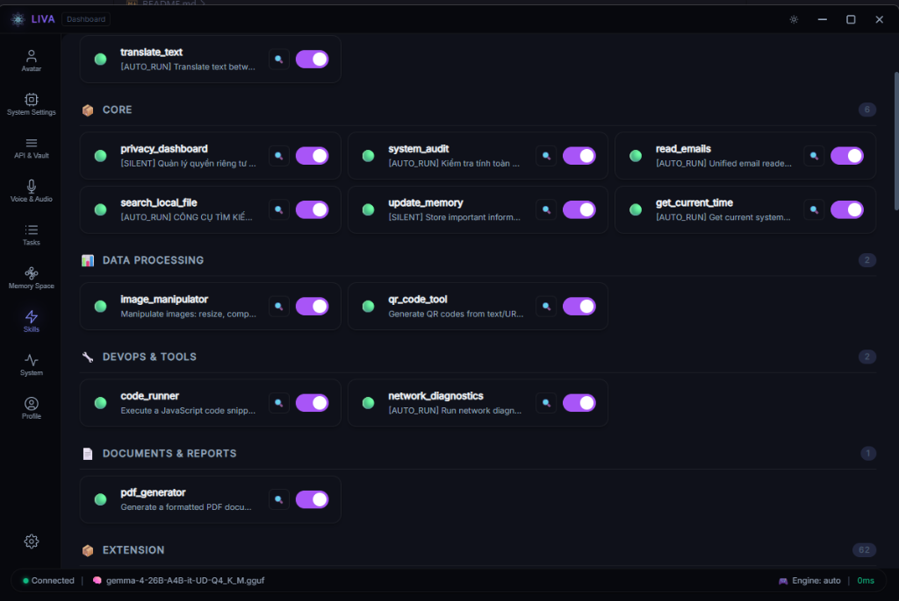
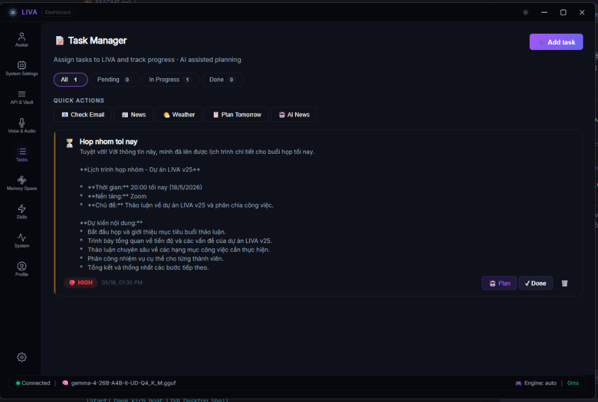
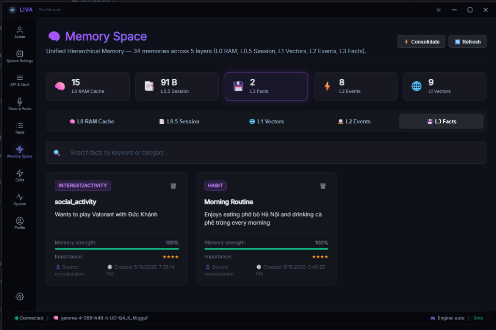
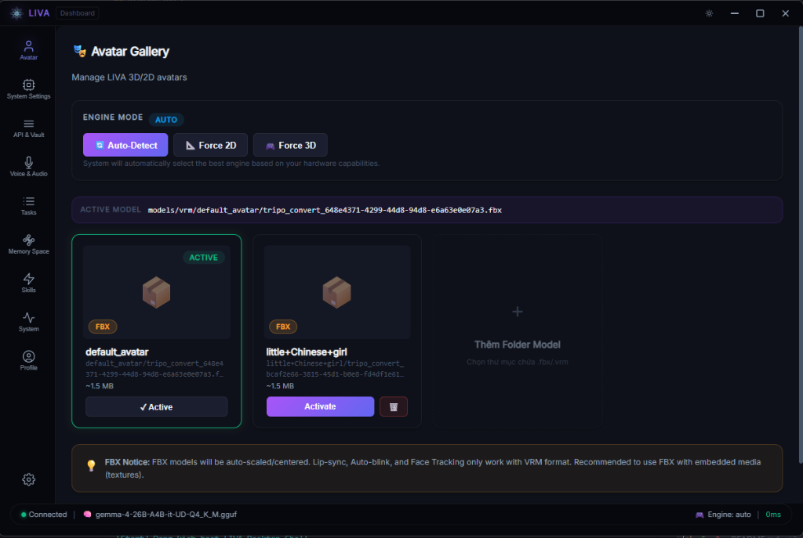

<div align="center">

  # LIVA - The AI Assistant 🧠
  *A Versatile Personal Assistant (Jarvis) - A Foundation for a Cognitive OS*

  [](https://github.com/DuongNAD/LIVA/stargazers)
  [](https://github.com/DuongNAD/LIVA/network/members)
  [](LICENSE)

</div>

## 👨‍💻 About the Author
Hello! I'm **Nguyen Anh Duong**, currently a student at **FPT University Hanoi**. 
**LIVA** is currently a Personal AI Assistant (inspired by Jarvis from Iron Man). This project is my passion and marks my first steps on the journey to research and build a true **Cognitive Operating System (Cognitive OS)** in the future.

Since this is a large-scale project built by a single individual, there will inevitably be shortcomings. I highly appreciate and welcome support, feedback, and **code contributions (Pull Requests)** from the community to jointly optimize, upgrade, and perfect this project!

---

## 🚀 Technical Highlights
LIVA is built with cutting-edge technologies to deliver the experience of a "living assistant" rather than a sluggish response bot:

> **A note on honesty.** This section describes **what runs today**, verified against the source. Anything designed but not yet wired up lives under [Future Roadmap](#-future-roadmap) instead — that is the difference between documented ambition and false advertising. A full claim-by-claim audit with `file:line` evidence is in [`docs/03-danh-gia/01-doi-chieu-tuyen-bo-vs-thuc-te.md`](docs/03-danh-gia/01-doi-chieu-tuyen-bo-vs-thuc-te.md) — note that it is a **snapshot dated 2026-07-22**, so where it and this README disagree, several of its findings have since been closed (the Tauri voice runtime, the MCP wiring) and the code is the tiebreaker.

- ⚡ **Native Rust core, no GC.** The entire backend is a single Rust binary (`liva-native-core`) on the Tokio async runtime — no garbage collector, no interpreter, no event-loop stalls. LLM inference goes through `llama.cpp` embedded in-process (`llama-cpp-2`), loading GGUF models via `mmap`. Semantic embeddings for long-term memory run on a **dedicated 384-dim ONNX model** (`llm/embedder.rs`, ONNX Runtime) — separate from the chat engine, so embedding work never blocks token streaming. No external embedding service, no separate worker runtime.
  *Technical note:* the legacy `llm:embedding` command still shares the chat `LlamaContext`; memory/RAG no longer uses it.
- 🔄 **Sequential model hot-swap.** LIVA can swap GGUF models in VRAM through the `llm:swap_model` command: the old engine is released, the driver is given time to reclaim, then the new model is loaded via `mmap`. Switching between the router and an expert model is **manual** today; automatic routing by question difficulty is on the roadmap. Model configuration is read from `data/liva-config.json` (`ai.localModelsDir` + `ai.routerModel`). The current default router is **Qwen3-VL-2B-Instruct (Q4_K_M)** — a multimodal model that handles both text and vision.
- 🧠 **Private reasoning boundary.** Text and vision generation share one stream-safe output filter in the Rust LLM engine. Internal `<think>`, `<thought>`, `<analysis>`, `<reasoning>` and channel-based reasoning blocks are removed even when their delimiters are split across token pieces. Only the visible/final channel reaches UI streams, TTS, checkpoints, and conversational memory. Hidden-token callbacks remain cancellation heartbeats, so barge-in still interrupts a reasoning model without filling the TTS queue.
- 🎙️ **Fully local voice stack.** **Nemotron** ASR (ONNX, RNN-T) with runtime language switching via `voice:set_language` (verified for `vi-VN` and `en-US`). **Piper** VITS text-to-speech with per-language voices (`vi_VN-vais1000` + `en_US-lessac`), auto-selected from Vietnamese diacritics. **Silero VAD** configured at 22 frames × 32 ms ≈ **0.7 s** end-of-turn. Also included: **GTCRN** denoise (on by default), optional **AEC**, optional offline Vietnamese ASR **Parakeet**, and optional Vietnamese neural TTS **VieNeu**.
  Full-duplex streaming with barge-in runs over the embedded WebSocket server (`ws://localhost:8002`). Both entry points — the standalone `liva-native-core` binary and the Tauri desktop shell — build their voice runtime from the same `webrtc::session::VoiceRuntimeComponents::from_env()` and bind the same gateway, so VAD, denoise, turn-shadow and AEC are no longer standalone-only.
- 🗣️ **Wake word & game mode.** An optional "LIVA" wake word (`LIVA_WAKE_MODE`, four modes including a trained ONNX classifier per language) gates always-on listening. The resource governor (`LIVA_GAME_MODE=auto`) lowers process priority so LIVA never steals frames or cores from whatever you're doing. It fires on three independent signals: a fullscreen foreground app (Win32), CPU load above `LIVA_BUSY_CPU_PERCENT`, **or** GPU load above `LIVA_BUSY_GPU_PERCENT` (both default 80) — together they catch games, renders, and encodes whether fullscreen or windowed, CPU- or GPU-bound. Both figures measure load *outside* LIVA: CPU subtracts LIVA's own usage (`GetProcessTimes`), and the GPU branch drops its signal rather than guess when per-process attribution is unavailable (Windows/WDDM) while LIVA itself may be using the GPU — so generating a reply never makes LIVA throttle itself. The GPU branch needs NVIDIA (NVML, loaded dynamically); on other machines it simply switches off.
- 👁️ **Native screen vision.** A pure-Rust screen capture (Windows Graphics Capture via `xcap`) and region-diff engine (`vision:capture`, `vision:get_changed_regions`) watches selected screen regions with minimal overhead. `vision:ask` sends a frame to the multimodal Qwen3-VL model for visual question answering — entirely local.
- 🧪 **Deep verification suite.** Rust unit & integration tests plus 18 dedicated correctness/stress executables (`verify_round2`, `router_stress`, `voice_stress`, `verify_duplex`, `screen_vision_bench`, `tool_calling_probe`, …) covering ASR/TTS preemption safety, LLM sliding-window pruning, chunk boundaries, and duplex latency budgets.
- 📊 **Instruments that admit ignorance.** The dashboard health panel used to poll hard-coded numbers (`cpuUsage: 12`, `uptime: 3600`) and paint eight green lights regardless of the machine's actual state. `sysinfo.rs` replaced them with real Win32 readings, under one rule: **`None` is a valid answer.** No NVIDIA card, non-Windows host, or a failing API yields `null` → the UI shows `--` instead of a comforting number. An empty cell that tells the truth beats a pretty one that lies.
- 🔒 **Private by default.** Every AI inference — LLM, vision, speech recognition, speech synthesis, VAD, wake word — runs **locally** through `llama.cpp` + ONNX Runtime on models stored on disk. The Rust core contains **no cloud AI client**. The WebView is locked down by Content Security Policy to loopback connections only; MediaPipe face tracking ships vendored wasm + models rather than a CDN. No auto-updater, no telemetry. **Pull the network cable and LIVA keeps working.**
  Data security: **Argon2id** for the desktop Stronghold vault, **AES-256-GCM** for the `facts` memory table, SQLite in **WAL** mode. The WebSocket gateway enforces an `Origin` allow-list (browsers outside it get a `403`), since WebSocket is not covered by the Same-Origin Policy.
  **Exceptions worth stating plainly:** (1) the **Telegram** integration is optional and needs the Internet by nature — off unless you set `TELEGRAM_BOT_TOKEN`, and available in both shells once you do; (2) `liva-voice/` is an experimental voice-cloning sandbox that *does* use cloud services (Edge TTS / HuggingFace) — it is not part of the realtime voice path and the app never starts it; (3) the **first build** needs the Internet to fetch the ONNX Runtime binaries and model weights.
- ♻️ **Memory foundation.** SQLite in WAL mode (`journal_mode=WAL`, `wal_autocheckpoint=500`, `busy_timeout=5000`) to survive abrupt process termination. The hybrid retrieval layer exists: a `sqlite-vec` vector index (`vec_idx`, 384-dim int8) alongside an FTS5 full-text index, fused through `memory:search_hybrid`.
  **Current status (2026-07-23):** every successfully embedded conversational turn on all three entry paths (voice, typed chat, Telegram/API) is persisted and later recalled. One SQLite transaction writes both a metadata-only `events` ledger row and its vector/FTS representation: `events.eventId == vectors_meta.vec_id`, `source_event_ids` points back to that event, and owner/conversation scope is preserved. `rawUserMsg`/`rawAiReply` stay `NULL`. A bounded projection consumer now runs in both standalone and Tauri: every 30 seconds (first tick immediately) it validates lineage/scope in batches of 25, atomically marks valid events `consolidated`, checkpoints progress, and sends invalid projections to DLQ after three retries. This finalizes the existing L2 retrieval projection; semantic distillation, Reflection and the L3 knowledge graph remain designed-but-idle.
- 🤖 **Self-correction sandbox (scaffolding, opt-in build).** A self-correction loop exists: run `cargo test` in a sandbox, extract the failure from the log, apply a patch, restore the original file via `BackupGuard` on failure, retry up to 3 times. The loop is complete and tested. **Status:** patch generation is abstracted behind a `trait CodeAgent`, and the adapter binding that trait to the local LLM **has not been written** — only mock implementations used in tests exist today. Because nothing calls it yet, it sits behind `cargo build --features experimental` and is **not in the default binary** (CI still compile-checks it). A first brick, not a usable feature.
- 👻 **Ghost Mode UI.** Built on Tauri v2 and Rust, LIVA runs as a transparent desktop overlay. You can watch the AI work while clicking straight through its window to the software underneath.

---

## 🖼️ System Screenshots
<p align="center">
  
  
</p>
<p align="center">
  
  
</p>
<p align="center">
  
  
</p>

---

## 🧩 Multi-tier Memory System — *design, partially implemented*

> **Read this first.** The schema below is **fully created in `db.rs`** and the hybrid search functions work. As of 2026-07-23 the **conversational write path and projection consumer are connected**: every successfully embedded turn atomically creates a pending event plus scoped retrieval vector; a bounded idempotent worker validates and finalizes that projection, with checkpoint + 3-strike DLQ. The `turn_layer_nodes` / `l3_nodes` tables still have no writer, and the Reflection Daemon and Nightly Cron described below **do not exist as code**.
>
> Also working today: a per-conversation checkpoint (stable across turns as of the July 2026 fix), a sliding history window, encrypted `facts` storage, and `memory:search_hybrid` — which now embeds the query server-side when the client doesn't supply a vector.
>
> This section is kept because it describes the intended architecture and the schema that already exists. Feeding the deeper tiers (L1→L2 consolidation, L3 graph) is the next memory milestone.

Instead of stuffing the entire chat history into a Prompt (which consumes tokens, causes lag, and confuses the AI), LIVA divides its memory into 5 distinct tiers managed by the ultra-lightweight `SQLite-Vec` vector database:

1. **Tier L0 (Working RAM):** 
   - **Function:** Acts as a temporary buffer, similar to human working memory.
   - **Mechanism:** Stores temporary variables, open UI states, and currently executing commands. Data in this tier is completely "invisible" to the Prompt and is flushed immediately when a task finishes to save resources.

2. **Tier L0.5 (Context Buffer):**
   - **Function:** The bridge between temporary buffer and short-term memory.
   - **Mechanism:** Retains crucial information from recently completed tasks or Tool Calls (e.g., web search results, system analysis data). This helps the AI maintain its Chain-of-Thought instantly without dumping raw data back into the main chat history.

3. **Tier L1 (Session Memory):**
   - **Function:** Stores the context of the current conversation.
   - **Mechanism:** Retains the last 10-20 exchanges. When L1 is full or the session ends, LIVA triggers a background process (Reflection Daemon — **not implemented**) to distill key points, extract learnings, and push them down to Tier L2. This keeps the Context Window optimal and lightning-fast.

4. **Tier L2 (Semantic Vector Memory):**
   - **Function:** Permanent memory containing "Facts," user preferences, and learned system knowledge.
   - **Mechanism:** All data is encoded into multidimensional Vectors (Embeddings) and stored in SQLite files. When a user asks about a past topic, the Semantic Router performs a Similarity Search to retrieve that exact memory fragment from L2 and injects it into the current context with millisecond latency.

5. **Tier L3 (Consolidation Archive):**
   - **Function:** Compresses and structures knowledge to form core cognition.
   - **Mechanism:** Usually runs in the background at night (Nightly Cron — **not implemented**) or when idle. The AI reviews the entire L2, connects fragmented pieces of information, recognizes user habits, and archives them securely as a Knowledge Graph.

---

## 🏗️ Modern Monorepo Architecture
The project is strictly designed following the **Single Responsibility Principle (SRP)**. A Cargo workspace hosts the native side, and npm workspaces host the UI side:

### 1. `liva-native-core` (Rust)
- The unified native core acting as the "Central Brain" and high-performance runner. It drives the agent `StateGraph`, SQLite database administration (WAL + `sqlite-vec` + FTS5 hybrid search), and both halves of the Model Context Protocol — the embedded server and the stdio client that talks to external MCP servers. *(A full Planner/Executor with a persistent task graph is roadmap, not shipped: `task_plan_chat` is a single LLM turn, not a structured plan with an executor consuming it.)*
- Runs the entire realtime voice pipeline natively: Nemotron ASR + Piper TTS via ONNX runtimes (`ort`), Silero VAD, wake-word gating, and the binary streaming duplex — plus local LLM routing/inference using `llama.cpp` bindings (`llama-cpp-2` crate). *(The `webrtc` module name is historical: it is LIVA's own 9-byte-framed WebSocket protocol. The `webrtc` crate, and with it any PeerConnection/STUN/TURN, was removed in July 2026.)*
- Exposes all capabilities over an embedded WebSocket server at `ws://localhost:8002`.

### 2. `liva-desktop` (Tauri v2 / Rust)
- An ultra-lightweight desktop shell providing the Ghost Mode Overlay and OS integration.
- Embeds `liva-native-core` directly in-process — there is no external gateway daemon, no sidecar handshake, no extra hop.
- Features hardened IPC boundaries, a Stronghold-encrypted secret vault (Argon2id), and 100% localized offline assets.

### 3. `liva-ui` (Vue 3 + Vite)
- The frontend: real-time 2D Memory Dashboard, chat, avatar gallery, and task manager.
- Runs on the Vite dev server (port 5173) during development and is bundled into the desktop app for release.

### 4. `packages/liva-common`
- A shared library containing Type definitions and Interfaces synced between Frontend and Desktop.

**Also in the workspace:** `mobile_client` (experimental companion client), `teamwork_projects/obsidian_llm_wiki` (the Obsidian knowledge vault plus the MCP server that serves it — see [`docs/04-quy-trinh/KNOWLEDGE_BASE.md`](docs/04-quy-trinh/KNOWLEDGE_BASE.md)), and the optional Python `liva-voice/` service (port 8765) reserved for voice-cloning experiments (edge-tts / GPT-SoVITS scaffolding) — it is **not** part of the realtime voice path.

---

## 🧰 Agent Skills & Integrations
LIVA's agent runtime transforms a standard chatbot into an **Agentic AI** capable of acting on the real world. What ships in the native core today:

### 1. 🧠 Agent Runtime
- **Agent graph:** A `StateGraph` with router / tool-exec / chat-completion / vision nodes drives the voice pipeline, with per-conversation checkpointing to SQLite.
- **Tool selection — fast path, then LLM.** Routing starts with a keyword table (`route_intent`): it costs zero tokens and already handles colloquial Vietnamese. When it returns "don't know", an **opt-in LLM tool-calling loop** (`LIVA_TOOL_CALLING=1`) takes over: the embedder retrieves the top-4 tools from the live catalogue and the model picks one **by number**, since a 2B model misspells names but not digits. Choosing a tool and being *allowed to run* it are deliberately separate (`ExecPolicy`) — by default only internal, non-writing tools auto-execute, so skill content stays data and never becomes instructions. Off by default until the keyword and LLM paths are proven to agree on a real corpus.
- **Self-Correction sandbox:** Runs tests in an isolated evolution sandbox and reflects on error logs — see the status caveat in Technical Highlights above. Not wired to the LLM yet.
- **GitNexus Automation (development-time, not runtime):** This is tooling for whoever edits LIVA, not a capability LIVA has. GitNexus reports a symbol's blast radius before a function is changed, and an AI pre-commit hook (`scripts/ai-pre-commit.cjs`) audits every staged diff against a local LLM endpoint before a commit is allowed (fail-open when that endpoint is offline).

### 2. 🗄️ Memory & Knowledge
- **Hybrid semantic recall:** `memory:search_hybrid` fuses vector similarity and FTS5 ranking; `memory:set_fact` / `memory:get_fact` manage structured facts (values encrypted with AES-256-GCM). Automatic recall is wired into **all three entry paths** — the voice pipeline, typed chat (`user_voice_command`), and the Telegram/API path (`chat:completion`) — each turn embeds the user's message and retrieves the top-`k` prior turns before the LLM call. Proven in a live session (`scripts/e2e-memory.mjs`): tell LIVA a fact, ask again — it answers correctly, **including after a full process restart** (the memory lives in SQLite, not RAM). Retrieval runs on a **dedicated 384-dim ONNX embedder** (`llm/embedder.rs`), not on the chat `LlamaContext` — so writing a memory never clears the chat KV cache or blocks token streaming. **Caveat worth stating:** it needs the weights at `models/embedding/` (e.g. multilingual-e5-small), installed by `npm run setup:models`. Without them recall degrades to a no-op with a log warning rather than an error — which is exactly why `npm run doctor` exists.
- **Obsidian Knowledge Vault over MCP (server side):** The MCP server embedded in the Rust core is reachable from the command dispatcher via `mcp:list_tools` / `mcp:call_tool`; every file operation is pinned under `LIVA_VAULT_PATH` and rejects absolute paths and `..`. A separate, more mature **TypeScript** server also lives in `teamwork_projects/obsidian_llm_wiki/`.
- **MCP client (client side) — LIVA calling out.** A real JSON-RPC 2.0 stdio client (`mcp_client:list_servers` / `list_tools` / `call_tool`) spawns and talks to external MCP servers declared in `mcp_config.json` (`mcpServers.{name}.{command,args,env}`, same shape as the reference config; override the path with `LIVA_MCP_CONFIG`, the per-request timeout with `LIVA_MCP_TIMEOUT_MS`). It performs the real `initialize` handshake and correlates request ids. External servers stay **out** of the chat tool catalogue unless you name them in `LIVA_TOOL_CALLING_SERVERS` — listing a server's tools spawns a child process, and doing that silently on every turn is not behaviour anyone asked for.

### 3. 🎙️ Voice & Vision
- **Voice commands:** `voice:stt_start/chunk/flush/stop`, `voice:tts_speak/stop`, and runtime language switching via `voice:set_language` (Vietnamese/English).
- **Screen-region vision:** `vision:capture`, `vision:add_region`, `vision:get_changed_regions` track chosen screen areas with a native diff engine; `vision:ask` answers questions about the screen using the local multimodal model.

### 4. 🌐 Integrations & Remote Control
- **Telegram remote control:** Real and working — the bot starts in **either shell** (desktop app or standalone `liva-native-core`) as soon as `TELEGRAM_BOT_TOKEN` is set, because both go through the same `boot::spawn_background_services`. The allow-list is **fail-closed**: an empty `TELEGRAM_ALLOWED_IDS` rejects *everyone*, including you.
  *Fixed 2026-07-26:* until then the bot only ran in the standalone binary, so setting a token and opening the desktop app gave you **silence and no error** — the worst kind of failure. `get_system_status` now reports "configured" and "actually running" as two separate facts (`telegram::bot_running()`), so that specific silence cannot come back unnoticed.
  `/cat` and `/ls` are **sandboxed** (since 2026-07-22): both resolve through the MCP server's `resolve_path`, the same barrier the vault uses, which pins every path under `LIVA_VAULT_PATH` and rejects absolute paths, `..`, and Windows drive-relative forms like `C:foo`. `/ls` prints vault-relative paths only, so it does not leak the host layout either. Before that fix, `/cat .env` and `/ls C:\` worked over the Internet for anyone on the allow-list — regression tests now pin the exact payloads that used to succeed.
- **OS control — volume & media playback:** Real and working (`integrations/os_control.rs`). Two MCP tools, `control_volume` (up / down / mute, 1–10 steps) and `control_media` (play-pause / next / previous), driven through the Windows media virtual-keys via `SendInput`. Going through the shell's own key handling rather than Core Audio is what makes play-pause reach *whichever* app currently owns the media session — and it needed **no new dependency**, since the required `windows-sys` feature was already enabled.
  Three deliberate constraints worth knowing. **(1) A volume command is capped at 10 key presses (≈20%)**, so one sentence can nudge the volume but can never silence the machine outright. **(2) Both are on the auto-execute list** (`ExecPolicy`, above) rather than needing a confirmation — the reason they qualify is that each is undone by exactly one opposite command: up↔down, and mute and play-pause are toggles. **(3) Screen brightness was deliberately left out**: there is no standard virtual-key for it, `SetMonitorBrightness` needs DDC/CI and fails on most laptop panels, and a control that silently does nothing on a beta tester's machine is exactly the "fake success" this project just removed from smart home.
  Reachable any time through `mcp:call_tool`; reachable *by talking* only with `LIVA_TOOL_CALLING=1`, which stays off by default because the LLM selection turn measures **≈2.5 s median** on the 2B router. On non-Windows the call returns a plain error saying it is Windows-only, rather than pretending to succeed.
- **Smart Home Control:** *Not implemented — and it now says so.* `integration:smart_home_control` validates the command, then reports plainly that no integration is connected and **nothing was changed**. It used to return unconditional success; once the router started matching Vietnamese ("bật đèn"), that turned into LIVA confidently telling you the lights were on when they were not. A test locks the honest wording in place.
- **Email (IMAP) & Zalo OA:** *Not implemented.* The `EMAIL_*` / `ZALO_*` keys in `.env.example` are leftovers with no code reading them.

*(The Node.js-era skill pack — headless-browser RPA, Google Workspace automation, and friends — was retired together with the legacy gateway; equivalents are being rebuilt natively as the roadmap progresses.)*

---

## 📚 Documentation Hub

**Start here: [`docs/README.md`](docs/README.md)** — the navigation index for the whole documentation set.

The docs were re-planned on 2026-07-21 against a full code survey, and are organised in four tiers:

| Folder | What's in it |
|---|---|
| [`docs/01-ban-ve/`](docs/01-ban-ve/) | **Architecture blueprints** — system diagram, the full IPC/WebSocket contract, voice pipeline, LLM, agent/memory, vision & governor, data layer, frontend/Tauri, integrations, module map |
| [`docs/02-van-hanh/`](docs/02-van-hanh/) | **Operations** — environment variables, AI models & resources, deployment/runtime, testing & CI |
| [`docs/03-danh-gia/`](docs/03-danh-gia/) | **Assessment** — claims vs. reality, technical debt & risk, and the prioritised fix/upgrade roadmap |
| [`docs/04-quy-trinh/`](docs/04-quy-trinh/) | **Process** — review prompts, feature template, knowledge-base pointer |
| [`docs/99-luu-tru/`](docs/99-luu-tru/README.md) | **Archive** — superseded documents, kept for history only |

> ⚠️ The seven `docs/architecture/01–07` documents that used to be linked here describe the **Node.js gateway that has since been deleted** (port 8082, `llama-server`, `worker_threads`, "93+ MCP tools"). They now live under [`docs/99-luu-tru/kien-truc-nodejs-v29/`](docs/99-luu-tru/kien-truc-nodejs-v29/) — do not treat them as current.

Additional references:
- [`.env.example`](.env.example) — every supported `LIVA_*` environment variable, documented inline.
- [`CLAUDE.md`](CLAUDE.md) — build/test commands and the GitNexus code-intelligence workflow.
- [`docs/04-quy-trinh/KNOWLEDGE_BASE.md`](docs/04-quy-trinh/KNOWLEDGE_BASE.md) — pointer to the Obsidian vault (single source of truth for Knowledge/Rules/Skills).

---

## 🛠 Step-by-Step Installation & Usage Guide

### Step 1: Prerequisites
- **Rust**: 1.85 or newer (the workspace uses edition 2024).
- **Node.js**: 20 or newer (npm workspaces).
- **CMake + LLVM/Clang**: required to build the `llama-cpp-2` bindings — set the `LIBCLANG_PATH` environment variable to your LLVM `bin` directory.
- **espeak-ng** (Windows installer) — *optional*: grapheme-to-phoneme conversion for the Kokoro fallback voice only. Piper and VieNeu phonemize on their own, so the default voice path never shells out to it. Auto-detected from PATH / Program Files (override with `LIVA_ESPEAK_PATH`).
- **Hardware**: Minimum 16GB RAM. An NVIDIA GPU (CUDA) with **8GB+ VRAM (12GB recommended)** for smooth local inference; CPU-only works via `LIVA_LLM_N_GPU_LAYERS=0`.
- **Models** — all weights are gitignored, so a fresh `git clone` **cannot run yet**. Fetch them with one command (see Step 2); `scripts/models.mjs` knows ~26 files across six sources.
  - **LLM (GGUF):** the router path comes from `data/liva-config.json` (`ai.localModelsDir` + `ai.routerModel`); the fetcher defaults to the in-repo `models/llm/`, override with `--llm-dir`. The shipped default is **`Qwen3-VL-2B-Instruct-Q4_K_M.gguf`**, which serves both text and vision. *(There is no `LIVA_LLM_MODEL_DIR` environment variable at runtime — that name only appears in a stress-test binary.)*
  - **ASR (Nemotron)** → `models/nemotron-asr/` · **TTS (Piper)** → `models/piper/` · **VAD, wake word, embeddings** → `models/`.
  - **Why this matters more than it looks:** missing weights do **not** raise an error. The core still boots and still accepts commands — RAG just silently no-ops, TTS quietly drops to another backend, and `vision:ask` fails at call time rather than at startup. That is the worst failure shape there is: nothing red, features merely absent. `npm run doctor` exists to turn that silence into a table — which file is missing, which capability is therefore off, and the command that fixes it.

### Step 2: Download and Install
Open Terminal / PowerShell and run:

```bash
# 1. Clone the repository
git clone https://github.com/DuongNAD/LIVA.git
cd LIVA

# 2. Install Node.js packages for the Monorepo workspaces
npm ci

# 3. Fetch the model weights (gitignored — nothing works without them)
npm run setup:models          # minimal profile; add -- --profile full for everything

# 4. Check what you actually have
npm run doctor                # exits 1 if a required file is missing
```

`npm run doctor` prints, per capability, which files are present and which feature is switched off by the ones that are not. Run it first whenever something "works but does nothing".

### Step 3: Environment Variables

> ⚠️ **Important — there is no `.env` loader.** The Rust core does **not** depend on `dotenv`, and `scripts/start_all.ps1` does not read `.env` either. Copying `.env.example` to `.env` **has no effect on the running process**. Treat `.env.example` as *documentation* of the supported variables, not as live configuration.

To actually change a setting, export it in the shell **before** launching:

```powershell
$env:LIVA_LLM_N_CTX = "8192"
npm run dev
```

Every variable — voice, VAD, wake word, game mode, LLM, integrations — is documented inline in [`.env.example`](.env.example), with the authoritative table (defaults, `file:line`, which run profile reads it) in [`docs/02-van-hanh/01-cau-hinh-va-bien-moi-truong.md`](docs/02-van-hanh/01-cau-hinh-va-bien-moi-truong.md).

Model paths are **not** environment variables: they come from `data/liva-config.json` (`ai.localModelsDir` + `ai.routerModel`), editable from the Settings screen.

### Step 4: Run the System
From the project root (`LIVA/`), execute:

```powershell
npm run dev
```

**The startup process is automated** (`scripts/start_all.ps1`):
1. Checks ports 5173 and 8002. It stops only stale processes owned by this LIVA checkout and refuses to kill foreign processes.
2. Spawns the UI dev server (`liva-ui`, port 5173).
3. Launches the LIVA Tauri desktop shell (`tauri dev`). The shell runs the native core **in-process**, binds the embedded WebSocket gateway on `127.0.0.1:8002`, and shares one `AppState`/voice runtime between Tauri IPC and WebSocket clients.

Run a non-mutating startup preflight with:

```powershell
powershell -ExecutionPolicy Bypass -File scripts/start_all.ps1 -CheckOnly
```

> The standalone gateway remains available for transport tests or headless use:
>
> ```powershell
> cd liva-native-core; cargo run --release
> ```
>
> Do not run it on the same port while the desktop shell is active. Both entry points use the same reusable WebSocket transport, but they are separate processes and therefore do not share runtime state with each other.

To verify the native engine, build it and run the correctness/stress binaries. Note that this is a Cargo **workspace**, so binaries land in the **repo-root** `target\`, not `liva-native-core\target\` (full list in [`CLAUDE.md`](CLAUDE.md)):

```powershell
cd liva-native-core; cargo build; cd ..
.\target\debug\verify_duplex.exe   # duplex pipeline: VAD, preemption latency, session IDs
.\target\debug\voice_stress.exe    # G2P speed, ASR/TTS throughput, chunk boundaries
```

### Step 5: How to Use
- **Basic Interaction:** Click the chat bar to type commands or use the Microphone to talk. With `LIVA_WAKE_MODE=asr_prefix`, just say "LIVA, ..." — always-on listening only forwards sentences that start with the wake word.
- **Memory Dashboard:** Open the Dashboard on the UI to observe data flowing between L1 and L2. You can see what the AI is thinking and which Tools it's using in the background.
- **Ghost Mode:** The interface is transparent. You can interact with other applications underneath LIVA without interruption.

---

## 🔮 Future Roadmap

### Near-term — closing the gap between design and behaviour

These are designed and partly built, but **not shipped behaviour** today. They were previously described in the feature list; they belong here until the code is wired up.

- **Semantic consolidation over finalized events:** the bounded projection consumer now validates L2 lineage and handles checkpoint/DLQ. The next worker must extract durable facts/relations from `consolidated` events without reintroducing plaintext copies or blocking the chat/LLM hot path.
- **Reflection Daemon & Nightly Consolidation:** the semantic distillation and L3 knowledge-graph passes described in the memory section still do not exist.
- **Automatic router ↔ expert routing:** `llm:swap_model` works, but choosing *when* to swap based on question difficulty is not implemented.
- **Turn LLM tool-calling on by default:** the loop exists and is tested (`LIVA_TOOL_CALLING=1`), but it stays opt-in until the keyword fast path and the LLM path are shown to agree on a real smart-home corpus with a 2B model.
- **Bind the self-correction loop to the local LLM:** implement `trait CodeAgent` against the real engine instead of the test-only mocks, then take `evolution/` back out of `--features experimental`.
- **Publish measured latency numbers:** the project currently has no TTFT benchmark. Only figures with a reproducible source belong in this README.

### Longer-term — the Cognitive OS direction

- **Desktop Pet & Full-Screen Roaming:** Upgrading the 3D VRM / Live2D engine so the LIVA avatar can break out of the widget bounding box to roam freely across your entire screen, interacting with your open windows.
- **Advanced Animation & Lip-Sync:** Implementing real-time audio-driven facial expressions, natural breathing cycles (Idle Breathing), blinking, and precise mouth movements synchronized perfectly with the text-to-speech output.
- **Multimodal Screen Vision:** Extending the native screen-region engine so LIVA can actively point out errors in your code, read articles for you, or watch a video with you in real time.
- **Autonomous Agent Swarm:** Delegating complex workflows to a swarm of specialized background agents (e.g., a "Research Agent" collecting data while a "Coding Agent" writes the script).
- **IoT & Smart Home Integration:** Acting as the central brain for smart home devices through local protocols (Matter/Zigbee), allowing you to ask LIVA to dim the lights or adjust the thermostat. *(`integration:smart_home_control` exists today with no hardware I/O — it understands the command and says so plainly rather than pretending it worked.)*
- **Messaging integrations (Email/IMAP, Zalo OA):** placeholder keys exist in `.env.example`, but no implementation.
- **Self-Evolving Codebase (Auto-Healing):** Enabling LIVA to self-diagnose its own source code, write patches, and seamlessly submit Pull Requests to fix its own bugs.
- **Centralized Server & Seamless Device Migration:** Packaging LIVA as a self-hosted API/App. Your powerful main PC acts as the central "Brain", allowing the LIVA avatar to seamlessly migrate and roam across your other personal devices (laptops, smartphones, tablets) via a lightweight client.
- **Cross-Device Memory Sync:** Syncing the L1/L2 vector memory across multiple devices (PC, Mobile) via an encrypted P2P network so LIVA's context seamlessly follows you everywhere.
- **Continuous Passive Learning:** Analyzing background context (e.g., your current music, your stress level inferred from typing speed) to offer proactive, zero-click support before you even ask.
- **AR/VR Spatial Hologram:** Integrating with mixed reality headsets (Meta Quest, Apple Vision Pro) to project the LIVA avatar as a 3D spatial hologram into your physical workspace.
- **Local Private Fine-Tuning:** Using idle GPU time overnight to continuously fine-tune its own base model (via LoRA) tailored specifically to your habits and coding style, ensuring 100% data privacy.

---

## 🤝 Contributing
Transforming **LIVA** from a personal assistant into a complete **Cognitive OS** is a long journey. I highly welcome and appreciate any support from the developer community:

- **Issues:** If you encounter bugs, please open an Issue.
- **Optimization:** Help is needed to improve Rust (Tauri) performance, refine System Prompts, or optimize `llama.cpp` speed and memory management.
- **Pull Requests:** Write new agent skills or MCP integrations (e.g., Smarthome control, new API integrations) or upgrade the 2D Dashboard.

### How to contribute
If you want to propose upgrades or modify the source code, please follow the standard open-source workflow:
1. **Fork** this project to your GitHub account.
2. Create a new branch for your feature: `git checkout -b feature/AmazingFeature`
3. Commit your changes: `git commit -m 'feat: Add AmazingFeature'`
4. Push to your branch: `git push origin feature/AmazingFeature`
5. Open a **Pull Request (PR)** to the original LIVA repository. I will review, discuss, and merge your code into the main project!

*(Despite some commercial restrictions, you are completely free to contribute code back to this main repository so we can build a stronger LIVA together!)*

---

## 🛡️ License
This project is the intellectual property of **Nguyen Anh Duong** and is protected under a **Personal & Internal Use License**.
- You are **PERMITTED** to download, use, learn, upgrade, and modify for personal purposes.
- You are **STRICTLY PROHIBITED** from republishing, copying to share publicly as a new project, commercializing, selling, or providing it as a Service (SaaS).

For specific details, please read the [`LICENSE`](LICENSE) file.

---

## 🙏 Acknowledgments
The LIVA project is built on the inheritance of and standing on the shoulders of giants. A deep thank you to the open-source communities, scientific paper authors, and amazing projects that provided the foundational technology or code snippets that inspired LIVA, notably:

**Research Papers:**
- Strongly inspired by the research paper *"The AI Scientist: Towards Fully Automated Open-Ended Scientific Discovery"*, which helped shape and build the Autonomous Coding loop (AI Scientist) for the project.
- In-depth research on **Cognitive Architecture**, **Self-Reflection**, and **Semantic Memory**, laying the groundwork for the L0-L3 multi-tier memory system.

**Open-Source Core:**
- The **llama.cpp** community for an ultra-fast AI Engine maximizing local hardware.
- The **Tauri** and **Vue 3** teams for the ultra-lightweight Desktop UI framework.
- The **SQLite-Vec** source code supporting the local Vector query system.
- **NVIDIA (Nemotron ASR)**, **rhasspy/Piper**, **Silero VAD**, and **espeak-ng** for the fully-local voice stack.
- Open-source AI models from **Google (Gemma)**, **Qwen**, **Meta**.
- And countless other small open-source libraries that contributed to the massive ecosystem of LIVA today.
