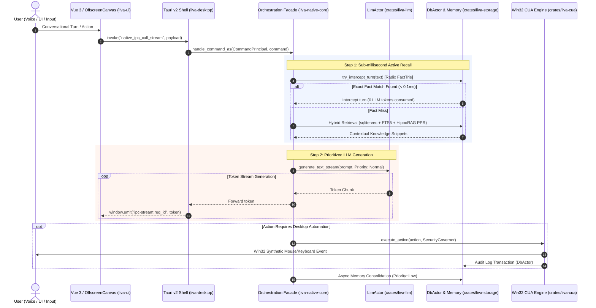
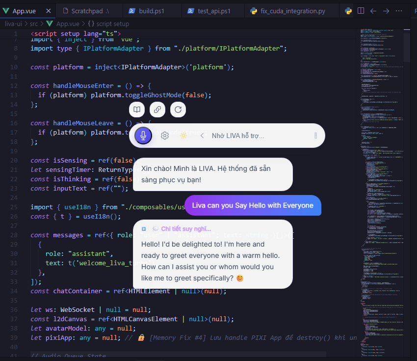
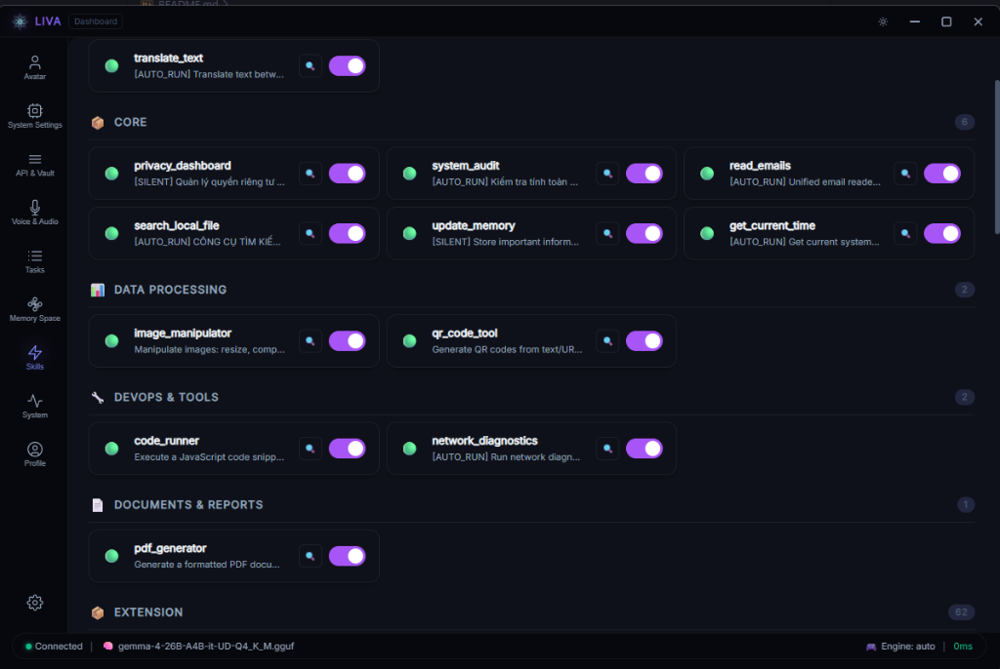
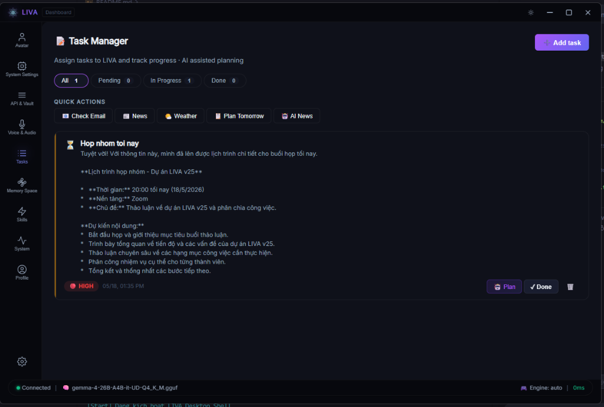
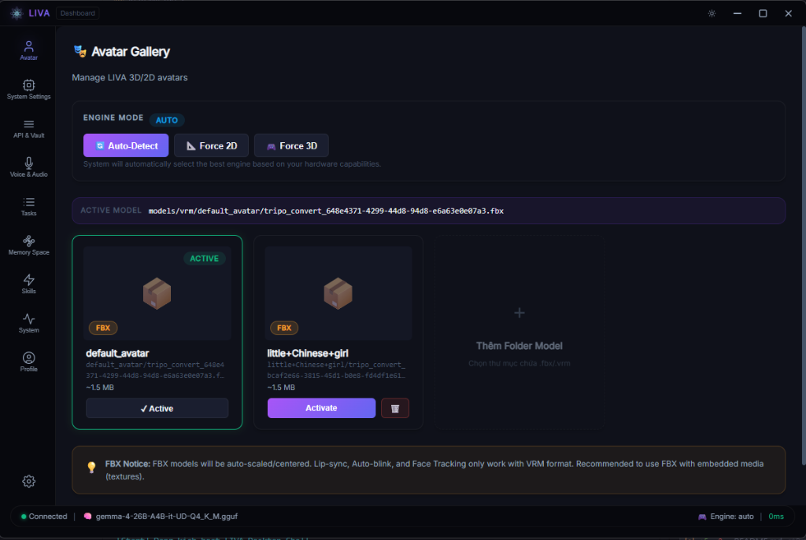
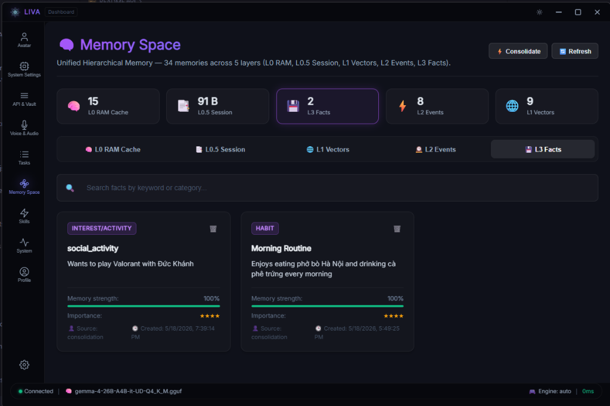

<div align="center">

  # LIVA — Local Intelligent Virtual Assistant 🧠
  *A Privacy-Centric, Local-First Cognitive Desktop Operating System*

  [](Cargo.toml)
  [](liva-desktop/src-tauri)
  [](https://microsoft.com/windows)
  [](Cargo.toml)
  [](docs/01-kien-truc/04-giao-thuc-ipc-tauri-v2.md)
  [](docs/03-phat-trien-van-hanh/02-mo-hinh-ai-va-tai-nguyen.md)
  [](docs/03-phat-trien-van-hanh/02-mo-hinh-ai-va-tai-nguyen.md)
  [](.github/workflows/test.yml)
  [](LICENSE)

</div>

---

## Executive Summary

**LIVA** (**Local Intelligent Virtual Assistant**) is a JARVIS-like, desktop-native cognitive operating system engineered for Windows 10/11 x64 workstations. Built from the ground up in modern Rust with a high-performance Tauri v2 desktop shell and a Vue 3 / Three.js 3D avatar interface, LIVA delivers an autonomous personal AI assistant that operates **100% offline and local-first**.

### Core Tenets
- **Zero Telemetry & Absolute Privacy**: All conversational reasoning, document indexing, multimodal vision grounding, voice synthesis, and desktop automation execute directly on local CPU/GPU hardware. No prompts, audio chunks, or embeddings leave the machine.
- **Unified Native Rust Architecture**: All legacy Node.js/Python server processes, Docker daemons, and internal loopback TCP/WebSocket proxies have been completely eliminated. The entire runtime is consolidated into a cohesive 7-crate Rust workspace.
- **Actor-Based Concurrency**: Dedicated, non-blocking MPSC actors for LLM inference (with 3-tier priority scheduling and preemption) and transactional SQLite mutations (single-writer micro-batching pinned to an isolated OS thread).
- **Multi-Tier Hierarchical Memory**: Ultra-fast active recall via in-memory Radix Trie (< 0.1 ms), persistent SQLite WAL storage, statically compiled `sqlite-vec` vector embeddings, and lock-free HippoRAG knowledge graph traversal.
- **Strict Hardware Guardrails**: Operates within a guaranteed **RAM ceiling of $\le 4.0\text{ GB}$** (typical working set $\sim 2.27\text{ GB}$) and a **VRAM ceiling of $\le 5.1\text{ GB}$**, actively governed to avoid interfering with foreground workstation tasks.

---

## System Architecture

LIVA is organized as a unified, high-performance Rust Workspace containing exactly **7 member crates**, cleanly separating domain contracts, persistence, inference, tooling, automation, orchestration, and desktop presentation.

```
                           ┌────────────────────────────────────────────────────────┐
                           │                 LIVA DESKTOP SHELL                     │
                           │                    (liva-desktop)                      │
                           │    Tauri v2 Shell · Multi-Window · WH_MOUSE_LL Hook    │
                           └───────────────────────────┬────────────────────────────┘
                                                       │ Native Tauri v2 IPC Channels
                                                       │ (Zero TCP/WebSocket Loopback)
                                                       ▼
┌───────────────────────────────────────────────────────────────────────────────────────────────────┐
│                             LIVA NATIVE ORCHESTRATION FACADE                                      │
│                                    (liva-native-core)                                             │
│       AppState Coordinator · Agent StateGraph · WebRTC Voice Pipeline · Qwen3-VL Vision · MCP     │
├──────────────────────┬───────────────────────┬─────────────────────┬──────────────────────────────┤
│                      │                       │                     │                              │
│       crates/        │        crates/        │       crates/       │           crates/            │
│   liva-core-types    │      liva-storage     │      liva-llm       │           liva-cua           │
│                      │                       │                     │                              │
│  - Pure Domain Types │  - SQLite Pool (WAL)  │  - Priority LlmActor│  - Native Computer-Use Agent │
│  - Errors (thiserror)│  - Pinned DbActor     │    (High/Norm/Low)  │  - Win32 Synthetic Input     │
│  - Auth & Permissions│  - Radix FactTrie     │  - Thread-Safe ONNX │  - Multi-Monitor DPI Aware   │
│  - IPC Schema Models │  - Static sqlite-vec  │    EmbeddingEngine  │  - UIPI & Security Governor  │
│  - Specta TS Export  │  - Lock-Free HippoRAG │  - SHA-256 Trust    │  - Hardware Kill Switch      │
│  - Zero Heavy Deps   │    (ArcSwap<CsrGraph>)│    Model Cache      │    (VK_ESCAPE Daemon)        │
└──────────────────────┴───────────────────────┴─────────────────────┴──────────────────────────────┘
                                                       ▲
                                                       │ Diagnostic Probes & Benchmarks
                               ┌───────────────────────┴───────────────────────┐
                               │                 crates/liva-tools             │
                               │        Consolidated CLI & Diagnostic Suite    │
                               │      (probe · bench · doctor · eval commands) │
                               └───────────────────────────────────────────────┘
```

### The 7 Rust Workspace Members

| Member | Path | Edition | Description & Core Responsibilities |
|---|---|:---:|---|
| **1. Desktop Shell** | `liva-desktop/src-tauri` | 2021 | Tauri v2 desktop application shell. Hosts transparent overlay widgets, dashboard, and setup windows. Handles system tray, Windows low-level mouse hooks (`WH_MOUSE_LL` for click-through Ghost Mode), Stronghold encrypted secret store, and in-process IPC channel routing. |
| **2. Native Core** | `liva-native-core` | 2021 | Top-level orchestration facade and runtime engine. Houses the unified `AppState` context, agent StateGraph scheduling, full-duplex WebRTC audio pipeline (Silero VAD, Smart Turn v3.2, Parakeet STT, VieNeu/Piper TTS), Qwen3-VL vision processing, native MCP server, and hardware governors (`VisualGovernor`, NVML monitor). |
| **3. Core Types** | `crates/liva-core-types` | 2021 | Pure domain models and contract definitions with zero heavy external dependencies. Defines `thiserror` error hierarchies, role-based authorization (`CommandPrincipal`), IPC request/response types, and Specta bindings for frontend TypeScript type safety. |
| **4. Storage Engine** | `crates/liva-storage` | 2024 | Calibrated persistent storage. Implements calibrated SQLite WAL connection pools, single-writer `DbActor` transactional micro-batching, in-memory Radix Trie active recall, statically compiled `sqlite-vec` C-FFI, and lock-free `ArcSwap<CsrGraph>` for HippoRAG graph traversal. |
| **5. LLM Engine** | `crates/liva-llm` | 2024 | Actor-based local LLM runtime. Features a bounded Tokio MPSC `LlmActor` with a 3-tier priority queue (`High`, `Normal`, `Low`) and atomic preemption. Decouples thread-safe ONNX `EmbeddingEngine` sessions (`&self`), dynamic prompt budgeting, and SHA-256 model trust verification. |
| **6. Diagnostic Tools** | `crates/liva-tools` | 2021 | Consolidated CLI diagnostic suite replacing 26 individual diagnostic binaries. Exposes unified commands: `probe` (DB, ONNX, wakeword, GTCRN, STT, TTS, router, OS), `bench` (latency & throughput), `doctor` (preflight health verification), and `eval` (task & recall evaluation). |
| **7. Computer-Use Agent** | `crates/liva-cua` | 2021 | Native desktop automation engine. Provides Win32 synthetic mouse/keyboard input injection, monitor DPI coordinate mapping, screen ROI capture, UIPI (User Interface Privilege Isolation) security guards, dedicated emergency kill switch (`VK_ESCAPE` hotkey polling thread), and SQLite action audit logging. |

> **Architecture Clarification**: Audio and speech processing (Silero VAD, Smart Turn v3.2, Sonora AEC3, GTCRN speech denoiser, Parakeet STT, VieNeu/Piper TTS) is implemented directly within `liva-native-core/src/webrtc`, `src/stt`, `src/tts`, and `src/wake.rs`. There is no separate `crates/liva-voice` crate.

---

## Concurrency, Runtime & Memory Architecture

### 1. Actor-Based Concurrency & Preemption
- **Prioritized `LlmActor`**: LLM generation runs inside a bounded Tokio MPSC actor. Requests are categorized into three priority bands:
  - `Priority::High`: Health checks, parameter inspection, and cancellation signals.
  - `Priority::Normal`: Interactive user conversational turns and live streaming responses.
  - `Priority::Low`: Background memory consolidation, document indexing, and maintenance tasks.
- **Instant Preemption**: The actor eagerly drains commands from its queue. Long-running token generation executed on dedicated OS blocking threads (`tokio::task::spawn_blocking`) continuously monitors atomic cancellation tokens. An incoming `High`-priority command or shutdown signal preempts ongoing generation in $< 5\text{ ms}$, eliminating head-of-line blocking and interface freezes.
- **Dedicated Single-Writer `DbActor`**: Database write operations are serialized through an MPSC channel to a dedicated background OS thread. Write commands are coalesced into transactional micro-batches (`BEGIN IMMEDIATE` ... `COMMIT`) flushed either upon reaching 50 operations or an elapsed 5ms window. This boosts write throughput to **1,500–3,000 ops/s** and completely prevents `SQLITE_BUSY` database lock contention.

### 2. Multi-Tier Memory Subsystem
```
┌────────────────────────────────────────────────────────────────────────┐
│                      LIVA Multi-Tier Memory Engine                     │
├────────────────────────────────────────────────────────────────────────┤
│ Tier 0: In-Memory Radix Trie (crates/liva-storage)                     │
│   - FactTrie & ActiveRecallManager                                     │
│   - Substring sliding-window keyword matching in < 0.1 ms (0 tokens)   │
├────────────────────────────────────────────────────────────────────────┤
│ Tier 1: Persistent SQLite WAL (crates/liva-storage & liva-native-core) │
│   - Calibrated PRAGMAs: page_size=4096, cache_size=-2000 (~2MB),       │
│     mmap_size=256MB, synchronous=NORMAL, journal_size_limit=64MB       │
│   - Micro-batched single-writer DbActor; readers pool for concurrency  │
├────────────────────────────────────────────────────────────────────────┤
│ Tier 2: Hybrid Vector Index (crates/liva-storage)                      │
│   - sqlite-vec: Static C-FFI (vec_idx USING vec0(embedding int8[384])) │
│   - Decoupled EmbeddingEngine: multilingual-e5-small via ONNX Runtime  │
│   - FTS5 full-text search integrated with Ebbinghaus memory decay      │
├────────────────────────────────────────────────────────────────────────┤
│ Tier 3: Associative Knowledge Graph (crates/liva-storage)              │
│   - GraphRAG: l3_nodes and l3_edges tables                             │
│   - In-memory lock-free ArcSwap<CsrGraph> snapshot                     │
│   - HippoRAG: 3-round SpMV Personalized PageRank (PPR) in ~1.12 ms     │
└────────────────────────────────────────────────────────────────────────┘
```

### 3. Native Tauri v2 IPC Protocol
- **Zero Loopback WebSockets/TCP**: Completely eliminates internal loopback network ports (no port 8002, no `tokio-tungstenite`).
- **Direct In-Process Channels**: Text tokens, phonemes, viseme blendshapes, and binary audio buffers stream directly over native `tauri::ipc::Channel` instances and window events (`window.emit`).
- **End-to-End Safety**: Eliminates Windows Firewall alerts, eliminates double JSON serialization overhead, and guarantees compile-time schema synchronization between Rust and Vue 3 via Specta.

### 4. Hardware Resource Limits & Load Governors
- **RAM Ceiling ($\le 4.0\text{ GB}$)**:
  - Peak internal working set: $\sim 2.27\text{ GB}$ (Core + Tokio 120MB, Storage/CSR 150MB, Embeddings 80MB, Voice DSP 60MB, STT 180MB, LLM 280MB, KV Cache 250MB, VLM 150MB, TTS 250MB, UI/Three.js 350MB).
  - Steady-state operating memory: $\sim 3.0\text{ GB}$ including OS buffers.
- **VRAM Ceiling ($\le 5.1\text{ GB}$)**:
  - Physical GPU memory budget strictly reserved for Windows DWM compositor (1.0 GB) and dual CUDA contexts (350 MB).
  - `VisualGovernor`: Enforces mutual exclusion for the 750 MB Qwen3-VL vision model. When not in active visual reasoning, the VLM is kept dormant. Upon a vision capture event, the visual slot is claimed and kept warm for a 15-second cooldown window before release.
  - `Governor` (NVML): Monitors external GPU and CPU utilization in real-time. If foreground applications (such as 3D games or video editing suites) exceed 80% utilization, LIVA automatically throttles background tasks and drops OS thread priorities to `BELOW_NORMAL`.

---

## Dataflow & IPC Architecture


```mermaid
sequenceDiagram
    autonumber
    actor User as User (Voice / UI / Input)
    participant UI as Vue 3 / OffscreenCanvas (liva-ui)
    participant Shell as Tauri v2 Shell (liva-desktop)
    participant Core as Orchestration Facade (liva-native-core)
    participant LlmActor as LlmActor (crates/liva-llm)
    participant Storage as DbActor & Memory (crates/liva-storage)
    participant Cua as Win32 CUA Engine (crates/liva-cua)

    User->>UI: Conversational Turn / Action
    UI->>Shell: invoke("native_ipc_call_stream", payload)
    Shell->>Core: handle_command_as(CommandPrincipal, command)
    
    rect rgb(240, 245, 255)
        Note over Core,Storage: Step 1: Sub-millisecond Active Recall
        Core->>Storage: try_intercept_turn(text) [Radix FactTrie]
        alt Exact Fact Match Found (< 0.1ms)
            Storage-->>Core: Intercept turn (0 LLM tokens consumed)
        else Fact Miss
            Core->>Storage: Hybrid Retrieval (sqlite-vec + FTS5 + HippoRAG PPR)
            Storage-->>Core: Contextual Knowledge Snippets
        end
    end

    rect rgb(255, 245, 240)
        Note over Core,LlmActor: Step 2: Prioritized LLM Generation
        Core->>LlmActor: generate_text_stream(prompt, Priority::Normal)
        loop Token Stream Generation
            LlmActor-->>Core: Token Chunk
            Core-->>Shell: Forward token
            Shell-->>UI: window.emit("ipc-stream:req_id", token)
        end
    end

    opt Action Requires Desktop Automation
        Core->>Cua: execute_action(action, SecurityGovernor)
        Cua->>User: Win32 Synthetic Mouse/Keyboard Event
        Cua->>Storage: Audit Log Transaction (DbActor)
    end

    Core->>Storage: Async Memory Consolidation (Priority::Low)
```

---

## Prerequisites & Installation

### System Requirements
- **Operating System**: Windows 10/11 x64 (64-bit required).
- **Rust Toolchain**: Rust 1.85+ (supporting Rust 2024 edition) with `x86_64-pc-windows-msvc` target.
- **Node.js**: v20 or newer (npm v10+ with npm workspaces support).
- **C++ Build Tools**: Visual Studio 2022 C++ x64 Build Tools with the **LLVM (`lld-link`)** linker component.
- **CMake & LLVM**: CMake $\ge 3.24$ and LLVM/Clang. Ensure `LIBCLANG_PATH` environment variable points to your LLVM `bin` directory.
- **Hardware**: Minimum 16 GB system RAM. NVIDIA GPU (CUDA 12.x) with 6 GB+ VRAM recommended for hardware acceleration; full CPU fallback inference is supported.

### Step-by-Step Setup

```powershell
# 1. Clone the repository
git clone https://github.com/DuongNAD/LIVA.git
cd LIVA

# 2. Install frontend and toolchain dependencies
npm ci

# 3. Fetch and verify required model weights (GGUF & ONNX)
npm run setup:models

# 4. Verify system environment, model hashes, and toolchain health
cargo run -p liva-tools -- doctor
```

### Environment Configuration (PowerShell)

> 💡 **Notice**: LIVA's native core does not parse `.env` files at runtime for security and determinism. Configure parameters directly in your PowerShell session or Windows environment:

```powershell
# GPU layer offload (set to 0 for CPU-only inference, 99 for maximum GPU offload)
$env:LIVA_LLM_N_GPU_LAYERS = "99"

# Context window token budget (default: 4096)
$env:LIVA_LLM_N_CTX = "4096"

# Voice wake mode: "asr_prefix" (default) or "wakeword"
$env:LIVA_WAKE_MODE = "asr_prefix"

# Optional: Number of SQLite read connections in the pool (default: 4)
$env:LIVA_DB_READERS = "4"
```

For complete environment variable documentation, refer to [Environment Variables & Configuration](docs/03-phat-trien-van-hanh/01-cau-hinh-va-bien-moi-truong.md).

---

## Build, Test & Development

All build and test executions on developer machines **MUST adhere to strict resource-bounding flags** to prevent compiler thread explosion and protect workstation stability.

### Sequential Development Commands

```powershell
# 1. Workspace compilation check (strictly bounded to 2 threads)
cargo check --workspace -j 2

# 2. Workspace code formatting verification
cargo fmt --all -- --check

# 3. Workspace clippy linter (zero-warning compliance)
cargo clippy --workspace -j 2 -- -D warnings

# 4. Run full workspace test suite (bounded compiler and test threads)
cargo test --workspace -j 2 -- --test-threads 2

# 5. Targeted crate tests
cargo test -p liva-storage -j 2 -- --test-threads 2       # SQLite, Trie & static sqlite-vec
cargo test -p liva-llm -j 2 -- --test-threads 2           # LlmActor priority & cancellation
cargo test -p liva-cua -j 2 -- --test-threads 2           # Win32 desktop automation & killswitch
cargo test -p liva-native-core -j 2 -- --test-threads 2   # Orchestration harness & state graphs
cargo test -p liva-tools -j 2 -- --test-threads 2         # Diagnostic probe & bench suite
cargo test -p liva-desktop -j 2 -- --test-threads 2       # Tauri shell & Stronghold vault

# 6. Run diagnostic CLI tools
cargo run -p liva-tools -- probe db                       # Verify SQLite WAL & schema integrity
cargo run -p liva-tools -- doctor                         # Verify models and environment health
```

### Running the Desktop Application

```powershell
# Launch the desktop app in development mode (spawns Vue 3 Vite server + Tauri v2 shell)
cd liva-desktop
npx tauri dev
```

*Alternatively, run `npm run dev` from the repository root.*

### Packaging Production Binaries

```powershell
# Build standard release installer (NSIS / Windows x64 executable)
cd liva-desktop
npx tauri build

# Build GPU-accelerated installer with CUDA support
cd liva-desktop
npx tauri build -- --features cuda
```

---

## Quantitative Architectural Benchmarks

Forensic audit comparison between LIVA's legacy monolithic prototype and the modern Multi-Crate Workspace architecture:

| Metric | Legacy Monolith | Multi-Crate Architecture | Measured Improvement |
|---|---|---|---|
| **Local `target/` Build Cache** | **94.34 GB** (9,772 artifacts) | **$< 12.0\text{ GB}$** | **87.3% disk reduction** |
| **Executable Binaries Linked** | **106 binaries** (78 tests + 26 bins) | **2 binaries** (1 harness + 1 tools CLI) | **98.1% fewer link targets** |
| **Incremental Link Time** | 20–60s (MSVC `link.exe`) | **$< 3\text{ s}$** (MSVC `lld-link` + single harness) | **10x–20x faster linking** |
| **CI/CD Pipeline Turnaround** | $> 60\text{ min}$ (sequential Windows VM) | **$\sim 5.5\text{ min}$** (4-Job Parallel DAG) | **91% CI turnaround cut** |
| **SQLite Page Cache RAM Footprint** | **312.5 MB** (uncalibrated pool) | **$\sim 11.7\text{ MB}$** (calibrated PRAGMAs) | **96.2% RAM reduction (~300MB saved)** |
| **Active Recall Retrieval Latency** | 50–250ms (full-table scan + AES) | **$< 0.1\text{ ms}$** (in-memory Radix Trie) | **500x lower latency** |
| **Database Write Throughput** | 20–50 tx/s (unbatched disk sync) | **1,500–3,000 ops/s** (5ms micro-batching) | **50x write throughput boost** |
| **Health Check Latency During LLM** | 3,000–15,000ms (locked Mutex) | **$< 5\text{ ms}$** (Priority::High actor channel) | **Zero UI freeze / HoL blocking** |
| **3D Avatar Rendering Framerate** | 20–35 FPS (UI thread starvation) | **Locked 60 FPS** (OffscreenCanvas Worker) | **Fluid visual rendering** |
| **Windows Installer Package Size** | **291.2 MB** (unoptimized) | **$< 85.0\text{ MB}$** (ThinLTO + symbol stripping) | **70.8% smaller installer** |

---

## Documentation Hub

LIVA maintains comprehensive, living documentation organized into clean functional tiers:

| Tier | Directory / File | Description |
|---|---|---|
| 📑 **Master Index** | [`docs/README.md`](docs/README.md) | Central entry point and navigation directory for all technical documentation. |
| 🏛️ **Architecture & Principles** | [`docs/01-kien-truc/`](docs/01-kien-truc/) | High-level system architecture, cognitive design, memory, and communication. |
| ↳ *System Overview & Vision* | [`docs/01-kien-truc/01-tong-quan-va-tam-nhin.md`](docs/01-kien-truc/01-tong-quan-va-tam-nhin.md) | Vision, local-first philosophy, and multi-crate workspace structure. |
| ↳ *Cognitive Actor Principles* | [`docs/01-kien-truc/02-nguyen-ly-cognitive-actor.md`](docs/01-kien-truc/02-nguyen-ly-cognitive-actor.md) | Native Actor Concurrency, Perception $\to$ Policy $\to$ Action cycle, and HITL safety. |
| ↳ *Multi-Tier Memory Architecture* | [`docs/01-kien-truc/03-kien-truc-bo-nho-da-tang.md`](docs/01-kien-truc/03-kien-truc-bo-nho-da-tang.md) | Deep dive into Radix Trie, calibrated SQLite WAL, static sqlite-vec, and HippoRAG. |
| ↳ *Tauri v2 IPC Protocol* | [`docs/01-kien-truc/04-giao-thuc-ipc-tauri-v2.md`](docs/01-kien-truc/04-giao-thuc-ipc-tauri-v2.md) | In-process streaming channels, binary payload transfer, and Specta type synchronization. |
| 📦 **Workspace Member Crates** | [`docs/02-crates/`](docs/02-crates/) | In-depth engineering specifications for each workspace crate. |
| ↳ *liva-native-core* | [`docs/02-crates/01-liva-native-core.md`](docs/02-crates/01-liva-native-core.md) | Orchestration facade, AppState, agent graphs, voice/vision engines, and MCP server. |
| ↳ *liva-storage* | [`docs/02-crates/02-liva-storage.md`](docs/02-crates/02-liva-storage.md) | Persistence mechanics, PRAGMA calibration, DbActor micro-batching, and static FFI. |
| ↳ *liva-llm* | [`docs/02-crates/03-liva-llm.md`](docs/02-crates/03-liva-llm.md) | Actor inference, 3-tier priority scheduling, ONNX embeddings, and SHA-256 trust cache. |
| ↳ *liva-core-types* | [`docs/02-crates/04-liva-core-types.md`](docs/02-crates/04-liva-core-types.md) | Pure domain entities, error taxonomies, permission models, and IPC schemas. |
| ↳ *liva-cua* | [`docs/02-crates/05-liva-cua.md`](docs/02-crates/05-liva-cua.md) | Computer-Use Agent automation, Win32 input, emergency kill switch, and UIPI safety. |
| ↳ *liva-tools* | [`docs/02-crates/06-liva-tools.md`](docs/02-crates/06-liva-tools.md) | Consolidated diagnostic CLI: probe commands, benchmarks, doctor, and eval suites. |
| ↳ *liva-desktop (src-tauri)* | [`docs/02-crates/07-liva-desktop-src-tauri.md`](docs/02-crates/07-liva-desktop-src-tauri.md) | Tauri v2 shell, window lifecycle, system tray, WH_MOUSE_LL hooks, and IPC bridges. |
| ⚙️ **Operations & Development** | [`docs/03-phat-trien-van-hanh/`](docs/03-phat-trien-van-hanh/) | Operational guides, environment variables, testing, and troubleshooting. |
| ↳ *Environment & Variables* | [`docs/03-phat-trien-van-hanh/01-cau-hinh-va-bien-moi-truong.md`](docs/03-phat-trien-van-hanh/01-cau-hinh-va-bien-moi-truong.md) | Complete reference of `$env:LIVA_*` configuration flags and resource tunables. |
| ↳ *AI Models & Resources* | [`docs/03-phat-trien-van-hanh/02-mo-hinh-ai-va-tai-nguyen.md`](docs/03-phat-trien-van-hanh/02-mo-hinh-ai-va-tai-nguyen.md) | Model weight management, quantization, setup script, and SHA-256 verification. |
| ↳ *Development & Debugging* | [`docs/03-phat-trien-van-hanh/03-huong-dan-phat-trien-va-debug.md`](docs/03-phat-trien-van-hanh/03-huong-dan-phat-trien-va-debug.md) | Windows toolchain setup, tracing subscriber configuration, and debug procedures. |
| ↳ *Testing & CI/CD Pipeline* | [`docs/03-phat-trien-van-hanh/04-kiem-thu-va-ci.md`](docs/03-phat-trien-van-hanh/04-kiem-thu-va-ci.md) | Single test harness architecture, resource bounding flags, and 4-job parallel DAG. |
| ↳ *Backup & Recovery* | [`docs/03-phat-trien-van-hanh/05-sao-luu-va-xu-ly-su-co.md`](docs/03-phat-trien-van-hanh/05-sao-luu-va-xu-ly-su-co.md) | Online SQLite WAL backup runbook, manifest checksum verification, and crash recovery. |
| 🗄️ **Historical Archive** | [`docs/99-luu-tru/README.md`](docs/99-luu-tru/README.md) | Quarantined legacy Node.js/Python architecture documents and completed milestones. |
| 🧠 **Obsidian Vault** | [`teamwork_projects/obsidian_llm_wiki/vault/`](teamwork_projects/obsidian_llm_wiki/vault/) | Single Source of Truth for system architectures, memory designs, and agent rules. |

---

## Visual Showcase & Demo

<p align="center">
  
  
</p>
<p align="center">
  
  
</p>
<p align="center">
  
  
</p>

### Continuous Session Video Demonstration
▶ **[Watch or download the unedited desktop session recording (MP4, 7.9 MB)](https://github.com/DuongNAD/LIVA/releases/tag/demo-2026-07)**

---

## Author & Project Governance

**Nguyen Anh Duong**  
Software Engineering Student, **FPT University Hanoi**  
Lead Architect & Developer of LIVA

### Licensing & Usage Terms

- **Workspace Crates**: The core architectural library crates (`crates/liva-core-types`, `crates/liva-storage`, `crates/liva-llm`, `crates/liva-tools`, `crates/liva-cua`) are licensed under either the [Apache License, Version 2.0](http://www.apache.org/licenses/LICENSE-2.0) or the [MIT License](http://opensource.org/licenses/MIT) at your option.
- **Application Distribution**: The compiled desktop application binary and user interface are protected under the **Personal & Internal Use License**. You are permitted to download, build, and use LIVA for personal and internal research. Commercial SaaS hosting, public redistribution, and unlicensed resale are strictly prohibited. Refer to [`LICENSE`](LICENSE) for complete legal terms.

---

## Acknowledgments

LIVA stands upon the innovations of the global open-source community:
- **[llama.cpp](https://github.com/ggerganov/llama.cpp)** & **[llama-cpp-2](https://github.com/utilityai/llama-cpp-rs)** for high-efficiency local LLM inference.
- **[Tauri](https://github.com/tauri-apps/tauri)** & **[Vue.js](https://github.com/vuejs/core)** for the lightweight desktop presentation and reactive UI shell.
- **[SQLite](https://www.sqlite.org/)** & **[sqlite-vec](https://github.com/asg017/sqlite-vec)** for reliable embedded transactional persistence and vector indexing.
- **[NVIDIA](https://github.com/NVIDIA)**, **[Silero](https://github.com/snakers4/silero-vad)**, and **[Piper](https://github.com/rhasspy/piper)** for embedded neural speech and acoustic processing.
- **[Qwen Team (Alibaba Cloud)](https://github.com/QwenLM)** for state-of-the-art vision-language model architectures.
