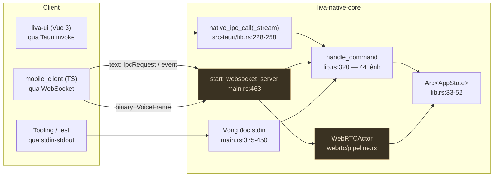
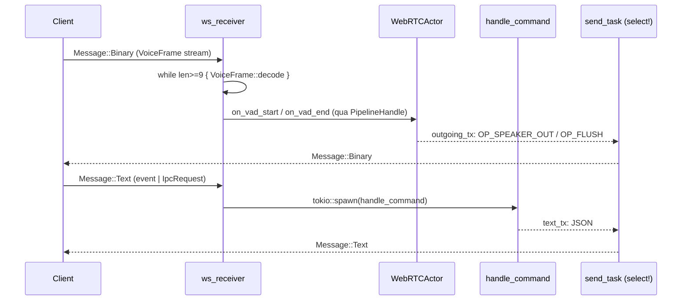
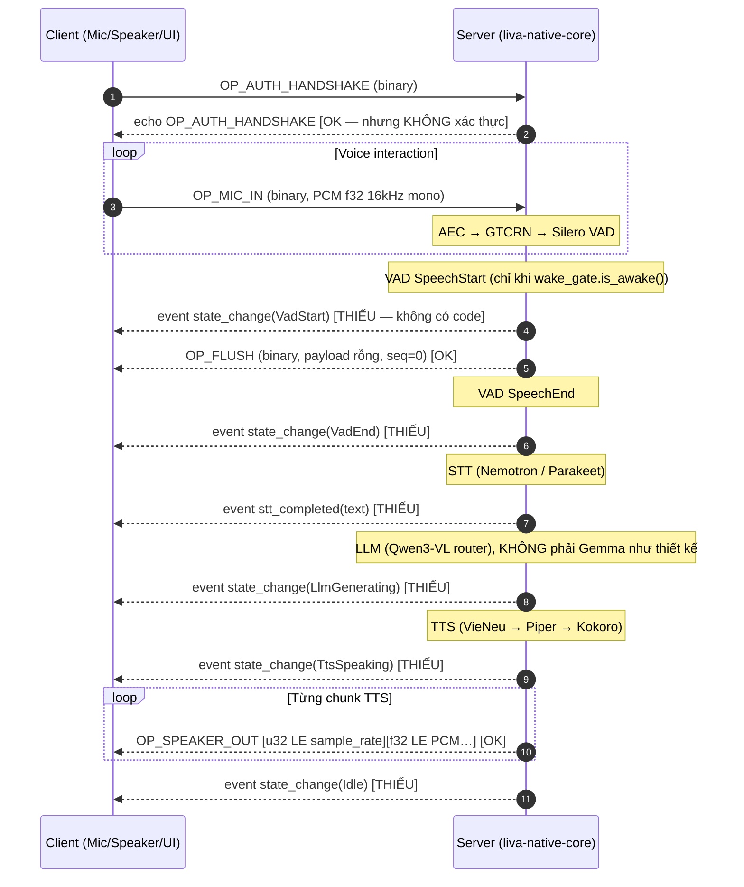

# Giao thức IPC và WebSocket

[⬆ Mục lục](../README.md) · [◀ Kiến trúc tổng thể](01-kien-truc-tong-the.md) · [Đường ống thoại ▶](03-duong-ong-thoai.md)

---

> **Đây là HỢP ĐỒNG GIAO THỨC.** Bất kỳ ai viết client cho LIVA (web, Tauri, mobile, CLI, thiết bị nhúng) đều phải theo đúng tài liệu này. Mọi mục đều được trích dẫn tới dòng code thật; chỗ nào code lệch với thiết kế gốc đều được nêu rõ ở §10.

---

## Mục lục

1. [Phạm vi & hai điểm vào](#1-phạm-vi--hai-điểm-vào)
2. [`AppState` — trạng thái dùng chung](#2-appstate--trạng-thái-dùng-chung)
3. [Vòng đời khởi động — 26 bước](#3-vòng-đời-khởi-động--26-bước)
4. [Kênh vận chuyển: WebSocket server & stdio IPC](#4-kênh-vận-chuyển-websocket-server--stdio-ipc)
5. [Lớp nhị phân — khung `VoiceFrame`](#5-lớp-nhị-phân--khung-voiceframe)
6. [Lớp text — hai giao thức trên cùng một socket](#6-lớp-text--hai-giao-thức-trên-cùng-một-socket)
7. [`handle_command` — bảng 44 lệnh đầy đủ](#7-handle_command--bảng-44-lệnh-đầy-đủ)
8. [Khung streaming — hai định dạng khác nhau](#8-khung-streaming--hai-định-dạng-khác-nhau)
9. [Lệnh UI gửi mà core không có handler](#9-lệnh-ui-gửi-mà-core-không-có-handler)
10. [Đối chiếu THIẾT KẾ GỐC vs AS-BUILT](#10-đối-chiếu-thiết-kế-gốc-vs-as-built)
11. [Checklist cho người viết client](#11-checklist-cho-người-viết-client)

---

## 1. Phạm vi & hai điểm vào

Cùng một `AppState` + `handle_command` được dựng **hai lần độc lập** ở hai binary khác nhau. Đây là điều quan trọng nhất phải nắm trước khi đọc phần giao thức, vì **không phải điểm vào nào cũng mở WebSocket**. Rút gọn ở góc nhìn giao thức:

- **`liva-native-core`** (bin standalone, `main.rs:30` `fn main()`) — **CÓ** gateway WS 8002 (`start_websocket_server`, `main.rs:463`), **CÓ** stdio IPC (`main.rs:375-450`), có đủ VAD/denoise/AEC/turn-shadow và Telegram.
- **`liva-desktop`** (vỏ Tauri, `lib.rs:261` `pub fn run()`) — **KHÔNG** mở WS, **KHÔNG** dùng stdio (chỉ Tauri `invoke`), và `vad/denoiser/turn_shadow/aec` hard-code `None` (`lib.rs:377-380`).
- Luồng dev chuẩn (`npm run dev` → `scripts/start_all.ps1`) **KHÔNG khởi động binary `liva-native-core`** ⇒ **gateway WebSocket 8002 không chạy**; vỏ Tauri vẫn `emit("gateway-ready", {"port": 8002, "token": null})` (`lib.rs:477-480`) kèm comment sai sự thật ("Gateway is already running on port 8002 (started by start_all.ps1)").

> 📌 Nguồn đầy đủ (bảng so sánh hai profile chạy): [Kiến trúc tổng thể](01-kien-truc-tong-the.md) — cách chạy từng profile: [Triển khai và runtime](../02-van-hanh/03-trien-khai-va-runtime.md)

⇒ **Toàn bộ đường voice duplex nhị phân** (OP_MIC_IN → VAD → barge-in → OP_SPEAKER_OUT) chỉ sống khi chạy binary `liva-native-core` **thủ công**. Trạng thái: **[MỘT PHẦN]**.

### 1.1 Ba kênh IPC tồn tại trong repo

| Kênh | Điểm vào | Định dạng | Trạng thái |
|---|---|---|---|
| WebSocket `ws://127.0.0.1:8002/ws` | `main.rs:463-1115` | nhị phân `VoiceFrame` + text (2 lớp) | **[MỘT PHẦN]** — chỉ khi chạy binary standalone |
| stdin/stdout dòng-JSON | `main.rs:375-450` (đọc), `main.rs:361-373` (ghi) | `IpcRequest` → `IpcResponse`, mỗi bản ghi 1 dòng + `\n` + flush | **[OK]** trong binary standalone |
| Tauri `invoke` | `liva-desktop/src-tauri/src/lib.rs:228-258` | `native_ipc_call` / `native_ipc_call_stream` | **[OK]** — đây là kênh UI desktop thật đang dùng |

Cả ba kênh cuối cùng đều đổ vào **cùng một** `handle_command` (§7).

### 1.2 Sơ đồ tổng thể các kênh



---

## 2. `AppState` — trạng thái dùng chung

`liva-native-core/src/lib.rs:33-52` — **đủ 13 field, kèm kiểu**:

```rust
pub struct AppState {
    pub db: DatabasePool,                                                     // r2d2: .writer + .readers pools
    pub crypto: EncryptionEngine,                                             // AES-GCM, KHÔNG khoá
    pub stt: tokio::sync::Mutex<SttManager>,
    pub tts: tokio::sync::Mutex<Option<TtsManager>>,
    pub tts_player: TtsAudioPlayer,                                           // KHÔNG khoá (nội bộ tự khoá)
    pub llm: tokio::sync::Mutex<LlamaRouterManager>,
    pub vad: tokio::sync::Mutex<Option<webrtc::vad::VadEngine>>,
    pub denoiser: tokio::sync::Mutex<Option<webrtc::denoise::GtcrnDenoiser>>,
    pub turn_shadow: tokio::sync::Mutex<Option<webrtc::turn_shadow::SmartTurnClassifier>>,
    pub aec: tokio::sync::Mutex<Option<webrtc::aec::SelfEchoCanceller>>,
    pub mcp_server: Arc<mcp::server::NativeMcpServer>,
    pub vision: tokio::sync::Mutex<VisionManager>,
    pub embedder: tokio::sync::Mutex<Option<llm::embedder::EmbeddingEngine>>,   // model ONNX riêng, KHÔNG dùng LlamaContext
}
```

| # | Field | Kiểu | Có khoá? | Ghi chú |
|---:|---|---|---|---|
| 1 | `db` | `DatabasePool` | không (pool riêng) | `writer` `max_size(1)` + `readers` `max_size(4)` mở `SQLITE_OPEN_READ_ONLY` — `db.rs:147-161` |
| 2 | `crypto` | `EncryptionEngine` | không | AES-256-GCM, chỉ dùng cho `facts.value` |
| 3 | `stt` | `tokio::sync::Mutex<SttManager>` | có | Nemotron RNN-T / Parakeet CTC |
| 4 | `tts` | `tokio::sync::Mutex<Option<TtsManager>>` | có | `None` nếu model TTS thiếu |
| 5 | `tts_player` | `TtsAudioPlayer` | không | tự khoá bên trong |
| 6 | `llm` | `tokio::sync::Mutex<LlamaRouterManager>` | có | **một** Mutex cho chat + embed + vision + swap |
| 7 | `vad` | `tokio::sync::Mutex<Option<VadEngine>>` | có | `None` trong Tauri |
| 8 | `denoiser` | `tokio::sync::Mutex<Option<GtcrnDenoiser>>` | có | `None` trong Tauri |
| 9 | `turn_shadow` | `tokio::sync::Mutex<Option<SmartTurnClassifier>>` | có | `None` trong Tauri |
| 10 | `aec` | `tokio::sync::Mutex<Option<SelfEchoCanceller>>` | có | `None` trong Tauri |
| 11 | `mcp_server` | `Arc<NativeMcpServer>` | không | đã nối vào dispatcher: `mcp:list_tools` (`lib.rs:1575`) + `mcp:call_tool` (`lib.rs:1578`) |
| 12 | `vision` | `tokio::sync::Mutex<VisionManager>` | có | WGC qua `xcap` |
| 13 | `embedder` | `tokio::sync::Mutex<Option<EmbeddingEngine>>` | có | model ONNX 384 chiều **tách khỏi** `llm` (`llm/embedder.rs`); `None` khi thiếu `models/embedding/` ⇒ RAG im lặng bỏ qua |

Đặc điểm quan trọng đối với người viết client:

- **Toàn bộ dùng `tokio::sync::Mutex`, không có `RwLock` nào.** Không có `Arc` bên trong trừ `mcp_server`.
- Chia sẻ bằng `Arc<AppState>` clone cho từng task (`main.rs:274, 286, 313, 321, 346, 409`) và **cho mỗi kết nối WS** (`main.rs:478`).
- Trong `spawn_blocking` dùng `blocking_lock()` (`main.rs:668,674,682`; `lib.rs:863,1281,1292,1438,1494`).
- **Điểm nghẽn kiến trúc:** `state.llm` là **một** Mutex duy nhất cho chat + embed + vision + swap_model. Một lượt sinh token (blocking) khoá luôn mọi lệnh LLM khác ⇒ client **không nên** phát song song `chat:completion` và `vision:ask`.
- **Engine audio là toàn cục, không per-session.** `vad`/`denoiser`/`aec`/`turn_shadow` mang state hồi quy dòng chảy và không có code phân vùng theo session ⇒ **hai client WS đồng thời sẽ trộn stream vào cùng state**. Hệ quả cho người viết client: **giao thức hiện tại chỉ an toàn với MỘT client voice tại một thời điểm.**

  Từ 22/07/2026 có một hàng rào nhỏ: `handle_ws_connection` gọi `vad.reset()` + `denoiser.reset()` **một lần cho mỗi kết nối WS mới** (`main.rs:597-604`), nên client sau không kế thừa bộ đếm frame / hidden-state LSTM của client trước. ~~"`reset()` không được gọi ở đường chạy thật"~~ — khẳng định cũ, đúng cho tới trước bản sửa này. Nó **không** giải quyết trường hợp hai client nối **đồng thời**: state vẫn toàn cục.

  > 📌 Nguồn đầy đủ (chi tiết state hồi quy từng engine): [Đường ống thoại](03-duong-ong-thoai.md)

---

## 3. Vòng đời khởi động — 26 bước

### 3.1 `fn main()` — dựng runtime thủ công

`liva-native-core/src/main.rs:30-49` — **không** dùng `#[tokio::main]`:

| Bước | Việc | Dòng | Mặc định |
|---|---|---|---|
| 1 | `LIVA_TOKIO_WORKER_THREADS` | 31-34 | `available_parallelism()` → fallback 4 |
| 2 | `LIVA_TOKIO_MAX_BLOCKING_THREADS` | 36-39 | **512** |
| 3 | `Builder::new_multi_thread().enable_all().build()` → `rt.block_on(async_main())` | 41-48 | |

### 3.2 `async_main()` — 26 bước, thứ tự chính xác

`liva-native-core/src/main.rs:51-459`:

| # | Việc | Dòng | Ghi chú lỗi |
|---|---|---|---|
| 1 | `FmtSubscriber` level INFO, **writer = stderr** | 53-57 | stdout dành riêng cho IPC |
| 2 | Đọc `LIVA_DB_PATH`, `LIVA_ENCRYPTION_KEY`; `create_dir_all(parent)` | 61-68 | key thiếu → fallback `"0"×32` |
| 3 | `env_flag("LIVA_DB_IN_MEMORY", false)` → `DatabasePool::new_in_memory()` else `DatabasePool::new(&db_path)` | 70-78 | **`.expect()` — panic nếu lỗi** |
| 4 | `rodio::OutputStream::try_default()` + `Sink::try_new` | 80-93 | lỗi → `None`, không fatal |
| 5 | Resolve 3 đường model qua `resolve_resource_path` | 97-114 | thử prefix `""`, `".."`, `"../.."` |
| 6 | `stt::SttManager::new(&stt_model_dir)` | 116 | |
| 7 | `TtsAudioPlayer::new(shared_sink.clone())` + `TtsManager::from_bin(...)` | 118-128 | lỗi → `None` + log error |
| 8 | `LIVA_LLM_N_CTX` (4096), `LIVA_LLM_N_GPU_LAYERS` (0) → `LlamaRouterManager::new` | 130-139 | **`.expect()` — panic nếu lỗi** |
| 9 | `governor::Governor::from_env()` + **`std::thread`** poll `game_mode_active()` mỗi 5s | 143-152 | |
| 10 | VAD: `webrtc::vad::resolve_model_path(&stt_model_dir)` → `VadEngine::new(path, VadConfig::from_env())` | 155-167 | không có file → `None` |
| 11 | `LIVA_VAULT_PATH` → `NativeMcpServer::new(&vault_path)` | 169-171 | |
| 12 | `NativeScreenCapturer::new(0)` → `VisionManager::new(..., VisionConfig::default())` | 173-177 | hard-code display 0 |
| 13 | GTCRN denoise — **BẬT mặc định**, tắt bằng `LIVA_DENOISE_ENABLED=0/false/off` | 184-209 | |
| 14 | Smart Turn shadow — **opt-in** `LIVA_TURN_SHADOW_ENABLED=1` | 214-230 | |
| 15 | AEC — **opt-in** `LIVA_AEC_ENABLED=1` | 234-238 | |
| 16 | `llm::embedder::EmbeddingEngine::load(&resolve_model_dir())` — model embedding cho RAG | 242-254 | thiếu model → `None` + `warn!` (**không** fatal) |
| 17 | `Arc::new(AppState { … })` | 256-270 | |
| 18 | `tokio::spawn(load_configured_router_model(state, false))` — autoload router LLM | 274-277 | |
| 19 | `tokio::spawn` vòng lặp GPU downshift game-aware (`LIVA_GAME_N_GPU_LAYERS`, mặc định 0) | 285-310 | **early-return nếu `normal_layers == 0`** |
| 20 | `tokio::spawn(start_websocket_server(state))` | 313-318 | ⇐ **giao thức WS bắt đầu sống từ đây** |
| 21 | `tokio::spawn` interval 60s → `tts_mgr.check_idle_unload()` | 321-331 | Tauri **không** có bước này |
| 22 | `mpsc::channel::<String>(100)` (tx/rx cho stdout) | 334 | |
| 23 | Telegram: `TELEGRAM_BOT_TOKEN` + `TELEGRAM_ALLOWED_IDS` (CSV) → `TelegramBotManager::new(...).start()` | 337-358 | bỏ qua nếu không có token |
| 24 | Task ghi stdout: mỗi msg + `\n` + `flush` | 361-373 | |
| 25 | Vòng lặp đọc stdin line-by-line → parse `IpcRequest` → `tokio::spawn(handle_command(...))` | 375-450 | |
| 26 | `drop(tx)` → `writer_handle.await` → log shutdown | 453-458 | |

> **Đính chính 22/07/2026 cho bước 3:** trước đây chỗ này chỉ hỏi biến **có tồn tại hay không** (`.is_ok()`), nên `LIVA_DB_IN_MEMORY=false` — đúng như `.env.example` hướng dẫn — lại **bật** DB in-memory và xoá sạch dữ liệu mỗi lần khởi động. Nay đi qua helper `env_flag(key, default)` (`lib.rs:84`): chỉ `1/true/yes/on` mới bật. ~~"`LIVA_DB_IN_MEMORY` (chỉ cần *tồn tại*)"~~ — mô tả cũ, không còn đúng.

Bảng trên chỉ ghi giá trị mặc định **tại đúng chỗ nó được đọc trong `main.rs`**, đủ để hiểu thứ tự khởi động; nó không phải danh mục biến môi trường.

> 📌 Nguồn đầy đủ (bảng biến môi trường, lệch `.env.example` vs code): [Cấu hình và biến môi trường](../02-van-hanh/01-cau-hinh-va-bien-moi-truong.md)

### 3.3 `pub fn run()` — Tauri shell (khác biệt)

`liva-desktop/src-tauri/src/lib.rs:261-593`. Trình tự gần giống nhưng:

- `tracing_subscriber::fmt()...try_init()` (`lib.rs:264-266`) — comment ghi rõ không có subscriber thì log của core bị nuốt.
- **Cũng nạp embedder** (`lib.rs:359-368`) rồi truyền vào `AppState` — khác VAD/denoise (chỉ đường WebSocket tiêu thụ), bộ nhớ dài hạn đi qua `chat:completion` nên có tác dụng ở vỏ Tauri.
- `AppState` dựng ở `lib.rs:370-384` với **`vad/denoiser/turn_shadow/aec = Mutex::new(None)`** hard-code.
- `std::mem::forget(_stream)` (`lib.rs:388-390`) giữ `rodio::OutputStream` sống vĩnh viễn.
- 4 luồng nền: (A) autoload router LLM (`:418-421`), (B) GPU downshift 5s (`:429-455`), (C) governor priority thread 5s (`:468-473`), (D) hit-test con trỏ 30ms cho ghost mode (`:483-576`).
- **Không** spawn `start_websocket_server`; **không** có task unload TTS idle 60s.
- Có thêm `tauri_plugin_stronghold` (khoá Argon2id từ `LIVA_STRONGHOLD_PASSWORD`/`LIVA_STRONGHOLD_SALT`, mặc định hard-code — `lib.rs:123-129`).

> 📌 Nguồn đầy đủ (bảng lệnh Tauri `invoke`, cấu hình cửa sổ, ghost mode): [Frontend và vỏ Tauri](08-frontend-va-vo-tauri.md)

---

## 4. Kênh vận chuyển: WebSocket server & stdio IPC

### 4.1 Server và handshake

`async fn start_websocket_server(state: Arc<AppState>) -> Result<(), String>` — `main.rs:463-525`.

| Thuộc tính | Giá trị | Dòng |
|---|---|---|
| Bind | `LIVA_SERVER_HOST:LIVA_SERVER_PORT` = `127.0.0.1:8002` | 469-471 |
| Endpoint | `/ws` | 490-506 |
| Log | `WebSocket server listening on ws://{addr}/ws` | — |
| Kiểm path | `accept_hdr_async` callback từ chối **ngay ở tầng HTTP**: `path != "/ws"` → `Err(reject(StatusCode::NOT_FOUND, "invalid path"))` ⇒ `WebSocketStream` không bao giờ được dựng | 490-493 |
| Kiểm `Origin` | allow-list `origin_allowed()`; không khớp → HTTP **403 `"origin not allowed"`** | 494-504 |
| Auth | **Không token, không TLS** (đã có hàng rào `Origin`) | — |

**Allow-list `Origin`** (`lib.rs:105-110` `DEFAULT_WS_ALLOWED_ORIGINS`, kiểm ở `lib.rs:128`): `http://localhost:5173`, `http://127.0.0.1:5173`, `tauri://localhost`, `https://tauri.localhost`; mở rộng bằng `LIVA_WS_ALLOWED_ORIGINS` (CSV). Hai quy tắc biên mà người viết client phải biết:

- **Không có header `Origin` (`None`) thì CHO QUA** — chủ ý, vì client gốc (vỏ Tauri, `verify_duplex`, script kiểm thử) không gửi `Origin`. Hàng rào này nhắm vào **trang web**, nơi kẻ tấn công không đặt được `Origin`.
- `Origin` **rỗng** (`""` / toàn khoảng trắng) thì **BỊ CHẶN** — đó là dấu hiệu trình duyệt bị sandbox.

⚠️ **Cảnh báo bảo mật (đã thu hẹp 22/07/2026):** `OP_AUTH_HANDSHAKE` vẫn chỉ echo lại payload (§5.3), nên **không có xác thực theo danh tính ở bất kỳ tầng nào** — không token, không TLS. ~~"Không kiểm `Origin`… không có xác thực ở bất kỳ tầng nào"~~ là mô tả trước 22/07/2026: nay allow-list `Origin` đã chặn được một trang web bất kỳ mở `new WebSocket("ws://127.0.0.1:8002/ws")` rồi gọi `llm:swap_model`. Điều **vẫn đúng**: bất kỳ **tiến trình local** nào (không gửi `Origin`) cũng mở được socket và phát lệnh — bao gồm `llm:swap_model` (không validate đường dẫn) và `telegram:send_text`.

### 4.2 `handle_ws_connection` — vòng đời một kết nối

`async fn handle_ws_connection(ws_stream: WebSocketStream<TcpStream>, state: Arc<AppState>) -> Result<(), String>` — `main.rs:527-1115`:

1. `ws_stream.split()` → `ws_sender` / `ws_receiver`.
2. Hai kênh ra: `mpsc::channel::<VoiceFrame>(128)` (`outgoing_tx`) và `mpsc::channel::<String>(128)` (`text_tx`) — `main.rs:538-539`.
3. `conversation_id = Uuid::new_v4()` — **ổn định suốt kết nối** để bộ nhớ hội thoại đọc lại được (`session_id` tăng mỗi lượt VAD nên không dùng làm khoá được) — `main.rs:543`.
4. `WebRTCActor::new(state.clone(), outgoing_tx.clone(), conversation_id)` → `(WebRTCPipelineHandle, WebRTCActor)`; `spawn(actor.run())` — `main.rs:545-550`.
5. `send_task`: `tokio::select!` giữa `outgoing_rx` (→ `Message::Binary(frame.encode()?)`) và `text_rx` (→ `Message::Text`) — `main.rs:553-587`. **Đây là chỗ multiplex nhị phân + JSON trên cùng một socket.**
6. **Reset engine audio có nhớ** trước khi phục vụ client mới: `vad.reset()` + `denoiser.reset()` — `main.rs:597-604`.
7. State cục bộ mỗi kết nối: `accumulating: bool`, `audio_buffer: Vec<f32>`, `wake_gate = wake::WakeGate::from_env()` — `main.rs:606-608`.
8. Vòng `while let Some(msg_res) = ws_receiver.next().await` với 3 nhánh: `Binary` (§5), `Text` (§6), `Close` → break.
9. Cleanup: `pipeline_handle.on_interrupted()`, `send_task.abort()`, `actor_handle.abort()` — `main.rs:1111-1113`.



### 4.3 stdio IPC — cùng schema, khác vận chuyển

- **Vào:** mỗi dòng stdin là một JSON `IpcRequest` (`main.rs:375-450`, parse ở `:389`).
- **Ra:** mỗi phản hồi là một JSON `IpcResponse` + `\n` + flush (`main.rs:361-373`).
- **stdout là kênh dữ liệu thuần** — log đi stderr (bước 1 §3.2). Client **không** được kỳ vọng log trên stdout.

Struct dây (`main.rs:13-28`):

```rust
#[derive(Debug, Deserialize)]
struct IpcRequest {
    id: String,
    command: String,
    payload: serde_json::Value,
}

#[derive(Debug, Serialize)]
struct IpcResponse {
    id: String,
    status: String,                                       // "ok" | "error"
    #[serde(skip_serializing_if = "Option::is_none")]
    data: Option<serde_json::Value>,
    #[serde(skip_serializing_if = "Option::is_none")]
    error: Option<String>,
}
```

> **Lưu ý dây quan trọng:** `data` và `error` dùng `skip_serializing_if = "Option::is_none"` ⇒ khi thành công, trường `error` **hoàn toàn vắng mặt** (không phải `null`). Thiết kế gốc ghi `"error": null` — client phải chấp nhận cả hai (§10).

---

## 5. Lớp nhị phân — khung `VoiceFrame`

### 5.1 Định nghĩa

`liva-native-core/src/webrtc/frame.rs` (191 dòng; phần hợp đồng dây là 1-57, phần còn lại là `mod frame_tests` từ dòng 60):

```rust
pub const OP_AUTH_HANDSHAKE: u8 = 0x00;
pub const OP_MIC_IN: u8 = 0x01;
pub const OP_SPEAKER_OUT: u8 = 0x02;
pub const OP_FLUSH: u8 = 0x03;
pub const OP_ACK_PLAYING: u8 = 0x04;

pub struct VoiceFrame { pub op_code: u8, pub seq_id: u32, pub payload: Bytes }
impl VoiceFrame {
    pub fn encode(&self) -> Result<Bytes, String>;                 // giới hạn payload 1 MiB
    pub fn decode(src: &mut BytesMut) -> Result<Option<Self>, String>;
}
```

### 5.2 Sơ đồ header 9 byte

Header **9 byte, little-endian**, rồi payload thô:

```
 byte 0     byte 1   byte 2   byte 3   byte 4
+---------+--------+--------+--------+--------+
| op_code |          seq_id  (u32 LE)         |
+---------+--------+--------+--------+--------+
 byte 5     byte 6   byte 7   byte 8
+--------+--------+--------+--------+
|        payload_len (u32 LE)       |
+--------+--------+--------+--------+
 byte 9 …
+-----------------------------------------------+
|            payload (payload_len byte)          |
+-----------------------------------------------+
```

Quy tắc mã hoá / giải mã (`frame.rs:20-56`):

| Quy tắc | Chi tiết | Dòng |
|---|---|---|
| Giới hạn payload khi **encode** | `payload.len() > 1024*1024` → `Err("Payload exceeds 1MB limit")` | 21-23 |
| Thứ tự ghi | `put_u8(op_code)` → `put_u32_le(seq_id)` → `put_u32_le(len)` → `put_slice(payload)` | 25-28 |
| Thiếu header khi **decode** | `src.len() < 9` → `Ok(None)` (chưa đủ khung) | 33-35 |
| Giới hạn payload khi **decode** | `payload_size > 1024*1024` → `Err` | 40-42 |
| Thiếu payload | `src.len() < 9 + payload_size` → `Ok(None)` | 44-46 |
| Tiêu thụ | `src.advance(9)` + `src.split_to(payload_size)` | 48-49 |

> **1 MiB = 1.048.576 byte**, áp dụng cho **payload**, không tính 9 byte header. Với PCM f32 mono 16 kHz, 1 MiB ≈ 262.144 mẫu ≈ 16,4 giây audio — thực tế client nên gửi chunk ~20-100 ms.

**Framing kiểu stream:** server đọc trong vòng `while bytes_mut.len() >= 9 { VoiceFrame::decode(...) }` (`main.rs:626-635`) ⇒ **nhiều `VoiceFrame` có thể nằm trong một WebSocket binary message**, và một khung dở dang sẽ bị bỏ (`Ok(None)` → `break`) chứ **không** được nối sang message kế tiếp. ⇒ **Client PHẢI gửi trọn vẹn từng khung trong một WS message** (hoặc gửi nhiều khung nguyên vẹn trong một message), không được cắt khung ngang giữa hai message.

### 5.3 Bảng 5 opcode — đầy đủ

| Op | Hex | Hướng | Payload | Server xử lý | Client xử lý | Trạng thái |
|---|---|---|---|---|---|---|
| `OP_AUTH_HANDSHAKE` | `0x00` | C↔S | tuỳ ý (mobile gửi chuỗi UTF-8 `"auth_token"`) | **Echo nguyên payload + nguyên `seq_id`** (`main.rs:637-645`) — **không xác thực gì** | `mobile_client/src/services/WebSocketClient.ts:185` `sendAuthHandshake` (chờ frame `op=0x00` cùng `seqId`) | **[MỘT PHẦN]** chạy nhưng vô nghĩa về bảo mật |
| `OP_MIC_IN` | `0x01` | C→S | PCM **f32 LE mono 16 kHz** thô, **không** header sample-rate | Cắt cho chia hết 4 (`len_rounded = (len/4)*4`, `main.rs:648`), `bytemuck::cast_slice` nếu con trỏ căn 4-byte, ngược lại decode thủ công `f32::from_le_bytes` (`main.rs:650-657`). Chuỗi trong **một** `spawn_blocking`: AEC → GTCRN → VAD (`main.rs:665-690`) | `liva-ui/src/composables/useVoicePipeline.ts:353` qua `serializeVoiceFrame(OP_MIC_IN, micSeqId, …)`; `mobile_client` cũng 9 byte | **[OK]** — cả hai client đúng hợp đồng (sửa 22/07/2026, xem §10.2) |
| `OP_SPEAKER_OUT` | `0x02` | S→C | `[u32 LE sample_rate][f32 LE PCM…]` | `webrtc/pipeline.rs:384-393`; `sample_rate` = `e.sample_rate()` (VieNeu, `pipeline.rs:345`) / `v.sample_rate()` (Piper, đọc từ model — `pipeline.rs:349`) / `24000` (Kokoro, `pipeline.rs:365`). `seq_id` tăng dần, reset 0 mỗi `spawn_llm_and_tts` (`pipeline.rs:311`) | `liva-ui/src/utils/speakerFrame.ts:36-66` `parseSpeakerPayload`, `useSpeakerPlayback.ts:133` | **[OK]** (khi gateway chạy) |
| `OP_FLUSH` | `0x03` | S→C | rỗng (`Bytes::new()`), `seq_id: 0` | Gửi trong `WebRTCActor::cancel_active_operations()` (`pipeline.rs:461-466`), tức mỗi `handle_vad_start` / `handle_vad_end` / `handle_interrupted` (`pipeline.rs:168,174,206`) | `liva-ui/src/App.vue:160-165` → `speaker.flush()` → `stop(false)` (`useSpeakerPlayback.ts:207,180-205`) | **[OK]** |
| `OP_ACK_PLAYING` | `0x04` | C→S (thiết kế) | — | **Không nơi nào trong Rust đọc/ghi**; rơi vào `_ => {}` (`main.rs:791`) | Chỉ có hằng số trong TS (`WebSocketClient.ts:8`) và doc-comment giữ chỗ (`frame.rs:7-10`) | **[THIẾU]** code chết hai đầu |

### 5.4 Định dạng payload từng loại — chi tiết

#### `OP_MIC_IN` (0x01) — client → server

```
payload = [f32 LE][f32 LE][f32 LE] …          // KHÔNG có sample_rate trong payload
```

- Sample rate **ngầm định 16.000 Hz mono** — server **không kiểm tra và không resample**. Nếu client gửi 48 kHz, VAD/STT vẫn chạy nhưng kết quả sai.
- Biên độ: f32 chuẩn `[-1.0, 1.0]`.
- Byte thừa (`len % 4 != 0`) bị **cắt bỏ im lặng** (`main.rs:648`).
- Xử lý sau khi decode (`main.rs:665-690`, trong một `spawn_blocking`, dùng `blocking_lock()`):


Điều **client cần biết** về barge-in (`main.rs:705-785`): server **chỉ phát `OP_FLUSH` khi `wake_gate.is_awake()`** — `VadEvent::SpeechStart` lúc gate đóng chỉ âm thầm bật `accumulating`, client sẽ không thấy tín hiệu nào trên socket. Vì `LIVA_WAKE_MODE` mặc định là **Off** (gate mở toàn phần, UX push-to-talk), hành vi mặc định là: mỗi lần VAD bắt đầu → có `OP_FLUSH`.

> 📌 Nguồn đầy đủ (ngưỡng VAD/AEC/denoise, các mode wake `AsrPrefix`/`Hybrid`/`TrainedModel`, cụm từ đánh thức, cửa sổ tỉnh, prefill chống cắt đầu câu): [Đường ống thoại](03-duong-ong-thoai.md)

#### `OP_SPEAKER_OUT` (0x02) — server → client

```
payload = [u32 LE sample_rate][f32 LE][f32 LE] …
          └─ 4 byte ─────────┘└─ (payload_len - 4) byte, chia hết 4 ─┘
```

Hợp đồng ghi thẳng trong code (`webrtc/pipeline.rs:384-393`):

```rust
// OP_SPEAKER_OUT payload contract: [u32 LE sample_rate][f32 LE PCM…]
let raw_bytes: &[u8] = bytemuck::cast_slice(&audio_samples);
let mut payload = Vec::with_capacity(4 + raw_bytes.len());
payload.extend_from_slice(&sample_rate.to_le_bytes());
payload.extend_from_slice(raw_bytes);
```

Client tham chiếu (`liva-ui/src/utils/speakerFrame.ts:36-66`) validate:
- `byteLength >= 8` (4 byte sample-rate + ít nhất 1 mẫu f32);
- `(byteLength - 4) % 4 == 0`;
- `8000 <= sampleRate <= 96000` (giới hạn Web Audio `AudioBuffer`);
- **luôn tôn trọng `byteOffset`** — payload bắt đầu ở byte 9 của WS frame nên **không căn 4-byte**, phải đọc qua `DataView.getFloat32(..., true)` thay vì `new Float32Array(buffer, 9, n)` (sẽ ném lỗi alignment).

> Đây là cái bẫy #1 khi viết client mới: **offset 9 không chia hết cho 4**.

#### `OP_FLUSH` (0x03) — server → client

```
payload = (rỗng, 0 byte)     seq_id = 0
```

Hành động client bắt buộc: **xoá ngay hàng đợi phát và tắt tiếng**. Kèm theo phía server: `session_id += 1`, abort 3 handle (stt/llm/tts), `tts_player.stop().await` (`pipeline.rs:445-467`).

> **Ghi chú mâu thuẫn nguồn (đã giải quyết):** một sơ đồ trình tự trong báo cáo khảo sát chú thích `OP_FLUSH` là "CHƯA CÓ TRONG CODE HIỆN TẠI". **Ba khu vực khảo sát độc lập** (`core-entry`, `webrtc`, `tts`) đều trích dẫn khối gửi `OP_FLUSH` (nay ở `pipeline.rs:461-466`), và `bin/verify_duplex.rs:126-145` assert `on_vad_start()` → nhận `OP_FLUSH` **< 10 ms**. Tài liệu này kết luận theo trích dẫn code: **`OP_FLUSH` được gửi thật**.

#### `OP_AUTH_HANDSHAKE` (0x00) — echo

```rust
OP_AUTH_HANDSHAKE => {
    // Echo handshake back to acknowledge
    let handshake_frame = VoiceFrame {
        op_code: OP_AUTH_HANDSHAKE,
        seq_id: frame.seq_id,
        payload: frame.payload.clone(),
    };
    let _ = outgoing_tx.send(handshake_frame).await;
}
```
(`main.rs:637-645`) — dùng được như **ping/pong đo RTT**, không dùng được như xác thực.

#### `OP_ACK_PLAYING` (0x04)

Không có mã xử lý. Gửi lên sẽ rơi vào `_ => {}` (`main.rs:791`) và bị **nuốt im lặng** — client không nhận lỗi.

### 5.5 Máy trạng thái pipeline (ngữ cảnh cho client)

`webrtc/pipeline.rs:8-39`:

```rust
enum PipelineState { Idle, VadStart, VadEnd, SttProcessing, LlmGenerating, TtsSpeaking, Interrupted }
enum PipelineEvent {
    VadStart, VadEnd(Vec<f32>), Interrupted,
    SttCompleted { session_id, result },
    TtsSpeaking { session_id },
    LlmCompleted { … }, TtsCompleted { … },
}
```

Chống kết quả cũ bằng `active_session_id: Arc<AtomicU64>`, so khớp `session_id` ở **mọi** callback.

📌 **Dọn dẹp 22/07/2026:** ~~"`WebRTCPipelineHandle::feed_rtp_pcm(&self, _samples: &[f32])` là TODO rỗng ⇒ code chết; crate `webrtc = "0.12.0"` có trong `Cargo.toml`"~~ — cả hai đã bị **xoá khỏi mã nguồn**. Không còn `feed_rtp_pcm` ở bất cứ đâu trong `liva-native-core/src` hay `liva-desktop/src-tauri/src`, `Cargo.toml` không còn dependency `webrtc`, và `webrtc/signaling.rs` cũng đã bị xoá (`webrtc/mod.rs` nay chỉ còn `frame, vad, denoise, turn_shadow, aec, pipeline`). `impl WebRTCPipelineHandle` (`pipeline.rs:47-70`) nay chỉ còn `state` / `on_vad_start` / `on_vad_end` / `on_interrupted`. Giữ lại bối cảnh vì kết luận giao thức không đổi: **luồng thật đi qua WebSocket nhị phân, không phải RTP.**

⚠️ **Các `PipelineState` KHÔNG được phát ra socket** dưới dạng sự kiện `state_change` — xem §10.

---

## 6. Lớp text — hai giao thức trên cùng một socket

Nhánh `Message::Text` (`main.rs:795-1102`) thử **theo thứ tự**:

1. Parse JSON. Nếu có field `event` (chuỗi) → **Lớp A (legacy client event)**, xử lý rồi `continue`.
2. Ngược lại parse thành `IpcRequest` → **Lớp B**. Parse lỗi → trả `IpcResponse{ id: "unknown", status: "error", error: "Invalid JSON query: …" }`.


### 6.1 Lớp A — legacy client event

Vào: `{"event": "<tên>", "payload": <bất kỳ>}`. Ra: `{"event": "<tên khác>", "payload": <kết quả>}`.

**Bảng ánh xạ đầy đủ** (`main.rs:798-1044`):

| # | Event vào | Payload vào | → `handle_command` | Event ra | Dòng |
|---:|---|---|---|---|---|
| 1 | `get_config` | `{}` | `get_config` | `config_data` | 808 |
| 2 | `get_ai_config` | `{}` | `get_ai_config` | `ai_config` | 816 |
| 3 | `get_voice_status` | `{}` | `get_voice_status` | `voice_status` | 824 |
| 4 | `get_voice_profiles` | `{}` | `get_voice_profiles` | `voice_profiles` | 832 |
| 5 | `get_system_status` | `{}` | `get_system_status` | `system_status` | 840 |
| 6 | `get_skills_list` | `{}` | `get_skills_list` | `skills_list` | 848 |
| 7 | `get_user_profile` | `{}` | `get_user_profile` | `user_profile` | 856 |
| 8 | `get_tasks` | `{}` | `get_tasks` | `tasks_list` | 864 |
| 9 | `get_avatar_models` | `{}` | `get_avatar_models` | `avatar_models_list` | 872 |
| 10 | `get_memory_data` | `{}` | `get_memory_data` | `memory_data` | 880 |
| 11 | `user_voice_command` | `{text}` | **luồng riêng, KHÔNG qua `handle_command`** | `ai_thinking_start` → `ai_stream_start` → n×`ai_stream_chunk{textChunk,isThought}` → `ai_spoken_response{text}` → `ai_thinking_end` | 888-1010 |
| 12 | *mọi event khác* | tuỳ | `handle_command(event_name, payload, None, None)` | `Ok` → `"{event}_response"`; `Err` → `"{event}_error"` với `payload {command, error}` | 1011-1041 |

Hệ quả trực tiếp của dòng 12:
- `vision:ask` → `vision:ask_response` (khớp `liva-ui/src/composables/useGateway.ts:444`).
- `update_config` → `update_config_response`, **chứ không phải** `config_updated` — nên client không cập nhật `configData` từ phản hồi này (`useGateway.ts:391-392` chỉ khớp `config_data`/`config_updated`). **[MỘT PHẦN]**

📌 **Đính chính 22/07/2026 — lỗi không còn bị nuốt.** ~~"tất cả nhánh Lớp A đều bọc bằng `if let Ok(res) = handle_command(...)`; khi trả `Err` thì không có gì được gửi về client"~~ chỉ còn đúng với **11 nhánh có tên** (`get_config` … `user_voice_command`). Nhánh mặc định `_` nay `match` cả hai vế (`main.rs:1023-1040`): `Err` được `warn!` rồi gửi về `{"event": "<tên>_error", "payload": {command, error}}`. Comment trong code nêu đúng lý do sửa: `vision:ask` ở build debug trả lỗi ngay nhưng người dùng phải đợi 120 giây để nhận một thông báo timeout sai. ⇒ **Người viết client vẫn nên dùng Lớp B** nếu muốn `id`/`status` chuẩn, nhưng Lớp A không còn im lặng tuyệt đối.

### 6.2 Chi tiết `user_voice_command`

`main.rs:888-1010`:

| Điều kiện | Nhánh | Lỗi → |
|---|---|---|
| `text.to_lowercase()` chứa `"màn hình"` hoặc `"screen"` | **vision**: `capture_for_vision()` + `llm.answer_with_image(VisionImage::Rgb{…}, TEMP_DEFAULT, TOP_P_DEFAULT, cb streaming)` | chuỗi cứng `"Xin lỗi, hiện mình chưa xem được màn hình."` |
| ngược lại | dựng `[system = PERSONA_LIVA, user = text]` → `compile_prompt` → `generate_completion` streaming | `"Xin lỗi, đã xảy ra lỗi trong quá trình xử lý."` |

Chuỗi sự kiện ra (cả hai nhánh):

```
ai_thinking_start
ai_stream_start
ai_stream_chunk  { textChunk: "...", isThought: bool }   × n
ai_spoken_response { text: "<toàn văn>" }
ai_thinking_end
```

### 6.3 Lớp B — `IpcRequest`

Vào (`main.rs:1048-1100`):

```json
{ "id": "req_001", "command": "chat:completion", "payload": { "...": "..." } }
```

Ra:

```json
{ "id": "req_001", "status": "ok", "data": { "...": "..." } }
```
hoặc
```json
{ "id": "req_001", "status": "error", "error": "Unknown command: foo" }
```

Khác biệt then chốt so với Lớp A: `handle_command` được gọi **kèm `tx` và `req_id`** (`main.rs:1073-1079`) ⇒ **chỉ Lớp B mới stream được**. Lớp A luôn truyền `None, None`.

---

## 7. `handle_command` — bảng 44 lệnh đầy đủ

Chữ ký (`liva-native-core/src/lib.rs:320-326`):

```rust
pub async fn handle_command(
    state: Arc<AppState>,
    command: &str,
    payload: serde_json::Value,
    tx: Option<tokio::sync::mpsc::Sender<String>>,
    req_id: Option<String>,
) -> Result<serde_json::Value, String>
```

Nhánh mặc định: `Err(format!("Unknown command: {}", command))` (`lib.rs:1599`).

Ký hiệu: `*` = bắt buộc. Cột "Dòng" là số dòng trong `liva-native-core/src/lib.rs`.

| # | Lệnh | Payload | Trả về (Ok) | Dòng | UI gọi? | Trạng thái |
|---:|---|---|---|---|---|---|
| 1 | `ping` | — | `{"pong": true}` | 330 | mobile | **[OK]** |
| 2 | `vision:capture` | — | `{width, height, format, data(base64)}`; cập nhật `last_frame` | 333-357 | **không** | **[MỘT PHẦN]** — base64 nguyên frame RGBA ≈ 11 MB @1080p |
| 3 | `vision:add_region` | `ScreenRegion{id,name,x,y,width,height,threshold}` | `{"success":true}` | 358-364 | **không** | **[MỘT PHẦN]** |
| 4 | `vision:remove_region` | `{id*}` | `{"success":true}` | 365-372 | **không** | **[MỘT PHẦN]** |
| 5 | `vision:get_changed_regions` | — | `[RegionDiffResult{region_id,name,difference,is_changed}]`; lần đầu (`last_frame=None`) trả baseline `difference=1.0, is_changed=true` | 373-420 | **không** | **[MỘT PHẦN]** |
| 6 | `vision:set_config` | `VisionConfig{color_tolerance,max_regions}` | `{"success":true}` | 421-427 | **không** | **[MỘT PHẦN]** |
| 7 | `echo` | bất kỳ | chính payload | 429 | không | **[OK]** |
| 8 | `status` | — | `{engine:"LIVA Native Engine", status:"healthy", version:CARGO_PKG_VERSION}` | 430-434 | không | **[OK]** |
| 9 | `get_config` | — | nội dung `data/liva-config.json`; thiếu file → object mặc định lớn (`avatar/ai/ui/system/voice`) | 435-487 | có | **[OK]** |
| 10 | `update_config` | patch JSON | `{"success":true}`; deep-merge `merge_json` rồi ghi file; có key `ai` → spawn `load_configured_router_model(state, force=true)` | 488-511 | có | **[OK]** |
| 11 | `get_ai_config` | — | phần `ai` của config, hoặc defaults | 512-535 | có | **[OK]** |
| 12 | `get_voice_status` | — | `{stt: "ready"\|"offline", tts: …}` (`stt.model_dir.exists()`, `tts.is_some()`; hack test: `model_dir == "non_existent_dir"` ⇒ ready) | 536-556 | có | **[OK]** |
| 13 | `get_voice_profiles` | — | mảng **chuỗi** tên file trong `data/voices` (path tương đối, **không** qua `resolve_resource_path`) | 557-572 | có | **[MỘT PHẦN]** — UI mong mảng object |
| 14 | `get_system_status` | — | object health lớn — **phần lớn là số cứng giả** (`cpuUsage:12`, `uptime:3600`, `totalMemory:16000000000`…); chỉ `modelLoaded`/`model`/`aiEngine.status` là thật | 573-611 | có (poll 3s) | **[MỘT PHẦN]** |
| 15 | `get_skills_list` | — | `[smart_home::get_metadata()]` — **đúng 1 skill** | 612-616 | có | **[MỘT PHẦN]** |
| 16 | `get_user_profile` | — | `data/user_profile.json`, hoặc profile hardcode | 617-638 | có | **[OK]** |
| 17 | `get_tasks` | — | `{tasks:[{id,title,description,status,priority,result,createdAt,updatedAt}]}` từ SQLite `tasks` | 639-673 | có | **[OK]** |
| 18 | `add_task` | `{title*, description, priority="medium", status="pending", id?}` | `{"success":true,"id":…}` (id = `rand::random::<u64>()` nếu thiếu) | 674-709 | có | **[OK]** |
| 19 | `delete_task` | `{id*}` | `{"success":true}` | 710-731 | có | **[OK]** |
| 20 | `update_task` | `{id*, updates:{title?,description?,status?,priority?,result?}}` | `{"success":true}` (transaction read-modify-write) | 732-791 | có | **[OK]** |
| 21 | `task_plan_chat` | `{taskId*, message\|text*, temperature?, top_p?, stream?}` — `stream` mặc định `tx.is_some()` | stream: chunk `{taskId, message, done:false}`; cuối `{taskId, message, done:true}`. Prompt `SYS_TASK_PLANNER`; title/desc bọc `<user_task_title>` + `sanitize_untrusted` | 792-892 | có | **[OK]** — chunk **không** bọc `IpcResponse` |
| 22 | `get_avatar_models` | — | `{models2d, models3d}` mảng **chuỗi**, từ `models/live2d`, `models/vrm` | 893-927 | có | **[MỘT PHẦN]** — lệch schema UI |
| 23 | `get_memory_data` | — | `{l0, l0_5:"", facts, events, vectors}`; `facts.value` được `crypto.decrypt` | 928-1063 | có | **[MỘT PHẦN]** — bảng nguồn không có writer |
| 24 | `memory:set_fact` | `db::Fact` (13 field, **không** `serde(default)`) | `{"success":true}` | 1064-1083 | **không** | **[MỘT PHẦN]** |
| 25 | `memory:get_fact` | `{key*}` | `Fact` hoặc `null` | 1084-1107 | **không** | **[MỘT PHẦN]** |
| 26 | `memory:search_hybrid` | `{query_text*, query_vector*:[f32], top_k=5, filter?:MetadataFilter, dense_weight=1.0, sparse_weight=1.0}` | kết quả `search_hybrid_vectors` (RRF K=60) | 1108-1167 | **không** | **[MỘT PHẦN]** — client phải tự tính vector |
| 27 | `memory:upsert_vector` | `{vecId*, type*, content*, vector*:[f32], domain?, category?, traceKeywords?, fileTarget?, sourceEventIds?}` | `{"success":true}` | 1168-1253 | **không** | **[MỘT PHẦN]** |
| 28 | `voice:stt_start` | — | `{"success":true}` (`reset_stream`) | 1254-1257 | **không** | **[MỘT PHẦN]** |
| 29 | `voice:stt_chunk` | `{chunk*: base64 f32 LE PCM, isLast=false}` | `{text}` | 1258-1288 | **không** | **[MỘT PHẦN]** |
| 30 | `voice:stt_stop` | — | `{text}` (`feed_audio(&[], true)`) | 1289-1299 | mobile | **[MỘT PHẦN]** |
| 31 | `voice:stt_flush` | — | `{"success":true}` (giống `stt_start`) | 1300-1303 | **không** | **[MỘT PHẦN]** |
| 32 | `voice:set_language` | `{language*}` | `{"success":true, language}` — set cả STT lẫn TTS | 1304-1317 | **không** | **[MỘT PHẦN]** — ngôn ngữ thực tế cố định bằng env |
| 33 | `voice:tts_speak` | `{text*, flush=false}` | `{"success":true}`; lỗi `"TTS engine not initialized"` nếu `tts=None` | 1318-1335 | **không** | **[MỘT PHẦN]** |
| 34 | `voice:tts_stop` | — | `{"success":true}` — `tts_player.stop()` **trước**, rồi spawn task lock `tts` | 1336-1348 | **không** | **[MỘT PHẦN]** |
| 35 | `llm:swap_model` | `{model_path*, n_ctx?, n_gpu_layers?, vocab_only?}` | `{"success":true}` | 1349-1365 | **không** | **[MỘT PHẦN]** — **không validate path** (rủi ro bảo mật) |
| 36 | `llm:embed` | `{input*: String \| [String]}` | vector đơn nếu input là chuỗi, mảng vector nếu là mảng; lỗi nếu `vocab_only` hoặc chưa load model | 1366-1401 | **không** | **[MỘT PHẦN]** — không có consumer |
| 37 | `chat:completion` | `{messages*:[{role,content}], temperature=TEMP_DEFAULT, top_p=TOP_P_DEFAULT, stream=false}` | stream: `IpcResponse{data:{token, done:false}}` từng token (cần **cả** `tx` **và** `req_id`); cuối `{text, done:true, usage:{prompt_tokens, completion_tokens, total_tokens}}`. **Tự chèn `PERSONA_LIVA`** nếu client không gửi system | 1402-1477 | **không** | **[MỘT PHẦN]** — API cho tool ngoài |
| 38 | `vision:ask` | `{question?, temperature=0.7, top_p=0.8, image?: base64}` — thiếu `question` → mặc định `"Trên màn hình đang hiển thị gì? Mô tả ngắn gọn bằng tiếng Việt."`; thiếu `image` → `capture_for_vision()` | `{text, usage:{prompt_tokens, completion_tokens}}` — **không stream** (callback `\|_\| true`) | 1478-1529 | **có** | **[MỘT PHẦN]** — cần build RELEASE |
| 39 | `llm:health_check` | — | `{status:"healthy", model_loaded, model_path, n_ctx, n_gpu_layers}` | 1530-1542 | **không** | **[MỘT PHẦN]** |
| 40 | `telegram:send_text` | `{chatId*: chuỗi số, text*}` | `{"success":true}` fire-and-forget (tạo `Bot` mới mỗi lần từ env) | 1543-1557 | **không** | **[MỘT PHẦN]** |
| 41 | `integration:smart_home_control` | `SmartHomeArgs` (tuỳ `smart_home::execute`) | `{result}` | 1558-1561 | **không** | **[THIẾU]** — `execute` là stub |
| 42 | `integrations:list` | — | `[smart_home::get_metadata()]` | 1562-1566 | có | **[MỘT PHẦN]** |
| 43 | `mcp:list_tools` | — | `state.mcp_server.list_tools()` serialize thẳng ra JSON | 1575-1576 | **không** | **[MỘT PHẦN]** — core có, chưa client nào gọi |
| 44 | `mcp:call_tool` | `{name*, arguments?}` — thiếu `arguments` ⇒ `{}` | kết quả `CallToolRequest` của `NativeMcpServer`; mọi thao tác file đi qua `resolve_path` (chặn path tuyệt đối và `..`, ghim dưới `LIVA_VAULT_PATH`) | 1578-1597 | **không** | **[MỘT PHẦN]** — core có, chưa client nào gọi |

---

## 8. Khung streaming — hai định dạng khác nhau

`tx` / `req_id` **chỉ có ý nghĩa** với `chat:completion` (#37) và `task_plan_chat` (#21). Hai lệnh này **không dùng chung định dạng chunk** — đây là điểm gây lỗi client nhiều nhất.

| Lệnh | Chunk giữa chừng | Chunk cuối | Có bọc `IpcResponse`? |
|---|---|---|---|
| `chat:completion` | `{"id":"<req_id>","status":"ok","data":{"token":"…","done":false}}` | Trả qua **giá trị `Ok`** của `handle_command` → server bọc thành `IpcResponse{data:{text,done:true,usage:{…}}}` | **CÓ** |
| `task_plan_chat` | `{"taskId":…,"message":"…","done":false}` | `{"taskId":…,"message":"…","done":true}` | **KHÔNG** — thiếu `id` và `status` |

⇒ **Client phải parse hai dạng khung stream khác nhau trên cùng một socket.** Cách phân biệt an toàn: nếu JSON có field `status` → là `IpcResponse`; nếu có field `taskId` → là chunk `task_plan_chat`; nếu có field `event` → là sự kiện Lớp A.

Với Tauri, chunk stream không đi qua socket mà qua `window.emit(&format!("ipc-stream:{}", req_id), resp)` (`liva-desktop/src-tauri/src/lib.rs:252`, kênh `mpsc(100)`).

---

## 9. Lệnh UI gửi mà core không có handler

**24 sự kiện** mà `liva-ui` gửi đi không khớp match arm nào trong `lib.rs`/`main.rs` (ví dụ `consolidate_memory`, `select_voice_profile`, `save_env_config`, `reset_memory`…) ⇒ rơi vào `_ => Err("Unknown command: …")` (`lib.rs:1599`).

Phép đếm (22/07/2026): 41 tên xuất hiện trong `sendMsg("…")` khắp `liva-ui/src`, trừ đi 45 tên là match arm của `handle_command` (`lib.rs`) cộng các arm sự kiện riêng trong `main.rs`, còn **24**. Đây là phép đếm **gần đúng** — nó bỏ sót các lời gọi truyền tên qua biến, nên hãy coi 24 là cận dưới. ~~"22 sự kiện"~~ là con số cũ, tính trước khi `handle_command` có thêm hai arm `mcp:*` và trước khi UI thêm lệnh mới.

**Điểm giao thức quan trọng:** với Lớp A, `Err` nay **có** sinh ra khung phản hồi — nhánh mặc định trả `{"event": "<tên>_error", "payload": {command, error}}` (`main.rs:1030-1039`), nên client thấy được `Unknown command`. Nhưng 11 nhánh **có tên** (`get_config` … `user_voice_command`, §6.1) vẫn bọc bằng `if let Ok(res)` và vẫn nuốt lỗi im lặng. Người viết client mới **nên dùng Lớp B** (§6.3) để luôn có `id`/`status` chuẩn. Trạng thái: **[MỘT PHẦN]** ở phía core.

> 📌 Nguồn đầy đủ (danh sách sự kiện mồ côi, lệnh core không client nào gọi, `mobile_client` sai contract): [Nợ kỹ thuật và rủi ro](../03-danh-gia/02-no-ky-thuat-va-rui-ro.md)

---

## 10. Đối chiếu THIẾT KẾ GỐC vs AS-BUILT

Nguồn thiết kế: [`docs/99-luu-tru/thiet-ke-goc/LIVA_CLIENT_SERVER_DESIGN.md`](../99-luu-tru/thiet-ke-goc/LIVA_CLIENT_SERVER_DESIGN.md).

### 10.1 Bảng đối chiếu tổng hợp

| Hạng mục thiết kế | Thiết kế gốc nói | AS-BUILT (code thật) | Kết luận |
|---|---|---|---|
| Giao thức | WebSocket WS/WSS | WebSocket, `tokio-tungstenite` 0.21 | **KHỚP** |
| Port & endpoint | `8002`, `/ws`, đổi được bằng `LIVA_SERVER_PORT` | `main.rs:469-471`, `LIVA_SERVER_HOST` + `LIVA_SERVER_PORT`, path `/ws` | **KHỚP** (có thêm `LIVA_SERVER_HOST`) |
| Bind từ xa `0.0.0.0` | "remote deployments bind to `0.0.0.0:8002/ws`" | Mặc định `127.0.0.1`; đổi được bằng env nhưng **không có token/TLS** (chỉ có allow-list `Origin`, vô dụng với client native) | **LỆCH** — mở ra ngoài là không an toàn |
| WSS / TLS qua `rustls` hoặc reverse proxy | có nêu | **Không có code TLS nào trong core** | **THIẾU** |
| Header nhị phân 9 byte | `[op u8][seq u32 LE][len u32 LE]` | `frame.rs:25-28` y hệt | **KHỚP CHÍNH XÁC** |
| Giới hạn payload 1.048.576 | có | `frame.rs:21`, `:40` | **KHỚP CHÍNH XÁC** |
| 5 opcode `0x00`-`0x04` | có | `frame.rs:3-10` y hệt | **KHỚP** về hằng số |
| `OP_AUTH_HANDSHAKE` "ping-pong authentication" | ngụ ý có xác thực | Echo nguyên payload, **không xác thực** (`main.rs:637-645`) | **LỆCH** |
| `OP_ACK_PLAYING` theo dõi tiến độ phát | có đặc tả | **Không nơi nào trong Rust đọc/ghi**; `_ => {}` (`main.rs:791`) | **THIẾU** |
| Payload `OP_MIC_IN` = f32 PCM 16 kHz mono | có | đúng, thêm quy tắc cắt `len/4*4` (`main.rs:648`) | **KHỚP** |
| Payload `OP_SPEAKER_OUT` = f32 PCM **16 kHz** | thiết kế ghi 16 kHz | **Thực tế có prefix `[u32 LE sample_rate]`**, và sample rate lấy từ backend TTS đang chạy: `e.sample_rate()` (VieNeu) / `v.sample_rate()` (Piper) / `24000` (Kokoro) — `pipeline.rs:384-393, 345, 349, 365` | **LỆCH** — as-built giàu hơn thiết kế; **client phải đọc sample_rate từ payload**, không được giả định 16 kHz |
| `OP_FLUSH` server→client khi barge-in | có | `pipeline.rs:461-466`, gửi ở `handle_vad_start`/`handle_vad_end`/`handle_interrupted` | **KHỚP** |
| `IpcRequest` `{id, command, payload}` | có, ví dụ `chat:completion` | `main.rs:13-18` y hệt | **KHỚP** |
| `IpcResponse` có `"error": null` khi ok | ví dụ JSON ghi `"error": null` | `skip_serializing_if = "Option::is_none"` ⇒ **trường vắng mặt** (`main.rs:22-28`) | **LỆCH nhẹ** — client phải chịu được cả hai |
| Chunk stream `{"id","status","data":{"token","done"}}` | có | đúng với `chat:completion`; **`task_plan_chat` KHÔNG bọc `IpcResponse`** | **LỆCH MỘT PHẦN** |
| Sự kiện `state_change` (`VadStart`, `LlmGenerating`, `TtsSpeaking`, `Idle`) | 5 lần xuất hiện trong sơ đồ trình tự | **Không có mã nào phát `state_change` ra socket**; `PipelineState` chỉ sống nội bộ (`pipeline.rs:8-17`) | **THIẾU** |
| Sự kiện `stt_completed` gửi text về UI | có | Không có event `stt_completed` trên socket; text chỉ đi qua chuỗi `ai_stream_*` của `user_voice_command` | **THIẾU / thay bằng cơ chế khác** |
| Sự kiện telemetry `system_status` đẩy định kỳ | có | **Chỉ tồn tại kiểu pull**: client phải gửi `{"event":"get_system_status"}` (`main.rs:840`); không có push định kỳ | **LỆCH** |
| "Two frame types" (JSON text + binary) trên **một** kết nối | có | `send_task` `tokio::select!` multiplex (`main.rs:553-587`) | **KHỚP** |
| Giữ stdin/stdout legacy, **dùng chung `Arc<AppState>`** | có | `main.rs:375-450` dùng chính `state` đã dựng ở bước 17 | **KHỚP** |
| Model phía server (router Gemma, TTS Kokoro) | "Gemma-4-E4B-it router model" + Kokoro | Router đã là **Qwen3-VL**; TTS định tuyến VieNeu → Piper → Kokoro | **LỆCH** — thiết kế lỗi thời (không ảnh hưởng hợp đồng dây, trừ `sample_rate` của `OP_SPEAKER_OUT`) |
| Client "ultra-lightweight" không load model AI | có | `liva-ui` vẫn chạy **WakeWordWorker** phía client (`useVoicePipeline.ts:338-341`) | **LỆCH nhẹ** |
| MCP server native | có | `NativeMcpServer` được khởi tạo **và đã nối vào dispatcher**: `mcp:list_tools` (`lib.rs:1575`) + `mcp:call_tool` (`lib.rs:1578`); ~~"không có nhánh `mcp:*` trong `handle_command`"~~ đúng cho tới trước 22/07/2026. Chưa client nào (UI hay mobile) gọi hai lệnh này. | **KHỚP** ở lớp lệnh, **[MỘT PHẦN]** ở phía client |

> 📌 Nguồn đầy đủ về model: cấu hình LLM và persona ở [Hệ LLM và prompt](04-he-llm-va-prompt.md), bảng model + RAM/VRAM ở [Mô hình AI và tài nguyên](../02-van-hanh/02-mo-hinh-ai-va-tai-nguyen.md), bảng backend TTS ở [Đường ống thoại](03-duong-ong-thoai.md). Đối chiếu **tuyên bố sản phẩm** (khác với đối chiếu thiết kế gốc ở bảng trên): [Đối chiếu tuyên bố vs thực tế](../03-danh-gia/01-doi-chieu-tuyen-bo-vs-thuc-te.md).

### 10.2 ✅ ĐÃ SỬA (22/07/2026) — header 1 byte của `liva-ui`

**Hiện trạng: cả hai client đều đúng hợp đồng 9 byte.** `useVoicePipeline.ts:353` gửi mic qua

```ts
wsRef.send(serializeVoiceFrame(OP_MIC_IN, micSeqId, new Uint8Array(buffer.buffer)));
micSeqId = (micSeqId + 1) >>> 0;
```

`serializeVoiceFrame` nằm ở `liva-ui/src/utils/voiceFrame.ts` (`VOICE_FRAME_HEADER_SIZE = 9`, `setUint8(0, opcode)` + `setUint32(1, seqId, true)` + `setUint32(5, len, true)`, ném `RangeError` nếu payload vượt 1 MiB) — đối xứng với `speakerFrame.ts` ở chiều ngược lại và khớp `mobile_client/src/services/WebSocketClient.ts:176-182`. Trạng thái: **[OK]**.

⚠️ **Đừng nhầm:** tiền tố **1 byte** `0x02` vẫn còn trong `useVoicePipeline.ts:196,266` — nhưng đó là **giao thức khác** (sự kiện MessagePack), không phải đường mic.

#### Bối cảnh lịch sử — vì sao lỗi này từng chí mạng

*(Giữ lại vì nó giải thích thiết kế của `voiceFrame.ts` và là bài học cho người viết client mới. Mô tả dưới đây KHÔNG còn là hiện trạng.)*

~~"Thiết kế gốc và server đều dùng header 9 byte. `liva-ui` gửi header 1 byte."~~ Đoạn code cũ chỉ ghi `msg[0] = 0x01` rồi nối thẳng PCM — không có `seq_id`, không có `payload_len`. **Hậu quả cơ học** khi server decode (`main.rs:626-635` + `frame.rs:32-56`):

| Byte của message cũ | Server diễn giải là | Thực chất là |
|---|---|---|
| `[0]` = `0x01` | `op_code` = `OP_MIC_IN` ✔ tình cờ đúng | header 1 byte |
| `[1..5]` | `seq_id` (u32 LE) | **4 byte đầu của mẫu PCM f32 thứ nhất** |
| `[5..9]` | `payload_len` (u32 LE) | **4 byte của mẫu PCM f32 thứ hai** |
| `[9..]` | payload | audio bị lệch 9 byte |

Vì `payload_len` được đọc từ **bit pattern của một mẫu f32 audio**, giá trị nó nhận gần như luôn vượt `1 MiB` ⇒ `decode` trả `Err("Payload exceeds 1MB limit")` ⇒ `error!("Frame decode error")` + `break` (`main.rs:630-633`) ⇒ khung bị vứt, không mẫu audio nào tới VAD. Chỉ khi mẫu thứ hai đúng bằng `0.0` (im lặng tuyệt đối) thì `payload_len = 0` và server "decode thành công" một khung rỗng — vẫn không có audio.

Lỗi tồn tại lâu vì nó **bị che** bởi sự thật ở §1: luồng dev chuẩn không chạy gateway 8002, nên `liva-ui` không có server để nói chuyện và lỗi không bao giờ nổi lên. Đây là lý do §11 mục 2 nhấn mạnh test bằng `OP_AUTH_HANDSHAKE` — nó là cách rẻ nhất để phát hiện lệch header trước khi mất hàng giờ nghi ngờ micro.

### 10.3 Sơ đồ trình tự — thiết kế gốc, kèm đính chính as-built

Sơ đồ dưới đây giữ nguyên tinh thần của `LIVA_CLIENT_SERVER_DESIGN.md` §3, các bước **không tồn tại trong code** được đánh dấu rõ.



**Đọc sơ đồ:** phần **nhị phân** (`OP_AUTH_HANDSHAKE`, `OP_MIC_IN`, `OP_FLUSH`, `OP_SPEAKER_OUT`) là **có thật**. Toàn bộ **kênh sự kiện trạng thái** (`state_change`, `stt_completed`) trong thiết kế gốc **chưa được hiện thực** — client hiện chỉ có thể suy ra trạng thái gián tiếp qua `OP_FLUSH` (bắt đầu lượt mới) và luồng chunk `OP_SPEAKER_OUT` (đang nói).

---

## 11. Checklist cho người viết client

1. **Chọn kênh.** Muốn voice duplex → bắt buộc chạy binary `liva-native-core` thủ công, kết nối `ws://127.0.0.1:8002/ws`. Chỉ cần lệnh điều khiển → có thể dùng stdio hoặc Tauri `invoke`.
2. **Khung nhị phân LUÔN 9 byte header.** Không có ngoại lệ. Test bằng cách gửi `OP_AUTH_HANDSHAKE` và chờ echo cùng `seq_id`.
3. **Gửi trọn khung trong một WS message.** Server không nối khung dở dang qua ranh giới message.
4. **`OP_MIC_IN`: f32 LE, 16 kHz, mono, không header sample-rate.** Chunk nên ~20-100 ms; giới hạn cứng 1 MiB payload.
5. **`OP_SPEAKER_OUT`: đọc `sample_rate` từ 4 byte đầu payload**, không giả định 16 kHz. Payload bắt đầu ở byte 9 của WS frame ⇒ **không căn 4-byte** ⇒ dùng `DataView.getFloat32(offset, true)`.
6. **`OP_FLUSH` = xoá hàng đợi phát ngay lập tức.** Không đợi hết chunk đang phát.
7. **Đừng gửi `OP_ACK_PLAYING`** — server nuốt im lặng.
8. **Lệnh điều khiển: ưu tiên Lớp B (`IpcRequest`).** Lớp A (`event`) chỉ báo lỗi ở nhánh mặc định (`<tên>_error`); 11 nhánh có tên vẫn **nuốt lỗi im lặng**.
9. **Streaming: chỉ Lớp B mới stream.** Phân biệt khung bằng `status` (IpcResponse) / `taskId` (task_plan_chat) / `event` (Lớp A).
10. **`error` vắng mặt khi thành công** (không phải `null`) — code client phải chịu được cả hai.
11. **Một client voice tại một thời điểm.** VAD/denoise/AEC là state toàn cục, không phân vùng session.
12. **Không phát song song lệnh LLM.** `state.llm` là một Mutex duy nhất.
13. **Chỉ có hàng rào `Origin`, không có token/TLS.** Client trình duyệt phải chạy từ một origin trong allow-list (hoặc thêm vào `LIVA_WS_ALLOWED_ORIGINS`); client native không gửi `Origin` nên đi lọt. Đừng bind ra `0.0.0.0` khi chưa có TLS + token.

---

## Liên quan

**Đọc tiếp theo mạch:** [⬆ Mục lục](../README.md) · [◀ Kiến trúc tổng thể](01-kien-truc-tong-the.md) · [Đường ống thoại ▶](03-duong-ong-thoai.md)

**Tài liệu này dựa vào (nguồn sự thật ở nơi khác):**

- [Kiến trúc tổng thể](01-kien-truc-tong-the.md) — bảng so sánh **hai profile chạy**, dùng ở §1 để nói profile nào mới mở gateway 8002.
- [Đường ống thoại](03-duong-ong-thoai.md) — ngưỡng VAD/AEC/denoise, các mode wake gate, bảng backend TTS; §5.4 chỉ giữ hệ quả giao thức (khi nào có `OP_FLUSH`, `sample_rate` nào xuất hiện trong `OP_SPEAKER_OUT`).
- [Hệ LLM và prompt](04-he-llm-va-prompt.md) — cấu hình LLM, `PERSONA_LIVA`, `sanitize_untrusted`; §6.2 và §7 (#21, #37, #38) chỉ mô tả phần dây, không lặp lại nội dung prompt.
- [Cấu hình và biến môi trường](../02-van-hanh/01-cau-hinh-va-bien-moi-truong.md) — bảng biến môi trường đầy đủ; §3.2 chỉ ghi mặc định tại đúng chỗ đọc trong `main.rs`.
- [Mô hình AI và tài nguyên](../02-van-hanh/02-mo-hinh-ai-va-tai-nguyen.md) — bảng model và RAM/VRAM, dùng ở §10.1 khi nói router đã đổi sang Qwen3-VL.
- [Triển khai và runtime](../02-van-hanh/03-trien-khai-va-runtime.md) — cách chạy đúng từng profile, tức cách để gateway 8002 thực sự sống.
- [Frontend và vỏ Tauri](08-frontend-va-vo-tauri.md) — bảng lệnh Tauri `invoke` và cấu hình cửa sổ, bổ sung cho §3.3 và §8.
- [Nợ kỹ thuật và rủi ro](../03-danh-gia/02-no-ky-thuat-va-rui-ro.md) — danh sách đầy đủ lệnh mồ côi hai chiều core ↔ client, nền cho §9.
- [Đối chiếu tuyên bố vs thực tế](../03-danh-gia/01-doi-chieu-tuyen-bo-vs-thuc-te.md) — đối chiếu tuyên bố sản phẩm, khác với đối chiếu thiết kế gốc ở §10.
- [Thiết kế gốc: LIVA Client-Server Design](../99-luu-tru/thiet-ke-goc/LIVA_CLIENT_SERVER_DESIGN.md) — văn bản thiết kế được §10 đem ra đối chiếu.
- [Báo cáo khảo sát gốc 2026-07](../03-danh-gia/00-bao-cao-khao-sat-goc-2026-07.md) — nguồn khảo sát thô, đã giải quyết mâu thuẫn về `OP_FLUSH` ở §5.4.

**Tài liệu khác dựa vào tài liệu này:**

- [Đường ống thoại](03-duong-ong-thoai.md) — lấy khung nhị phân 9 byte và ý nghĩa 5 opcode để mô tả chặng vận chuyển audio.
- [Frontend và vỏ Tauri](08-frontend-va-vo-tauri.md) — lấy tên lệnh trong bảng 44 lệnh để nói màn hình nào gọi lệnh nào.
- [Agent, bộ nhớ và tiến hoá](05-agent-bo-nho-va-tien-hoa.md) — lấy chữ ký `handle_command` và danh sách match arm (nay **có** `mcp:list_tools`/`mcp:call_tool`, vẫn **không** có `swarm:*`) để xác định module nào còn mồ côi.
- [Tích hợp ngoài](09-tich-hop-ngoai.md) — lấy hợp đồng `telegram:send_text` và cơ chế `ipc_tx` ghi ra stdout.
- [Nợ kỹ thuật và rủi ro](../03-danh-gia/02-no-ky-thuat-va-rui-ro.md) — lấy sự thật "WS 8002 không xác thực" và "`llm:swap_model` không validate path" làm C1/C2.
- [Lộ trình sửa lỗi và nâng cấp](../03-danh-gia/03-lo-trinh-sua-loi-va-nang-cap.md) — lấy §10.2 (header 1 byte của `liva-ui`) làm một hạng mục sửa.
- [Phụ thuộc module và tra cứu](10-phu-thuoc-module-va-tra-cuu.md) — lấy vị trí `lib.rs`/`main.rs`/`webrtc/` để dựng bản đồ tra cứu.

**Khi sửa code sau đây thì phải cập nhật tài liệu này:**

- `liva-native-core/src/lib.rs` — chữ ký và **bảng 44 lệnh** ở §7; thêm/xoá một match arm là phải sửa bảng. Cả `origin_allowed()` + `DEFAULT_WS_ALLOWED_ORIGINS` ở §4.1.
- `liva-native-core/src/main.rs` — §3 (26 bước khởi động), §4 (server WS + stdio IPC), §5.4 (xử lý `OP_MIC_IN`), §6 (hai lớp text).
- `liva-native-core/src/webrtc/frame.rs` — §5.1, §5.2 (khung 9 byte), §5.3 (bảng opcode). Đây là phần lõi tài liệu sở hữu.
- `liva-native-core/src/webrtc/pipeline.rs` — §5.4 (`OP_SPEAKER_OUT`, `OP_FLUSH`), §5.5 (máy trạng thái pipeline).
- `liva-desktop/src-tauri/src/lib.rs` — §1 (điểm vào không mở WS), §3.3 (khác biệt vỏ Tauri), §8 (stream qua `window.emit`).
- `liva-ui/src/composables/` (`useVoicePipeline.ts`, `useGateway.ts`, `useSpeakerPlayback.ts`) — §6.1 (ánh xạ event), §9, §10.2 (lịch sử lỗi header 1 byte).
- `liva-ui/src/utils/speakerFrame.ts` — §5.4 (bẫy alignment offset 9) và §11 mục 5.
- `liva-ui/src/utils/voiceFrame.ts` — §5.3 (`OP_MIC_IN` phía client) và §10.2; đây là bản đối xứng của `frame.rs` ở phía TS.
- `scripts/start_all.ps1` — §1: nếu script bắt đầu khởi động binary `liva-native-core` thì kết luận "gateway 8002 không chạy" hết đúng.
