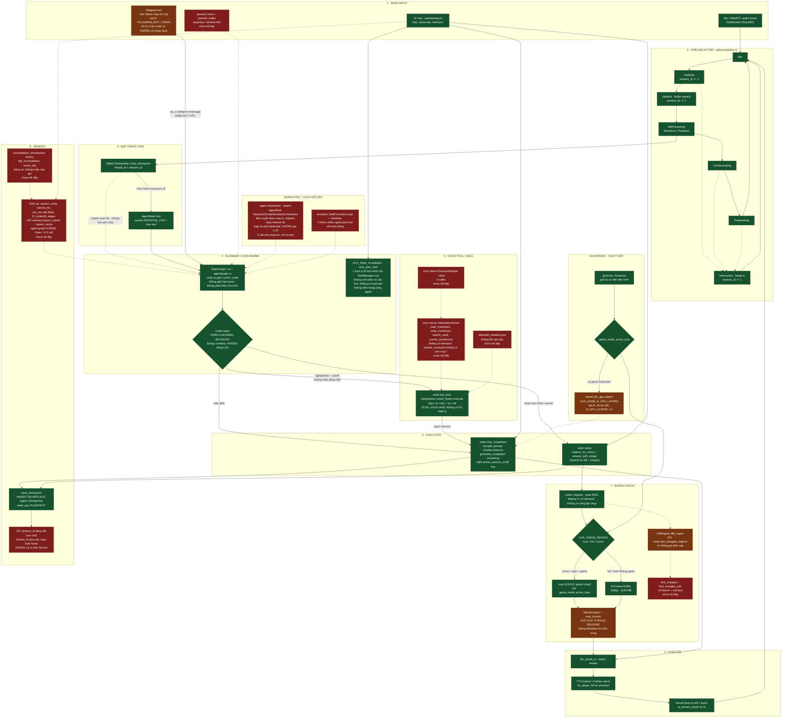
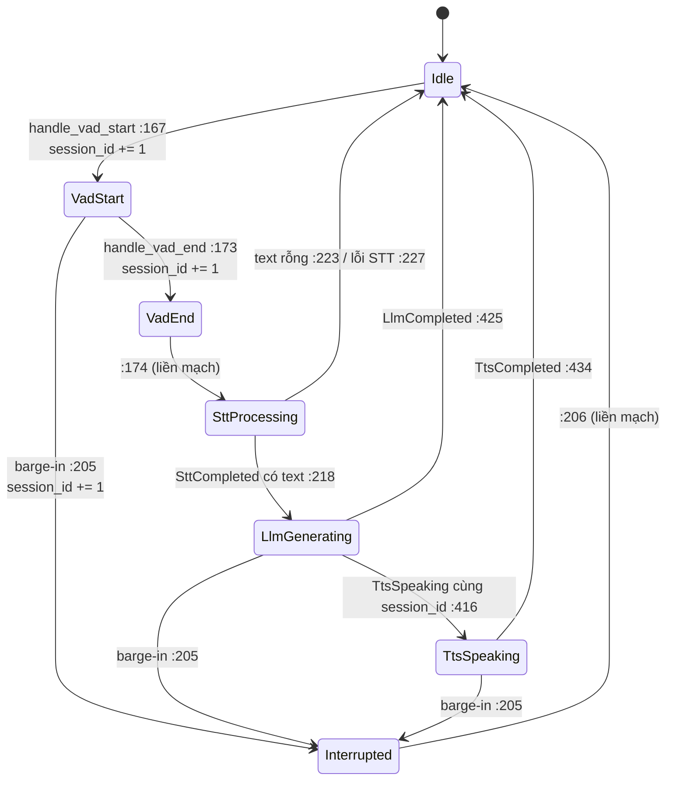
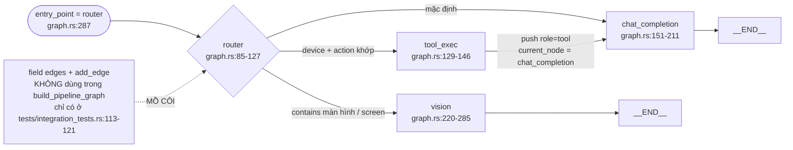
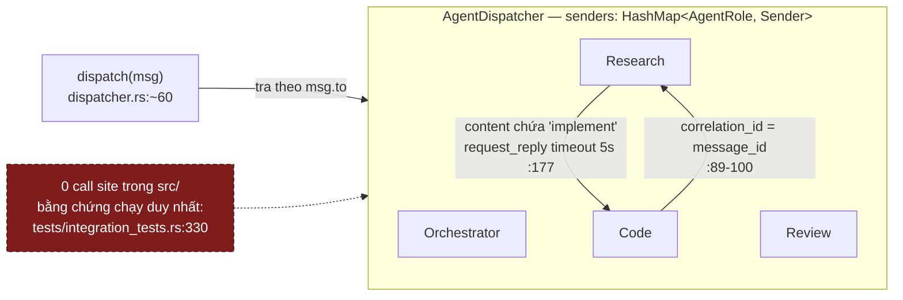
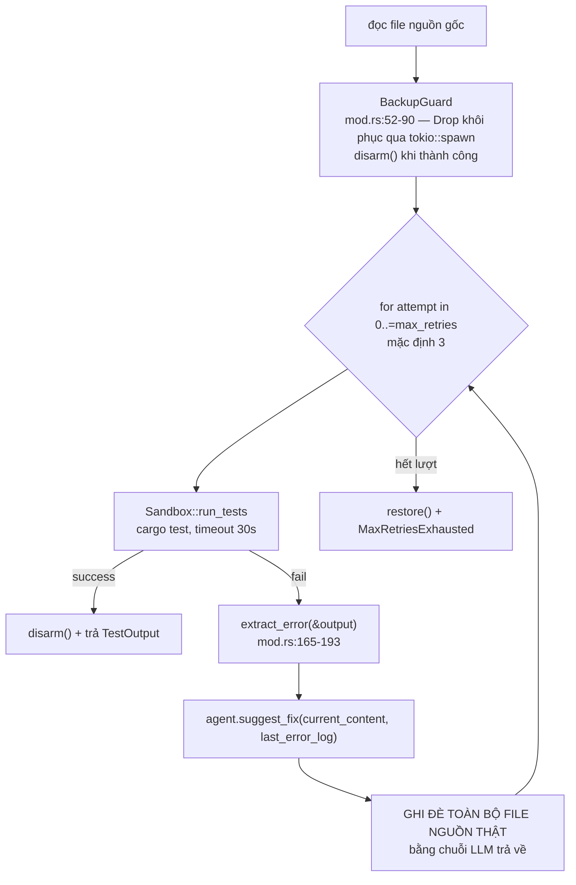

# Hệ agent, bộ nhớ và tiến hoá

[⬆ Mục lục](../README.md) · [◀ Hệ LLM và prompt](04-he-llm-va-prompt.md) · [Thị giác, passive và governor ▶](06-thi-giac-passive-va-governor.md)

---

Tài liệu này mô tả **tầng agent** của LIVA: hai tầng máy trạng thái, `StateGraph` + `build_pipeline_graph`, router phân loại ý định, checkpoint bộ nhớ, swarm dispatcher và vòng tự sửa `evolution/`. Mọi khẳng định đều bám vào file/dòng code thật; nhánh nào **mồ côi** (có code nhưng 0 call site trong `src/`) được đánh dấu rõ ràng.

Quy ước nhãn dùng xuyên suốt:

- **[OK]** — đang chạy thật trong production.
- **[MỘT PHẦN]** — có code, đang chạy nhưng thiếu/hỏng một mảnh, hoặc chỉ bật khi opt-in.
- **[THIẾU]** — chưa có, là stub, hoặc **mồ côi** (không ai gọi).

---

## 1. Bảng tổng kết trạng thái nối dây

| Thành phần | File | Trạng thái |
|---|---|---|
| `agent::state::AgentState` | `src/agent/state.rs` | **[OK]** — dùng trong pipeline giọng nói |
| `agent::graph::StateGraph` + `build_pipeline_graph` | `src/agent/graph.rs` | **[OK]** — chỉ trên đường **voice/WebRTC**, không phải đường `chat:completion` |
| `agent::memory::SqliteCheckpointer` | `src/agent/memory.rs` | **[MỘT PHẦN]** — chạy thật nhưng **hỏng về mặt ngữ nghĩa** (thread_id đổi mỗi lượt — mục 5) |
| `agent::dispatcher` (swarm) | `src/agent/dispatcher.rs` | **[THIẾU] — MỒ CÔI**: 0 tham chiếu trong `src/`, chỉ có ở `tests/integration_tests.rs:334` |
| `evolution::{SelfCorrectionLoop, Sandbox}` | `src/evolution/*` | **[THIẾU] — MỒ CÔI**: 0 tham chiếu trong `src/` ngoài `pub mod evolution;` (`src/lib.rs:15`); chỉ tests dùng |
| `mcp::server::NativeMcpServer` | `src/mcp/server.rs` | **[THIẾU] — NỬA MỒ CÔI**: được khởi tạo và nhét vào `AppState` (`src/main.rs:168,251`) nhưng **`handle_command` không có arm nào gọi `state.mcp_server`** |
| `mcp::client::ProcessWrapper` | `src/mcp/client.rs` | **[THIẾU] — MỒ CÔI**: không ai gọi |
| `integrations::smart_home` | `src/integrations/smart_home.rs` | **[MỘT PHẦN]** — 3 điểm gọi thật (node `tool_exec`, `integration:smart_home_control`, `integrations:list`/`get_skills_list`) nhưng thân hàm là **stub chỉ log** |
| `passive::{hook,buffer}` | `src/passive/*` | **[THIẾU] — MỒ CÔI**: grep `passive` trong `main.rs`/`lib.rs`/`webrtc/*` chỉ ra đúng 1 dòng `pub mod passive;` (`src/lib.rs:14`) |
| `data/skill_whitelist.json` | `data/` | **[THIẾU] — CHẾT HOÀN TOÀN**: grep toàn repo, không file `.rs`/`.ts`/`.vue`/`.py` nào đọc nó |

Bảng trên chỉ soi **phạm vi tầng agent**. Bảng nối dây/mồ côi cho toàn bộ crate (mọi module, mọi bảng SQL, mọi TODO) nằm ở tài liệu nợ kỹ thuật.

> 📌 Nguồn đầy đủ: [Đánh giá 02 — Nợ kỹ thuật và rủi ro](../03-danh-gia/02-no-ky-thuat-va-rui-ro.md)

---

## 2. Sơ đồ tổng thể — máy trạng thái, agent graph và các nhánh mồ côi

Sơ đồ dưới đây là bản gốc từ báo cáo khảo sát, **giữ nguyên không lược bỏ**. Màu xanh = chạy thật, màu nâu = opt-in / điều kiện, màu đỏ nét đứt = mồ côi / hỏng.

Đây là sơ đồ **luồng agent** (nhìn từ một lượt nói tới lúc trả lời), không phải sơ đồ triển khai. Các khối phụ trong sơ đồ chỉ vẽ ở mức đủ hiểu mạch — chi tiết thuộc về tài liệu sở hữu tương ứng:

> 📌 Sơ đồ kiến trúc tổng thể (client / shell / gateway / core): [Bản vẽ 01 — Kiến trúc tổng thể](01-kien-truc-tong-the.md)
> 📌 Khối S2/S9 (VAD, STT, TTS, ngưỡng thoại): [Bản vẽ 03 — Đường ống thoại](03-duong-ong-thoai.md)
> 📌 Khối S7 + governor (vùng chụp, passive, ngưỡng GPU): [Bản vẽ 06 — Thị giác, passive và governor](06-thi-giac-passive-va-governor.md)
> 📌 Khối S8 (bảng SQL, ERD, mã hoá): [Bản vẽ 07 — Tầng dữ liệu và bảo mật](07-tang-du-lieu-va-bao-mat.md)



---

## 3. Hai tầng máy trạng thái — KHÔNG có Planner/Executor cổ điển

LIVA **không** có kiến trúc Planner → Executor kiểu ReAct/LangGraph đầy đủ. Thay vào đó có **hai tầng máy trạng thái tách biệt**, tầng ngoài điều phối vòng đời thoại, tầng trong định tuyến nội dung một lượt.

### 3.1 Tầng ngoài — actor pipeline thoại [OK]

`src/webrtc/pipeline.rs:8-39`:

```rust
pub enum PipelineState { Idle, VadStart, VadEnd, SttProcessing, LlmGenerating, TtsSpeaking, Interrupted }

pub enum PipelineEvent {
    VadStart,
    VadEnd(Vec<f32>),
    Interrupted,
    SttCompleted { session_id: u64, result: Result<Option<String>, String> },
    TtsSpeaking { session_id: u64 },
    LlmCompleted { session_id: u64, result: Result<(), String> },
    TtsCompleted { session_id: u64, result: Result<(), String> },
}
```

Actor: `pub struct WebRTCActor` (`pipeline.rs:80-95`) với

```rust
pub fn new(state_shared: Arc<AppState>, outgoing_tx: mpsc::Sender<VoiceFrame>)
    -> (WebRTCPipelineHandle, Self)          // pipeline.rs:98
pub async fn run(mut self)                   // pipeline.rs:127
```

Vòng lặp `while let Some(event) = self.event_rx.recv().await` dispatch sang các `handle_*`. Chuyển trạng thái qua `fn transition_to(&mut self, new_state: PipelineState)` (`pipeline.rs:157`) — log `🔄 [State Transition]` rồi phát qua `watch::Sender<PipelineState>`.

**Chuyển trạng thái thật, trích từ code** (số dòng là vị trí lời gọi `transition_to`):

| Handler | Dòng | Chuyển sang |
|---|---|---|
| `handle_vad_start` | `:167` | `VadStart` |
| `handle_vad_end` | `:173`, `:174` | `VadEnd` rồi **ngay lập tức** `SttProcessing` |
| `handle_interrupted` | `:205`, `:206` | `Interrupted` rồi **ngay lập tức** `Idle` |
| `handle_stt_completed` | `:218` / `:223` / `:227` | `LlmGenerating` nếu có text; `Idle` nếu rỗng hoặc lỗi |
| `handle_tts_speaking` | `:416` | `TtsSpeaking` (chỉ khi `session_id` còn khớp) |
| `handle_llm_completed` | `:425` | `Idle` |
| `handle_tts_completed` | `:434` | `Idle` |

Máy trạng thái này dựng lại thành sơ đồ trạng thái:



Nối dây thật: `main.rs:459-489` accept WS + kiểm path `/ws` → `handle_ws_connection` (`main.rs:494`) → `WebRTCActor::new` + `tokio::spawn(actor.run())` (`main.rs:509-510`). VAD gọi `pipeline_handle.on_vad_start()` (`main.rs:654`), `on_vad_end(speech_audio)` (`main.rs:690`, `main.rs:713`), `on_interrupted()` (`main.rs:1033`).

> Ghi chú: `WebRTCPipelineHandle::feed_rtp_pcm` (`pipeline.rs:72-77`) có thân hàm là `Ok(())` với 3 dòng `// TODO` — **[THIẾU]**.

### 3.2 Không có Planner riêng [THIẾU]

Cái gần "planner" nhất là prompt `llm::persona::SYS_TASK_PLANNER` dùng bởi lệnh `task_plan_chat` (`src/lib.rs:708-808`): **một lượt LLM one-shot** đọc `title`/`description` của task từ bảng `tasks`.

- **Không** sinh plan có cấu trúc (không JSON step list).
- **Không** có executor tiêu thụ output.
- **Không** nằm trong vòng agent — nó là một lệnh gateway độc lập.

UI gọi nó ở `liva-ui/src/components/dashboard/TaskManager.vue:99,163`.

---

## 4. `StateGraph` — DAG có tên nhưng thực chất là chuỗi động

### 4.1 Hạ tầng đồ thị [OK]

```rust
pub type NodeFuture = Pin<Box<dyn Future<Output = Result<AgentState, String>> + Send>>;   // graph.rs:10
pub type NodeFn     = Box<dyn Fn(AgentState) -> NodeFuture + Send + Sync>;                // graph.rs:11

pub struct StateGraph {                        // graph.rs:13-17
    nodes: HashMap<String, NodeFn>,
    edges: HashMap<String, String>,            // 1 cạnh ra / node → KHÔNG phải DAG tổng quát
    entry_point: String,
}
```

API:

- `pub fn add_node<F, Fut>(&mut self, name: &str, node: F)` — `graph.rs:28`
- `pub fn add_edge(&mut self, from: &str, to: &str)` — `graph.rs:40`
- `pub fn set_entry_point(&mut self, node: &str)` — `graph.rs:44`
- `pub async fn run(&self, initial_state: AgentState) -> Result<AgentState, String>` — `graph.rs:48`

**Ngữ nghĩa thực thi** (`graph.rs:54-68`): lặp `while state.current_node != "__END__"`; gọi node hiện tại với `state.clone()`; **nếu node KHÔNG tự đổi `current_node`** thì mới đi theo `edges`, không có cạnh thì `__END__`. Tức là **định tuyến động do node tự quyết định** (conditional edge kiểu LangGraph), còn `edges` chỉ là fallback tuyến tính.

Ba nhận xét đọc thẳng từ code, không suy đoán:

1. Trong `build_pipeline_graph` **không có một lời gọi `add_edge` nào** — toàn bộ luồng đi bằng cách node tự gán `state.current_node`. Field `edges` chỉ được dùng ở test (`tests/integration_tests.rs:113-121`) ⇒ `add_edge` + `edges` là **API sống nhưng production không dùng — [THIẾU] (mồ côi một phần)**.
2. `run()` **không có giới hạn số bước / không phát hiện chu trình**. Một node gán `current_node` trỏ về chính nó sẽ lặp vô hạn.
3. `state.clone()` **mỗi vòng lặp** — copy toàn bộ lịch sử hội thoại mỗi bước.

### 4.2 Đồ thị production: `build_pipeline_graph` [OK]

```rust
pub fn build_pipeline_graph(
    state_shared: Arc<AppState>,
    llm_chunk_tx: mpsc::Sender<String>,
    session_id: u64,
    active_session_id: Arc<std::sync::atomic::AtomicU64>,
) -> StateGraph                                   // graph.rs:74-79
```

**4 node, entry point = `"router"`** (`graph.rs:287`):

| Node | File:dòng | Hành vi |
|---|---|---|
| `router` | `graph.rs:85-127` | Phân loại **bằng chuỗi con, không dùng LLM** |
| `tool_exec` | `graph.rs:129-146` | Gọi `crate::integrations::smart_home::execute(payload)`, push message `{"role":"tool"}` → `chat_completion` |
| `chat_completion` | `graph.rs:151-211` | `compile_prompt` → `llm.generate_completion(...)` streaming token qua `llm_chunk_tx` → `__END__` |
| `vision` | `graph.rs:220-285` | `vision::capture::capture_for_vision()` → `llm.answer_with_image(..., VisionImage::Rgb{..})` streaming → `__END__` |

Sơ đồ 4 node và cách chúng tự định tuyến:



### 4.3 Luật router — phân loại ý định bằng `String::contains` [MỘT PHẦN]

Trích nguyên văn logic (`graph.rs:95-123`):

```rust
let text_lower = text.to_lowercase();
let device = if text_lower.contains("light") { Some("light") }
    else if text_lower.contains("ac")  { Some("ac") }
    else if text_lower.contains("fan") { Some("fan") }
    else { None };

let action = if text_lower.contains("on")  { Some("on") }
    else if text_lower.contains("off") { Some("off") }
    else { None };

// Screen-look intent → answer about a screenshot with the VL core.
if text_lower.contains("màn hình") || text_lower.contains("screen") {
    state.current_node = "vision".to_string();
} else if let (Some(d), Some(a)) = (device, action) {
    state.context.insert("device".to_string(), json!(d));
    state.context.insert("action".to_string(), json!(a));
    state.current_node = "tool_exec".to_string();
} else {
    state.current_node = "chat_completion".to_string();
}
```

Thứ tự ưu tiên:

1. `contains("màn hình") || contains("screen")` → `"vision"`.
2. `device ∈ {light, ac, fan}` **và** `action ∈ {on, off}` → set `context["device"]`, `context["action"]` → `"tool_exec"`.
3. Còn lại → `"chat_completion"`.

> **RỦI RO CAO — false positive.** Các so khớp là `contains` trần trên chuỗi thường, không tách từ:
> - `"ac"` là chuỗi con của `back`, `track`, `machine`, `character`, `place`…
> - `"on"` là chuỗi con của `con`, `song`, `one`, `money`, `phone`, `only`…
>
> Câu *"we're back on track"* thoả cả `device = ac` lẫn `action = on` ⇒ chạy `smart_home::execute` ngoài ý muốn.

> **RỦI RO — không có từ khoá tiếng Việt cho thiết bị/hành động.** Chỉ nhánh vision mới có `"màn hình"`. Câu *"bật đèn giúp mình"* rơi thẳng vào `chat_completion` ⇒ nhánh tool thực tế **không dùng được với người dùng Việt**.

> **RỦI RO — chụp màn hình không xác nhận.** `contains("màn hình")` kích hoạt `capture_for_vision()` **không có bước xin phép nào**.

### 4.4 Cơ chế huỷ (barge-in) trong node [OK]

Cả `chat_completion` lẫn `vision` kiểm huỷ **hai lần** — trước và sau khi lấy `blocking_lock` của LLM — bằng cách so `active_session_id` với `session_id` đã bind lúc dựng graph (`graph.rs:175-181`, `graph.rs:236-244`):

```rust
if as_val.load(Ordering::SeqCst) != session_id {
    return Err("LLM cancelled before lock".to_string());
}
let mut llm = ss.llm.blocking_lock();
if as_val.load(Ordering::SeqCst) != session_id {
    return Err("LLM cancelled post-lock".to_string());
}
```

Ngoài ra callback token trả `false` để dừng sinh khi phiên bị thay (`graph.rs:189-195`).

`chat_completion` có **fallback persona**: nếu chuỗi message không có role `system` thì chèn `crate::llm::persona::PERSONA_LIVA` ở vị trí 0 (`graph.rs:165-170`) — dành cho checkpoint cũ tạo trước khi có persona.

`vision` khi lỗi: log `tracing::warn!("[vision] {}")` rồi đẩy chuỗi xin lỗi cứng `"Xin lỗi, hiện mình chưa xem được màn hình."` vào TTS (`graph.rs:271-279`).

### 4.5 `state.rs` — trạng thái phiên (toàn bộ 10 dòng) [OK]

```rust
#[derive(Debug, Serialize, Deserialize, Clone, Default)]
pub struct AgentState {
    pub messages: Vec<Value>,          // chat messages hoặc tool calls
    pub current_node: String,
    pub context: HashMap<String, Value>,
}
```

- `messages` là `Vec<serde_json::Value>` **không định kiểu** — role/content là chuỗi tự do, đọc bằng `.get("content").and_then(|c| c.as_str())`.
- `context` hiện chỉ mang 2 khoá `"device"` và `"action"` do node `router` đặt.
- `current_node` vừa là con trỏ thực thi vừa là tín hiệu định tuyến; giá trị đặc biệt: `"START"`, `"__END__"`.

---

## 5. `memory.rs` — thực chất chỉ là checkpointer [MỘT PHẦN, hỏng ngữ nghĩa]

### 5.1 Toàn bộ nội dung file (56 dòng)

```rust
pub struct SqliteCheckpointer { db: Arc<DatabasePool> }                                          // memory.rs:5
pub fn new(db: Arc<DatabasePool>) -> Self                                                        // memory.rs:10
pub async fn save_checkpoint(&self, thread_id: &str, state: &AgentState) -> Result<(), String>   // memory.rs:14
pub async fn load_checkpoint(&self, thread_id: &str) -> Result<Option<AgentState>, String>       // memory.rs:34
```

SQL ghi (`memory.rs:24`):

```sql
INSERT OR REPLACE INTO agent_checkpoints (thread_id, state_json) VALUES (?1, ?2)
```

serialize **toàn bộ `AgentState` thành JSON**. Bảng (`src/db.rs:206-209`):

```sql
CREATE TABLE IF NOT EXISTS agent_checkpoints (
    thread_id TEXT PRIMARY KEY,
    state_json TEXT NOT NULL
);
```

Ghi qua `pool.writer`, đọc qua `pool.readers`, cả hai đều bọc `tokio::task::spawn_blocking`.

### 5.2 Những thứ **KHÔNG** có trong `memory.rs` [THIẾU]

- **Không** phân tầng ngắn hạn / dài hạn. `AgentState.messages` là toàn bộ "ngắn hạn".
- **Không** truy hồi bằng embedding. Không có lời gọi `search_hybrid_vectors` / `llm:embed` nào từ `agent/`.
- **Không** consolidation. Grep `consolidat` trong `src/*.rs` ngoài `db.rs` chỉ ra 2 hit ở `src/lib.rs:894,925` — đó là **câu SELECT đọc cột `consolidation_status` để hiển thị** cho lệnh `get_memory_data`. Các bảng `consolidation_checkpoints`, `dlq_consolidation`, `events`, `vector_dlq` được `init_schemas` tạo ra (`db.rs:211-288`) nhưng **không có code Rust nào ghi vào chúng**.
- **Không** mã hoá. Trái ngược với `facts` (dùng `db::set_fact(&conn, &state.crypto, &fact)` — `lib.rs:991`), `state_json` được lưu **plaintext** dù chứa nguyên văn hội thoại.

### 5.3 LỖI KHOÁ CHECKPOINT — dùng `session_id` làm `thread_id`

Đây là lỗi nghiêm trọng nhất của tầng agent. Nối dây tại `src/webrtc/pipeline.rs:246-295`:

```rust
let checkpointer = crate::agent::memory::SqliteCheckpointer::new(Arc::new(state_llm.db.clone()));
let session_id_str = session_id.to_string();          // ⚠ thread_id = session_id (u64)

// Load existing checkpoint
let loaded = checkpointer.load_checkpoint(&session_id_str).await;
let state = match loaded {
    Ok(Some(mut st)) => {                              // pipeline.rs:253-257 — KHÔNG BAO GIỜ CHẠM TỚI
        st.messages.push(serde_json::json!({"role": "user", "content": text}));
        st.current_node = "router".to_string();
        st
    }
    _ => {                                             // pipeline.rs:258-267 — luôn đi nhánh này
        crate::agent::state::AgentState {
            messages: vec![
                serde_json::json!({"role": "system", "content": crate::llm::persona::PERSONA_LIVA}),
                serde_json::json!({"role": "user", "content": text}),
            ],
            current_node: "router".to_string(),
            context: std::collections::HashMap::new(),
        }
    }
};
```

Trong khi đó `session_id` **tăng ở MỌI sự kiện VAD**:

```rust
async fn cancel_active_operations(&mut self) {        // pipeline.rs:437-439
    self.session_id += 1;
    self.active_session_id.store(self.session_id, Ordering::SeqCst);
```

và `cancel_active_operations()` được gọi trong `handle_vad_start` (`:166`), `handle_vad_end` (`:172`) và `handle_interrupted` (`:204`).

**Hệ quả đọc thẳng từ code:**

| # | Hệ quả | Cơ chế |
|---|---|---|
| 1 | **Hội thoại không có trí nhớ đa lượt** | Mỗi lượt nói sinh `thread_id` mới ⇒ `load_checkpoint` luôn trả `None` ⇒ luôn dựng `AgentState` mới với đúng `[system PERSONA_LIVA, user text]` |
| 2 | **Rò rỉ dung lượng** | Bảng `agent_checkpoints` phình thêm 1 hàng mỗi lượt nói, không bao giờ dọn |
| 3 | **Ghi đè xuyên phiên** | `WebRTCActor::new` đặt `session_id: 0` (`pipeline.rs:112`) ⇒ mỗi lần WS reconnect lại đếm từ 0, `INSERT OR REPLACE` **ghi đè** checkpoint của phiên trước |
| 4 | **Đụng khoá giữa các kết nối** | Hai kết nối WS khác nhau đều sinh `"1"`, `"2"`, … ⇒ lịch sử lẫn nhau |
| 5 | **Code chết** | Nhánh "load thành công" (`pipeline.rs:252-257`) là code **không thể chạm tới** trong luồng hiện tại |

**Bản chất của lỗi:** `thread_id` phải là **định danh hội thoại bền vững** (per-connection hoặc per-user), còn `session_id` trong LIVA là **bộ đếm huỷ tác vụ** (cancellation token) — hai khái niệm ngược nhau về vòng đời. Dùng cái sau làm cái trước khiến checkpointer chỉ ghi mà không bao giờ đọc lại được.

### 5.4 Bộ nhớ dài hạn thật sự nằm ở đâu (và agent không dùng) [THIẾU — chưa nối dây]

`src/db.rs:300-351` định nghĩa sẵn một hạ tầng RAG lai đầy đủ: `vectors_meta` + `vectors_fts` (FTS5 giữ dấu tiếng Việt) + `vec_idx` (sqlite-vec, int8 384 chiều) + knowledge graph `l3_nodes`/`l3_edges`, phục vụ ba hàm tìm kiếm `search_similar_vectors` (KNN), `search_fts_vectors` (BM25) và `search_hybrid_vectors` (RRF).

Truy cập qua gateway bằng `memory:set_fact`, `memory:get_fact`, `memory:search_hybrid`, `memory:upsert_vector`, `llm:embed`.

> 📌 Nguồn đầy đủ (schema từng bảng, công thức chấm điểm dense/RRF, ai ghi ai đọc): [Bản vẽ 07 — Tầng dữ liệu và bảo mật](07-tang-du-lieu-va-bao-mat.md)

**Nhưng `build_pipeline_graph` không hề chạm vào `state_shared.db`.** Kết luận: RAG tồn tại như một API mà **client phải tự lái** (client tự tính vector rồi truyền `query_vector` vào), và grep `memory:search_hybrid` / `memory:upsert_vector` trong `liva-ui/src` cho **0 kết quả** ⇒ hiện không ai gọi. Đây là hạ tầng có nhưng **chưa nối dây**.

---

## 6. Swarm dispatcher — CÓ CODE, ĐANG TẮT [THIẾU — MỒ CÔI]

### 6.1 Kiểu dữ liệu

```rust
pub enum AgentRole { Research, Code, Review, Orchestrator }   // dispatcher.rs:8-13

pub struct AgentMessage {                                      // dispatcher.rs:16-23
    pub message_id: String, pub trace_id: String,
    pub from: AgentRole, pub to: AgentRole,
    pub content: String, pub correlation_id: Option<String>,
}

pub struct AgentDispatcher { senders: Arc<RwLock<HashMap<AgentRole, mpsc::Sender<AgentMessage>>>> }
pub struct SwarmAgent { role, dispatcher, receiver, pending_replies: Arc<Mutex<HashMap<String, oneshot::Sender<AgentMessage>>>> }
```

API: `AgentDispatcher::register_agent(&self, role, sender)`, `AgentDispatcher::dispatch(&self, msg) -> Result<(), String>`, `SwarmAgent::new(role, dispatcher, receiver)`, `SwarmAgent::start(self) -> JoinHandle<()>`.

### 6.2 Cách phân việc

- **Không** có scheduler, **không** có hàng đợi công việc. Định tuyến **thuần theo `msg.to`** — tra `HashMap<AgentRole, Sender>`, một role ↔ một mailbox.
- "Song song" đến từ chỗ mỗi message nhận được lại được `tokio::spawn` riêng (`dispatcher.rs:88`), nên một agent xử lý nhiều message đồng thời và không tự deadlock khi request-reply lồng nhau.
- **Request/reply:** `request_reply_internal` (`dispatcher.rs:150-185`) tạo `oneshot::channel`, ghi vào `pending_replies` theo `message_id`, gửi đi rồi chờ **timeout 5 giây** (`dispatcher.rs:177`). Reply được nhận diện bởi `correlation_id == Some(request message_id)` (`dispatcher.rs:89-100`).



### 6.3 Logic agent là stub hardcode, KHÔNG gọi LLM

`dispatcher.rs:116-136`:

- `Research`: nếu `msg.content.contains("implement")` → uỷ quyền sang `Code`, ghép chuỗi `"Research results: Code completed: {}"`; ngược lại trả `"Research findings on: {}"`.
- `Code`: trả literal `"// Auto-generated Rust Code\nfn main() { println!(\"Done: {}\"); }"`.
- `Review`, `Orchestrator`: rơi vào `_ => format!("Role {:?} stub response", role)`.

### 6.4 Trạng thái: TẮT — và tắt vì MỒ CÔI, không phải vì cờ

Không có feature-flag, không có env var — đơn giản là **không có call site nào trong `src/`**. Bằng chứng chạy được duy nhất là test `test_case_6_swarm_duplex_collaboration_no_deadlock` (`tests/integration_tests.rs:330-…`), test này tự tay `register_agent` cho `Orchestrator`/`Research`/`Code` rồi `dispatch` một message.

⇒ Muốn bật swarm cần **hai** việc, không phải một: (a) tạo call site (ví dụ arm `swarm:*` trong `handle_command` hoặc một node trong `build_pipeline_graph`), và (b) **thay stub bằng lời gọi LLM thật** — hiện logic role không hề chạm `AppState.llm`.

---

## 7. `evolution/` — vòng tự sửa code [THIẾU — MỒ CÔI]

### 7.1 Sandbox (`src/evolution/sandbox.rs`, 133 dòng)

```rust
pub enum SandboxError { Io(std::io::Error), Timeout, SpawnFailed(String) }           // :8-12
pub struct TestOutput { pub success: bool, pub stdout: String, pub stderr: String }  // :32-37
pub struct Sandbox;
impl Sandbox {
    pub async fn run_tests(project_path: &Path) -> Result<TestOutput, SandboxError>  // :42
}
```

**Cơ chế cách ly thực tế — rất mỏng:**

- Chạy `cargo test` với `current_dir(project_path)` và `CARGO_TARGET_DIR = project_path/target_sandbox` (`sandbox.rs:43-50`). Đây là **cách ly thư mục build**, **KHÔNG phải cách ly bảo mật**.
- **Không** container, **không** chroot/jail, **không** giới hạn RAM/CPU, **không** giới hạn mạng, **không** hạ quyền, **không** lọc env. Code test được biên dịch và **chạy với đầy đủ quyền của process LIVA**.
- Giới hạn duy nhất: **timeout 30 giây** (`Duration::from_secs(30)`, `sandbox.rs:105`). Khi timeout, trên Windows gọi `taskkill /F /T /PID <pid>` để diệt cả cây tiến trình con, rồi `child.kill()` (`sandbox.rs:119-129`).
- Fallback Windows: nếu `Command::new("cargo")` spawn lỗi thì thử `cmd /C cargo test` (`sandbox.rs:57-73`).
- stdout/stderr piped, đọc song song bằng `tokio::join!(wait_child, read_stdout, read_stderr)` để tránh deadlock đầy buffer pipe (`sandbox.rs:97-103`).

### 7.2 Vòng tự sửa (`src/evolution/mod.rs`, 295 dòng — trong đó ~100 dòng là `#[cfg(test)]`)

```rust
pub trait CodeAgent: Send + Sync {
    fn suggest_fix(&self, source_content: &str, error_log: &str)
        -> impl Future<Output = Result<String, String>> + Send;      // :6-12
}

pub struct SelfCorrectionLoop<A: CodeAgent> { agent: A, max_retries: usize }               // :14
pub enum SelfCorrectionError { Io, Sandbox, Agent(String), MaxRetriesExhausted(String) }   // :20-25

pub fn new(agent: A) -> Self                                    // max_retries = 3  (:96)
pub fn with_max_retries(agent: A, max_retries: usize) -> Self
pub async fn run(&self, project_path: &Path, source_file_path: &Path)
    -> Result<TestOutput, SelfCorrectionError>                  // :104
```

**Thuật toán** (`mod.rs:104-163`):



`extract_error` (`mod.rs:165-193`) lọc các dòng chứa `error[E`, `error:`, `--> `, `panicked at`, `failed`, và khối `failures:`.

### 7.3 Có thật sự chạy được không?

**Cơ chế thì chạy được, nhưng hệ thống thì chưa bao giờ chạy.** Cụ thể:

- **Không có implementor `CodeAgent` nào trong `src/`.** Toàn bộ implementor là mock trong test: `MockCodeAgent` (`mod.rs:201-220`, `impl CodeAgent` tại `mod.rs:206`), `IterativeMockAgent` (`tests/self_correction_stress.rs:46+`, `:51`), và `tests/sandbox_stress.rs:166`. Nghĩa là **không có cầu nối tới LLM** — LIVA **chưa hề "tự viết bản vá"**.
- Grep `evolution` trong `src/`: chỉ ra đúng `src/lib.rs:15  pub mod evolution;`. Không có lệnh gateway nào (`handle_command` không có arm `evolution:*`), không có background task nào trong `main.rs`.
- Test tự chứng minh cơ chế hoạt động: `mod.rs:248-294` (`test_self_correction_loop_syntax_error`) dựng một crate tạm trong `std::env::temp_dir()`, ghi `src/lib.rs` lỗi cú pháp, mock trả về code đúng → assert `output.success`. Cùng với `tests/sandbox_stress.rs` và `tests/self_correction_stress.rs` (hai file này spawn `cargo test` lồng nhau nên rất chậm — đúng như `CLAUDE.md` ghi).

> **RỦI RO nếu định bật:** `run()` **ghi đè trực tiếp file nguồn thật** rồi mới rollback khi thất bại, và sandbox **không chặn được** code do LLM sinh ra khi nó được biên dịch và chạy (không giới hạn quyền, mạng, tài nguyên). Bật nhánh này mà không bổ sung cách ly thật là mở một đường thực thi mã tuỳ ý.

---

## 8. Tool / skill calling

### 8.1 LIVA hiện gọi công cụ thế nào [MỘT PHẦN]

**Không** có tool-calling theo kiểu function-calling của LLM (không parse JSON tool call từ model). Chỉ có **1 đường duy nhất, bằng keyword**: node `router` → node `tool_exec` → `integrations::smart_home::execute()`.

`src/integrations/mod.rs` chỉ có `pub mod smart_home;` ⇒ **toàn hệ thống có đúng 1 skill**, và `smart_home::execute` (`smart_home.rs:51-67`) **chỉ log rồi trả chuỗi** — không có giao thức, không điều khiển thiết bị thật.

Điều đáng nói ở tầng agent: `get_metadata()` đã sẵn schema chuẩn function-calling nhưng **không được nhét vào prompt ở đâu cả** — `compile_prompt` chỉ nhận `Vec<ChatMessage>`. Nghĩa là ngay cả khi có thêm skill, model cũng không "nhìn thấy" chúng; định tuyến vẫn phải đi qua keyword ở node `router`.

> 📌 Nguồn đầy đủ (kiểu dữ liệu, thân hàm stub, vì sao chưa có giao thức): [Bản vẽ 09 — Tích hợp ngoài](09-tich-hop-ngoai.md)

### 8.2 Danh sách skill lộ ra UI [OK]

`get_skills_list` (`lib.rs:528-532`) và `integrations:list` (`lib.rs:1478-1482`) đều trả `[ smart_home::get_metadata() ]` — mảng **1 phần tử**. UI tiêu thụ ở `liva-ui/src/components/dashboard/SkillsView.vue:107,141` và `liva-ui/src/composables/useGateway.ts:162,283,318`.

### 8.3 `data/skill_whitelist.json` — file chết [THIẾU]

File này bật/tắt 4 skill (`privacy_dashboard`, `system_audit`, `send_zalo_rpa`, `read_emails`) nhưng grep `skill_whitelist` toàn repo cho **0 kết quả** ngoài chính nó — đây là di sản của engine TypeScript/Python đã bị xoá.

Hệ quả cho tầng agent: **không có cơ chế whitelist skill nào đang được thực thi**. Node `tool_exec` gọi thẳng `smart_home::execute` mà không tra cứu quyền ở đâu cả; nếu sau này nối swarm/MCP vào graph thì phải tự dựng lại lớp kiểm soát này.

> 📌 Nguồn đầy đủ (nội dung file, các di sản `data/agents/*` cùng loại): [Bản vẽ 07 — Tầng dữ liệu và bảo mật](07-tang-du-lieu-va-bao-mat.md)

### 8.4 MCP — tool server có, chưa cắm vào agent [THIẾU — NỬA MỒ CÔI]

`src/mcp/server.rs` khai báo `NativeMcpServer` với 4 tool (`read_markdown`, `write_markdown`, `search_vault`, `control_smarthome`) đọc/ghi trong Obsidian vault, có `resolve_path` chống path-traversal. `src/mcp/client.rs` là `ProcessWrapper` spawn MCP server ngoài qua stdio JSON-lines.

> 📌 Nguồn đầy đủ (bảng tool + args, `protocol.rs` lệch spec, bảo mật MCP): [Bản vẽ 09 — Tích hợp ngoài](09-tich-hop-ngoai.md)

Phần liên quan tầng agent là **ranh giới nối dây**: `main.rs:168` `NativeMcpServer::new(&vault_path)` → `main.rs:251` nhét vào `AppState` (field `pub mcp_server: Arc<mcp::server::NativeMcpServer>` — `lib.rs:44`). **Nhưng grep `mcp_server` trong `src/` chỉ ra 6 hit và không hit nào là điểm sử dụng** — chỉ có khai báo field, khởi tạo ở `main.rs`, và 3 chỗ dựng `AppState` giả trong `src/bin/verify_*.rs`. `handle_command` **không có arm `mcp:*`**.

⇒ MCP server đang **được cấp phát nhưng không ai gọi** ngoài `tests/integration_tests.rs`. `mcp::client::ProcessWrapper` (spawn MCP server ngoài qua stdio JSON-lines) **hoàn toàn mồ côi**.

---

## 9. Ranh giới nối dây — chi tiết

### 9.1 Đã nối dây thật vào gateway (WS `ws://127.0.0.1:8002/ws`)

**Đường nhị phân (giọng nói) → agent graph:**

`main.rs:459-489` accept + kiểm path `/ws` → `handle_ws_connection` (`main.rs:494`) → `WebRTCActor::new` + `tokio::spawn(actor.run())` (`main.rs:509-510`) → frame `OP_MIC_IN` → VAD → `on_vad_start`/`on_vad_end` → `PipelineState::SttProcessing` → `handle_stt_completed` → `spawn_llm_and_tts(text)` → **`SqliteCheckpointer::load_checkpoint` → `build_pipeline_graph(...).run(state)` → `save_checkpoint`** (`pipeline.rs:246-295`) → token stream `llm_chunk_tx` → TTS chunker (`pipeline.rs:301+`) → `VoiceFrame` ra client.

> Đây là **con đường duy nhất** module `agent/` được thực thi trong production.

**Đường JSON (text) — KHÔNG đi qua agent graph:**

- `chat:completion` (`lib.rs:1318-1393`) gọi thẳng `llm_manager.generate_completion` sau `compile_prompt`, có chèn persona server-side.
- `vision:ask` (`lib.rs:1394-1445`) gọi thẳng `answer_with_image`.
- `task_plan_chat` gọi thẳng LLM với `SYS_TASK_PLANNER`.

Không router, không `tool_exec`, không checkpoint.

Nền tảng background đã bật trong `main.rs`: autoload router model (`:258`), governor game-aware GPU downshift poll 5s + `LIVA_GAME_N_GPU_LAYERS` (`:275-292`), WS server (`:297`), TTS idle-unload 60s (`:305`), Telegram bot nếu có `TELEGRAM_BOT_TOKEN` (`:332`).

### 9.2 Còn mồ côi trong phạm vi tầng agent (có code, 0 call site trong `src/`)

Bốn nhánh dưới đây là **thứ chặn tầng agent tiến hoá**, nên liệt kê tại chỗ:

1. `src/agent/dispatcher.rs` — toàn bộ swarm (`AgentDispatcher`/`SwarmAgent`/`AgentRole`/`AgentMessage`).
2. `src/evolution/` — `SelfCorrectionLoop`, `Sandbox`, trait `CodeAgent` (**thiếu implementor thật**).
3. `StateGraph::add_edge` + field `edges` — API sống nhưng production không dùng (mục 4.2).
4. `src/mcp/{server,client}.rs` — server có instance sống trong `AppState` nhưng không có consumer; client hoàn toàn không ai gọi.

Ngoài ra còn `src/passive/*`, `feed_rtp_pcm`, 9 bảng SQL không có writer và `data/skill_whitelist.json` — chúng nằm ngoài tầng agent nên chỉ nhắc tên.

> 📌 Nguồn đầy đủ (bảng mồ côi toàn crate, số dòng chết, nguyên nhân gốc là `#[allow(dead_code)]` cấp crate): [Đánh giá 02 — Nợ kỹ thuật và rủi ro](../03-danh-gia/02-no-ky-thuat-va-rui-ro.md)

---

## 10. Tóm tắt rủi ro tầng agent

Ba rủi ro nặng nhất do chính tầng agent sinh ra: (1) checkpoint dùng `session_id` làm `thread_id` ⇒ **không có trí nhớ đa lượt** (`pipeline.rs:246-251` + `:437-439`, mục 5.3); (2) router phân loại bằng `String::contains` ⇒ false-positive `"ac"`/`"on"` và **mù tiếng Việt** (`graph.rs:96-123`, mục 4.3); (3) `evolution::Sandbox` không phải cách ly bảo mật và `run()` ghi đè file nguồn thật trước khi rollback (`sandbox.rs:43-50`, `mod.rs:104-163`, mục 7).

Mức nhẹ hơn: `state_json` lưu plaintext trong khi `facts` được mã hoá; `StateGraph::run` không giới hạn bước và `clone()` state mỗi vòng; `contains("màn hình")` tự chụp màn hình không xin phép; MCP server cấp phát mà không có consumer.

> 📌 Nguồn đầy đủ (bảng rủi ro xếp hạng CRITICAL/HIGH/MEDIUM/LOW toàn hệ thống, mã định danh C*/H*/F*): [Đánh giá 02 — Nợ kỹ thuật và rủi ro](../03-danh-gia/02-no-ky-thuat-va-rui-ro.md) · hướng dẫn sửa: [Đánh giá 03 — Lộ trình sửa lỗi và nâng cấp](../03-danh-gia/03-lo-trinh-sua-loi-va-nang-cap.md)

---

## Liên quan

**Đọc tiếp theo mạch:** [⬆ Mục lục](../README.md) · [◀ Hệ LLM và prompt](04-he-llm-va-prompt.md) · [Thị giác, passive và governor ▶](06-thi-giac-passive-va-governor.md)

**Tài liệu này dựa vào (nguồn sự thật ở nơi khác):**

- [Bản vẽ 03 — Đường ống thoại](03-duong-ong-thoai.md) — chuỗi VAD → STT → LLM → TTS mà actor pipeline điều phối, ngưỡng VAD/AEC, bảng engine STT và backend TTS.
- [Bản vẽ 04 — Hệ LLM và prompt](04-he-llm-va-prompt.md) — `compile_prompt`, `PERSONA_LIVA`, `SYS_TASK_PLANNER` và cấu hình model mà node `chat_completion`/`vision` gọi tới.
- [Bản vẽ 06 — Thị giác, passive và governor](06-thi-giac-passive-va-governor.md) — `capture_for_vision`, `LIVA_VISION_REGION`, `passive/*` và ngưỡng governor xuất hiện trong sơ đồ mục 2.
- [Bản vẽ 07 — Tầng dữ liệu và bảo mật](07-tang-du-lieu-va-bao-mat.md) — ERD, schema `agent_checkpoints`, hạ tầng RAG lai và phạm vi mã hoá (mục 5).
- [Bản vẽ 09 — Tích hợp ngoài](09-tich-hop-ngoai.md) — chi tiết MCP server/client và skill `smart_home` mà node `tool_exec` gọi (mục 8).
- [Bản vẽ 02 — Giao thức IPC và WebSocket](02-giao-thuc-ipc-va-websocket.md) — tập lệnh `handle_command` và khung nhị phân, nơi agent graph được kích hoạt.
- [Đánh giá 02 — Nợ kỹ thuật và rủi ro](../03-danh-gia/02-no-ky-thuat-va-rui-ro.md) — bảng rủi ro xếp hạng và bảng code mồ côi toàn crate (mục 9.2, mục 10).
- [Đánh giá 03 — Lộ trình sửa lỗi và nâng cấp](../03-danh-gia/03-lo-trinh-sua-loi-va-nang-cap.md) — hướng dẫn sửa cụ thể cho lỗi `thread_id` và router keyword.
- [Vận hành 04 — Kiểm thử và CI](../02-van-hanh/04-kiem-thu-va-ci.md) — vị trí và cách chạy `tests/integration_tests.rs`, `sandbox_stress.rs`, `self_correction_stress.rs`.

**Tài liệu khác dựa vào tài liệu này:**

- [Bản vẽ 03 — Đường ống thoại](03-duong-ong-thoai.md) — lấy máy trạng thái `PipelineState` và điểm bàn giao sang agent graph.
- [Bản vẽ 06 — Thị giác, passive và governor](06-thi-giac-passive-va-governor.md) — lấy node `vision` trong `build_pipeline_graph` làm điểm vào của nhánh chụp màn hình.
- [Đánh giá 01 — Đối chiếu tuyên bố vs thực tế](../03-danh-gia/01-doi-chieu-tuyen-bo-vs-thuc-te.md) — lấy kết luận "không có trí nhớ đa lượt", "swarm/evolution mồ côi" để đối chiếu tuyên bố.
- [Đánh giá 02 — Nợ kỹ thuật và rủi ro](../03-danh-gia/02-no-ky-thuat-va-rui-ro.md) — lấy phân tích H4 (router `contains`), H7 (bộ nhớ dài hạn chưa nối) và H1 (sandbox `evolution`).

**Khi sửa code sau đây thì phải cập nhật tài liệu này:**

- `liva-native-core/src/agent/graph.rs` — mục 4 (StateGraph, sơ đồ 4 node, luật router, cơ chế barge-in).
- `liva-native-core/src/agent/memory.rs` — mục 5 (checkpointer, lỗi khoá `thread_id`).
- `liva-native-core/src/agent/state.rs` — mục 4.5 (`AgentState`).
- `liva-native-core/src/agent/dispatcher.rs` — mục 6 (swarm, request-reply, trạng thái mồ côi).
- `liva-native-core/src/webrtc/pipeline.rs` — mục 3.1 và 9.1 (máy trạng thái ngoài, nối dây checkpoint → graph).
- `liva-native-core/src/evolution/mod.rs` + `sandbox.rs` — mục 7 (vòng tự sửa, giới hạn cách ly).
- `liva-native-core/src/mcp/server.rs` + `client.rs` — mục 8.4 (ranh giới nối dây MCP).
- `liva-native-core/src/integrations/smart_home.rs` — mục 8.1 (đường tool duy nhất, `get_metadata` chưa vào prompt).
