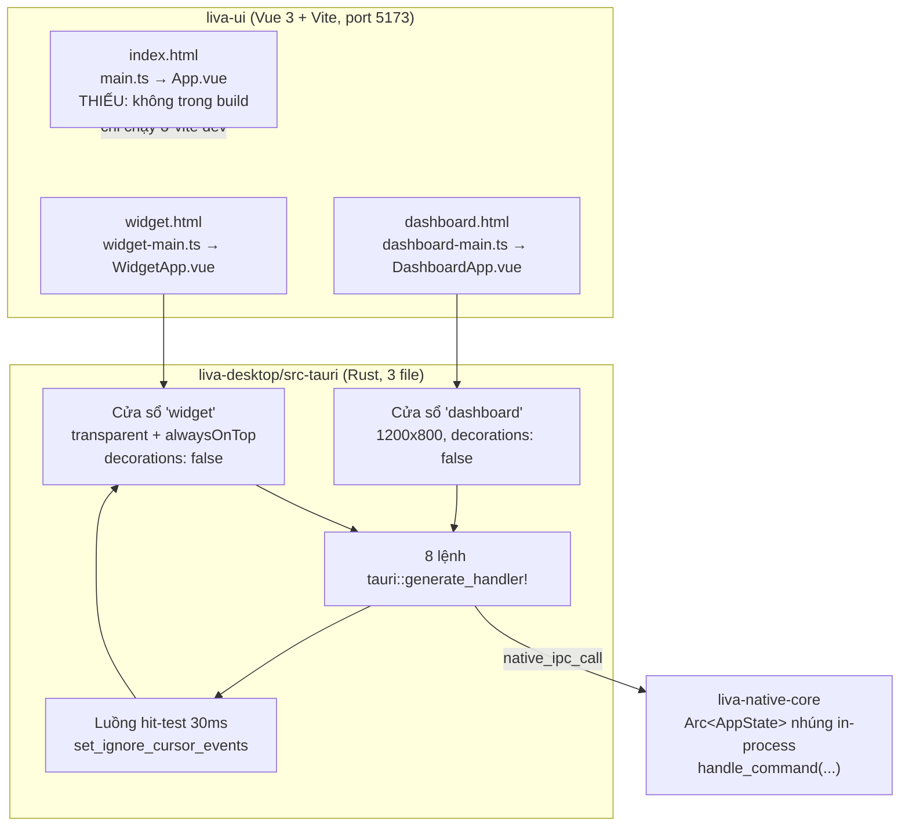
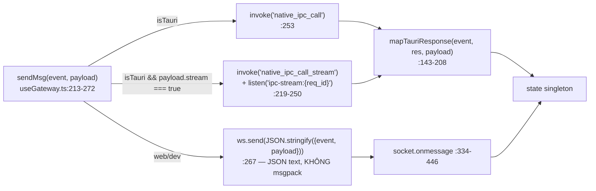
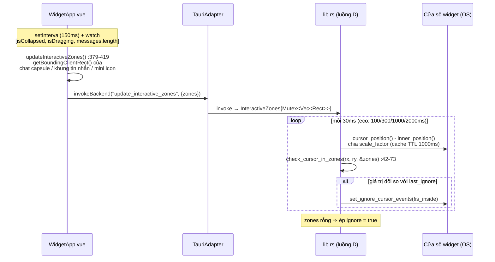
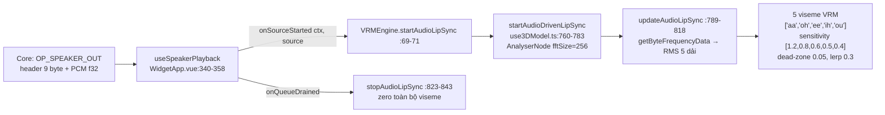

# Frontend `liva-ui` và vỏ Tauri `liva-desktop`

[⬆ Mục lục](../README.md) · [◀ Tầng dữ liệu và bảo mật](07-tang-du-lieu-va-bao-mat.md) · [Tích hợp ngoài ▶](09-tich-hop-ngoai.md)

---

> Nhãn trạng thái dùng xuyên suốt: **[OK]** đang chạy thật · **[MỘT PHẦN]** có code nhưng tắt/opt-in/chưa nối dây · **[THIẾU]** chưa có/stub.

Tài liệu này mô tả toàn bộ tầng hiển thị của LIVA: ứng dụng Vue 3 đa entry (`liva-ui`), lớp adapter nền tảng, đường truyền xuống lõi Rust, avatar 3D + lip-sync, và vỏ Tauri v2 (`liva-desktop/src-tauri`) — cửa sổ, quyền, CSP, cách nhúng core in-process và tình trạng đóng gói.

---

## 1. Bản đồ nhanh



| Thành phần | Đường dẫn | Vai trò | Trạng thái |
|---|---|---|---|
| `liva-ui` | `E:\Project\LIVA\liva-ui` | SPA đa entry Vue 3 + Vite, `frontendDist` của Tauri | **[OK]** |
| `liva-desktop/src-tauri` | `src/main.rs` (7 dòng), `src/lib.rs` (577 dòng), `build.rs` (3 dòng) | Toàn bộ logic vỏ nằm trong `lib.rs` | **[OK]** |
| `packages/liva-common` | `src/index.ts`, `src/types/config.ts`, `src/types/websocket.ts` | Type dùng chung UI ↔ (gateway cũ) | **[MỘT PHẦN]** — hợp đồng đã trôi khỏi core |
| `liva-desktop/package.json` + `liva-desktop/src` | app Vite riêng | Vestigial, Tauri **không** nạp nó | **[THIẾU]** |

`main.rs:2` — `#![cfg_attr(not(debug_assertions), windows_subsystem = "windows")]`; `main()` chỉ gọi `liva_desktop_lib::run()`.

Bảng trên chỉ liệt kê phần **tầng hiển thị**; bản đồ workspace đầy đủ (mọi crate/package, số dòng, chỉ số dự án) nằm ở tài liệu tổng quan.

> 📌 Nguồn đầy đủ: [Tổng quan hệ thống](00-tong-quan-he-thong.md)

---

## 2. Ba entry point Vite, chỉ hai được build

| HTML | Entry TS | Root component | Trong build? |
|---|---|---|---|
| `liva-ui/widget.html` | `src/widget-main.ts` | `WidgetApp.vue` | ✅ `vite.config.ts:19` |
| `liva-ui/dashboard.html` | `src/dashboard-main.ts` | `DashboardApp.vue` | ✅ `vite.config.ts:20` |
| `liva-ui/index.html` | `src/main.ts` | `App.vue` | ❌ **không** trong `rollupOptions.input` |

```ts
// liva-ui/vite.config.ts:18-21
input: {
  widget:    resolve(__dirname, 'widget.html'),
  dashboard: resolve(__dirname, 'dashboard.html'),
},
```

Khi khai báo `rollupOptions.input` tường minh, Vite bỏ `index.html` mặc định. Kiểm chứng bằng output thật: `liva-ui/dist/` chỉ có `dashboard.html`, `widget.html`, `wake-word-test.html` — **không có `index.html`**.

⇒ **`App.vue` + `main.ts` + `index.html` là [THIẾU]**: chỉ chạy khi mở `http://localhost:5173/` ở chế độ `vite dev` (dev server vẫn phục vụ `index.html` ở root), không bao giờ vào bundle production, Tauri không trỏ tới nó.

### 2.1 Bootstrap giống hệt nhau ở cả 3 entry

`main.ts:8-13`, `dashboard-main.ts:8-10`, `widget-main.ts:8-10` — cùng một pattern:

```ts
const app = createApp(<Root>);
app.provide('platform', detectPlatform());
app.mount("#app");
```

Khác nhau ở CSS: `main.ts` / `widget-main.ts` nạp `./style.css`, `dashboard-main.ts` nạp `./dashboard.css`. Cả ba đều nạp `virtual:uno.css` (UnoCSS).

### 2.2 Build config đáng chú ý

- `vite.config.ts:12` — `base: './'` (đường dẫn tương đối, bắt buộc cho `frontendDist`).
- `vite.config.ts:17` — `external: ['fs','path','os','crypto','child_process']`, comment ghi "[Phase 5.1] Fail-fast: Cắt đứt mọi liên kết vô tình với Node.js API trong Frontend".
- `vite.config.ts:23-39` — `manualChunks`: `vendor-three` (three + @pixiv), `vendor-pixi` (pixi.js + pixi-live2d-display), `vendor-ai` (@mediapipe), `vendor-vue`, `vendor`.
- `vite.config.ts:43-47` — `server.host: true`, `port: 5173`, `strictPort: true` — mở cho LAN để mobile client truy cập.
- `chunkSizeWarningLimit: 1000` (`:14`).
- Không có plugin Tauri chính thức; `liva-ui/package.json` chỉ có `dev/build/preview/test` (`build` = `vue-tsc -b && vite build`).
- `vitest.config.ts`: jsdom, `setupFiles: ./tests/setup.ts`, coverage istanbul; loại trừ `src/main.ts`, `src/App.vue`, `src/components/VisionSensor.vue` (file này **0 byte**) — tức là hai entry chết bị gỡ khỏi phép đo phủ.

> 📌 Nguồn đầy đủ (ngưỡng coverage, bảng test, CI): [Kiểm thử và CI](../02-van-hanh/04-kiem-thu-va-ci.md)

### 2.3 Thư viện đồ hoạ đã cài

`liva-ui/package.json:12-26`: `pixi.js@^6.5.10` + `pixi-live2d-display@^0.4.0` (2D), `three@^0.184.0` + `@pixiv/three-vrm@^3.5.2` (3D), `@mediapipe/tasks-vision@^0.10.34` (face tracking), `msgpackr` (giải mã khung WS nhị phân).

---

## 3. `useGateway.ts` — dual transport, module-level singleton

File: `liva-ui/src/composables/useGateway.ts` (607 dòng). Toàn bộ state (`ws`, `configData`, `userProfile`, …) khai báo **ngoài** hàm `useGateway()` (dòng 18-140) ⇒ mọi component share chung một socket/store. `export function useGateway()` ở `:472` trả về ~30 field.

### 3.1 Rẽ nhánh Tauri vs Web

```ts
// useGateway.ts:210
const isTauri = typeof window !== "undefined"
  && (window as unknown as Record<string, unknown>).__TAURI_INTERNALS__ !== undefined;
```

> ⚠️ `isTauri` được tính **một lần lúc load module**. Nếu `__TAURI_INTERNALS__` chưa được inject kịp, **toàn phiên** rơi về WebSocket.



`connect()` (`:274-470`):
- Trong Tauri: chỉ set `isConnected = true` rồi bắn 10 lệnh init (`:278-287`).
- Ngoài Tauri: mở `ws://${wsHost}:8002/ws` (`:296`) với `socket.binaryType = "arraybuffer"` (`:298`); `wsHost` = `127.0.0.1` nếu hostname rỗng/localhost, ngược lại dùng chính hostname (`:294-295`) — hỗ trợ truy cập LAN.
- Reconnect: `onclose` → `setTimeout(connect, 3000)` (`:458-461`), có guard clear timer. `onerror` → `socket.close()`.

**Bộ init 10 op** (`:278-287` Tauri, `:313-322` WS): `get_config`, `get_ai_config`, `get_voice_status`, `get_voice_profiles`, `get_system_status`, `get_skills_list`, `get_user_profile`, `get_tasks`, `get_avatar_models`, `get_memory_data`.

### 3.2 Giải mã khung nhị phân

`onmessage` (`:334-446`): nếu là `ArrayBuffer` → đọc `view.getUint8(0)`; **chỉ chấp nhận `type === 0x02` → `unpack(new Uint8Array(arrayBuffer, 1))` (msgpackr)**, byte khác thì `return` (bỏ luôn audio). Nếu là `string` → `JSON.parse`.

> **Core KHÔNG hiểu msgpack:** grep `rmp|msgpack|MessagePack` trong `liva-native-core/src/` và `liva-desktop/src-tauri/src/` → **0 kết quả**. Nhánh binary của core (`main.rs:566-…`) chỉ decode `VoiceFrame`.

### 3.3 Đối chiếu op gửi với core

Tóm tắt: 10 op `get_*` của bộ init được `main.rs:755-818` trả về bằng event riêng (`get_config` → `config_data`, `get_tasks` → `tasks_list`, …); `user_voice_command` đi luồng riêng (`ai_thinking_start` → `ai_stream_start` → n× `ai_stream_chunk` → `ai_spoken_response` → `ai_thinking_end`, `:824-951`); **mọi event khác** rơi vào fallback `handle_command(event)` rồi trả `"{event}_response"` (`main.rs:954-961`).

> 📌 Nguồn đầy đủ (bảng event vào/ra từng dòng, Lớp A/B): [Giao thức IPC và WebSocket](02-giao-thuc-ipc-va-websocket.md)

Đây là lý do `vision:ask_response` tồn tại: client gửi `vision:ask`, core rơi vào nhánh fallback → trả `vision:ask_response` (khớp `useGateway.ts:432`). Cùng cơ chế đó, `update_config` → core trả `update_config_response`, **không phải** `config_updated` ⇒ client **không** cập nhật `configData` từ phản hồi này (chỉ khớp `config_data`/`config_updated`, `:379-380`).

**10 nhánh `onmessage` KHÔNG có nguồn phát trong core** — [THIẾU]: `config_updated`, `profile_updated_success`, `fact_deleted`, `task_plan_reply`, `skill_check_result`, `all_skills_check_complete`, `env_config_data`, `memory_reset_result`, `memory_updated`, `gpu_setup_progress`. Đây là di sản của gateway Node đã xoá, hoặc chỉ sống qua đường Tauri IPC (`mapTauriResponse`).

`gpu_setup_progress` có xử lý riêng: `gpuSetupStatus = payload.status`, tự xoá sau 4 s khi chuỗi chứa `Hoàn tất`/`thất bại`/`Complete`/`Failed` (`:437-439`).

**`update_user_profile` không có handler** trong `handle_command` (`lib.rs` chỉ có `get_user_profile` ở `:533`) ⇒ fallback trả `Err`, không có response. Onboarding trong web mode dựa vào `profileTimeout` 2.5 s (`useGateway.ts:325-331`) để tự nhả UI.

### 3.4 API công khai đáng chú ý

| Hàm | Dòng | Ghi chú |
|---|---|---|
| `sendMsg(event: WSClientEvent \| string, payload)` | `:213` | Nhận cả `string` ⇒ union type **không ràng buộc gì** |
| `updateConfig()` | `:490` | ✅ có handler (`lib.rs:404`) |
| `saveUserProfile()` | `:496` | ⚠️ optimistic, core không có handler |
| `askVision()` | `:512-521` | payload `{question?}`, timeout client 120 s (`:517`); comment `:510` ghi rõ **yêu cầu core build RELEASE** |

---

## 4. `useVoicePipeline.ts` — ScriptProcessorNode, không AudioWorklet

Chương này chỉ nói về **nửa trình duyệt** của đường thoại (thu mic, wake word, đẩy PCM lên). Nửa lõi Rust — VAD Silero, GTCRN denoise, AEC, smart-turn, backend TTS/STT — nằm ở tài liệu đường ống thoại; mọi ngưỡng nêu dưới đây là ngưỡng **phía client**, không phải ngưỡng VAD của core.

> 📌 Nguồn đầy đủ: [Đường ống thoại](03-duong-ong-thoai.md)

State machine: `'OFF' | 'PASSIVE' | 'ACTIVE' | 'PROCESSING'`. Timeout không hoạt động **15 s** đẩy `ACTIVE|PROCESSING → PASSIVE` (`resetActiveTimeout()` `:271-279`).

Chữ ký trả về (`useVoicePipeline.ts:5-26`):

```ts
export interface UseVoicePipelineReturn {
  state: Ref<'OFF' | 'PASSIVE' | 'ACTIVE' | 'PROCESSING'>;
  volumeLevel: Ref<number>;
  isReady: Ref<boolean>;
  startPipeline: (ws: WebSocket) => Promise<void>;
  stopPipeline: () => Promise<void>;
  toggleVoice: () => void;
  onWakeWordDetected: (cb: () => void) => void;
  setProcessing: () => void; setPassive: () => void; keepAlive: () => void;
  wakeWordThreshold: Ref<number>;
  diagnosticsPanelRef: Ref<HTMLElement | null>;
  setWakeWordThreshold: (threshold: number) => void;
  pipelineError: Ref<string>;
  activateWebSpeechFallback: () => void; deactivateWebSpeechFallback: () => void;
  webSpeechFallbackActive: Ref<boolean>;
}
```

`startPipeline` (`:281-404`):
- `getUserMedia({audio:{channelCount:1, sampleRate:{ideal:16000}, echoCancellation:true, noiseSuppression:true, autoGainControl:true}})` (`:303-311`).
- `new AudioCtx({ sampleRate: 16000 })` (`:314`).
- `analyser` fftSize 256 (`:317-319`) cho VU meter (`monitorVolume` chạy `requestAnimationFrame`, `:406-428`).
- **`audioContext.createScriptProcessor(2048, 1, 1)`** (`:322`) — comment "[v31] Nemotron streaming: 128ms chunks (2048 samples @ 16kHz)". **Không có file AudioWorklet nào trong repo** (`src/workers/` chỉ có `LivaWakeWorker.ts`, `audio-worker.ts`, `hey_liva_weights.json`).
- Chuỗi node: `source → analyser → processor → destination` (`:358-360`).
- Interaction guard: bắt `click`/`keydown` để `audioContext.resume()` (`:372-389`).

### 4.1 "Valve" hai chiều trong `onaudioprocess` (`:324-356`)

```ts
// PASSIVE + rms > 0.002  → gửi cho wake worker (chống tự đánh thức, tiết kiệm CPU)
if (state.value === 'PASSIVE' && rms > 0.002) sendToWorker('audio', { audio: Array.from(inputData) });

// ACTIVE|PROCESSING → đẩy PCM lên WS
const msg = new Uint8Array(1 + pcmBuffer.byteLength);
msg[0] = 0x01;                       // Audio header
msg.set(new Uint8Array(pcmBuffer), 1);
wsRef.send(msg);
```

`SILENCE_THRESHOLD = 0.02` (`:251`) — vượt ngưỡng thì `resetActiveTimeout()`.

### 4.2 ⚠️ Hợp đồng khung mic **lệch** với core — [THIẾU]

Client gửi `[0x01][8192 byte f32 LE]` — **thiếu 9 byte header**. Hợp đồng đúng là header 9 byte `[op u8][seq u32 LE][payload_size u32 LE]`, và `payload_size > 1 MiB` khiến `VoiceFrame::decode` (`liva-native-core/src/webrtc/frame.rs:29-53`) trả `Err("Payload exceeds 1MB limit")` → `main.rs:572-575` `break` vòng decode.

> 📌 Nguồn đầy đủ (sơ đồ header 9 byte, bảng opcode, đối chiếu client): [Giao thức IPC và WebSocket](02-giao-thuc-ipc-va-websocket.md)

Với khung của client, byte 5..9 là bit-pattern của một mẫu f32 mic. Ví dụ mẫu `1e-5` → `0x3727C5AC` ≈ 925 MB > 1 MB ⇒ decode lỗi. Chỉ khi mẫu đúng bằng `0.0` mới ra `payload_size = 0` → OP_MIC_IN rỗng.

Cùng lỗi cho hai khung msgpack `wake_word_triggered` (`:261-266`) và `web_speech_transcription` (`:193-198`) — prefix `0x02` trùng `OP_SPEAKER_OUT`, core không có nhánh match nào ⇒ im lặng bỏ qua.

Ngược lại `WidgetApp.vue:329-333` dùng `sendMsg` = **JSON text** ⇒ đường này khớp `main.rs:731+` và chạy thật.

### 4.3 Wake word chạy 100% phía client — và không phải ONNX

`src/workers/LivaWakeWorker.ts` (333 dòng), Web Worker `{type:'module'}`, khởi tạo tại `useVoicePipeline.ts:45-48`.

- Header file vẫn ghi "ONNX Runtime Web Worker", nhưng `loadModel()` (`:64-79`) **không nạp ONNX gì cả** — chỉ log rồi `isReady = true`. Comment `:67-69`: bypass WASM, nạp trọng số trực tiếp từ JSON để tránh "Emscripten 8524768 memory crash" và lỗi cache Vite. `config.modelPath = '/models/hey_liva.onnx'` (`:41`) là **field chết** (`public/models/hey_liva.onnx` vẫn tồn tại nhưng không được đọc).
- Mạng nơ-ron viết tay bằng JS thuần, trọng số từ `import weights from './hey_liva_weights.json'` (`:19`, file 24 KB): MLP 16→32 (ReLU) →16 (ReLU) →1 (**Sigmoid**, comment `:163` "Fixes Softmax bug") — `runInference` `:133-173`.
- Đặc trưng: **RMS energy** 16 frame, `frameSizeMs 80 / hopSizeMs 20 @ 16 kHz`, scale `min(1, rms*3)` (`extractFeatures` `:93-119`).
- Sliding window `Float32Array(8192)`, cần `REQUIRED_SAMPLES = 6080` (`:179-210`), cooldown 1500 ms, threshold mặc định `0.15` (`:40-49`), persist trong `localStorage['liva_wake_threshold']` (`useVoicePipeline.ts:33-34, 532-535`).
- Giao thức worker: nhận `init | audio | features | pause | resume | reset | setThreshold | terminate`; phát `loaded | ready | detection{detected,confidence} | thresholdChanged | paused | resumed | reset | terminated | __log{level,args}` (kênh `__log` bắc cầu về `logger`, `useVoicePipeline.ts:53-58`).
- **Pre-warm:** `initWorker()` được gọi ở module scope (`useVoicePipeline.ts:568-572`) ngay khi import ⇒ worker khởi động trước cả khi user bấm mic.

Phía core cũng có wake gate riêng (`main.rs:643-647`, `wake::WakeGate::from_env()`, mode `trained_model`/`asr_prefix`/`hybrid`) ⇒ **hai hệ wake word song song**; cái phía client là cái đang chạy trong widget.

### 4.4 Web Speech fallback — [MỘT PHẦN]

`activateWebSpeechFallback()` (`:136-148`) dùng `SpeechRecognition | webkitSpeechRecognition`, `lang='vi-VN'`, `continuous=true`, `interimResults=false` (`:177-179`); transcript final gửi bằng msgpack `web_speech_transcription` (khung không khớp core, xem §4.2). Bật/tắt bởi event `stt_fallback_activated` / `stt_fallback_deactivated` từ WS (`WidgetApp.vue:763-766`).

> Web Speech API là **dịch vụ online của trình duyệt** — mâu thuẫn với định hướng offline của LIVA.

### 4.5 `audio-worker.ts` — [THIẾU], code chết

`src/workers/audio-worker.ts` (66 dòng): nhận `{type:'DECODE_AUDIO', id, base64}`, decode MP3 bằng `OfflineAudioContext`, tính envelope lip-sync RMS 60 fps, trả `AUDIO_READY` với transferable buffers.

Grep toàn `src/`: **không nơi nào `new Worker(... audio-worker ...)`**. Chỉ `tests/workers/audio-worker.test.ts:45,73` import ⇒ tồn tại để lấy coverage.

---

## 5. `useSpeakerPlayback.ts` + `speakerFrame.ts` — [OK]

### 5.1 Hợp đồng khung loa

```ts
// liva-ui/src/utils/speakerFrame.ts
export const VOICE_FRAME_HEADER_SIZE = 9;   // opcode u8 + seqId u32 LE + payloadSize u32 LE
export const OP_SPEAKER_OUT = 0x02;
export const OP_FLUSH       = 0x03;
export interface SpeakerChunk { sampleRate: number; samples: Float32Array<ArrayBuffer>; }
export function parseSpeakerPayload(payload: ArrayBuffer | Uint8Array): SpeakerChunk | null
```

Payload `OP_SPEAKER_OUT` = `[u32 LE sample_rate][f32 LE mono PCM…]`. Validate (`:41-48`): đủ ≥ 8 byte, `(len-4) % 4 === 0`, `8000 ≤ sampleRate ≤ 96000` — sai → `null` → caller rơi về đường MP3 legacy.

**Xử lý alignment rất cẩn thận** (`:52-63`): payload bắt đầu ở byte 9 của khung WS nên **không** căn 4 byte; nếu `(byteOffset+4) % 4 !== 0` thì đọc từng mẫu bằng `DataView.getFloat32(..., true)` thay vì `new Float32Array(buffer, offset, n)` (sẽ throw). Luôn tôn trọng `bytes.byteOffset`.

Ba hằng số này **khớp 100%** với bảng opcode của core (`webrtc/frame.rs:3-7`, encode header 9 byte tại `frame.rs:21-26`); payload PCM sinh ở `webrtc/pipeline.rs:376-382`, FLUSH ở `pipeline.rs:454`. Đây là đường nhị phân **duy nhất** phía UI làm đúng hợp đồng (đối lập với khung mic ở §4.2).

> 📌 Nguồn đầy đủ (5 opcode, sơ đồ header 9 byte, giới hạn 1 MiB): [Giao thức IPC và WebSocket](02-giao-thuc-ipc-va-websocket.md)

### 5.2 Hàng đợi gapless

`useSpeakerPlayback(options: UseSpeakerPlaybackOptions = {}): UseSpeakerPlaybackReturn` (`:65-67`). Options (`:18-31`): `channel`, `useMasterGain`, `onPlaybackStarted`, `onPlaybackFinished`, `onSourceStarted(ctx, source)`, `onQueueDrained`.

- **Con trỏ lịch `nextStartTime`** (`:73`): `scheduleBuffer` (`:111-131`) đặt `source.start(nextStartTime)` rồi `nextStartTime += audioBuffer.duration - overlap`. Nếu con trỏ tụt sau `ctx.currentTime` thì kéo lên hiện tại (`:117-119`) ⇒ phát liền mạch, không hở.
- `LEGACY_MP3_OVERLAP_S = 0.1` (`:63`) cho chunk MP3 cũ (padding encoder ~100 ms); **PCM thì overlap = 0** (`:157`) vì sample-exact.
- `enqueueSpeakerPayload` (`:133-161`): thử `parseSpeakerPayload` → nếu `null` thì slice ra `ArrayBuffer` và gọi `enqueueEncodedAudio` (MP3 fallback). Đường PCM: `ctx.createBuffer(1, n, sampleRate)` + `copyToChannel`.
- **`queueEpoch`** (`:77`): tăng mỗi lần `stop()` ⇒ decode bất đồng bộ đang bay tự bỏ chunk cũ (`:153`, `:173`).

### 5.3 Barge-in: `flush()` vs `stop()` — khác biệt then chốt

```ts
function stop(blockIncomingChunks = true)  // :180
function flush() { stop(false); }          // :207-209
```

- `stop(true)`: đặt `blocked = true` ⇒ **chặn mọi chunk mới** cho tới `unblock()`. Dùng khi user gõ tin nhắn mới (`App.vue:107`, `WidgetApp.vue:586`), khi nhận `ai_thinking_start`, khi nhận text `[INTERRUPT]`.
- `flush()` = `stop(false)`: dừng hết source đã lên lịch + reset con trỏ nhưng **vẫn nhận chunk tiếp theo** — vì frame đến sau FLUSH thuộc phiên TTS mới. Đây chính là xử lý `OP_FLUSH` (`App.vue:160-165`, `WidgetApp.vue:697-702`).
- `unblock()` được gọi ở `ai_stream_start` và `ai_spoken_response` (`App.vue:210,228`; `WidgetApp.vue:780,864`).
- `stop()` cũng reset `masterGain.gain.value = 1.0` (`:198`) — huỷ ducking.

### 5.4 Phân biệt 0x02 nhập nhằng

Cả `App.vue:137-159` và `WidgetApp.vue:677-696` dùng cùng heuristic: byte 0 = `0x02` có thể là **VoiceFrame OP_SPEAKER_OUT** hoặc **msgpack event legacy**:

```ts
const payloadSize = view.getUint32(5, true);
if (payloadSize === arrayBuffer.byteLength - 9 && payloadSize > 0) { /* PCM */ }
else { unpack(new Uint8Array(arrayBuffer, 1)); }
```

### 5.5 Audio ducking (chỉ Widget)

`WidgetApp.vue:340-342` bật `useMasterGain: true`; event `audio_ducking` (`:925-928`) → `speaker.setMasterVolume(payload.volume)` → `masterGain.gain.setTargetAtTime(v, now, 0.05)` (`useSpeakerPlayback.ts:215-219`). `App.vue` **không** bật masterGain ⇒ `setMasterVolume` là no-op ở đó.

---

## 6. `platform/` — adapter nền tảng

`src/platform/IPlatformAdapter.ts` (15 dòng), đúng 8 method:

```ts
export interface IPlatformAdapter {
  readonly platformName: 'tauri' | 'web';
  getWindowSize(): Promise<{ width: number; height: number }>;
  toggleGhostMode(enabled: boolean): Promise<void>;
  minimizeToTray(): Promise<void>;
  quitApp(): Promise<void>;
  readVaultKey(key: string): Promise<string | null>;
  writeVaultKey(key: string, value: string): Promise<void>;
  onGatewayReady(callback: (port: number, token: string | null) => void): void;
  invokeBackend(command: string, args?: Record<string, unknown>): Promise<unknown>;
}
```

`src/platform/index.ts:6-16` `detectPlatform(): IPlatformAdapter` — nhận diện bằng `window.__TAURI_INTERNALS__`, fallback `MockWebAdapter`.

**`TauriAdapter`** (`src/platform/TauriAdapter.ts`): mọi API Tauri đều **dynamic import trong try/catch** để không vỡ khi chạy trình duyệt.

| Method | Tauri call | Có trong `invoke_handler`? |
|---|---|---|
| `toggleGhostMode` `:15` | `invoke('toggle_ghost_mode', {enabled})` | ✅ `lib.rs:76,566` |
| `minimizeToTray` `:23-25` | `Window.getCurrent().hide()` | — (API window) |
| `quitApp` `:33` | `plugin-process` `exit(0)` | — |
| `readVaultKey` `:43` | `invoke('read_vault_key',{key})` | ✅ `lib.rs:152,570` |
| `writeVaultKey` `:53` | `invoke('write_vault_key',{key,value})` | ✅ `lib.rs:189,571` |
| `onGatewayReady` `:60-63` | `listen('gateway-ready')` → `payload.{port,token}` | ✅ emit tại `lib.rs:461-464` |
| `invokeBackend` `:72` | `invoke(command, args)` | dùng cho `update_interactive_zones` (`lib.rs:92,568`) và `open_dashboard` (`lib.rs:102,569`) |

**`MockWebAdapter`** (`src/platform/MockWebAdapter.ts`): thêm class `web-mock-mode` vào `document.body` (`:9`), vault → `localStorage['liva_vault_{key}']` (`:31,35`), `onGatewayReady` giả lập `callback(8002, null)` sau 1 s (`:42-44`), `invokeBackend` chỉ log rồi `return null`.

**Dùng ở đâu:** `provide('platform', …)` ở cả 3 entry; `inject<IPlatformAdapter>('platform')` tại `App.vue:13` và `WidgetApp.vue:21`. **`DashboardApp.vue` KHÔNG inject platform** — dashboard đi qua `useGateway` (Tauri IPC hoặc WS). Có test riêng `tests/platform/PlatformAdapter.test.ts`.

`native_ipc_call` / `native_ipc_call_stream` được `useGateway` gọi **trực tiếp**, không đi qua adapter.

---

## 7. Ghost Mode — click-through và "Phantom Bounding Box Fix"

Cửa sổ `widget` phủ toàn màn hình (1920×1080 maximized, trong suốt, always-on-top). Nếu để nguyên, nó sẽ nuốt mọi cú click của người dùng lên game/app phía dưới. Giải pháp: **UI đo vùng bấm được → Rust hit-test con trỏ 30 ms → bật/tắt `set_ignore_cursor_events`**.



- Luồng hit-test: `std::thread::spawn` tại `lib.rs:468-560`. Poll thích ứng 30/100/500 ms (eco: 100/300/1000/2000 ms), cache `scale_factor` + `inner_position` TTL 1000 ms (eco 2000 ms).
- `check_cursor_in_zones(rx, ry, &[Rect]) -> (bool, f64)` (`lib.rs:42-73`) trả `(is_inside, min_distance)` bằng khoảng cách Euclid tới cạnh gần nhất.
- Lệnh `toggle_ghost_mode` (`lib.rs:75-79`) là đường thủ công song song, gọi thẳng `window.set_ignore_cursor_events(enabled)`.
- `App.vue:15-21` dùng ghost mode theo hover (`@mouseenter`/`@mouseleave` trên canvas Live2D) — cách cũ, khác hẳn cơ chế zones, và nằm trong entry **không được build**.

> **[MỘT PHẦN] Eco Mode**: `set_eco_mode` có handler (`lib.rs:81-89`, ghi `AtomicBool` với `Ordering::Relaxed`) nhưng grep toàn repo chỉ ra 2 hit duy nhất là chính định nghĩa `lib.rs:82` và đăng ký `lib.rs:567`. `WidgetApp.vue:735` chỉ xử lý *sự kiện* `eco_mode_changed` đến từ WS, **không hề gọi** `invoke('set_eco_mode')` ⇒ `EcoModeState` luôn `false`, nhánh eco trong luồng hit-test không bao giờ chạy.

---

## 8. Avatar — VRM/Three.js đang chạy, nhưng model thật là FBX

### 8.1 Bộ chọn engine

- `WidgetApp.vue:32-37`: cả hai engine đều `defineAsyncComponent` (lazy, 0 byte khi không dùng).
- `resolveEngineFromConfig(config)` (`WidgetApp.vue:44-56`): ưu tiên `ui.avatarMode` → `avatar.engineMode` → suy từ `activeModel.type/format` → mặc định `'3D'`.

> **`onMounted` ép cứng 3D** (`WidgetApp.vue:625-630`):
> ```ts
> engineMode.value = '3D';
> activeModelConfig.value = DEFAULT_WIDGET_MODEL;
> activeEngine.value = VRMEngine;
> engineStatus.value = 'forced-3d-bootstrap';
> logger.info('[Widget]', 'Initial engine forced to 3D for diagnostics');
> ```
> Chỉ khi WS trả `config_data`/`config_updated` (`WidgetApp.vue:726-728`) → `applyWidgetConfig()` (`:78-91`) mới đổi được sang 2D. ⇒ `HardwareDetector` ở Widget là **[MỘT PHẦN] chỉ chạy để log**; ở Dashboard (`AvatarGallery.vue:105`) là **[OK]**.

### 8.2 `VRMEngine.vue` — engine đang dùng thật [OK]

- Stack: `three` + `@pixiv/three-vrm` (`GLTFLoader` + `VRMLoaderPlugin`) và `FBXLoader` (`use3DModel.ts:9-12`).
- `use3DModel(): Use3DModelReturn` (`use3DModel.ts:178`), interface đầy đủ ở `:122-142`.
- Có: renderer trong suốt (`alpha:true`, `setClearColor(0x000000,0)`), 4 nguồn sáng, auto-blink theo máy trạng thái `'idle'|'closing'|'opening'|'closed'` với `easeOutQuad` + 20% double-blink (`:603-665`), idle breathing + OpenSimplex micro-sway (`:565-590`), micro-expression ngẫu nhiên có trọng số (`:848-897`), spring-damped lookAt (`:978-992`), **Deep Dispose** giải phóng VRAM gồm `renderer.forceContextLoss()` (`:1074-1102`).
- `defineExpose` (`VRMEngine.vue:365-376`): `triggerMotion, startLipSync, stopLipSync, startAudioLipSync, stopAudioLipSync, setExpression, toggleCamera, isCameraOn, captureFrameForAI, currentModelFormat`.
- **Throttle thích ứng** trong render loop (`use3DModel.ts:494-503`): đọc `globalThis.LIVA_AVATAR_DEMOTE_LEVEL` (`'freeze'|'preempted'` → bỏ hẳn frame) và `globalThis.LIVA_ECO_MODE` (200 ms/frame ≈ 5 fps); cửa sổ bị ẩn → 66 ms (~15 fps). Clamp `delta ≤ 1/30` chống nổ spring bone.

> **Thực tế chạy FBX, không phải VRM.** `liva-ui/public/models/vrm/` chỉ chứa `default_avatar/*.fbx` và `little+Chinese+girl/*.fbx` — **không có file `.vrm` nào**. `DEFAULT_WIDGET_MODEL` (`WidgetApp.vue:23-27`) trỏ thẳng `models/vrm/default_avatar/tripo_convert_648e…fbx`, `format:'fbx'`. Với FBX: `loadFBX` auto-scale/center bằng `Box3` + xoay `rotation.y = -PI/2` vì Tripo3D xuất quay ngang (`use3DModel.ts:433-436`), chạy `AnimationMixer` nếu có clip nhúng.
>
> **Toàn bộ blink / lipsync / expression / lookAt đều bọc trong `if (vrm.value)` (`use3DModel.ts:513`) ⇒ với model FBX, avatar KHÔNG nháy mắt, KHÔNG nhép miệng, KHÔNG biểu cảm** — chỉ có mixer clip và render.

Còn sót `debugProbe` — khối lập phương xanh cạnh 0.45, xoay liên tục, thêm vào scene (`use3DModel.ts:253-267`, xoay ở `:545-548`), chỉ bị gỡ khi `disposePreviousModel()` chạy.

### 8.3 `Live2DEngine.vue` — lipsync là giả [MỘT PHẦN]

- `PIXI.Application` + `pixi-live2d-display/cubism2`, dynamic import để né hoisting error (`Live2DEngine.vue:25-35`). Model mặc định `/assets/models/pio/index.json` (asset có thật trong `public/assets/models/pio/`).
- `startLipSync()` chỉ gọi `startRandomMotion("tap_body")` (`:79-83`); `stopLipSync()` là hàm rỗng (`:85-87`); `lipSyncLoop()` (`:122-127`) **bỏ qua giá trị biên độ** và gọi `startLipSync()` khi `Math.random() > 0.95`, kèm comment thừa nhận trong tương lai sẽ map `currentLipSyncData[index]` vào `ParamMouthOpenY`.
- **Không expose `startAudioLipSync`** — chỉ expose `playPrecalculatedLipSync(lipSyncData, startTime, audioCtx)` (`:138`). Mà `WidgetApp` chỉ gọi `startAudioLipSync`/`stopAudioLipSync` (`:346-353`) ⇒ **ở chế độ 2D avatar hoàn toàn không nhép miệng theo TTS**; `playPrecalculatedLipSync` là code chết.

### 8.4 Lip-sync thật: audio-driven qua `AnalyserNode`



1. Core đẩy khung nhị phân `OP_SPEAKER_OUT` (`utils/speakerFrame.ts`, header 9 byte) qua WS.
2. `useSpeakerPlayback({channel, useMasterGain, onPlaybackStarted, onPlaybackFinished, onSourceStarted, onQueueDrained})` (`WidgetApp.vue:340-358`) phát PCM gapless.
3. `onSourceStarted: (ctx, source) => engineRef.value?.startAudioLipSync(ctx, source)` (`:346-348`) → `use3DModel.startAudioDrivenLipSync(audioCtx, source)` (`:760-783`): tạo `AnalyserNode` `fftSize=256`, nối `source → analyser → destination`.
4. Mỗi frame render, `updateAudioLipSync()` (`:789-818`) đọc `getByteFrequencyData`, tính RMS 5 dải tần → 5 viseme VRM: `BAND_RANGES` (`:738-744`), `BAND_EXPRESSIONS = ['aa','oh','ee','ih','ou']` (`:749`), `BAND_SENSITIVITY = [1.2,0.8,0.6,0.5,0.4]` (`:747`), dead-zone `0.05`, lerp `0.3`.
5. `onQueueDrained` → `stopAudioLipSync()` (`:823-843`) zero toàn bộ viseme **và** `voice.setPassive()` nếu đang `PROCESSING` — chống mic nghe lại chính giọng LIVA.
6. Fallback thủ tục `updateProceduralLipSync` (`:677-707`) — dao động sin ~8 âm tiết/giây, chỉ dùng khi `audioAnalyserActive === false`.

> **Ánh xạ cảm xúc LLM → avatar là giả [THIẾU]:** core gửi tag `[happy]/[sad]/…` trong stream, `WidgetApp.vue:852-853` gọi `engineRef.value.setExpression(emotion)`, nhưng `VRMEngine.setExpression` (`:123-145`) validate xong **chỉ gọi `triggerMotion()` — hàm chọn biểu cảm NGẪU NHIÊN có trọng số** (`use3DModel.ts:914-916`); tham số `emotion` bị vứt bỏ ngoài việc set `currentEmotion` (biến chỉ ghi, không đọc).

### 8.5 `avatarSync.ts` — vai trò thật

Chỉ là helper **SSOT config Dashboard ↔ Widget**, KHÔNG liên quan lipsync (trái với suy đoán từ tên file). Xuất:
- `type EnginePreference = 'auto'|'2D'|'3D'`, `type ModelFormat = 'vrm'|'fbx'|'live2d'`, `interface AvatarModelInfo { name; filename; size; isActive; type:'2d'|'3d'; format? }` (`:5-15`)
- `normalizeEngineMode(raw: unknown): EnginePreference` (`:17`)
- `getActiveModelKey(config): string | null` (`:29`) — thứ tự ưu tiên `ui.activeModel.filename` → `avatar.vrmModel` → `avatar.live2dModel` → `avatar.activeModel`
- `isModelActive(model, config): boolean` (`:51`)
- `buildAvatarConfigPatch(model, engine): Record<string, unknown>` (`:65`) — sinh patch **ghi kép** vào cả `avatar.*` lẫn `ui.*`
- `applyActiveFlags(models, config): AvatarModelInfo[]` (`:92`)

Chỉ `AvatarGallery.vue:10-16` import. Mâu thuẫn nội tại: `buildAvatarConfigPatch` mặc định `format` cho 3D là `'fbx'` (`:86`) trong khi đường dẫn cơ sở luôn là `models/vrm/...` (`:69`).

### 8.6 Webcam & face tracking

**`VisionSensor.vue` là file 0 byte**, `grep -rn "VisionSensor" liva-ui/src` → **0 kết quả** ⇒ **[THIẾU]**, placeholder chưa bao giờ viết.

Chức năng webcam thật nằm ở `composables/useFaceTracking.ts`:
- `useFaceTracking(): UseFaceTrackingReturn` (`:183`) — MediaPipe `FaceLandmarker`, `runningMode:"VIDEO"`, `numFaces:1`, `outputFaceBlendshapes:true`, `delegate:"GPU"` (`:204-213`). Asset local có thật: `public/assets/wasm/vision_wasm_internal.{js,wasm}` và `public/assets/models/face_landmarker.task`.
- `estimateHeadPose(landmarks): HeadPose` (`:87`) — ước lượng hình học từ landmark 1/33/263/152/10, clamp yaw ±45°, pitch ±35°, roll ±30°.
- `extractExpressions(blendshapes): FaceExpressions` (`:130`) — map ARKit blendshape → `{happy,sad,surprised,angry,blink,blinkLeft,blinkRight,mouthOpen,browUpLeft,browUpRight}`.
- `captureFrame(): string | null` (`:353`) — canvas ẩn 320×240 → `toDataURL("image/webp", 0.5)`.
- Nút bật/tắt camera ở `VRMEngine.vue:397-404` (nút tròn góc phải), `toggleCamera()` (`:169-187`) → `startTracking(webcamVideo)` + `setFaceTrackingActive(true)` + `faceTrackingLoop()` (`:152-164`) bơm `updateLookAt(-yaw, pitch)` và `updateExpressions(...)` vào VRM mỗi frame. Video `<video ref="webcamVideo">` ẩn 1×1 px, `opacity:0` (`VRMEngine.vue:389-394`, CSS `:438-445`).
- Frame gửi lên AI: `WidgetApp.vue:509-514` gọi `captureFrameForAI()` rồi `sendMsg("camera_frame", {image, timestamp})` — **`camera_frame` không có handler nào trong core** ⇒ rơi vào `_ =>` và trả `Unknown command`.

> Mâu thuẫn: face tracking chỉ tác động khi model là **VRM** (mọi lệnh trong `updateExpressions`/`updateBlink` gate bởi `vrm.value`), nhưng repo chỉ có model FBX ⇒ **camera bật lên nhưng avatar không phản ứng**.

---

## 9. Bảng đầy đủ màn hình Dashboard

Điều hướng: `Sidebar.vue:22-35` (10 mục chính + `settings` ở footer) → `DashboardApp.vue:38-50` `pageMap`, bọc `<KeepAlive>` (`DashboardApp.vue:122-124`).

**Điểm nghẽn phía backend:** `handle_command` (`liva-native-core/src/lib.rs:244-1484`) chỉ có ~42 arm (các họ `get_*`/`update_config`, `*_task`, `vision:*`, `memory:*`, `voice:*`, `llm:*`, `chat:completion`, `telegram:*`, `integration*`); mọi lệnh ngoài danh sách rơi vào `_ => Err(format!("Unknown command: {}", command))` (`lib.rs:1483`). Lỗi bị nuốt bằng `if let Ok(res)` ⇒ **UI không nhận phản hồi và cũng không báo lỗi**. Cột "Op gửi xuống core" dưới đây ghi rõ op nào có arm, op nào không.

> 📌 Nguồn đầy đủ (bảng 42 lệnh: payload, giá trị trả, số dòng): [Giao thức IPC và WebSocket](02-giao-thuc-ipc-va-websocket.md)

| Màn hình (file) | Chức năng | Op gửi xuống core | Trạng thái |
|---|---|---|---|
| **AvatarGallery.vue** (`avatar`) | Chọn engine auto/2D/3D, liệt kê model 2D/3D, kích hoạt model, import folder, xoá model | `get_avatar_models` (`:82`), `get_config` (`:83`), `update_config` (`:93` qua `pushConfig`), `import_avatar_folder {folderPath}` (`:130`), `delete_avatar_model {filename}` (`:158`) | **[MỘT PHẦN]** — `import_avatar_folder`, `delete_avatar_model` **không có handler** → no-op. Lệch schema: core trả `models2d`/`models3d` là mảng **chuỗi tên file** (`lib.rs:809-842`), UI `mapGatewayModels` đọc `m.name`/`m.filename` trên chuỗi (`:33-41`) ⇒ mọi thẻ hiện `name='Model'`, `filename=''`. `AvatarGallery.vue:286` hardcode tên file `tripo_convert_648e4371-….fbx` để chặn nút xoá |
| **AISettings.vue** (`ai`) | Provider local/cloud, base URL/API key/model cloud, thư mục model local, router/expert GGUF, temperature/maxTokens/topP | `get_config` (`:143`), `update_config {ai:{…}}` (`:131`) | **[OK]** — `update_config` merge JSON + tự `load_configured_router_model` (`lib.rs:419-425`). Nhược: `saveConfig` chỉ `await setTimeout(500)` rồi báo "đã lưu" — **thông báo giả, không chờ ACK** (`:133-137`). File picker dùng `(file as any).path` (API Electron cũ, luôn `undefined` trên Tauri/WebView2) → fallback `file.name` (`:67-85`) |
| **ApiManagementView.vue** (`api`) | Đọc/ghi text thô `.env` + vault cho AI cloud & tích hợp | `get_env_config` (`:136`), `save_env_config {content}` (`:186`) | **[THIẾU]** — cả hai **không có handler** ⇒ `onEnvConfigData` không bao giờ chạy, form luôn rỗng; nút "Lưu cấu hình & Khởi động lại" hiện `envMessage` lạc quan (`:188`) nhưng không có gì xảy ra; `isRestarting` (`:192`) chỉ dùng để disable nút, không ai set |
| **VoiceManagementView.vue** (`voice`) | Xem/đổi voice profile, provider, ngôn ngữ, sample rate, bật/tắt training | `update_config {voice:{…}}` (`:32`), `get_voice_profiles` (`:47`), `get_voice_status` (`:48`), `start_voice_training` (`:53`), `stop_voice_training` (`:63`), `select_voice_profile {profile}` (`:69`,`:79`) | **[MỘT PHẦN]** — `update_config`/`get_voice_*` thật (core quét thư mục `data/voices`, `lib.rs:473-488`, trả mảng chuỗi). 3 op cuối **không có handler** → chỉ đổi text `statusMessage`. `testVoice` (`:77`) gắn `// @ts-ignore` và đặt chuỗi trạng thái — **không phát âm thanh** |
| **TaskManager.vue** (`tasks`) | CRUD task trên SQLite + chat lập kế hoạch AI inline | `get_tasks` (`:75`,`:180`,`:181`), `add_task` (`:123`,`:151`), `update_task {id,updates}` (`:164`,`:168`), `delete_task {id}` (`:173`), `task_plan_chat {taskId,message}` (`:99`,`:163`) | **[OK]** — cả 5 op có handler (`lib.rs:555/590/626/648/708`). Callback stream `gateway.onTaskPlanReply` (`:64`). Điểm yếu: sau `add_task` dùng `setTimeout(500)` rồi đoán `tasks.value[0]` là task vừa tạo (`:138-147`) |
| **MemoryViewer.vue** (`memory`) | Xem 5 tầng nhớ L0 / L0.5 / facts / events / vectors, tìm kiếm, xoá fact, ép consolidate | `get_memory_data` (`:32`), `consolidate_memory {force:true}` (`:44`), `delete_memory_fact {key}` (`:72`) | **[MỘT PHẦN]** — `get_memory_data` thật (query SQLite, giải mã fact bằng `state.crypto.decrypt`, `lib.rs:844+`). 2 op còn lại **không có handler** → nút xoay 12 s rồi tự tắt, fact không bị xoá |
| **SkillsView.vue** (`skills`) | Liệt kê/lọc skill, bật-tắt, self-test từng skill và toàn bộ | `get_skills_list` (`:107`,`:141`), `test_skill {name}` (`:121`), `test_all_skills` (`:135`), `toggle_skill {name,enabled}` (`:140`), `toggle_all_skills {enabled}` (`:145`,`:146`) | **[THIẾU]** gần như mock — `get_skills_list` có handler nhưng trả **đúng 1 phần tử** `integrations::smart_home::get_metadata()` (`lib.rs:528-532`); 4 op còn lại không có handler → toggle/test không làm gì, spinner treo tới khi rời tab |
| **SystemView.vue** (`system`) | 8 health probe, uptime/heap/RSS, telemetry, 4 nút quản trị | `get_system_status` (`:141`, poll 3 s), `force_gc` (`:104`), `trigger_gitnexus_index` (`:112`), `reload_skills` (`:120`), `reset_memory` (`:132`) | **[THIẾU]** — dữ liệu **HARDCODE** (`lib.rs:489-527`): `cpuUsage:12`, `totalMemory:16e9`, `uptime:3600`, `memoryUsage:50_000_000`, `rssMemory:100_000_000`, `telemetry:[]`, mọi service `"online"`, `remoteControl.enabled:true`, `engineMode:"native_grpc"`. Chỉ `aiEngine.status` và `model` là thật. 4 nút quản trị **không có handler** → chỉ hoạt hình spinner theo `setTimeout` (`:105-135`) |
| **VisionView.vue** (`vision`) | Ô nhập câu hỏi → LIVA chụp & mô tả màn hình | `vision:ask {question?}` qua `gateway.askVision()` (`useGateway.ts:512-521`) | **[MỘT PHẦN]** — đường nối chỉn chu nhất; core `lib.rs:1394-1445` gọi `vision::capture::capture_for_vision()` + `llm_manager.answer_with_image(...)`; timeout UI 120 s; phản hồi qua WS `vision:ask_response` (`:432`) hoặc IPC case `'vision:ask'` (`:204`). **Yêu cầu core build RELEASE** (ghi rõ ở `VisionView.vue:7`, `useGateway.ts:510`) |
| **UserProfile.vue** (`profile`) | Sửa hồ sơ: tên, năm sinh, quốc tịch, ngôn ngữ, sở thích, tone | `get_user_profile` (`:25`), `update_user_profile` qua `gateway.saveUserProfile()` (`:39`,`:53`) | **[MỘT PHẦN]** — `get_user_profile` thật (đọc `data/user_profile.json`, có fallback hardcode danh tính, `lib.rs:533-554`). `update_user_profile` **không có handler** → không lưu xuống đĩa; UI vẫn cập nhật optimistic (`useGateway.ts:494`) và báo "đã lưu" sau `setTimeout(600)` |
| **SettingsView.vue** (`settings`) | Bật geolocation, 2 lịch digest (interests/focus) giờ/phút + 4 kênh giao (UI/Telegram/Zalo/Email), chủ đề focus; modal wipe memory | `get_config` (`:62`), `update_config {system:{…}}` (`:125`), `reset_memory` (`:163`) | **[MỘT PHẦN]** — `update_config` thật. `reset_memory` **không có handler** → callback `onMemoryResetResult` không bao giờ chạy, sau 15 s hiện "Timeout — không nhận được phản hồi từ Gateway" (`:171`) |
| **OnboardingForm.vue** (overlay) | Form bắt buộc khi `userProfile` rỗng (`DashboardApp.vue:82-85,145-147`) | `update_user_profile` (`:47`,`:69`) | **[THIẾU]** — cùng lý do với UserProfile. Có auto-detect locale trình duyệt `normalizeLocale()` (`:25-29`) |
| **TitleBar.vue** | Titlebar frameless, drag, minimize/maximize/close, toggle theme sáng/tối lưu `localStorage` | Không có op; dùng `@tauri-apps/api/window` `getCurrentWindow()` (`:15`,`:22`,`:34`) — `close()` thực chất là `hide()` (`:35`) | **[OK]** — no-op êm khi chạy browser dev |
| **StatusBar.vue** | Trạng thái WS, tên model AI, engine mode, latency có màu | Không gửi op; đọc `gateway.isConnected/systemStatus/configData` | **[MỘT PHẦN]** — `systemStatus.latencyMs` **không tồn tại** trong payload `get_system_status` ⇒ luôn hiện `0ms` (`:33-37`) |
| **Sidebar.vue** | Điều hướng icon SVG inline + i18n tooltip | Không có op | **[OK]** |

`DashboardApp.vue:63-77` tính `activeServicesOnline/Total` (7 dịch vụ) nhưng badge hiển thị bị ẩn cứng `v-show="false"` (`:131`) — UI chết.

### 9.1 `ApiManagementView.vue` — bảng biến env (dù chưa nối backend)

Cơ chế: đọc/ghi **text thô của `.env`** bằng regex (`parseEnvField` `:73-76`, `setEnvField` `:78-85`), merge thêm `payload.vault` khi đọc (`onEnvConfigData` `:87-133`). Layout 2 cột.

Form phơi ra **hai nhóm biến, đều là biến do UI quản lý chứ Rust không đọc**: cột 1 "Hạ tầng AI & Tìm kiếm" (`AI_PROVIDER`/`AI_BASE_URL`/`AI_API_KEY`/`AI_MODEL` theo chuẩn **generic OpenAI-compatible**, `WHISPER_CLOUD_URL`, `TAVILY_API_KEY`, `WEATHER_API_KEY`), cột 2 "Tích hợp cá nhân & xã hội" (`TELEGRAM_*`, `ZALO_*`, `EMAIL_*`, `GOOGLE_CLIENT_SECRET`).

Chi tiết riêng của **màn hình** này: placeholder gợi ý Gemini OpenAI-compat (`:240`,`:251`) và Groq cho Whisper (`:269`); khi lưu Telegram, form ghi lặp giá trị sang `TELEGRAM_CHAT_ID` + `TELEGRAM_ADMIN_ID` (`:167-168`); `EMAIL_PORT` mặc định 993; Zalo có auto-detect `ZALO_USER_ID`.

> 📌 Nguồn đầy đủ (bảng biến môi trường, nơi nào đọc, lệch `.env.example` ↔ code): [Cấu hình và biến môi trường](../02-van-hanh/01-cau-hinh-va-bien-moi-truong.md)

Chú thích ở `:440` vẫn yêu cầu đặt `credentials.json` vào "thư mục gốc của LIVA Gateway (liva-gateway)" — dịch vụ Python đã bị xoá ⇒ **văn bản lỗi thời**.

> **Hai màn hình cấu hình AI song song, hai nơi lưu khác nhau, không đồng bộ:** `AISettings.vue` ghi vào `liva-config.json` qua `update_config` (chạy thật), `ApiManagementView.vue` ghi vào `.env` (đường chết).

---

## 10. i18n, logger, safeFetch, HardwareDetector

### 10.1 `useI18n.ts` (567 dòng) — hand-rolled

- **Không dùng `vue-i18n`** (không có trong `package.json`). Đúng 2 ngôn ngữ: `en-US` (`:4-271`), `vi-VN` (`:273-538`), gom trong `dictionaries: Record<string, Record<string,string>>`.
- **Nguồn ngôn ngữ = `userProfile.language` từ gateway**, không phải `navigator.language`:
```ts
const currentLang = computed<string>(() => {
  const lang = gateway.userProfile.value?.language;
  return typeof lang === 'string' ? lang : 'vi-VN';   // :548-551
});
```
⇒ mặc định `vi-VN`; đổi ngôn ngữ trong `UserProfile.vue`/Onboarding lan toả reactive tức thì (Widget chủ động đồng bộ: `WidgetApp.vue:729-734`).
- `t(key, params?)` (`:553-563`): tra dict → fallback `dictionaries['vi-VN']` → fallback cuối trả **chính key**; interpolation `{name}` bằng `String.replace` — **chỉ thay lần xuất hiện đầu tiên** của mỗi placeholder.
- Có key `lang_code` (`:97`, `:366`) chứa chính `'en-US'`/`'vi-VN'`. Bao phủ ~200 key: `nav_*`, `sys_*`, `tm_*`, `sk_*`, `av_*`, `ai_*`, `pr_*`, `set_*`, `wg_*`, `ob_*`.
- Dịch chưa hoàn chỉnh: bản `vi-VN` để nguyên tiếng Anh ở `pr_title: 'User Profile'` (`:481`) và `set_title: 'System Settings'` (`:503`).
- Một số chuỗi hard-code tiếng Việt ngoài i18n: `DashboardApp.vue:141` "Đang tải dữ liệu hồ sơ...", `App.vue:408` placeholder input, `useGateway.ts:437` so khớp `'Hoàn tất'`/`'thất bại'`.

### 10.2 `utils/fetch.ts` — `safeFetch`

```ts
export async function safeFetch(input: RequestInfo | URL, init?: RequestInit, timeoutMs = 5000): Promise<Response>
```
Wrapper mỏng quanh `fetch` + `AbortController`, `clearTimeout` trong `finally`. Doc ghi rõ **không throw trên 4xx/5xx** — caller phải tự check `response.ok`. Dòng `:16` có `// eslint-disable-next-line no-restricted-syntax` — **điểm duy nhất được phép gọi `fetch` native**, khớp quy ước ESLint.

Nơi dùng thật: `App.vue:96,313`, `WidgetApp.vue:539` (`sensory-capture` + preload filler WAV).

### 10.3 `utils/logger.ts` (25 dòng)

Dòng 1 là `/* eslint-disable no-console */` — **file duy nhất được đụng `console`**. Format `[LIVA][LEVEL][channel]`, chọn `console[level] ?? console.log`.

```ts
export const logger = { debug/info/warn/error: (channel: string, ...args: unknown[]) => void }
```

Quy ước là `logger.info('[Widget]', 'msg', …)` nhưng **rất nhiều chỗ gọi sai contract**, truyền message vào tham số `channel`: `useGateway.ts:213`, `useVoicePipeline.ts:138,191,204`, `DashboardApp.vue:15`. Hệ quả chỉ là prefix log xấu (`[LIVA][DEBUG][[useGateway] Sending event:]`), không lỗi runtime.

### 10.4 `utils/HardwareDetector.ts` (145 dòng)

```ts
export type EngineMode = '2D' | '3D';
export type EnginePreference = 'auto' | '2D' | '3D';
export interface HardwareProfile { gpu, ram, cores, isWeakGPU, recommendedEngine, os, browser, resolution, webglVersion, maxTextureSize }
export function profileHardware(): HardwareProfile
export function detectOptimalEngine(preference: EnginePreference = 'auto'): EngineMode
```

**Mục đích duy nhất: quyết định render avatar bằng Live2D (2D/PIXI) hay VRM (3D/three.js).** Không liên quan tới GPU layer của LLM (cái đó là `LIVA_LLM_N_GPU_LAYERS` phía Rust).

- `profileHardware` (`:90-132`): tạo canvas ẩn, thử `webgl2` → `webgl`/`experimental-webgl`; đọc `MAX_TEXTURE_SIZE`; lấy tên GPU qua `WEBGL_debug_renderer_info` → `UNMASKED_RENDERER_WEBGL`; **chủ động giải phóng bằng `WEBGL_lose_context.loseContext()`** (`:111-112`) tránh rò context.
- `cleanGPUName` (`:66-88`) bóc wrapper ANGLE rồi strip `Direct3D…/OpenGL…/Vulkan…/Metal…/vs_…/ps_…`.
- `isIntegratedGPU` (`:48-64`) khớp danh sách: `intel, uhd, hd graphics, iris, radeon graphics, radeon vega, microsoft basic, swiftshader, llvmpipe, vmware, virtualbox`.
- `navigator.deviceMemory` (mặc định 4 GB nếu API vắng), `navigator.hardwareConcurrency` (mặc định 4).
- **Luật quyết định** (`:126-129`): `ram < 8 || cores < 6 || isWeakGPU` → `'2D'`, ngược lại `'3D'`.

Nơi dùng: `WidgetApp.vue:619-621` (chỉ log, badge bị `v-if="false"` ở `:1001`), `SystemView.vue:11` (bảng phần cứng), `AvatarGallery.vue:17,105` (`detectOptimalEngine`).

---

## 11. Vỏ Tauri — tám lệnh

Đăng ký tại `liva-desktop/src-tauri/src/lib.rs:565-574` trong `tauri::generate_handler![...]`.

| # | Tên | Chữ ký (`lib.rs`:dòng) | Công dụng | Nối dây |
|---|---|---|---|---|
| 1 | `toggle_ghost_mode` | `fn toggle_ghost_mode(window: tauri::Window, enabled: bool) -> Result<(), String>` — `:75-79` | `window.set_ignore_cursor_events(enabled)` | `TauriAdapter.ts:15` **[OK]** |
| 2 | `set_eco_mode` | `fn set_eco_mode(eco_state: tauri::State<'_, EcoModeState>, enabled: bool) -> Result<(), String>` — `:81-89` | Ghi `AtomicBool` (`Ordering::Relaxed`); luồng hit-test đọc để giãn nhịp poll | **[THIẾU]** — UI không bao giờ gọi |
| 3 | `update_interactive_zones` | `fn update_interactive_zones(zones_state: tauri::State<'_, InteractiveZones>, zones: Vec<Rect>) -> Result<(), String>` — `:91-99` | UI đẩy danh sách vùng bấm được | `WidgetApp.vue:416` **[OK]** |
| 4 | `open_dashboard` | `fn open_dashboard(handle: tauri::AppHandle) -> Result<(), String>` — `:101-121` | `get_webview_window("dashboard")` → `show()` + `set_focus()`; nếu đã destroy thì dựng lại bằng `WebviewWindowBuilder::new(&handle, "dashboard", WebviewUrl::App("dashboard.html".into()))` `.inner_size(1200,800).resizable(true).center()` | `WidgetApp.vue:605` **[OK]** — ⚠️ cửa sổ dựng lại có `decorations` mặc định `true`, khác config gốc (`false`) |
| 5 | `read_vault_key` | `fn read_vault_key(app: tauri::AppHandle, key: String) -> Result<Option<String>, String>` — `:151-186` | Mở snapshot Stronghold tại `app_local_data_dir()/liva_vault.app`, client `"liva_client"`, `client.store().get(key)`; `Ok(None)` nếu chưa có snapshot | `TauriAdapter.ts:43` **[MỘT PHẦN]** — không component nào gọi |
| 6 | `write_vault_key` | `fn write_vault_key(app: tauri::AppHandle, key: String, value: String) -> Result<(), String>` — `:188-226` | Tạo dir cha, mở/tạo Stronghold, `create_client` nếu chưa có, `store().insert(...)`, `stronghold.save()` | `TauriAdapter.ts:53` **[MỘT PHẦN]** |
| 7 | `native_ipc_call` | `async fn native_ipc_call(state: tauri::State<'_, NativeCoreState>, command: String, payload: serde_json::Value) -> Result<serde_json::Value, String>` — `:228-235` | **Cầu chính UI↔core**: `handle_command(state.0.clone(), &command, payload, None, None).await` | `useGateway.ts:253` **[OK]** |
| 8 | `native_ipc_call_stream` | `async fn native_ipc_call_stream(window: tauri::Window, state: tauri::State<'_, NativeCoreState>, command: String, payload: serde_json::Value, req_id: String) -> Result<serde_json::Value, String>` — `:237-258` | `tokio::sync::mpsc::channel::<String>(100)` + spawn task đọc `rx` → `window.emit("ipc-stream:{req_id}", resp)`, rồi `handle_command(..., Some(tx), Some(req_id))` | `useGateway.ts:242` **[OK]** — kích hoạt khi `payload.stream === true` |

**Helper không phải command:**
- `fn check_cursor_in_zones(rx: f64, ry: f64, zones: &[Rect]) -> (bool, f64)` — `:42-73`.
- `fn get_stronghold_credentials() -> (String, Vec<u8>)` — `:123-129`.
- `fn get_vault_key(app: &tauri::AppHandle) -> Result<Vec<u8>, String>` — `:131-149`, Argon2id 32 byte, cache trong `StrongholdKey`.

**State được `manage`** (`:377-380`):

```rust
struct NativeCoreState(Arc<AppState>);                                   // lib.rs:8
#[derive(Default)] struct InteractiveZones { zones: Mutex<Vec<Rect>> }   // lib.rs:22-25
#[derive(Default)] struct EcoModeState { enabled: AtomicBool }           // lib.rs:27-30
struct StrongholdKey(Mutex<Option<Vec<u8>>>);                            // lib.rs:32
#[derive(serde::Deserialize, serde::Serialize, Clone, Debug)]
struct Rect { x: f64, y: f64, width: f64, height: f64 }                  // lib.rs:34-40
```

---

## 12. `tauri.conf.json` — hai cửa sổ, CSP

`tauri.conf.json:1-9`: `productName: "LIVA"`, `version: "25.0.0"`, `identifier: "com.liva.cognitive-os"`, `build.devUrl: "http://localhost:5173"`, `build.frontendDist: "../liva-ui/dist"`.

> **Không có `beforeDevCommand`/`beforeBuildCommand`** ⇒ Vite phải được khởi động thủ công (xem §14).

`app.macOSPrivateApi: true`, **`app.withGlobalTauri: true`** (`:11-12`) — `withGlobalTauri` phơi `window.__TAURI__` ra mọi trang, mở rộng bề mặt tấn công nếu có XSS.

| Cửa sổ | Cấu hình (`tauri.conf.json`) | Vai trò |
|---|---|---|
| `widget` (`:14-27`) | `url: "/widget.html"`, `width 1920`, `height 1080`, `maximized: true`, **`transparent: true`**, **`decorations: false`**, **`alwaysOnTop: true`**, **`skipTaskbar: true`**, `resizable: true`, `shadow: false` | Ghost/overlay mode — luôn nổi trên game/app, ẩn khỏi taskbar |
| `dashboard` (`:28-42`) | `url: "/dashboard.html"`, `width 1200`, `height 800`, `center: true`, `transparent: false`, `decorations: false`, `alwaysOnTop: false`, `visible: true`, `resizable: true`, `minWidth: 900`, `minHeight: 600` | Bảng điều khiển; `decorations:false` + `visible:true` ⇒ mở ngay khi khởi động, UI phải tự vẽ titlebar (khớp quyền `allow-minimize/maximize/close`) |

### 12.1 CSP (`tauri.conf.json:45`)

```
default-src 'self';
connect-src 'self' ipc: http://localhost:5173 ws://localhost:5173 ws://localhost:8002 ws://127.0.0.1:8002;
script-src 'self' 'unsafe-inline';
style-src 'self' 'unsafe-inline';
img-src 'self' asset: data:;
font-src 'self';
```

- **Điểm mạnh:** `connect-src` khoá chặt localhost — trong bản đóng gói, WebView **không thể** fetch/WS ra bất kỳ host ngoài nào; không có `wss:`/domain ngoài ⇒ mọi cloud API phải đi vòng qua Rust core (`reqwest`). `font-src 'self'` chặn cả Google Fonts.
- **Điểm yếu:** `script-src 'unsafe-inline'` làm CSP gần như vô hiệu trước XSS.
- **Hệ quả cụ thể:** `http://127.0.0.1:3000/api/sensory-capture` (`App.vue:96`, `WidgetApp.vue:539`) **không nằm trong CSP** ⇒ bị chặn cứng trong Tauri. Port 3000 cũng không tồn tại trong workspace hiện tại.

---

## 13. `capabilities/default.json` — quyền và bề mặt tấn công

File `capabilities/default.json` (25 dòng), áp cho **cả 2 cửa sổ** `["widget","dashboard"]`:

```
core:default, opener:default, stronghold:default, dialog:default,
core:window:default,
core:window:allow-set-ignore-cursor-events,
allow-minimize, allow-maximize, allow-unmaximize, allow-close,
allow-hide, allow-show, allow-is-maximized, allow-set-focus,
process:default
```

File sinh `gen/schemas/capabilities.json` khớp 100% (thêm `"local": true`). Bung ra từ `gen/schemas/acl-manifests.json`:

| Permission set | Bung thành |
|---|---|
| `core:default` | `core:path:default` + `core:event:default` + `core:window:default` + `core:webview:default` + `core:app:default` + `core:image:default` + `core:resources:default` + `core:menu:default` + `core:tray:default` |
| `core:event:default` | `allow-listen, allow-unlisten, allow-emit, allow-emit-to` |
| `core:webview:default` | `allow-get-all-webviews, allow-webview-position, allow-webview-size,` **`allow-internal-toggle-devtools`** |
| `core:image:default` | gồm **`allow-from-path`** (đọc file ảnh theo đường dẫn tuỳ ý từ JS) |
| `dialog:default` | `allow-message, allow-save, allow-open` |
| `opener:default` | `allow-open-url, allow-reveal-item-in-dir, allow-default-urls` |
| `process:default` | `allow-exit, allow-restart` |
| `stronghold:default` | `allow-create-client, allow-get-store-record, allow-initialize,` **`allow-execute-procedure`**`, allow-load-client, allow-save-secret, allow-save-store-record, allow-save` |

**Đánh giá:**

1. **Điểm mạnh:** KHÔNG có `tauri-plugin-fs`, `-shell`, `-http`, `-updater` — xác nhận bằng `src-tauri/Cargo.toml:28-41` (chỉ `opener`, `dialog`, `stronghold`, `process`) ⇒ **không có auto-update phone-home**, không có ACL fs/shell scope để bị lạm dụng.
2. **Lỗ lớn nhất KHÔNG nằm ở ACL mà ở `native_ipc_call`** — một command *tự viết*, nhận `command: String` tuỳ ý, không allow-list, không lọc, cấp cho **cả widget lẫn dashboard**. XSS trong WebView ⇒ chụp màn hình (`vision:capture`), đọc/ghi bộ nhớ dài hạn (`memory:*`), gửi Telegram (`telegram:send_text`), swap model (`llm:swap_model`), đọc `get_config` (chứa `ai.cloudApiKey`). ACL Tauri hoàn toàn không chặn được vì tất cả đi qua một command duy nhất.
3. **Quyền thừa:** `stronghold:allow-execute-procedure` (JS trong repo không dùng — chỉ đi qua `read_vault_key`/`write_vault_key` phía Rust); `core:image:allow-from-path` (grep không thấy UI dùng).
4. `process:allow-exit`/`restart` — DoS nhẹ; đang dùng thật ở `TauriAdapter.ts:33` (`exit(0)`).
5. **Bí mật mặc định hardcode** ngay trong vỏ: `lib.rs:124-127` (mật khẩu/salt Stronghold) và `lib.rs:270-271` (`LIVA_ENCRYPTION_KEY` mặc định) ⇒ nếu người dùng không cấu hình, vault được mã hoá bằng khoá ai cũng biết trước.

   > 📌 Nguồn đầy đủ (sơ đồ mã hoá, ba két bí mật, rủi ro bảo mật): [Tầng dữ liệu và bảo mật](07-tang-du-lieu-va-bao-mat.md)

---

## 14. Nhúng core in-process

`liva-desktop/src-tauri/Cargo.toml:37`: `liva-native-core = { path = "../../liva-native-core" }`. Toàn bộ khởi tạo nằm trong `pub fn run()` — `lib.rs:260-577`. **Không có process con, không có server WebSocket trong chế độ desktop.**

**Thứ tự khởi tạo (đồng bộ, TRƯỚC khi `tauri::Builder` chạy):**

1. `tracing_subscriber::fmt().with_max_level(Level::INFO).try_init()` — `:264-266` (không có subscriber thì mọi log của core bị nuốt).
2. DB: `LIVA_DB_PATH` mặc định `"data/agents/liva_core/structured_memory.sqlite"`; `LIVA_DB_IN_MEMORY` bật `DatabasePool::new_in_memory()`; cả hai đều `.expect(...)` ⇒ **panic nếu lỗi** (`:268-282`).
3. Audio: `rodio::OutputStream::try_default()` + `rodio::Sink::try_new` — lỗi thì chỉ `eprintln!` và đi tiếp với `None` (`:284-297`); `std::mem::forget(_stream)` ở `:372-374` để giữ stream sống mãi.
4. Đường dẫn model resolve qua `liva_native_core::resolve_resource_path(rel) -> PathBuf` (`liva-native-core/src/lib.rs:86-98`, thử prefix `""`, `".."`, `"../.."`) — vì cwd của Tauri là `liva-desktop/src-tauri`. Áp cho `LIVA_STT_MODEL_DIR` (`models/nemotron-asr`), `LIVA_TTS_MODEL_PATH` (`models/kokoro-v1.0.onnx`), `LIVA_TTS_VOICE_PATH` (`node_modules/kokoro-js/voices/af_heart.bin`).
5. `SttManager::new(&stt_model_dir)`; `TtsAudioPlayer::new(shared_sink.clone())`; `TtsManager::from_bin(...)` → lỗi thì `None` + eprintln (`:320-332`).
6. `LlamaRouterManager::new(llm_n_ctx, llm_n_gpu_layers).expect(...)` — **panic nếu lỗi** (`:342-343`). `LIVA_LLM_N_CTX` mặc định 4096, `LIVA_LLM_N_GPU_LAYERS` mặc định 0.
7. `NativeMcpServer::new(&vault_path)` với `LIVA_VAULT_PATH` mặc định **hardcode máy dev**: `"E:\\Project\\LIVA\\teamwork_projects\\obsidian_llm_wiki\\vault"` (`:345-347`).
8. `NativeScreenCapturer::new(0)` + `VisionManager::new(capturer, VisionConfig::default())` (`:349-353`).
9. `Arc<AppState>` dựng nguyên khối tại `:355-368` — khớp `pub struct AppState` (`liva-native-core/src/lib.rs:33-46`). **Chú ý:** `vad`, `denoiser`, `turn_shadow`, `aec` đều `tokio::sync::Mutex::new(None)` ⇒ VAD/khử ồn/AEC **KHÔNG được khởi tạo trong vỏ desktop**.

Các mặc định `LIVA_*` nhắc ở trên chỉ nêu để hiểu thứ tự khởi tạo — giá trị chuẩn, nơi đọc và độ lệch với `.env.example` do tài liệu cấu hình quản.

> 📌 Nguồn đầy đủ: [Cấu hình và biến môi trường](../02-van-hanh/01-cau-hinh-va-bien-moi-truong.md) · [Mô hình AI và tài nguyên](../02-van-hanh/02-mo-hinh-ai-va-tai-nguyen.md)

**Hàm public của core được Tauri gọi:**

| Hàm | Nơi gọi | Vai trò |
|---|---|---|
| `liva_native_core::AppState` | `lib.rs:6, 355-368` | dựng lại y hệt `main.rs` nhưng `vad/denoiser/turn_shadow/aec = None` |
| `handle_command(...)` | `lib.rs:234, 257` | **cầu IPC chính** |
| `resolve_resource_path(&str) -> PathBuf` | `lib.rs:301,307,313` | resolve model path vì cwd = `liva-desktop/src-tauri` |
| `db::DatabasePool::new / new_in_memory` | `lib.rs:279-281` | |
| `stt::SttManager::new` | `lib.rs:320` | |
| `tts::audio::TtsAudioPlayer::new`, `tts::TtsManager::from_bin` | `lib.rs:322-323` | |
| `llm::LlamaRouterManager::new` | `lib.rs:342` | |
| `crypto::EncryptionEngine::new` | `lib.rs:357` | |
| `mcp::server::NativeMcpServer::new` | `lib.rs:347` | |
| `vision::capture::NativeScreenCapturer::new(0)`, `VisionManager::new` | `lib.rs:349-353` | |
| `load_configured_router_model(state, false)` | `lib.rs:404` | autoload router LLM |
| `reload_llm_gpu_layers(state, n) -> bool` | `lib.rs:433` | GPU downshift |
| `governor::game_mode_active_now()` | `lib.rs:428` | |
| `governor::Governor::from_env()` | `lib.rs:453` | |

**Runtime:** không tạo `tokio::Runtime` thủ công; dùng runtime nội bộ của Tauri — `tauri::async_runtime::spawn` (`:403`, `:414`) và `tokio::spawn` trong command async (`:249`).

**4 luồng nền spawn trong `.setup()`** (`lib.rs:397-564`):

| Luồng | Kiểu | Vị trí | Việc | Trạng thái |
|---|---|---|---|---|
| A | `tauri::async_runtime::spawn` | `:402-405` | `load_configured_router_model(state, false).await` — tự nạp router LLM | **[OK]** |
| B | `tauri::async_runtime::spawn` | `:413-439` | Vòng lặp 5 s game-aware GPU downshift: `governor::game_mode_active_now()` → `reload_llm_gpu_layers(state, target).await`. Env: `LIVA_LLM_N_GPU_LAYERS`, `LIVA_GAME_N_GPU_LAYERS` (mặc định 0). Latch chỉ khi reload trả `true` | **[MỘT PHẦN]** — **early-return** nếu `normal_layers == 0` (mặc định) hoặc `game_layers == normal_layers` (`:423-425`) |
| C | `std::thread::spawn` | `:452-457` | `Governor::from_env()` gói `Arc`, gọi `game_mode_active()` mỗi 5 s → `SetPriorityClass` BELOW_NORMAL/NORMAL cho toàn process. Comment `:449-451` giải thích vì sao tách riêng khỏi luồng B | **[OK]** |

Luồng B và C chỉ được mô tả ở đây ở mức "vỏ Tauri spawn cái gì"; ngưỡng phát hiện tải, luật hạ cấp và cảnh báo passive thuộc tài liệu governor.

> 📌 Nguồn đầy đủ: [Thị giác, quan sát thụ động và governor](06-thi-giac-passive-va-governor.md)
| D | `std::thread::spawn` | `:468-560` | **Hit-test con trỏ toàn cục** cho widget (xem §7) | **[OK]** (nhánh eco không đạt tới) |

> **Sự kiện `gateway-ready` là SAI LỆCH** (`lib.rs:461-464`): phát `{"port": 8002, "token": null}` tới mọi cửa sổ với comment "Gateway is already running on port 8002 (started by start_all.ps1)". Thực tế `scripts/start_all.ps1` **không** khởi động gateway nào (chỉ vite + tauri dev), và `lib.rs` không bind port. Server WS 8002 chỉ tồn tại trong binary riêng `liva-native-core/src/main.rs:447-454` (`TcpListener::bind`, `LIVA_SERVER_PORT` mặc định 8002) — binary này **không được chạy** trong luồng desktop. UI xử lý đúng vì `useGateway.ts:210` kiểm tra `window.__TAURI_INTERNALS__` và bỏ hẳn nhánh WebSocket khi ở Tauri.

### 14.1 `scripts/start_all.ps1` — điều duy nhất frontend cần nhớ

Script (91 dòng, gọi bởi `package.json:17` `"dev"`) giải phóng 6 cổng, bật `npm run dev -w liva-ui` (vite 5173) rồi chạy foreground `npx tauri dev --no-dev-server`.

Ba hệ quả trực tiếp lên tầng hiển thị:

- **`--no-dev-server`** là lý do Vite phải được khởi động thủ công trước, và cũng khớp với `tauri.conf.json` **không có `beforeDevCommand`** (§12). Vite chưa lên ⇒ cửa sổ trắng.
- Script **không** khởi động server WS 8002 — nên nhánh WebSocket của `useGateway` (§3.1) không có đối tác trong luồng dev mặc định, và event `gateway-ready` là sai lệch (xem cảnh báo ở §14).
- Chỉ `Start-Sleep 2` chờ Vite, **không health-check**.

> 📌 Nguồn đầy đủ (bảng tiến trình, bảng cổng, cách chạy đúng, xử lý sự cố): [Triển khai và runtime](../02-van-hanh/03-trien-khai-va-runtime.md)

---

## 15. Cấu hình build và đóng gói

### 15.1 Workspace gốc (`Cargo.toml`, 13 dòng)

```toml
[workspace]
members = ["liva-desktop/src-tauri", "liva-native-core"]
resolver = "2"

[profile.dev.package.llama-cpp-2]     opt-level = 3
[profile.dev.package.llama-cpp-sys-2] opt-level = 3
```

- **Không có `[profile.release]` tuỳ chỉnh** ⇒ release dùng mặc định Cargo (`opt-level=3`, `lto=false`, `codegen-units=16`, `panic=unwind`, `strip=none`, `debug=false`). **Không bật LTO** — còn dư địa tối ưu.
- **Không có `.cargo/config.toml`** ⇒ target dir = **root `E:\Project\LIVA\target\`**. `liva-native-core\target\` là rác tiền-workspace.
- Không có `[workspace.dependencies]` ⇒ `tokio`, `serde`, `serde_json`, `rodio 0.17.3`, `tracing*` bị trùng lặp thủ công giữa hai `Cargo.toml`.

### 15.2 Crate vỏ (`liva-desktop/src-tauri/Cargo.toml`, 43 dòng)

```toml
[package] name = "liva-desktop"  version = "25.0.0"  edition = "2021"
[lib] name = "liva_desktop_lib"  crate-type = ["staticlib", "cdylib", "rlib"]
[build-dependencies] tauri-build = { version = "2", features = [] }

[features]
cuda   = ["liva-native-core/cuda"]     # -> llama-cpp-2/cuda
vulkan = ["liva-native-core/vulkan"]   # -> llama-cpp-2/vulkan
# LƯU Ý: không forward `openblas` (liva-native-core có feature này, Cargo.toml:70)

[dependencies]
tauri = { version = "2", features = ["macos-private-api"] }
tauri-plugin-opener = "2", tauri-plugin-dialog = "2",
tauri-plugin-stronghold = "2", tauri-plugin-process = "2"
serde = { version = "1", features = ["derive"] }, serde_json = "1"
rust-argon2 = "2.1.0"
liva-native-core = { path = "../../liva-native-core" }
rodio = "0.17.3", tokio = { version = "1", features = ["full"] }
tracing = "0.1", tracing-subscriber = "0.3"
```

Comment `Cargo.toml:20-24` ghi cách build GPU: `cargo build --release --features cuda` hoặc `tauri build -- --features cuda`. Điều kiện tiên quyết đầy đủ (CMake, LLVM/`LIBCLANG_PATH`, phiên bản CUDA, `CUDAARCHS`, RAM/VRAM cần cho từng model) không lặp lại ở đây.

> 📌 Nguồn đầy đủ: [Mô hình AI và tài nguyên](../02-van-hanh/02-mo-hinh-ai-va-tai-nguyen.md)

**Lệch phiên bản đáng chú ý:**

| Hạng mục | Vỏ | Core / UI |
|---|---|---|
| Rust edition | `2021` (`src-tauri/Cargo.toml`) | `2024` (`liva-native-core/Cargo.toml:4`) |
| Version | `src-tauri` = `25.0.0`, `tauri.conf.json` = `25.0.0` | `liva-desktop/package.json` = `0.1.0`, `liva-native-core` = `0.1.0` |
| Toolchain JS | `liva-desktop` TS 5.6 / Vite 6 | `liva-ui` TS 6.0 / Vite 8 |

### 15.3 Bundle (`tauri.conf.json:48-58`)

`bundle.active: true`, `targets: "all"`, icon 5 định dạng (`32x32.png`, `128x128.png`, `128x128@2x.png`, `icon.icns`, `icon.ico`).

> **Không có `bundle.resources`** ⇒ thư mục `models/` **không** được đóng gói vào installer; bản cài đặt dựa vào `resolve_resource_path` dò `""`/`".."`/`"../.."` — chỉ hoạt động khi chạy từ cây repo ⇒ **installer chưa dùng được thật**. **[THIẾU]**

> **Không có lệnh build production trong npm scripts:** `"build:desktop": "npm run build:ui && npm run build -w liva-desktop"` (`package.json:19`) build app Vite **vestigial** của `liva-desktop`, **không** chạy `tauri build`.

Workspaces npm gốc (`package.json:8-14`): `packages/liva-common`, `liva-ui`, `liva-desktop`, `teamwork_projects/obsidian_llm_wiki`, `mobile_client`.

---

## 16. `packages/liva-common` — hợp đồng type đã trôi

`packages/liva-common/package.json`: `name: "liva-common"`, `type: "module"`, `main`/`types` trỏ **thẳng vào `./src/index.ts`** (không build, không dist), exports `.`, `./config`, `./websocket`; `peerDependencies: { "zod": "^3.0.0 || ^4.0.0" }` — **zod không hề được dùng** (grep 0 hit) ⇒ peer dep chết.

Ai dùng thật: `liva-ui/package.json:18` (`"liva-common": "*"`), `useGateway.ts:4-15`, `AISettings.vue:11`. **Vỏ Tauri (Rust) không dùng gì từ đây** — không có generation type Rust↔TS.

```ts
// packages/liva-common/src/types/websocket.ts:10-56
export type WSClientEvent =
    | 'get_config' | 'update_config' | 'get_ai_config' | 'update_ai_config' | 'test_ai_connection'
    | 'get_voice_status' | 'get_voice_profiles' | 'select_voice_profile'
    | 'start_voice_training' | 'stop_voice_training'
    | 'get_avatar_models' | 'import_avatar_folder' | 'delete_avatar_model'
    | 'get_skills_list' | 'toggle_skill' | 'toggle_all_skills'
    | 'get_system_status'
    | 'get_user_profile' | 'update_user_profile'
    | 'get_tasks' | 'add_task' | 'update_task' | 'delete_task' | 'execute_task' | 'task_plan_chat'
    | 'user_voice_command' | 'camera_frame' | 'wake_word_triggered'
    | 'get_env_config' | 'save_env_config'
    | 'reset_memory'
    | 'explorer_ls' | 'explorer_cat'
    | 'ping';
```

**Đối chiếu với tập lệnh `handle_command`** (danh sách arm đầy đủ: xem [Giao thức IPC và WebSocket](02-giao-thuc-ipc-va-websocket.md)):
- **Khai báo trong contract nhưng core KHÔNG có handler** (18 op): `update_ai_config`, `test_ai_connection`, `select_voice_profile`, `start_voice_training`, `stop_voice_training`, `import_avatar_folder`, `delete_avatar_model`, `toggle_skill`, `toggle_all_skills`, `update_user_profile`, `execute_task`, `camera_frame`, `wake_word_triggered`, `get_env_config`, `save_env_config`, `reset_memory`, `explorer_ls`, `explorer_cat`.
- **Core có nhưng contract KHÔNG khai báo**: toàn bộ họ `vision:*` (6), `memory:*` (4), `voice:*` (6), `llm:*` (3), `chat:completion`, `telegram:send_text`, `integration:smart_home_control`, `integrations:list`, `echo`, `status`, `get_memory_data`.
- Cơ chế thoát kiểu: `sendMsg(event: WSClientEvent | string, ...)` (`useGateway.ts:213`) chấp nhận `string` ⇒ type-safety của contract thực chất bị vô hiệu.
- Test còn mock rỗng cả module: `liva-ui/tests/composables/useGateway.test.ts:27` — `vi.mock('liva-common', () => ({}))`.
- Header `config.ts:5` vẫn ghi "Both liva-gateway and liva-ui import these types" — `liva-gateway` đã bị xoá ⇒ comment lỗi thời.

Ngoài ra `WSServerEvent` khai báo `ai_response_start/chunk/end`, `thinking_start`, `tool_executing`… **không nơi nào dùng**; ngược lại `ai_stream_start`, `ai_stream_chunk`, `ai_spoken_response`, `audio_ducking`, `avatar_demote`, `eco_mode_changed` đang dùng thật lại **không có** trong union.

---

## 17. Danh mục code chết ở tầng UI/vỏ

Bảng dưới **chỉ liệt kê phần TS/Vue/vỏ Tauri** — phần code mồ côi bên Rust và bảng rủi ro xếp hạng (CRITICAL→LOW) không nằm ở đây.

> 📌 Nguồn đầy đủ (bảng rủi ro xếp hạng, bảng code mồ côi toàn dự án): [Nợ kỹ thuật và rủi ro](../03-danh-gia/02-no-ky-thuat-va-rui-ro.md)

| Vị trí | Ghi chú | Nhãn |
|---|---|---|
| `index.html` + `src/main.ts` + `src/App.vue` | Không có trong build output | **[THIẾU]** |
| `src/workers/audio-worker.ts` | Không `new Worker` ở đâu; chỉ test import | **[THIẾU]** |
| `src/components/VisionSensor.vue` | File 0 byte, 0 reference, đã exclude ở `vitest.config.ts:29` | **[THIẾU]** |
| `src/composables/useVRM.ts` (715 dòng) | Không component nào import; bị `use3DModel.ts` (superset) thay thế; chỉ `tests/composables/useVRM.test.ts` gọi helper `lerp/easeOutQuad/easeInQuad/randomBlinkInterval/weightedRandom` | **[THIẾU]** |
| `src/components/HelloWorld.vue` | Scaffold Vite/Vue mặc định | **[THIẾU]** |
| `LivaWakeWorker.config.modelPath` | Field vô dụng, không nạp ONNX | **[THIẾU]** |
| `Live2DEngine.playPrecalculatedLipSync` / `stopAudioLipSync` | Expose nhưng WidgetApp chỉ gọi `startAudioLipSync` (không tồn tại trên Live2D) | **[THIẾU]** |
| `use3DModel.debugProbe` (`:253-267, 545-548`) | Khối lập phương debug xoay trong scene | **[THIẾU]** |
| `useGateway.ts:153` case `update_ai_config` | Không component nào gửi op này | **[THIẾU]** |
| `DashboardApp.vue:131` badge sync | `v-show="false"` | **[THIẾU]** |
| `WidgetApp.vue:999,1001` badge hardware/engine | `v-if="false"` | **[THIẾU]** |
| `safeFetch("http://127.0.0.1:3000/api/sensory-capture")` (`App.vue:96`, `WidgetApp.vue:539`) | Port 3000 không tồn tại trong workspace, không nằm trong CSP ⇒ bị chặn cứng trong Tauri | **[THIẾU]** |
| `liva-desktop/{index.html,src,vite.config.ts,dist}` + script `build:desktop` | App Vite riêng, Tauri không nạp | **[THIẾU]** |
| `peerDependencies: zod` của `liva-common` | Không dùng | **[THIẾU]** |
| `start_all.ps1` kill `llama-server`, guard port 8100/8101/8082/8000 | Kiến trúc cũ | **[THIẾU]** |
| `gateway-ready` emit port 8002 (`lib.rs:461-464`) | Không server nào bind trong tiến trình desktop | **[THIẾU]** |
| `LIVA_VAULT_PATH` mặc định hardcode `E:\Project\LIVA\…` | Chỉ đúng trên máy dev | **[THIẾU]** |

### 17.1 Op UI gửi nhưng core không có handler (click là no-op im lặng)

Hơn 20 op — trải khắp `ApiManagementView`, `AvatarGallery`, `VoiceManagementView`, `MemoryViewer`, `SkillsView`, `SystemView`, `UserProfile`/Onboarding, cộng nhóm sự kiện "thông báo" của widget (`camera_frame`, `user_typing*`, `audio_play_*`, `wake_word_triggered` — `WidgetApp.vue:113,120,317,343,344`). Cột "Op gửi xuống core" của bảng §9 đã đánh dấu từng op theo màn hình; danh sách hợp nhất và cách phân loại nằm ở tài liệu nợ kỹ thuật.

> 📌 Nguồn đầy đủ: [Nợ kỹ thuật và rủi ro](../03-danh-gia/02-no-ky-thuat-va-rui-ro.md)

### 17.2 Mock UX (giả lập độ trễ / thông báo lạc quan)

`AISettings.vue:133-137` · `UserProfile.vue:41-45` · `SettingsView.vue:126-127` · `ApiManagementView.vue:188` · `AvatarGallery.vue:84-85` (`loadProgress` nhảy 30→100 không phản ánh tiến độ thật) · `VoiceManagementView.vue:42,58,64,72,81` · `SystemView.vue:105-135` (4 spinner theo `setTimeout`) · `MemoryViewer.vue:44-49` (spinner 12 s cố định).

---

## 18. Tổng hợp trạng thái

**[OK] — đang chạy thật, nối dây đầy đủ**
`widget.html`/`WidgetApp.vue` + `dashboard.html`/`DashboardApp.vue`; `useGateway` đường Tauri IPC (`native_ipc_call`, `native_ipc_call_stream`) và 11 op text WS khớp `main.rs`; `useSpeakerPlayback` + `speakerFrame` (PCM gapless, FLUSH barge-in, ducking) khớp `webrtc/frame.rs` + `webrtc/pipeline.rs`; `LivaWakeWorker` (MLP JS thuần trên RMS); `platform/*` + `update_interactive_zones` hit-test; `useI18n`, `logger`, `safeFetch`, `HardwareDetector` (ở Dashboard); `use3DModel` + `useFaceTracking` → `VRMEngine.vue`; 7/8 lệnh Tauri; 4 luồng nền A/B/C/D; 2 cửa sổ; CSP; capability set; `start_all.ps1`.

**[MỘT PHẦN] — có nhưng bị tắt / opt-in / bị ghi đè**
Web Speech fallback (chỉ bật khi core gửi `stt_fallback_activated`) · `HardwareDetector` trong Widget (bị `forced-3d-bootstrap` ghi đè) · `askVision`/`vision:ask` (yêu cầu core build RELEASE) · `sendMsg(..., {stream:true})` (chỉ dùng cho `task_plan_chat`) · Ghost-mode theo hover (`App.vue:15-21`, entry không được build) · Luồng B GPU downshift (early-return khi `LIVA_LLM_N_GPU_LAYERS=0` — mặc định) · feature `cuda`/`vulkan` opt-in · `vad`/`denoiser`/`turn_shadow`/`aec` = `None` cứng trong vỏ desktop · `read_vault_key`/`write_vault_key` (có adapter, không component nào gọi) · đường WebSocket trong `useGateway.ts:266-271` bị bỏ qua hoàn toàn khi chạy trong Tauri.

**[THIẾU] — chưa có / stub / hợp đồng lệch**
`set_eco_mode` (UI không gọi) · `App.vue`/`main.ts`/`index.html` · `audio-worker.ts` · `VisionSensor.vue` · `useVRM.ts` · khung mic `[0x01][PCM]` thiếu 9-byte header · khung msgpack `[0x02][…]` core không hiểu · 10 nhánh `onmessage` không có nguồn phát · 18 `WSClientEvent` không có handler · `update_user_profile` · `bundle.resources` (installer chưa dùng được) · lệnh `tauri build` trong npm scripts · ánh xạ cảm xúc LLM → avatar · lipsync ở chế độ 2D · blink/lipsync/expression với model FBX.

---

## Liên quan

**Đọc tiếp theo mạch:** [◀ Tầng dữ liệu và bảo mật](07-tang-du-lieu-va-bao-mat.md) · [Tích hợp ngoài ▶](09-tich-hop-ngoai.md) · [⬆ Mục lục](../README.md)

**Tài liệu này dựa vào (nguồn sự thật ở nơi khác):**

- [Tổng quan hệ thống](00-tong-quan-he-thong.md) — bản đồ workspace đầy đủ mà bảng §1 chỉ trích một lát cắt.
- [Kiến trúc tổng thể](01-kien-truc-tong-the.md) — hai profile chạy (vỏ Tauri nhúng core vs binary gateway), khung để hiểu vì sao §14 không mở cổng nào.
- [Giao thức IPC và WebSocket](02-giao-thuc-ipc-va-websocket.md) — bảng 42 lệnh `handle_command`, header nhị phân 9 byte và bảng opcode dùng trong §3.3, §4.2, §5.1, §9, §16.
- [Đường ống thoại](03-duong-ong-thoai.md) — nửa lõi của đường thoại (VAD/denoise/AEC, backend TTS, engine STT) mà §4 chỉ nối vào từ phía trình duyệt.
- [Thị giác, quan sát thụ động và governor](06-thi-giac-passive-va-governor.md) — ngưỡng governor cho luồng B/C spawn ở §14.
- [Tầng dữ liệu và bảo mật](07-tang-du-lieu-va-bao-mat.md) — sơ đồ mã hoá và ba két bí mật, nền cho đánh giá Stronghold ở §13.
- [Cấu hình và biến môi trường](../02-van-hanh/01-cau-hinh-va-bien-moi-truong.md) — bảng `LIVA_*` và `AI_*` dùng ở §9.1 và §14.
- [Mô hình AI và tài nguyên](../02-van-hanh/02-mo-hinh-ai-va-tai-nguyen.md) — điều kiện tiên quyết build GPU nhắc ở §15.2.
- [Triển khai và runtime](../02-van-hanh/03-trien-khai-va-runtime.md) — bảng tiến trình/cổng và cách chạy đúng, chi tiết `start_all.ps1` ở §14.1.
- [Kiểm thử và CI](../02-van-hanh/04-kiem-thu-va-ci.md) — ngưỡng coverage và pipeline CI nhắc ở §2.2.
- [Nợ kỹ thuật và rủi ro](../03-danh-gia/02-no-ky-thuat-va-rui-ro.md) — bảng rủi ro xếp hạng và code mồ côi toàn dự án, mở rộng §17.

**Tài liệu khác dựa vào tài liệu này:**

- [Giao thức IPC và WebSocket](02-giao-thuc-ipc-va-websocket.md) — lấy phía client của hợp đồng khung (mic sai header, `speakerFrame.ts` đúng header) để chấm điểm từng opcode.
- [Tích hợp ngoài](09-tich-hop-ngoai.md) — lấy màn hình `ApiManagementView.vue` làm nơi người dùng nhập khoá tích hợp (và lý do nó chưa nối backend).
- [Phụ thuộc module và tra cứu file](10-phu-thuoc-module-va-tra-cuu.md) — lấy cây file `liva-ui/`, `liva-desktop/src-tauri/` và quan hệ với `packages/liva-common`.
- [Triển khai và runtime](../02-van-hanh/03-trien-khai-va-runtime.md) — lấy cấu hình hai cửa sổ và `frontendDist` để mô tả tiến trình `LIVA.exe`.
- [Đối chiếu tuyên bố và thực tế](../03-danh-gia/01-doi-chieu-tuyen-bo-vs-thuc-te.md) — lấy trạng thái từng màn hình dashboard (§9) làm bằng chứng cho các tuyên bố về tính năng.
- [Nợ kỹ thuật và rủi ro](../03-danh-gia/02-no-ky-thuat-va-rui-ro.md) — lấy danh sách op no-op và code chết tầng UI (§17) đưa vào sổ nợ.
- [Lộ trình sửa lỗi và nâng cấp](../03-danh-gia/03-lo-trinh-sua-loi-va-nang-cap.md) — lấy các lỗi F-* ở tầng UI (khung mic thiếu header, `bundle.resources`, ép cứng 3D) làm đầu việc.

**Khi sửa code sau đây thì phải cập nhật tài liệu này:**

- `liva-ui/src/composables/useGateway.ts` — §3 (dual transport, bộ init 10 op, giải mã khung, API công khai).
- `liva-ui/src/composables/useVoicePipeline.ts` + `liva-ui/src/workers/` — §4 (máy trạng thái thoại, wake word, hợp đồng khung mic).
- `liva-ui/src/utils/speakerFrame.ts` + `useSpeakerPlayback.ts` — §5 (hàng đợi gapless, barge-in `flush()`/`stop()`).
- `liva-ui/src/platform/` — §6 (bảng 8 method adapter, `TauriAdapter` ↔ `invoke_handler`).
- `liva-ui/src/components/dashboard/*` + `liva-ui/src/components/*` — §8 và §9 (bảng màn hình dashboard, engine avatar — **tài liệu này sở hữu**).
- `liva-desktop/src-tauri/src/lib.rs` — §7, §11, §14 (hit-test ghost mode, bảng 8 lệnh Tauri, thứ tự khởi tạo core, 4 luồng nền — **tài liệu này sở hữu**).
- `liva-desktop/src-tauri/tauri.conf.json` (+ `capabilities/default.json`) — §12, §13 (cấu hình hai cửa sổ, CSP, quyền — **tài liệu này sở hữu**).
- `liva-ui/vite.config.ts` + `liva-ui/package.json` — §2 (entry point nào được build, manualChunks, thư viện đồ hoạ).
- `packages/liva-common/src/types/websocket.ts` — §16 (độ lệch hợp đồng type ↔ tập lệnh core).
