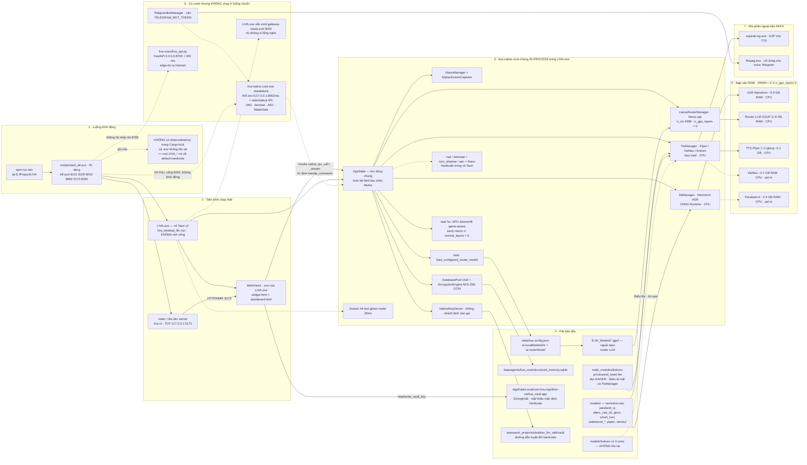

# Triển khai & Runtime

[⬆ Mục lục](../README.md) · [◀ Mô hình AI và tài nguyên](02-mo-hinh-ai-va-tai-nguyen.md) · [Kiểm thử và CI ▶](04-kiem-thu-va-ci.md)

---

Tài liệu này mô tả **những tiến trình thực sự chạy** khi khởi động LIVA, cổng mạng chúng mở, model nạp vào RAM/VRAM, và — quan trọng nhất — **cách chạy đúng** để có đủ cả hai profile (vỏ Tauri + gateway lõi standalone).

Điểm cốt lõi phải nắm trước khi đọc tiếp:

> `npm run dev` **KHÔNG** khởi động binary lõi `liva-native-core.exe`. Script `scripts/start_all.ps1` chỉ **kill** cổng 8002 rồi bật Vite + `tauri dev`. Toàn bộ đường thoại full-duplex (VAD · denoise · AEC · WakeGate · Telegram) nằm trong binary standalone đó và **không chạy** ở luồng mặc định.

---

## 1. Sơ đồ triển khai tổng thể

Sơ đồ dưới đây là góc nhìn **triển khai** (tiến trình · cổng · file trên đĩa · bộ nhớ), không phải sơ đồ kiến trúc phần mềm. Nếu bạn cần bản đồ tầng/module và quan hệ giữa chúng, xem tài liệu kiến trúc.

> 📌 Nguồn đầy đủ (sơ đồ kiến trúc tổng thể): [Kiến trúc tổng thể](../01-ban-ve/01-kien-truc-tong-the.md)



### 1.1 Đọc sơ đồ theo từng vùng

| Vùng | Ý nghĩa | Trạng thái |
|---|---|---|
| **1 · Khởi động** | `npm run dev` → `scripts/start_all.ps1`. Script giải phóng 6 cổng rồi bật 2 dịch vụ. | **[OK]** |
| **2 · Tiến trình chạy thật** | Vite dev (`:5173`) + `LIVA.exe` (vỏ Tauri) + WebView2 con. | **[OK]** |
| **3 · Core in-process** | `liva-native-core` được **nhúng như thư viện** vào `LIVA.exe`, chia sẻ một `AppState` (Arc + tokio Mutex). Không có tiến trình lõi riêng, không có socket giữa UI và core. | **[OK]** — trừ `MCPS`, `OFFV`, `T2` |
| **4 · File trên đĩa** | Config, SQLite, Stronghold vault, thư mục `models/`, GGUF ngoài repo. | **[OK]** — trừ `KOK` |
| **5 · RAM/VRAM** | Mọi model chạy **CPU thuần**; VRAM ≈ 0 vì `n_gpu_layers = 0`. | **[OK]** |
| **6 · Có code nhưng không chạy** | Binary gateway standalone, Telegram bot, service Python `liva-voice`, và event `gateway-ready` giả. | **[MỘT PHẦN]** |
| **7 · Nhị phân ngoài** | `espeak-ng.exe`, `ffmpeg.exe` — phải có trên PATH. | **[OK]** nếu đã cài |

---

## 2. Bảng tiến trình, cổng, phụ thuộc

| Tiến trình | Lệnh khởi động | Cổng | Phụ thuộc | Bắt buộc? |
|---|---|---|---|---|
| `node` / Vite dev server (liva-ui) | `npm run dev -w liva-ui`, do `scripts/start_all.ps1:56` gọi | TCP `127.0.0.1:5173` (HTTP + WS HMR) | Node/npm, deps của `liva-ui` | **Có** ở chế độ dev; bản build dùng `frontendDist: ../liva-ui/dist` nên không cần |
| **`LIVA.exe`** — vỏ Tauri v2 + core nhúng in-process | `npx tauri dev --no-dev-server` (`start_all.ps1:66`) | **Không mở cổng nào**; UI↔core đi qua Tauri `invoke` | Rust ≥1.85 (edition 2024), CMake, LLVM/`LIBCLANG_PATH`, WebView2 Runtime, `data/liva-config.json`, `models/`, `E:\AI_Models` | **Có** — đây là tiến trình chính, panic nếu DB hoặc `LlamaRouterManager::new` lỗi |
| `msedgewebview2.exe` (WebView2) | tự sinh bởi `LIVA.exe`, 2 cửa sổ `widget` + `dashboard` | — | WebView2 Runtime | Có (tự động) |
| `espeak-ng.exe` | shell-out từ `tts/espeak.rs` khi cần G2P | — | phải nằm trên PATH hoặc `LIVA_ESPEAK_PATH` | Có nếu dùng TTS Piper/Kokoro |
| `ffmpeg.exe` | shell-out khi xử lý voice message Telegram | — | PATH | Không (chỉ liên quan bot Telegram ở bin standalone) |
| `liva-native-core.exe` (gateway standalone) | chạy tay: `cargo run -p liva-native-core` hoặc `target\debug\liva-native-core.exe` | **WS `ws://127.0.0.1:8002/ws`** (`LIVA_SERVER_HOST`/`LIVA_SERVER_PORT`) + IPC qua stdin/stdout | như trên + `models/silero_vad_v6.onnx`, `gtcrn_simple.onnx`, `smart_turn_v3.2_cpu.onnx` | **KHÔNG** — `start_all.ps1` chỉ *kill* port 8002 chứ không khởi động nó; đây là nơi **duy nhất** có VAD/denoise/AEC/WakeGate/Telegram |
| `TelegramBotManager` (trong tiến trình trên) | tự bật khi có `TELEGRAM_BOT_TOKEN` | ra ngoài HTTPS `api.telegram.org` | token + `TELEGRAM_ALLOWED_IDS` | Không |
| `liva-voice` — `python liva_api.py` | `cd liva-voice; python liva_api.py` (thủ công) | **`0.0.0.0:8765`** HTTP + WS `/ws` + `/docs`, **không auth/CORS/rate-limit** | Python, fastapi/uvicorn, torch, edge-tts (cần Internet), yt-dlp, HF hub | **KHÔNG** — không file `.rs`/`.ts`/`.vue` nào gọi `8765`; `start_all.ps1` không nhắc tới cổng này |

### 2.1 Bảng cổng mạng

| Cổng | Ai mở | Giao thức | Bị `start_all.ps1` kill? | Ghi chú |
|---|---|---|---|---|
| `5173` | Vite dev server | HTTP + WS (HMR) | Có | Chỉ tồn tại ở dev; `devUrl: http://localhost:5173` trong `tauri.conf.json` |
| `8002` | `liva-native-core.exe` standalone | WebSocket `/ws` | **Có — nhưng không bật lại** | `main.rs:451-457` bind `LIVA_SERVER_HOST:LIVA_SERVER_PORT`, mặc định `127.0.0.1:8002`; `main.rs:464` chỉ nâng cấp WS khi path đúng `/ws` |
| `8765` | `liva-voice/liva_api.py` | HTTP + WS + `/docs` | **Không** (script không biết cổng này) | Bind `0.0.0.0` → lộ ra LAN; không auth |
| `8000`, `8082`, `8100`, `8101` | *không tiến trình nào trong repo hiện tại* | — | Có | Di sản của kiến trúc Python đã xoá; vẫn nằm trong danh sách kill (`start_all.ps1:24`) |

### 2.2 Ghi chú "gateway-ready" — cạm bẫy dễ hiểu nhầm

`liva-desktop/src-tauri/src/lib.rs:461-464` emit event `gateway-ready` với payload cứng `{"port": 8002, "token": null}`, kèm comment trong code nói gateway "đã chạy sẵn do `start_all.ps1` khởi động". **Điều này sai với thực tế script**: `start_all.ps1` chỉ kill 8002. Phía UI, `liva-ui/src/platform/TauriAdapter.ts:61` vẫn lắng nghe event này.

Hệ quả: log/UI có thể báo "gateway sẵn sàng port 8002" trong khi **không có ai lắng nghe** trên cổng đó. Đừng dùng tín hiệu này để kết luận đường thoại full-duplex đang hoạt động. Trạng thái: **[MỘT PHẦN]** — event thật, gateway không thật.

### 2.3 Ghi chú `.env` và biến môi trường

Điều duy nhất ảnh hưởng tới **cách chạy**: repo không có crate `dotenv`/`dotenvy`, nên `LIVA_*` chỉ có tác dụng khi được set **trong session shell trước khi chạy** (`$env:LIVA_... = "..."`); ghi vào `.env` là vô nghĩa. Danh sách biến, giá trị mặc định và độ lệch `.env.example` vs code nằm ở tài liệu cấu hình.

> 📌 Nguồn đầy đủ: [Cấu hình và biến môi trường](01-cau-hinh-va-bien-moi-truong.md)

---

## 3. Ngân sách bộ nhớ khi chạy (tóm tắt)

Con số cần nhớ để lên kế hoạch chạy: đường chạy mặc định (vỏ Tauri + Nemotron ASR + router LLM GGUF + Piper) chiếm **≈ 4–9 GB RAM** tuỳ file GGUF và **≈ 0 VRAM**, chạy **CPU thuần** kể cả khi build có feature `cuda`. Các thành phần opt-in cộng thêm: Parakeet-vi ≈ 2,4–2,8 GB, VieNeu-TTS ≈ 0,7 GB. `models/kokoro-v1.0.onnx` không tồn tại trong repo nên Kokoro không nạp được.

> 📌 Nguồn đầy đủ (bảng model, kích thước file, RAM/VRAM từng model): [Mô hình AI và tài nguyên](02-mo-hinh-ai-va-tai-nguyen.md)

### 3.1 Vì sao VRAM ≈ 0 dù build có `cuda`

Feature `cuda` (`liva-native-core/Cargo.toml`, `cuda = ["llama-cpp-2/cuda"]`) chỉ **biên dịch** backend CUDA vào llama.cpp. Số lớp thực sự đẩy lên GPU do `LIVA_LLM_N_GPU_LAYERS` quyết định, mặc định **0**. Kéo theo:

- Task 5 giây "GPU downshift game-aware" trong vỏ Tauri **early-return** vì `normal_layers = 0` → cơ chế nhường GPU cho game **[MỘT PHẦN]**: có code, không có tác dụng ở cấu hình mặc định. Ngưỡng và logic governor xem [Thị giác, quan sát thụ động và governor](../01-ban-ve/06-thi-giac-passive-va-governor.md).
- Muốn dùng GPU: build `cargo build --release --features cuda` **và** set `LIVA_LLM_N_GPU_LAYERS` > 0 trước khi chạy.

---

## 4. Cách chạy đúng

Có **hai profile runtime tách biệt**: **A · vỏ Tauri** (`LIVA.exe` + core nhúng in-process, có UI/STT/TTS/LLM/vision/DB nhưng **không** VAD·denoise·AEC·WakeGate·Telegram·WS `:8002`) và **B · gateway lõi standalone** (`liva-native-core.exe`, có đủ đường thoại full-duplex nhưng không có UI). `npm run dev` chỉ cho bạn profile A.

Hai profile **không tự nối với nhau**: chạy cả hai là hai tiến trình song song, mỗi tiến trình nạp model riêng — cộng RAM. Không có cơ chế nào trong repo khiến `LIVA.exe` gửi audio sang `:8002`.

> 📌 Nguồn đầy đủ (định nghĩa và ranh giới hai profile): [Kiến trúc tổng thể](../01-ban-ve/01-kien-truc-tong-the.md)

Phần dưới đây là **cách chạy đúng** từng profile — đây mới là nội dung riêng của tài liệu này.

### 4.1 Chuẩn bị trước khi chạy (một lần)

```powershell
# UTF-8 cho tiếng Việt trên console
chcp 65001

# Kiểm tra nhị phân ngoài bắt buộc
Get-Command espeak-ng -ErrorAction SilentlyContinue
Get-Command ffmpeg    -ErrorAction SilentlyContinue   # chỉ cần cho voice Telegram

# Kiểm tra thư mục model và GGUF ngoài repo
Get-ChildItem E:\Project\LIVA\models
Get-ChildItem E:\AI_Models\*.gguf

# Cấu hình router LLM: ai.localModelsDir + ai.routerModel
Get-Content E:\Project\LIVA\data\liva-config.json
```

Cài dependency Node (workspace gốc, có `liva-ui` + `liva-desktop`):

```powershell
cd E:\Project\LIVA
npm install
```

### 4.2 Profile A — chạy vỏ Tauri (đường mặc định)

```powershell
cd E:\Project\LIVA
npm run dev
```

Tương đương thủ công, nếu muốn kiểm soát từng bước:

```powershell
# Terminal 1 — UI dev server
cd E:\Project\LIVA\liva-ui
npm run dev            # http://127.0.0.1:5173

# Terminal 2 — vỏ Tauri + core nhúng in-process
cd E:\Project\LIVA\liva-desktop
npx tauri dev --no-dev-server
```

Ghi chú:

- `--no-dev-server` là **cố ý**: Tauri không tự spawn Vite, nó chỉ trỏ tới `devUrl: http://localhost:5173` đã có sẵn. Nếu Vite chưa lên, cửa sổ sẽ trắng.
- Khi `LIVA.exe` thoát, khối `finally` của `start_all.ps1:67-91` kill tiến trình Vite và mọi `llama-server` còn sót (giải phóng VRAM).
- `LIVA.exe` **panic** nếu mở DB thất bại hoặc `LlamaRouterManager::new` lỗi → thiếu GGUF là app không lên.

### 4.3 Profile B — chạy gateway lõi standalone (KHÔNG tự động)

Đây là phần `npm run dev` **không bao giờ khởi động**. Muốn có VAD / denoise / AEC / WakeGate / Telegram, phải chạy tay:

```powershell
# Build trước (khuyến nghị release: debug rất chậm, và vision cần release)
cd E:\Project\LIVA\liva-native-core
cargo build --release

# Chạy gateway — mở ws://127.0.0.1:8002/ws
cd E:\Project\LIVA
.\target\release\liva-native-core.exe
```

Hoặc chạy trực tiếp bằng cargo (chạy từ **thư mục gốc repo** để đường dẫn `models/` và `data/` tương đối giải đúng):

```powershell
cd E:\Project\LIVA
cargo run --release -p liva-native-core
```

Đổi host/cổng khi cần (mặc định `127.0.0.1:8002`, `main.rs:451-452`):

```powershell
$env:LIVA_SERVER_HOST = "127.0.0.1"
$env:LIVA_SERVER_PORT = "8002"
```

Kiểm chứng gateway đã thật sự lắng nghe (đừng tin event `gateway-ready` của UI):

```powershell
Get-NetTCPConnection -LocalPort 8002 -State Listen |
  Select-Object LocalAddress, LocalPort, OwningProcess
```

### 4.4 Chạy đủ CẢ HAI profile

Vì `start_all.ps1` **kill** cổng 8002 ngay khi khởi động, thứ tự bắt buộc là: **chạy `npm run dev` trước, gateway sau**. Làm ngược lại thì gateway vừa bật đã bị script giết.

```powershell
# --- Bước 1: profile A (giữ cửa sổ này chạy) ---
cd E:\Project\LIVA
npm run dev

# --- Bước 2: mở PowerShell THỨ HAI, sau khi cửa sổ LIVA đã hiện ---
cd E:\Project\LIVA
$env:LIVA_SERVER_PORT = "8002"
# (tuỳ chọn) bật các thành phần opt-in:
# $env:LIVA_STT_VI_ENGINE = "parakeet"
# $env:LIVA_TTS_VIENEU    = "1"
# $env:TELEGRAM_BOT_TOKEN = "<token>"
.\target\release\liva-native-core.exe
```

Cảnh báo tài nguyên: hai tiến trình **nạp model độc lập**. Chạy song song ≈ gấp đôi phần ASR + LLM trong bảng mục 3 → dễ vượt 10–16 GB RAM. Trên máy ít RAM, hãy chọn một profile.

### 4.5 Profile C (tuỳ chọn) — service Python `liva-voice`

Hoàn toàn tách rời, **không** tiến trình Rust/TS nào gọi tới nó:

```powershell
cd E:\Project\LIVA\liva-voice
python liva_api.py     # FastAPI 0.0.0.0:8765, có /docs
```

Cảnh báo an ninh: bind `0.0.0.0` (lộ ra toàn LAN), **không auth, không CORS whitelist, không rate-limit**, và `edge-tts` gọi ra Internet — phá vỡ giả định offline. Chỉ bật khi thực sự cần voice-cloning, và cân nhắc đổi bind về `127.0.0.1`.

### 4.6 Bảng "chạy lệnh nào thì được gì"

| Lệnh | Vite `:5173` | `LIVA.exe` + core nhúng | WS `:8002` | VAD/denoise/AEC/Wake | Telegram | `:8765` |
|---|---|---|---|---|---|---|
| `npm run dev` | **[OK]** | **[OK]** | **[THIẾU]** (bị kill) | **[THIẾU]** | **[THIẾU]** | **[THIẾU]** |
| `.\target\release\liva-native-core.exe` | — | — | **[OK]** | **[OK]** | **[OK]** nếu có token | — |
| Cả hai (mục 4.4) | **[OK]** | **[OK]** | **[OK]** | **[OK]** | **[OK]** nếu có token | **[THIẾU]** |
| `python liva_api.py` | — | — | — | — | — | **[OK]** |

---

## 5. Sự cố thường gặp khi khởi động

| Triệu chứng | Nguyên nhân theo code | Xử lý |
|---|---|---|
| Cửa sổ LIVA trắng trơn | Vite chưa lên nhưng `tauri dev --no-dev-server` đã chạy | Đợi `:5173` sẵn sàng rồi mới bật Tauri (mục 4.2) |
| `LIVA.exe` panic ngay lúc khởi động | Mở DB lỗi hoặc `LlamaRouterManager::new` thất bại (thiếu GGUF / sai `ai.routerModel`) | Kiểm tra `data/liva-config.json` và `E:\AI_Models\*.gguf` |
| TTS im lặng hoàn toàn | `models/kokoro-v1.0.onnx` **không tồn tại**; hoặc thiếu `node_modules/kokoro-js/voices/af_heart.bin` (đọc **eager**, thiếu là hỏng cả `TtsManager`) | Chạy `npm install` đủ; dùng Piper thay Kokoro |
| TTS phát ra sai ngữ điệu / lỗi G2P | Không có `espeak-ng` trên PATH | Cài espeak-ng hoặc set `LIVA_ESPEAK_PATH` |
| UI báo "gateway sẵn sàng" nhưng thoại full-duplex không hoạt động | Event `gateway-ready` là hardcode (`lib.rs:461-464`), gateway thật chưa chạy | Chạy profile B (mục 4.3) và xác minh bằng `Get-NetTCPConnection` |
| Đặt `LIVA_*` trong `.env` nhưng không có tác dụng | Repo **không có `.env`** và **không có `dotenv`/`dotenvy`** trong `Cargo.lock` | Set biến trong shell: `$env:LIVA_... = "..."` trước khi chạy |
| GPU nhàn rỗi dù build `--features cuda` | `LIVA_LLM_N_GPU_LAYERS` mặc định `0` | Set `$env:LIVA_LLM_N_GPU_LAYERS = "<số lớp>"` |
| Cổng 8002 vừa bật đã chết | `start_all.ps1:24-35` kill 8101/8100/8002/8082/5173/8000 mỗi lần khởi động | Bật gateway **sau** `npm run dev` |
| `models/nemotron-asr` luôn "modified" trong `git status` | Là **nested git repo có LFS**, không phải submodule đăng ký | Bỏ qua, đừng commit |

---

## 6. Đóng gói bản build (không dev)

```powershell
cd E:\Project\LIVA
npm run build:desktop      # = build:ui rồi build -w liva-desktop
```

Ở bản build, `tauri.conf.json` dùng `frontendDist: ../liva-ui/dist` → **không cần Vite `:5173`**. `productName` là `LIVA`, nên binary/cửa sổ mang tên `LIVA.exe`. Gateway standalone **vẫn không** được đóng gói vào luồng khởi động — nếu sản phẩm cuối cần thoại full-duplex, đây là khoảng trống phải xử lý.

---

## Liên quan

**Đọc tiếp theo mạch:** [⬆ Mục lục](../README.md) · [◀ Mô hình AI và tài nguyên](02-mo-hinh-ai-va-tai-nguyen.md) · [Kiểm thử và CI ▶](04-kiem-thu-va-ci.md)

**Tài liệu này dựa vào (nguồn sự thật ở nơi khác):**
- [Kiến trúc tổng thể](../01-ban-ve/01-kien-truc-tong-the.md) — định nghĩa hai profile runtime A/B và sơ đồ kiến trúc tổng thể (mục 1, mục 4)
- [Mô hình AI và tài nguyên](02-mo-hinh-ai-va-tai-nguyen.md) — bảng model, kích thước file, RAM/VRAM từng thành phần (mục 3)
- [Cấu hình và biến môi trường](01-cau-hinh-va-bien-moi-truong.md) — danh sách `LIVA_*`, giá trị mặc định, lệch `.env.example` vs code (mục 2.3, 4.4)
- [Giao thức IPC và WebSocket](../01-ban-ve/02-giao-thuc-ipc-va-websocket.md) — bảng lệnh `handle_command` và khung nhị phân đi qua WS `:8002`
- [Đường ống thoại](../01-ban-ve/03-duong-ong-thoai.md) — chi tiết VAD/AEC/denoise/WakeGate, thứ chỉ tồn tại ở profile B
- [Thị giác, quan sát thụ động và governor](../01-ban-ve/06-thi-giac-passive-va-governor.md) — ngưỡng governor đứng sau task GPU downshift (mục 3.1)
- [Frontend và vỏ Tauri](../01-ban-ve/08-frontend-va-vo-tauri.md) — cấu hình cửa sổ và bảng lệnh Tauri của `LIVA.exe`

**Tài liệu khác dựa vào tài liệu này:**
- [Kiểm thử và CI](04-kiem-thu-va-ci.md) — lấy cách khởi động tiến trình để chạy các binary verify
- [Đối chiếu tuyên bố vs thực tế](../03-danh-gia/01-doi-chieu-tuyen-bo-vs-thuc-te.md) — lấy sự thật "`npm run dev` không bật gateway `:8002`" làm bằng chứng
- [Nợ kỹ thuật và rủi ro](../03-danh-gia/02-no-ky-thuat-va-rui-ro.md) — lấy các mục `gateway-ready` giả, `:8765` không auth, cổng di sản bị kill
- [Lộ trình sửa lỗi và nâng cấp](../03-danh-gia/03-lo-trinh-sua-loi-va-nang-cap.md) — lấy khoảng trống "gateway không được đóng gói" làm đầu vào lộ trình

**Khi sửa code sau đây thì phải cập nhật tài liệu này:**
- `scripts/start_all.ps1` — bảng tiến trình (mục 2), danh sách cổng bị kill (2.1), thứ tự chạy hai profile (4.4)
- `liva-desktop/src-tauri/src/lib.rs` — event `gateway-ready` (2.2), task GPU downshift (3.1), các thành phần thoại bị hardcode `None`
- `liva-desktop/src-tauri/tauri.conf.json` — `devUrl :5173`, `frontendDist`, `productName` (mục 2.1, 4.2, 6)
- `liva-native-core/src/main.rs` — bind host/cổng `:8002`, path `/ws`, mặc định biến môi trường (2.1, 4.3)
- `liva-native-core/Cargo.toml` — feature `cuda`/`vulkan` và lý do VRAM ≈ 0 (3.1)
- `data/liva-config.json` — `ai.localModelsDir` + `ai.routerModel`, nguồn GGUF nạp lúc khởi động (mục 1, 4.1, 5)
- `liva-ui/src/platform/TauriAdapter.ts` — phía UI lắng nghe `gateway-ready` (2.2)
- `liva-voice/liva_api.py` — profile C, cổng `:8765` và cảnh báo an ninh (2.1, 4.5)
