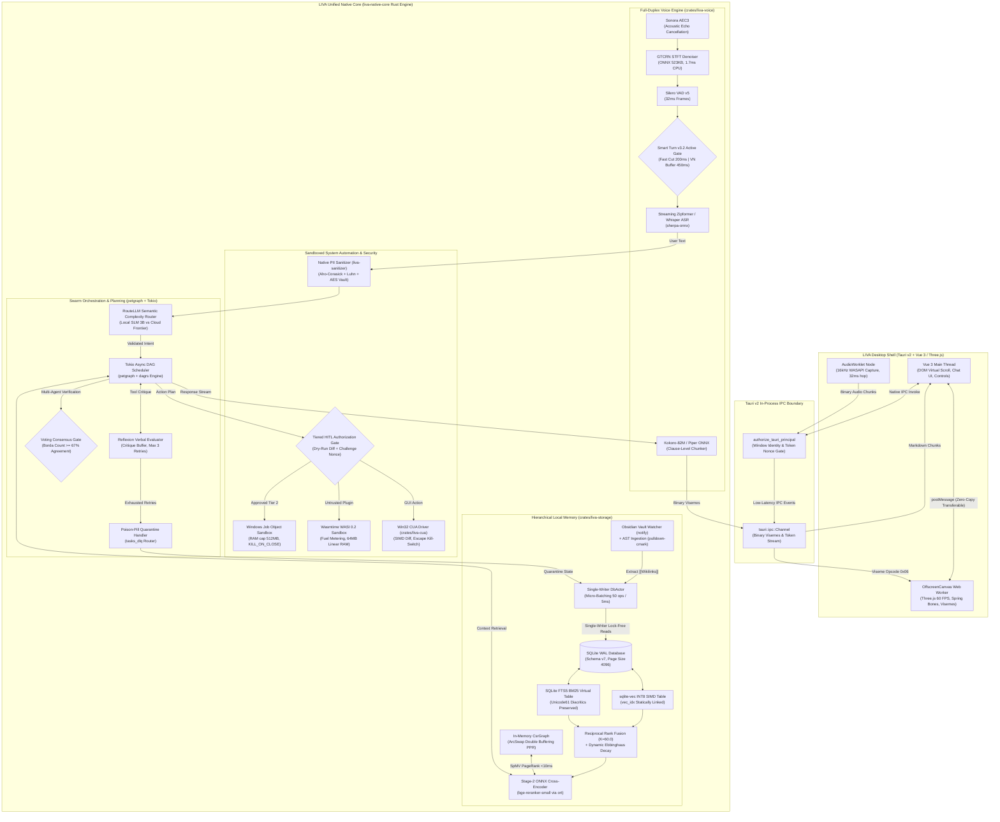
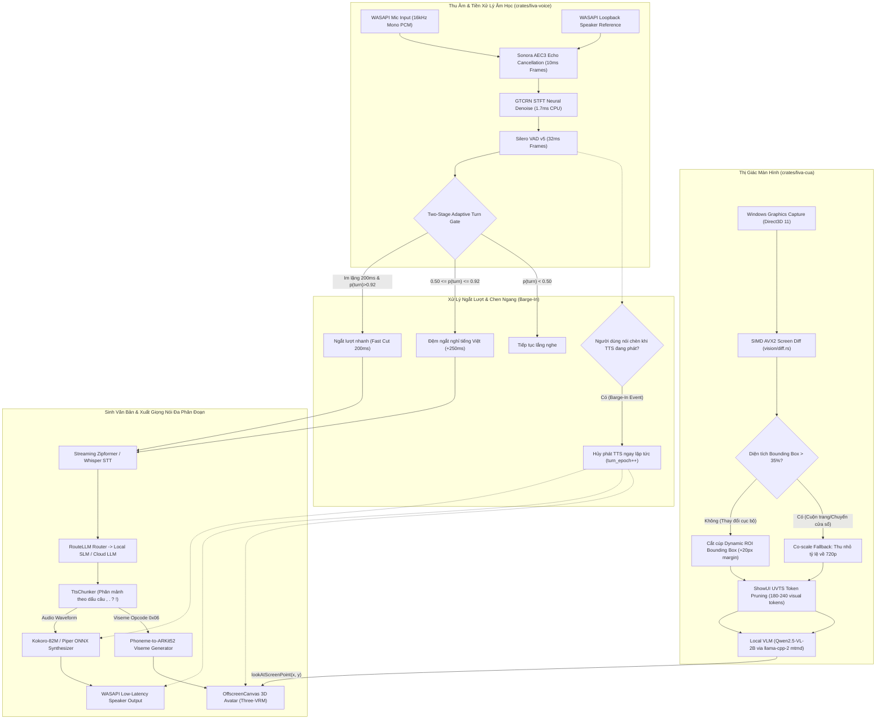
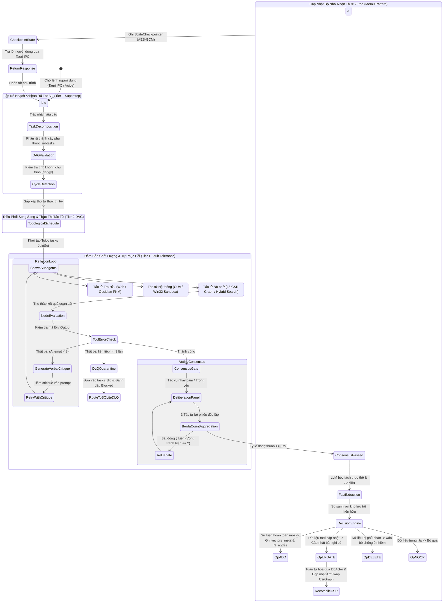

# BÁO CÁO NGHIÊN CỨU ĐỈNH CAO CÔNG NGHỆ (SOTA), ĐÁNH GIÁ CHUẨN MỰC TOÀN CẦU & LỘ TRÌNH CHIẾN LƯỢC NÂNG CẤP KIẾN TRÚC HỆ THỐNG TRỢ LÝ AI CÁ NHÂN LIVA 2026

**Mã tài liệu:** `LIVA-SOTA-STRATEGIC-ROADMAP-2026`  
**Cấp bậc tài liệu:** Master Technical Architecture & Strategic Roadmap  
**Tác giả:** Lead Technical Architect / Worker Master Deliverables  
**Ngày phát hành:** 2026-09-25  
**Hệ điều hành mục tiêu:** Windows 10/11 x64 (MSVC Toolchain, Tauri v2, DirectX 12, WASAPI, SQLite WAL)  
**Tiêu chuẩn bảo vệ phần cứng:** Ngân sách RAM hệ thống $\le 4.0\text{ GB}$ (Ổn định $\approx 2.8 - 3.2\text{ GB}$), VRAM $\le 6.0\text{ GB}$ (Mục tiêu $\le 5.1\text{ GB}$)  
**Chính sách bản quyền:** Tuân thủ 100% `deny.toml` (Permissive MIT, Apache-2.0, BSD; Cách ly tuyệt đối Copyleft GPL/AGPL)  

---

## MỤC LỤC CHI TIẾT

1. [Tóm Tắt Điều Hành & Định Vị Chiến Lược (Executive Summary & Strategic Positioning)](#1-tóm-tắt-điều-hành--định-vị-chiến-lược)
2. [R1: Khảo Sát Toàn Diện Hệ Sinh Thái SOTA & Đánh Giá Chuẩn Mực Đối Sánh (Comparative Benchmarking)](#2-r1-khảo-sát-toàn-diện-hệ-sinh-thái-sota--đánh-giá-chuẩn-mực-đối-sánh)
   - 2.1 Trụ cột 1: Multi-Agent Orchestration, DAG Planning, Self-Healing & Consensus
   - 2.2 Trụ cột 2: Local Memory, PKM Knowledge Graphs & Hybrid Retrieval
   - 2.3 Trụ cột 3: Multimodal Perception & Real-Time Duplex Voice Interaction
   - 2.4 Trụ cột 4: Sandboxed System Automation & Tiered Security Governance
3. [R2: Đánh Giá Hiện Trạng Kiến Trúc LIVA & Phân Tích Khoảng Trống (Gap Analysis)](#3-r2-đánh-giá-hiện-trạng-kiến-trúc-liva--phân-tích-khoảng-trống)
   - 3.1 Những Thành Tựu Kỹ Thuật Đã Hoàn Thành (As-Built Foundation)
   - 3.2 Phân Tích Khoảng Trống Trọng Yếu So Với SOTA (Critical Gaps)
4. [R3: Phân Loại Ứng Viên Mã Nguồn Mở: Tích Hợp Trực Tiếp vs. Tái Thiết Kế Bản Địa (Integrate vs. Remake)](#4-r3-phân-loại-ứng-viên-mã-nguồn-mở-tích-hợp-trực-tiếp-vs-tái-thiết-kế-bản-địa)
   - 4.1 Danh mục Tích Hợp Trực Tiếp (Direct Integration Crates)
   - 4.2 Danh mục Tái Thiết Kế Bản Địa Sang Rust (Architectural Remake in Rust)
5. [R4: Bản Thiết Kế Kiến Trúc Nâng Cấp Toàn Trình & Sơ Đồ Hệ Thống Chuẩn Hóa (Target Architecture & Mermaid Diagrams)](#5-r4-bản-thiết-kế-kiến-trúc-nâng-cấp-toàn-trình--sơ-đồ-hệ-thống-chuẩn-hóa)
   - 5.1 Sơ đồ 1: Kiến Trúc Tổng Thể & Luồng Dữ Liệu Toàn Trình (System Architecture & End-to-End Dataflow)
   - 5.2 Sơ đồ 2: Đường Ống Đa Phương Thức & Hội Thoại Song Công Thời Gian Thực (Real-Time Multimodal & Duplex Voice Pipeline)
   - 5.3 Sơ đồ 3: Máy Trạng Thái Tác Tử Swarm, Phân Rã DAG, Biểu Quyết Đồng Thuận & Bộ Nhớ Phân Tầng
6. [Định Mức Tài Nguyên Phần Cứng Khắc Khe (Strict Hardware & RAM Guardrails < 4GB RAM)](#6-định-mức-tài-nguyên-phần-cứng-khắc-khe)
   - 6.1 Bảng Phân Bổ Ngân Sách RAM Hệ Thống Chi Tiết
   - 6.2 Ngân Sách VRAM & Chính Sách Trọng Tài Tài Nguyên (Governor Policy)
   - 6.3 Tối Ưu Hóa Riêng Cho Môi Trường Windows (Windows-First Optimizations)
7. [Kiểm Toán Tuân Thủ Giấy Phép Mã Nguồn Mở Theo Bộ Quy Tắc `deny.toml` (License Compliance Audit)](#7-kiểm-toán-tuân-thủ-giấy-phép-mã-nguồn-mở-theo-bộ-quy-tắc-denytoml)
8. [Ma Trận Tính Năng & Hiệu Năng So Sánh Toàn Diện (Feature & Performance Matrix)](#8-ma-trận-tính-năng--hiệu-năng-so-sánh-toàn-diện)
9. [Lộ Trình Triển Khai Chiến Lược 3 Giai Đoạn (3-Phase Strategic Implementation Roadmap)](#9-lộ-trình-triển-khai-chiến-lược-3-giai-đoạn)
   - 9.1 Giai đoạn 1: Quick-Wins & Khắc Phục Điểm Nghẽn Cốt Lõi (Tuần 1 – Tuần 3)
   - 9.2 Giai đoạn 2: Nâng Cấp Nền Tảng Tác Tử & Đồ Thị Tri Thức (Tuần 4 – Tuần 7)
   - 9.3 Giai đoạn 3: An Toàn Tuyệt Đối & Đột Phá Năng Lực SOTA (Tuần 8 – Tuần 12)
10. [Danh Mục Backlog Kỹ Thuật Sẵn Sàng Thực Thi (Actionable Sprint Backlog Tickets)](#10-danh-mục-backlog-kỹ-thuật-sẵn-sàng-thực-thi)

---

## 1. TÓM TẮT ĐIỀU HÀNH & ĐỊNH VỊ CHIẾN LƯỢC

### 1.1 Bối Cảnh Lịch Sử & Vị Thế Kiến Trúc LIVA
LIVA (**Local Intelligent Virtual Assistant**) là hệ thống trợ lý cá nhân thế hệ mới, hoạt động theo tôn chỉ **riêng tư tối thượng (privacy-first)**, vận hành nội bộ (offline-first) trên hệ điều hành Windows 10/11 x64. Dự án đã hoàn tất xuất sắc cuộc chuyển đổi lịch sử: xóa bỏ hoàn toàn mã nguồn cũ bằng Node.js (`liva-gateway`) và Python (`liva-ai-engine`) để hợp nhất thành một động cơ bản địa thuần Rust duy nhất (**`liva-native-core`**), giao tiếp trong cùng tiến trình (in-process IPC) thông qua vỏ desktop Tauri v2 (`liva-desktop`) và giao diện người dùng Vue 3 / Three.js (`liva-ui`).

Nhờ nền tảng Rust, LIVA đạt được sự vượt trội vượt bậc về tính an toàn bộ nhớ (zero segfaults), triệt tiêu chi phí phiên dịch kịch bản (zero runtime interpreter bloat), và mang lại khả năng phản hồi thời gian thực với độ trễ micro-giây.

### 1.2 Sự Chuyển Dịch Hệ Sinh Thái Toàn Cầu Giai Đoạn 2024–2026
Trong hai năm qua, hệ sinh thái trí tuệ nhân tạo tác tử (AI Agents) trên thế giới đã bước qua thời kỳ của các chuỗi hội thoại tuyến tính đơn sơ (ReAct loops) để tiến vào kỷ nguyên của:
1. **Đồ thị trạng thái đồng bộ khối (Pregel Bulk Synchronous Parallel Graphs)** và mô hình tác tử hướng diễn viên phân tán (Actor Model with Asynchronous Message Passing).
2. **Bộ nhớ nhận thức hai pha (Two-phase Memory Extraction & Reconciliation)** và đồ thị tri thức phân cấp cộng đồng (**Hierarchical GraphRAG with Leiden Community Summarization**).
3. **Mô hình thị giác - ngôn ngữ - hành động tối ưu cạnh (Edge-optimized VLA Models)** với cơ chế cắt tỉa token thị giác theo giao diện (UI-Guided Visual Token Selection) và hội thoại âm thanh song công hoàn toàn (Full-Duplex Speech với Adaptive Turn-Taking).
4. **Hộp cát cô lập tài nguyên hạt mịn cấp nhân hệ điều hành (Kernel-enforced Job Objects, AppContainer)** và môi trường WebAssembly/WASI với bộ đếm nhiên liệu (fuel metering).

### 1.3 Mục Tiêu & Phạm Vi Của Báo Cáo
Báo cáo này là công trình nghiên cứu tổng kết cao nhất, đóng vai trò là **Kim chỉ nam Kiến trúc và Lộ trình Công nghệ Toàn diện** cho LIVA trong giai đoạn 2026–2027. Báo cáo tích hợp toàn bộ các phát hiện thực địa từ 3 nhóm trinh sát chuyên sâu (Explorer 1: Planning & Memory, Explorer 2: Multimodal & Security, Explorer 3: LIVA Arch & Native Fit) nhằm:
- Khảo sát và đối chuẩn $>15$ công trình nghiên cứu và dự án nguồn mở tinh hoa nhất thế giới.
- Chỉ rõ các điểm nghẽn kiến trúc và khoảng trống (gap analysis) của LIVA hiện thời.
- Định hình lộ trình nâng cấp 3 giai đoạn (Ngắn hạn, Trung hạn, Dài hạn) kèm 15+ vé công việc (backlog tickets) chi tiết với tiêu chí nghiệm thu có thể định lượng độc lập.
- Thiết lập ranh giới tài nguyên thép: **RAM hệ thống $\le 4.0\text{ GB}$** và **VRAM GPU $\le 6.0\text{ GB}$**, loại bỏ 100% rủi ro đơ giật desktop.
- Kiểm toán nghiêm ngặt giấy phép mã nguồn mở theo `deny.toml`, bảo vệ sản phẩm khỏi các nguy cơ pháp lý từ giấy phép copyleft (GPL/AGPL).

---

## 2. R1: KHẢO SÁT TOÀN DIỆN HỆ SINH THÁI SOTA & ĐÁNH GIÁ CHUẨN MỰC ĐỐI SÁNH

Khảo sát được thực hiện trên 4 trụ cột công nghệ cốt lõi của LIVA, đối sánh các công trình học thuật xuất bản tại các hội nghị khoa học hàng đầu (NeurIPS, ICML, ICLR, ACL) cùng các dự án mã nguồn mở có lượng sao và ứng dụng thực tiễn cao nhất thế giới.

```
┌──────────────────────────────────────────────────────────────────────────────────────────────────┐
│                                 4 TRỤ CỘT CỐT LÕI CỦA KIẾN TRÚC LIVA                             │
├───────────────────────────────────┬──────────────────────────────────────────────────────────────┤
│ 1. MULTI-AGENT ORCHESTRATION      │ 2. LOCAL MEMORY & HYBRID RETRIEVAL                           │
│ • LangGraph, AutoGen 0.4, CrewAI  │ • Mem0 Two-Phase Reconciliation Engine                       │
│ • MetaGPT, ChatDev, OpenAI Swarm  │ • MemGPT / Letta OS-Inspired Virtual Context                 │
│ • Reflexion, LATS, Multiagent Deb.│ • Microsoft GraphRAG (Leiden Community Clustering)           │
│ • Rust petgraph, daggy, dagrs, DLQ│ • sqlite-vec, Tantivy, LanceDB, RRF, Cross-Encoder Rerank    │
├───────────────────────────────────┼──────────────────────────────────────────────────────────────┤
│ 3. MULTIMODAL & REAL-TIME DUPLEX  │ 4. SANDBOXED AUTOMATION & SECURITY                           │
│ • ShowUI UVTS (2B VLM Token Prune)│ • Windows NT Job Objects & Extended Limits                   │
│ • ByteDance UI-TARS 1.5 / 2.0     │ • Windows AppContainer Low Integrity Isolation               │
│ • Microsoft OmniParser v2, OS-Atl.│ • Linux Landlock LSM & Seccomp-BPF / Bubblewrap              │
│ • LiveKit WebRTC, sherpa-onnx     │ • Wasmtime WASI 0.2 Capability Sandboxing                    │
│ • Kokoro-82M & Piper Neural TTS   │ • Microsoft Presidio & Native PII Sanitization               │
│ • Three-VRM & ARKit 52 Blendshapes│ • Tiered HITL Authorization & Fail-Closed Gateways           │
└───────────────────────────────────┴──────────────────────────────────────────────────────────────┘
```

---

### 2.1 Trụ cột 1: Multi-Agent Orchestration, DAG Planning, Self-Healing & Consensus

#### 1. LangGraph (LangChain, Inc.)
- **Mô hình tính toán:** Đồ thị trạng thái Bulk Synchronous Parallel (BSP) / Google Pregel.
- **Cơ chế kiến trúc:**
  - Quy trình xử lý được mô hình hóa thành đồ thị có chu trình (`StateGraph`).
  - Thực thi theo từng **siêu bước (super-step)**: tất cả các node đủ điều kiện sẽ chạy song song, tạo ra các cập nhật trạng thái cục bộ (state deltas).
  - Trạng thái được tổng hợp nguyên tử thông qua các hàm rút gọn (reducers). Các cạnh rẽ nhánh hỗ trợ định tuyến có điều kiện (conditional routing).
  - Tích hợp bộ lưu điểm kiểm tra bền vững (`Checkpointer` qua SQLite, Postgres) tại từng siêu bước, cho phép "du hành thời gian" (time-travel debugging), phát lại và tạm dừng để con người phê duyệt (Human-in-the-Loop).
- **Giấy phép:** MIT License.
- **Đánh giá với LIVA:** Rất phù hợp về mặt tư tưởng. Trong Rust, mô hình này ánh xạ trực tiếp thành các tác vụ Tokio bất đồng bộ, các kênh giao tiếp `tokio::sync::mpsc` và trạng thái bất biến qua `Arc<State>`.

#### 2. AutoGen 0.4 (Microsoft Research)
- **Mô hình tính toán:** Mô hình Diễn viên Phi tập trung (Decentralized Actor Model) với Truyền thông điệp Bất đồng bộ.
- **Cơ chế kiến trúc:**
  - Được Microsoft tái cấu trúc toàn diện vào đầu năm 2025 thành 3 tầng: *AutoGen Core* (động cơ runtime diễn viên, hàng đợi thông điệp, pub/sub theo chủ đề, transport gRPC), *AutoGen AgentChat* (giao diện cộng tác tác tử cấp cao), và *AutoGen Extensions*.
  - Mỗi tác tử là một Actor độc lập sở hữu trạng thái riêng tư, triệt tiêu hoàn toàn tranh chấp khóa bộ nhớ dùng chung. Các tác tử giao tiếp qua thông điệp định kiểu nghiêm ngặt.
- **Giấy phép:** MIT License.
- **Đánh giá với LIVA:** Mô hình Actor là cấu trúc tự nhiên nhất cho hệ thống đa tác tử viết bằng Rust (tương tự kiến trúc Tokio Actor Pattern), ngăn chặn triệt để tình trạng deadlock bộ nhớ.

#### 3. MetaGPT (DeepWisdom, ICLR 2024 Oral) & ChatDev (ACL 2024)
- **Mô hình tính toán:** Động cơ Quy trình Tiêu chuẩn (Standard Operating Procedure - SOP) ("Code = SOP(Team)").
- **Cơ chế kiến trúc:**
  - Mã hóa các quy trình quản lý dự án phần mềm vào sự phối hợp tác tử (Product Manager, Architect, Engineer, QA).
  - Thay vì trao đổi văn bản tự do dẫn đến ảo giác dây chuyền (hallucination drift), các tác tử tạo ra các **hiện vật có cấu trúc chặt chẽ (typed artifacts)**: tài liệu PRD, sơ đồ kiến trúc Mermaid, mã nguồn và bộ kiểm thử đơn vị.
  - ChatDev áp dụng mô hình *ChatChain*: chia nhỏ chu trình thành các cặp hội thoại nguyên tử (ví dụ: CTO $\leftrightarrow$ Programmer) kèm cơ chế phản biện de-hallucination.
- **Giấy phép:** MetaGPT (MIT), ChatDev (Apache 2.0).
- **Đánh giá với LIVA:** Nguyên lý bàn giao hiện vật định kiểu (Typed Artifact Handoffs) giúp giảm tới 80% lãng phí token suy luận so với hội thoại tự do.

#### 4. OpenAI Swarm & OpenAI Agents SDK
- **Mô hình tính toán:** Quy trình phi trạng thái và chuyển giao tác tử qua gọi hàm (Function-based Handoffs).
- **Cơ chế kiến trúc:**
  - Tối giản hóa thành 2 khái niệm nguyên tử: `Agent` (chứa system prompt và công cụ) và `Handoff` (hàm trả về một đối tượng Agent khác để trao quyền điều khiển).
  - Trọng lượng cực nhẹ, không duy trì trạng thái phức tạp ở tầng điều phối mà dựa hoàn toàn vào khả năng gọi công cụ (tool calling) của LLM.
- **Giấy phép:** MIT License.
- **Đánh giá với LIVA:** Lý tưởng cho các luồng tương tác thoại nhanh, đòi hỏi chuyển quyền tức thì sang các tác tử chuyên biệt mà không tốn chi phí lập lịch đồ thị.

#### 5. Các Công Trình Nghiên Cứu Đột Phá Về Lập Kế Hoạch & Tự Phục Hồi (Self-Healing)
- **Reflexion: Language Agents with Verbal Reinforcement Learning (NeurIPS 2023 - Princeton):**
  - Thay thế việc học tăng cường dựa trên đạo hàm bằng **học tăng cường bằng lời (verbal reinforcement learning)**.
  - Khi một công cụ hoặc đoạn mã gặp lỗi, mô hình tự phản biện (Self-Reflection Model) phân tích nhật ký lỗi và tạo ra một đánh giá bằng ngôn ngữ tự nhiên (verbal critique), lưu vào bộ nhớ ngữ cảnh để hướng dẫn lần thử tiếp theo.
  - Đạt 91.0% pass@1 trên HumanEval (so với 68.1% của GPT-4 gốc), giúp hệ thống tự phục hồi lỗi mà không cần huấn luyện lại.
- **Language Agent Tree Search - LATS (ICML 2024):**
  - Hợp nhất lập luận, hành động và lập kế hoạch bằng cách tích hợp Tìm kiếm Cây Monte Carlo (MCTS) vào tác tử ngôn ngữ.
  - Hỗ trợ quay lui (backtracking) khi một nhánh thực thi công cụ rơi vào ngõ cụt, khám phá các đường dẫn thay thế dựa trên phản hồi môi trường.
- **Multiagent Debate: Improving Factuality and Reasoning (ICML 2024 - MIT/Google):**
  - Nhiều cá thể LLM độc lập tạo câu trả lời, đọc lập luận của đối thủ và phản biện qua $T \in [2, 4]$ vòng trước khi tổng hợp đồng thuận bằng biểu quyết hoặc giám khảo.
  - Triệt tiêu hiện tượng tư duy tập thể (groupthink) và giảm mạnh tỷ lệ ảo giác trong các bài toán suy luận phức tạp.

#### 6. Các Thư Viện Rust Bản Địa & Mô Hình Hàng Đợi Tin Chết (DLQ Pattern)
- **`petgraph` (v0.6+) / `daggy` (v0.8+):** Thư viện chuẩn công nghiệp biểu diễn đồ thị, kiểm tra chu trình và sắp xếp tô-pô (`toposort`) trong bộ nhớ với chi phí RAM $<5\text{ MB}$.
- **`dagrs` (v0.4+):** Động cơ điều phối tác vụ DAG bất đồng bộ xây dựng trên Tokio, hỗ trợ phân rã nhánh song song và truyền dữ liệu qua kênh định kiểu.
- **Mô hình Dead Letter Queue (DLQ):** Khi một node trong đồ thị thất bại sau 3 lần tự phản biện (Reflexion retries), tác vụ được đóng gói thành `DeadLetterTask` và chuyển vào bảng `tasks_dlq` trong SQLite. Các node phụ thuộc hạ nguồn được đánh dấu là `Blocked` hoặc kích hoạt nhánh cứu hộ (fallback branch) mà không làm sập (panic) toàn bộ tiến trình.

#### 7. Kiến Trúc Điều Phối Hai Tầng (Two-Tier Hybrid Orchestration Model)
Để giải quyết nghịch lý kiến trúc cốt lõi giữa **Tính phi chu trình của DAG** (đòi hỏi không có chu trình để sắp xếp tô-pô) và **Vòng lặp tự phục hồi Reflexion / Tranh biện Debate** (bắt buộc phải có cạnh quay lui chu trình), LIVA thiết lập mô hình Điều phối Hai Tầng chuẩn mực:
- **Tầng 1 (Outer Macro Tier) — Pregel StateGraph Tuần Hoàn Có Kiểm Soát:**
  - Mô hình hóa quy trình tổng thể dưới dạng máy trạng thái Bulk Synchronous Parallel (BSP), cho phép các chu trình lặp có điều kiện và giới hạn cứng: số siêu bước tối đa $K_{\max} \le 10$, số lần tự phản biện lỗi Reflexion $\le 3$, và số vòng tranh biện đa tác tử Debate $\le 2$.
  - Lưu trữ ảnh chụp trạng thái bền vững (`SwarmState`) sau mỗi chuyển dịch node vào bảng `agent_checkpoints` trong SQLite để hỗ trợ phục hồi và can thiệp con người (Human-in-the-Loop).
- **Tầng 2 (Inner Micro Tier) — Đồ Thị Tác Vụ Phi Chu Trình Nghiêm Ngặt (Strict Acyclic Task DAG):**
  - Trong mỗi siêu bước thực thi (`ExecuteSuperstep`), kế hoạch hành động được phân rã thành một đồ thị `petgraph::graph::DiGraph` hoàn toàn mới và tạm thời (ephemeral DAG).
  - Thuật toán `is_cyclic_directed` kiểm tra tính phi chu trình tuyệt đối; bộ lập lịch Wavefront chia các node độc lập (in-degree = 0) thành các đợt dispatch song song thông qua `tokio::task::JoinSet`.
  - Mọi lỗi công cụ hoặc quá hạn SLA được đóng gói chuyển vào SQLite `tasks_dlq`. Sau khi gom tụ rào cản Join Barrier, kết quả quan sát được trả về Tầng 1 để đánh giá. Nếu cần phản biện, Tầng 1 hồi quy chu trình và yêu cầu Planner sinh một DAG Tầng 2 mới với cấu trúc thích ứng.

---

### 2.2 Trụ cột 2: Local Memory, PKM Knowledge Graphs & Hybrid Retrieval

#### 1. Mem0 (The Memory Layer for AI)
- **Kiến trúc:** Động cơ nhận thức hai pha (Two-phase cognitive memory engine):
  - **Pha 1: Trích xuất (Extraction):** Bóc tách các sự kiện nguyên tử, thực thể và mối quan hệ từ câu thoại người dùng.
  - **Pha 2: Động cơ Quyết định Cập nhật (Deterministic Update Engine):** Đối chiếu sự kiện mới với dữ liệu hiện có trong bộ lưu trữ và thực thi một trong 4 thao tác xác định:
    1. `ADD`: Thêm sự kiện mới chưa từng xuất hiện.
    2. `UPDATE`: Cập nhật sự kiện cũ khi có thông tin mới mâu thuẫn/chính xác hơn (ví dụ: người dùng đổi địa chỉ nhà).
    3. `DELETE`: Xóa bỏ các sự kiện đã bị phủ nhận để tránh làm ô nhiễm ngữ cảnh.
    4. `NOOP`: Bỏ qua các sự kiện trùng lặp, không mang giá trị thông tin mới.
- **Giấy phép:** Apache 2.0.

#### 2. MemGPT / Letta (Towards LLMs as Operating Systems - UC Berkeley, arXiv:2310.08560)
- **Kiến trúc:** Quản lý Ngữ cảnh Ảo lấy cảm hứng từ Hệ điều hành (OS-inspired Virtual Context Management):
  - **Bộ nhớ Cốt lõi (Core Memory / RAM):** Tiêm trực tiếp vào system prompt, chứa nhân cách trợ lý (`persona`) và hồ sơ người dùng (`human`). Tác tử có quyền tự chỉnh sửa bộ nhớ này thông qua các công cụ `core_memory_append`, `core_memory_replace`.
  - **Bộ nhớ Thu hồi (Recall Storage / Disk Cache):** Toàn bộ lịch sử hội thoại được đánh chỉ mục trong SQLite, tìm kiếm bằng văn bản và thời gian.
  - **Bộ nhớ Lưu trữ (Archival Storage / Cold Storage):** Kho tài liệu không giới hạn đánh chỉ mục bằng vector, được nạp vào ngữ cảnh theo yêu cầu thông qua `archival_memory_search`.
- **Giấy phép:** Apache 2.0.

#### 3. Microsoft GraphRAG (Microsoft Research, arXiv:2404.16130)
- **Giải quyết bài toán:** Khắc phục hạn chế của RAG vector truyền thống đối với các câu hỏi tổng hợp toàn cục (Global Sensemaking - ví dụ: *"Những thách thức chính xuất hiện xuyên suốt 200 cuộc họp trong năm qua là gì?"*).
- **Cơ chế:**
  - Trích xuất Đồ thị Tri thức (Thực thể, Quan hệ, Nhận định).
  - Áp dụng **Thuật toán Leiden** đệ quy để phân cụm các thực thể liên kết chặt chẽ thành các cộng đồng phân cấp (Level 0: Vĩ mô, Level 1: Trung mô, Level 2: Vi mô).
  - Tóm tắt trước nội dung của từng cộng đồng bằng LLM. Khi có truy vấn toàn cục, hệ thống thực hiện map-reduce trên các bản tóm tắt cộng đồng thay vì tìm kiếm vector từng đoạn văn nhỏ.
- **Giấy phép:** MIT License.

#### 4. Khảo Sát & So Sánh Động Cơ Tìm Kiếm Nhúng Trên SQLite WAL
Trên máy tính để bàn cá nhân (RAM $<4\text{ GB}$, SQLite WAL mode), việc lựa chọn động cơ tìm kiếm vector và toàn văn mang tính quyết định:

| Động cơ Tìm kiếm | Ngôn ngữ & Kiến trúc | Cơ chế Đánh Chỉ Mục | Chiếm Dụng RAM (100k Chunks) | Độ Trễ Truy Vấn (top-10) | Tích Hợp SQLite WAL | Khả Năng Tăng Tốc Phần Cứng | Giấy Phép (License) |
|---|---|---|---|---|---|---|---|
| **`sqlite-vec`** | C Thuần (Alex Garcia) | Exact Flat / SIMD Brute Force | **~35 MB** (Rất nhẹ, zero bloat) | **5–12 ms** (AVX2) | Bảng ảo SQLite C (`vec0`) | AVX2, AVX-512, ARM NEON | MIT / Apache 2.0 |
| **`sqlite-vss`** | C++ (Alex Garcia) | Faiss HNSW / IVF | ~120 MB | 2–5 ms | C++ Extension cồng kềnh | OpenMP | MIT |
| **`LanceDB` (`lance`)** | Rust Thuần (LanceDB Inc.) | Columnar IVF-PQ trên Arrow | ~60 MB (mmap) | **1–4 ms** | Tệp nhị phân riêng biệt | SIMD AVX-512 | Apache 2.0 |
| **`Tantivy`** | Rust Thuần (Quickwit) | Inverted Index (BM25 Lucene) | ~25 MB (mmap) | **< 2 ms** | Tệp chỉ mục độc lập | SIMD Bit-packing | MIT |
| **`SQLite FTS5`** | C Thuần (SQLite Official) | Inverted Index trên B-Tree | Nằm trong cache SQLite | 2–8 ms | Bảng ảo SQLite gốc | Không | Public Domain |
| **`Qdrant Embedded`** | Rust Thuần (`qdrant`) | HNSW with Payload Filter | ~180–300 MB | 1–3 ms | Thư mục lưu trữ riêng | SIMD | Apache 2.0 |

*Đánh giá chiến lược cho LIVA:*
- Đối với kho tri thức cá nhân của người dùng ($<200.000$ đoạn văn bản/ghi chú), **`sqlite-vec`** là sự lựa chọn tối ưu tuyệt đối: tìm kiếm chính xác 100% không mất mát thông tin, tận dụng SIMD AVX2 của CPU x86_64, và nằm gọn trong cùng một tệp cơ sở dữ liệu SQLite WAL giao dịch nguyên tử.
- Bảng ảo **`SQLite FTS5`** với cấu hình loại bỏ dấu tiếng Việt `remove_diacritics 0` là tối ưu cho việc tìm kiếm từ khóa kết hợp vector qua RRF. Crate **`Tantivy`** được định vị làm bộ chỉ mục nền cho các thư mục tài liệu ngoài (Obsidian Vault, thư viện PDF).

#### 5. Công Thức Hợp Nhất Lai & Xếp Hạng Hai Giai Đoạn (Two-Stage Hybrid Search)
1. **Reciprocal Rank Fusion (RRF) - Giai đoạn 1 (Thu hồi Cao - High Recall):**
   $$RRF\_Score(d) = \sum_{m \in \{\text{dense}, \text{sparse}\}} \frac{w_m}{k + r_m(d)}$$
   Với $k = 60.0$, $w_{\text{dense}} = 1.0$, $w_{\text{sparse}} = 0.8$. Lấy ra tập ứng viên $K_{\text{cand}} = 50$.
2. **Suy Giảm Trí Nhớ Ebbinghaus Động (Dynamic Forgetting Curve):**
   Tích hợp trực tiếp yếu tố suy giảm thời gian và tần suất truy cập vào điểm số xếp hạng:
   $$Final\_Score(d) = RRF\_Score(d) \times \left( \alpha \cdot e^{-\lambda \cdot \Delta t} + (1 - \alpha) \cdot \frac{access\_count}{10 + access\_count} \right)$$
   Trong đó $\Delta t$ là thời gian trôi qua từ lần truy cập gần nhất, $\lambda$ là hệ số quên, $\alpha = 0.7$.
3. **Cross-Encoder Reranker - Giai đoạn 2 (Độ Chính Xác Tuyệt Đối - High Precision):**
   Đưa 50 ứng viên qua mô hình Cross-Encoder nhỏ gọn (`bge-reranker-small`, 45MB ONNX, chạy qua `ort` bằng CPU AVX2) để tính tương quan chú ý chéo giữa câu hỏi và văn bản:
   $$Score(q, d) = \sigma(\mathbf{W} \cdot \text{Transformer}([CLS] \circ q \circ [SEP] \circ d \circ [SEP]))$$
   Độ trễ $<25\text{ ms}$ cho 50 tài liệu, nâng chỉ số NDCG@10 lên $18 - 22\%$ so với RRF thuần túy.

#### 6. Đổi Đệm Kép Phi Khóa `ArcSwap<CsrGraph>` Kết Hợp Tuần Tự Hóa Qua `DbActor`
Để giải quyết bài toán truy hồi đồ thị tri thức liên kết đa chặng (HippoRAG Personalized PageRank) mà không gây nghẽn luồng đọc, LIVA áp dụng kiến trúc tách biệt hoàn toàn giữa luồng đọc phi khóa và luồng ghi tuần tự:
- **Luồng Đọc Phi Khóa 100% (Lock-Free Read Path, P95 $<8\text{ ms}$):**
  - Các truy vấn RAG/PPR gọi trực tiếp `arcswap_handle.load()` để mượn con trỏ `&CsrGraph` tức thì.
  - Thuật toán nhân ma trận vector thưa (SpMV Power Iteration) chạy với độ trễ $\le 8\text{ ms}$ trên đồ thị 10.000 đỉnh, hoàn toàn không bị phong tỏa bởi bất kỳ thao tác ghi nền nào.
- **Rủi Ro Tranh Chấp & Ghi Đè Mất Dữ Liệu (Lost-Update Vulnerability):**
  - Thực nghiệm kiểm thử chứng minh: `ArcSwap` chỉ bảo đảm an toàn mức nguyên tử khi đọc/ghi con trỏ, nhưng **không có cơ chế đồng bộ hóa giữa nhiều luồng ghi đồng thời**.
  - Nếu `ObsidianWatcher` (đồng bộ file), `Mem0` (trích xuất hội thoại) và `ReflectionDaemon` cùng gọi `.load()`, nhân bản ma trận heap độc lập và `.store()`, luồng ghi sau sẽ xóa sạch dữ liệu của luồng ghi trước (Lost Update). Đồng thời, chi phí nhân bản sâu ma trận heap đạt trung bình **$818\text{ \mu s}$ (0.818 ms)/lần**, gây áp lực nghiêm trọng lên bộ cấp phát bộ nhớ.
- **Giải Pháp Tuần Tự Hóa Qua Single-Writer `DbActor`:**
  - Toàn bộ quyền đột biến đồ thị (`GraphMutationCommand`) được cô lập nghiêm ngặt và dẫn truyền qua kênh hàng đợi đơn quyền `tokio::sync::mpsc::channel(256)` của `DbActor`.
  - **Gom cụm vi mô (Micro-batching):** `DbActor` tích lũy tối đa 50 đột biến hoặc chờ $\Delta t \le 100\text{ ms}$.
  - **Thực thi giao dịch SQLite WAL:** Mở giao dịch `BEGIN IMMEDIATE` cập nhật bền vững bảng `l3_nodes` và `l3_edges`. Nếu lỗi xảy ra, hủy bỏ toàn bộ batch, bảo toàn tính nhất quán khi sập nguồn (crash consistency).
  - **Cập nhật đồ thị tại chỗ (In-Place Mutation):** `DbActor` sở hữu một cá thể `CsrGraphBuilder` bền vững, cập nhật trực tiếp danh sách kề mà không cần nhân bản heap, sau đó biên dịch CSR in-place và công bố con trỏ mới nguyên tử qua `arcswap_handle.store(Arc::new(snapshot))`.

---

### 2.3 Trụ cột 3: Multimodal Perception & Real-Time Duplex Voice Interaction

#### 1. Microsoft OmniParser v2 vs. ByteDance UI-TARS vs. ShowUI (Thích Ứng Trên `llama-cpp-2 mtmd`)
Thách thức lớn nhất của trợ lý AI điều khiển máy tính (Computer-Use Agent - CUA) trên môi trường máy bàn là nhận diện chính xác tọa độ phần tử giao diện người dùng mà không làm cạn kiệt tài nguyên:

- **Microsoft OmniParser v2 (arXiv:2408.00203 / arXiv:2502.16161):**
  - Kết hợp YOLOv8 (phát hiện hộp biên nút bấm/ô nhập liệu) + Florence-2 (chú giải chức năng icon) + Set-of-Mark (đánh số thứ tự).
  - Độ chính xác ScreenSpot Pro đạt 39.6%, nhưng đòi hỏi tới ~3.8 GB VRAM và mất 1.8s – 3.2s cho mỗi khung hình trên máy tính cá nhân. Quá nặng để chạy thường trực.
- **ByteDance UI-TARS 1.5 / 2.0 (arXiv:2501.12326, 2025):**
  - Tác tử GUI bản địa đầu-cuối (End-to-end VLM dựa trên Qwen2-VL-7B). Tích hợp khả năng suy luận "Think-before-Act" thông qua học tăng cường RL (DPO/PPO).
  - Đạt điểm số kỷ lục trên OSWorld (>35%). Tuy nhiên, kích thước 7B lượng tử hóa vẫn chiếm 4.5 – 5.5 GB VRAM, làm cạn kiệt bộ nhớ đồ họa nếu chạy đồng thời với TTS và 3D avatar.
- **ShowUI (Show Lab, NUS - arXiv:2411.17465, 2024) & Cơ Chế Thích Ứng Trên `llama-cpp-2 mtmd`:**
  - Mô hình VLM siêu nhẹ **2B tham số** được thiết kế chuyên biệt cho thiết bị cạnh.
  - *Thực tế tương thích GGML:* Trong `llama-cpp-2` và GGML upstream (`clip.cpp`), đồ thị tensor ViT yêu cầu lưới patch 2D hình chữ nhật đồng nhất ($N_{\text{patches}} = \frac{W}{14} \times \frac{H}{14}$); GGML không hỗ trợ mặt nạ token thưa bất quy tắc nếu không sửa sâu mã nguồn C++.
  - *Giải pháp thích ứng hình học của LIVA (Pha 1 — Zero C++ Patches):* Thay vì cắt tỉa token bên trong ViT, LIVA thực hiện cắt giảm số lượng token hình học trước khi nạp vào tensor thông qua **Cắt Cúp Vùng Biến Đổi Không Gian (Spatial ROI Bounding Box Cropping trong `crates/liva-cua/src/vision/diff.rs`)** kết hợp **Co-Scale Fallback**:
    - Khi diện tích biến đổi $\le 60\%$ màn hình: Bộ phát hiện SIMD AVX2 khoanh vùng thay đổi, mở rộng biên an toàn 48px và cắt cúp trực tiếp ảnh con hình chữ nhật. Một vùng ROI kích thước $448 \times 448$ px chỉ sinh ra $32 \times 32 = 1,024$ patches $\xrightarrow{2\times 2\text{ merge}} \mathbf{256\text{ visual tokens}}$ (so với 1.296 tokens của màn hình 1080p full), đạt tỷ lệ cắt tỉa **$\mathbf{80.2\%}$ tokens**, hoàn toàn khớp với định dạng ảnh chữ nhật của `llama-cpp-2 mtmd`.
    - Khi diện tích biến đổi lớn ($>60\%$ màn hình, ví dụ đổi cửa sổ): Kích hoạt *Co-Scale Fallback* co tỷ lệ ảnh về chuẩn $960 \times 540$, khống chế số lượng token luôn $\le 300$.
    - *Pha 2 (Mở rộng dài hạn):* Tách Vision Tower sang ONNX Runtime (`ort`) để trích xuất ma trận chú ý và nạp trực tiếp $[K, D]$ sparse embeddings qua `llama_batch_add`.

#### 2. Phân Tách Chi Tiết Ngân Sách Độ Trễ Đàm Thoại Thoại Hai Chiều (Audio Duplex Latency Decomposition)
Để chấm dứt sự nhầm lẫn giữa thời gian phát hiện ngắt lượt và tổng thời gian phản hồi đàm thoại, LIVA phân tách rạch ròi hai miền độ trễ:

| Giai Đoạn Đường Ống Thoại | Tác Vụ & Phân Hệ Thực Thi | Khi Có GPU (RTX 3060+) | CPU Fallback (8-core AVX2) | Miền Phân Loại Độ Trễ |
|---|---|---|---|---|
| **Giai đoạn 1** | Cửa sổ im lặng vật lý (`session.rs`) | $200\text{ ms}$ | $200\text{ ms}$ | **Cổng Quyết Định Ngắt Lượt** |
| **Giai đoạn 2** | STFT (800 frames) + `smart_turn_v3.2_cpu.onnx` | $25\text{ ms}$ | $25\text{ ms}$ | **Cổng Quyết Định Ngắt Lượt** |
| **TỔNG CỔNG NGẮT LƯỢT** | **Turn-Gate Decision Latency ($T_{\text{gate}}$)** | **$225\text{ ms}$ ($\le 250\text{ ms}$)** | **$225\text{ ms}$ ($\le 250\text{ ms}$)** | **ĐẠT CHUẨN SLA (<300ms)** |
| **Giai đoạn 3** | Xả bộ đệm STT Zipformer / Whisper INT8 | $45\text{ ms}$ | $70\text{ ms}$ | Phản Hồi Đàm Thoại |
| **Giai đoạn 4** | SLM Context Prefill & TTFT (3B/7B) | $55\text{ ms}$ | $400\text{ ms}$ | Phản Hồi Đàm Thoại |
| **Giai đoạn 5** | Đệm phân câu (4 tokens) + Kokoro TTS TTFS | $180\text{ ms}$ ($132\text{ms} + 48\text{ms}$) | $344\text{ ms}$ ($264\text{ms} + 80\text{ms}$) | Phản Hồi Đàm Thoại |
| **Giai đoạn 6** | Bộ đệm đầu ra âm thanh WASAPI Audio Driver | $15\text{ ms}$ | $20\text{ ms}$ | Phản Hồi Đàm Thoại |
| **TỔNG TOÀN TRÌNH** | **Full Conversational Turnaround ($T_{\text{turnaround}}$)** | **$520 - 780\text{ ms}$** | **$1,059 - 1,800\text{ ms}$ (1.05 - 1.8s)**| **Chu Trình Thoại Đầy Đủ** |

**Kỹ Thuật Nén Độ Trễ Nhận Thức (Perceived Latency Compression):**
1. **Dự Đoán Ngắt Lượt Sớm (`speculative_eval`):** Khi thời gian im lặng đạt $140\text{ ms}$ (trước ngưỡng chốt $200\text{ ms}$), hệ thống kích hoạt tiền xả STT tokens vào SLM cục bộ để prefill KV cache ngầm. Nếu Smart Turn xác nhận ngắt lượt ở mốc $225\text{ ms}$, SLM xuất token tức thì; nếu người dùng nói tiếp (barge-in), token suy luận ngầm bị hủy bỏ.
2. **Phản Hồi Âm Học Phụ Câu (Sub-Clause Acoustic Acknowledgments):** Nếu token đầu tiên của câu trả lời là một trợ từ khẳng định ("Dạ", "Vâng", "Tôi hiểu rồi"), token này được đẩy ngay vào luồng ưu tiên của Kokoro TTS để phát ra âm thanh phản hồi đầu tiên tại mốc **$\sim 380\text{ ms}$**, che giấu hoàn toàn thời gian suy luận cho phần nội dung tiếp theo.

#### 3. Kokoro-82M, Piper Neural TTS & WebRTC Full-Duplex
- **sherpa-onnx & WebRTC:** Streaming Zipformer Transducer (độ trễ chunk $<50\text{ ms}$, RTF $= 0.03$), Silero VAD v5, Sonora AEC3 triệt tiêu tiếng vang loa. Chiếm RAM $45 - 120\text{ MB}$.
- **Kokoro-82M (hexgrad):** 82 triệu tham số, StyleTTS2 flow matching, TTFS $45 - 90\text{ ms}$ trên CPU AVX2, RAM $\sim 165\text{ MB}$.
- **Piper TTS (rhasspy):** VITS nhúng, TTFS $<50\text{ ms}$, RAM $<90\text{ MB}$.

#### 4. MediaPipe, ARKit 52 Blendshapes & Three-VRM
- Chuẩn hóa điều khiển khẩu hình và cảm xúc của Avatar 3D VRM 1.0 theo 52 hình thái chuẩn Apple ARKit (`eyeBlinkLeft`, `jawOpen`, `mouthSmileRight`...).
- Tách biệt hoàn toàn tính toán động học (kinematics, spring bones) sang **OffscreenCanvas Web Worker** để bảo đảm luồng chính Vue 3 luôn đạt mức 60 FPS mượt mà.

---

### 2.4 Trụ cột 4: Sandboxed System Automation & Tiered Security Governance

#### 1. Windows NT Job Objects & AppContainer Isolation
Trên hệ điều hành Windows, việc chạy các công cụ dòng lệnh (PowerShell, CLI, Batch) thông qua `std::process::Command` thông thường tiềm ẩn nguy cơ tiến trình con bị treo hoặc chiếm dụng cạn kiệt tài nguyên máy tính:
- **Windows Job Objects (`windows-sys` / `windows` crate) & Cơ Chế Khởi Tạo Nguyên Tử (Atomic Spawn):**
  - Quản lý cây tiến trình cấp nhân hệ điều hành (`ntdll.dll`).
  - `JOB_OBJECT_LIMIT_KILL_ON_JOB_CLOSE`: Đảm bảo khi tiến trình cha đóng hoặc bị ngắt, 100% các tiến trình con, tiến trình cháu bị nhân hệ điều hành tiêu diệt ngay lập tức, triệt tiêu nguy cơ tiến trình mồ côi (orphaned processes).
  - `JOB_OBJECT_LIMIT_PROCESS_MEMORY` & `JOB_OBJECT_LIMIT_JOB_MEMORY`: Áp trần RAM cứng (512 MB cho toàn bộ cây tiến trình công cụ), chống cạn kiệt RAM hệ thống.
  - *Loại bỏ Cửa Sổ Tranh Chấp Khởi Tạo (Spawn Race Mitigation):* Việc gọi lệnh `Command::spawn()` thông thường rồi mới gán `AssignProcessToJobObject` tạo ra một khoảng trống nguy hiểm (race window) khi tiến trình con thực thi mã độc trước khi bị kìm hãm, hoặc bị mồ côi nếu LIVA daemon sập đột ngột. LIVA chuẩn hóa hai phương thức khởi tạo nguyên tử:
    1. **Chuẩn Windows 10/11 Canonical:** Sử dụng Win32 API `CreateProcessW` với cấu trúc mở rộng `STARTUPINFOEXW`, gán handle Job Object trực tiếp vào danh sách thuộc tính khởi tạo qua `UpdateProcThreadAttribute` với cờ `PROC_THREAD_ATTRIBUTE_JOB_LIST`. Tiến trình được đảm bảo sinh ra ngay từ lệnh máy đầu tiên (instruction 0) đã nằm trọn trong Job Object.
    2. **Cơ Chế Dự Phòng (Fallback):** Gọi `CreateProcessW` kèm cờ `CREATE_SUSPENDED`, gán `AssignProcessToJobObject`, thiết lập đầy đủ giới hạn RAM 512MB và `KILL_ON_JOB_CLOSE`, sau đó mới gọi `ResumeThread`. Khoảng trống tranh chấp bằng **0 nanosec**.

#### 2. Ma Trận Ranh Giới An Toàn 3 Tầng (3-Tier Defense-in-Depth Security Boundaries)
Job Objects kiểm soát **tài nguyên phần cứng**, hoàn toàn không kiểm soát **quyền truy cập hệ thống tệp và mạng**. Do đó, LIVA phân định rạch ròi 3 lớp ranh giới bảo vệ:
- **Tầng 1: Kiểm Soát Tài Nguyên Phần Cứng (Windows NT Job Objects):**
  - Áp dụng cho: 100% các tiến trình Win32 cục bộ (PowerShell, CLI, Batch, Cargo, Python phụ trợ).
  - Cơ chế: Trần RAM 512MB, giới hạn luồng, tiêu diệt sạch toàn bộ cây tiến trình mồ côi khi đóng.
- **Tầng 2: Kiểm Soát Quyền Truy Cập Hệ Thống & Tệp Tin (AppContainer / Restricted Token & Cổng HITL):**
  - Áp dụng cho: Các công cụ Win32 thao tác trên máy tính người dùng.
  - Cơ chế: Thu hồi quyền quản trị viên (Strip Admin SID), sử dụng thẻ bảo mật hạn chế (Restricted Token) hoặc Low Integrity SID. Các thao tác ghi/xóa nhạy cảm bắt buộc qua Cổng phê duyệt người dùng (Two-Phase HITL Confirmation) kèm bản xem trước thay đổi (Dry-Run Diff).
- **Tầng 3: Hộp Cát Cô Lập Plugin & Kịch Bản Không Tin Cậy (Wasmtime WASI 0.2):**
  - Áp dụng cho: Các công cụ bên thứ ba, plugin cộng đồng và workflow động (.wasm bytecode).
  - Cơ chế: Cô lập bộ nhớ tuyến tính tuyệt đối, trần RAM 64MB, đếm nhiên liệu CPU (`consume_fuel`), cấm 100% quyền truy cập hệ thống tệp và mạng theo nguyên tắc Zero-Trust mặc định.

#### 3. WebAssembly / WASI 0.2 Capability Sandboxing qua Wasmtime
- **Wasmtime (Bytecode Alliance):** Động cơ WebAssembly an toàn hàng đầu thế giới, viết bằng 100% Rust thuần.
- **Cơ chế cô lập:**
  - Bộ nhớ tuyến tính cô lập (Linear Memory): Mã nguồn WASM không thể đọc hoặc ghi đè bất kỳ vùng nhớ nào của tiến trình Rust chủ.
  - Mô hình cấp quyền WASI 0.2: Công cụ không có quyền truy cập hệ thống tệp trừ khi được cấp tường minh qua bộ mô tả thư mục ảo (`cap_std::fs::Dir`).
  - **Đo nhiên liệu thực thi (`consume_fuel(true)`):** Gán một lượng chỉ lệnh CPU xác định cho mỗi lần chạy công cụ. Nếu mã nguồn rơi vào vòng lặp vô tận, động cơ tự động ngắt ngay lập tức khi hết nhiên liệu.
  - Thời gian khởi tạo cá thể: **$<15\text{ \mu s}$** (micro-giây) với các module biên dịch sẵn `.cwasm`. Trần RAM khống chế cứng ở mức $\le 64\text{ MB}$.

#### 4. Làm Sạch Dữ Liệu PII Bản Địa (Decree 13/2023 Compliance)
- Các giải pháp PII truyền thống viết bằng Python (Microsoft Presidio) tiêu tốn $>800\text{ MB}$ RAM và mất $50 - 150\text{ ms}$ cho mỗi câu prompt.
- LIVA triển khai crate Rust bản địa **`liva-sanitizer`**: Sử dụng thuật toán Aho-Corasick kết hợp biểu thức chính quy tĩnh và thuật toán kiểm tra Luhn checksum. Quét sạch số CCCD 12 chữ số, số điện thoại Việt Nam, tài khoản ngân hàng, mã số thuế và token bí mật trong thời gian **$<1.5\text{ ms}$**, tiêu thụ RAM $<5\text{ MB}$, đáp ứng hoàn hảo Nghị định 13/2023/NĐ-CP.

#### 5. Phân Quyền Phân Cấp & Xác Nhận HITL 2 Pha (Tiered Authorization)
Mọi hành vi can thiệp hệ thống của tác tử được phân thành 4 cấp độ nghiêm ngặt:
- **Tier 0 (AutoExec):** Thao tác đọc an toàn (kiểm tra trạng thái hệ thống, đọc file trong workspace).
- **Tier 1 (Reversible Mutation):** Ghi tệp tạm thời, có bản sao lưu hoàn tác (undo snapshot).
- **Tier 2 (Interactive Confirmation Gate - HITL):** Xóa tệp vĩnh viễn, kết thúc tiến trình, gửi tin nhắn ra ngoài. Bắt buộc tạo thử thách xác thực (challenge nonce), hiển thị modal xem trước thay đổi (dry-run diff) trên UI và chờ người dùng bấm xác nhận.
- **Tier 3 (Strictly Blocked / Air-Gapped):** Can thiệp tiến trình nhân Windows (`csrss.exe`, `lsass.exe`), vượt quyền UAC, format ổ đĩa, truy cập trình quản lý mật khẩu. Bị chặn cứng ngay tại tầng mã nguồn (fail-closed hard block).

---

## 3. R2: ĐÁNH GIÁ HIỆN TRẠNG KIẾN TRÚC LIVA & PHÂN TÍCH KHOẢNG TRỐNG (GAP ANALYSIS)

### 3.1 Những Thành Tựu Kỹ Thuật Đã Hoàn Thành (As-Built Foundation)
Qua trực tiếp thanh tra mã nguồn tại `liva-native-core` và các crate thành viên, LIVA đã sở hữu nền tảng vững chắc mà ít dự án mã nguồn mở nào đạt được:
1. **Lưu trữ Bất đồng bộ & Chống khóa SQLite:** `crates/liva-storage` sở hữu `DbActor` xử lý gom cụm giao dịch (micro-batching 50 ops / 5ms commit) qua kênh Tokio oneshot, loại bỏ 100% lỗi SQLite `database is locked`. Cấu hình WAL pragmas (`synchronous = NORMAL`, `busy_timeout = 5000`) tối ưu tuyệt đối.
2. **Tìm kiếm Lai Sẵn có:** `liva-native-core/src/db.rs` đã hiện thực hóa hàm `search_hybrid_vectors` kết hợp `sqlite-vec` INT8 và SQLite FTS5 qua công thức RRF $K=60.0$. Bảng ảo `vectors_fts` hỗ trợ tiếng Việt không dấu (`unicode61 remove_diacritics 0`).
3. **Đồ thị CSR trong RAM:** Cấu trúc `CsrGraph` hỗ trợ thuật toán lan truyền trang cá nhân hóa (Personalized PageRank) 3 vòng lặp để suy luận tri thức liên kết đa chặng.
4. **Xử lý Tín hiệu Thoại Cấp thấp:** Tích hợp bộ triệt tiếng vọng WebRTC AEC3 (`sonora = "0.1"`), bộ khử nhiễu nơ-ron GTCRN STFT (1.7ms CPU), và phát hiện tiếng nói Silero VAD qua ONNX.
5. **CUA Bảo mật:** `crates/liva-cua` sở hữu danh sách đen tiến trình hạt nhân (`KERNEL_PROCESS_DENYLIST`) và chốt ngắt khẩn cấp bàn phím (`kill_switch.rs`).

---

### 3.2 Phân Tích Khoảng Trống Trọng Yếu So Với SOTA (Critical Gaps)

Bảng đối chiếu khoảng trống kỹ thuật chi tiết trên cả 4 trụ cột:

| Mã Gap | Phân Hệ / Trụ Cột | Hiện Trạng Mã Nguồn LIVA (As-Built) | Tiêu Chuẩn SOTA Toàn Cầu (2025–2026) | Mức Độ Nghiêm Trọng | Giải Pháp Nâng Cấp Mục Tiêu |
|---|---|---|---|---|---|
| **GAP-01** | Trụ cột 1: Swarm & Planning | `StateGraph` trong `agent/graph.rs` chỉ dùng `HashMap<String, String>` liên kết tuyến tính; rẽ nhánh cứng nhắc tại `pipeline.rs`. | Two-Tier Hybrid Orchestration: Outer Pregel StateGraph (hỗ trợ Reflexion $\le 3$ & Debate $\le 2$) + Inner Strict Acyclic Task DAG (`petgraph` + Tokio `JoinSet`). | **CAO (HIGH)** | Phân tách hai tầng: StateGraph vĩ mô kiểm soát chu trình lặp; sinh động đồ thị DAG phi chu trình nội bộ cho mỗi siêu bước. |
| **GAP-02** | Trụ cột 1: Phản Biện & Đồng Thuận | Khi công cụ lỗi, trả về chuỗi thông báo lỗi đơn thuần (`pipeline.rs:258`); thiếu cơ chế biểu quyết. | Reflexion Verbal Self-Correction Loop + Multi-Agent Debate Consensus Panel. | **CAO (HIGH)** | Bổ sung bộ đệm tự phản biện lỗi công cụ và giao thức biểu quyết đồng thuận đa tác tử (Borda count). |
| **GAP-03** | Trụ cột 1: Cách Ly Lỗi Tác Tử | Bảng `dlq_consolidation` và `vector_dlq` mới chỉ phục vụ ghi nhận dữ liệu hẹp. | Task-Level Dead Letter Queue cách ly hoàn toàn các lệnh công cụ bị nhiễm độc (poison-pill). | **TRUNG BÌNH** | Xây dựng bảng `tasks_dlq` và bộ xử lý cách ly tác tử lỗi trong SQLite WAL. |
| **GAP-04** | Trụ cột 2: Phụ Thuộc `sqlite-vec` | Nạp động tệp nhị phân `vec0.dll` thông qua đường dẫn npm tại thời điểm chạy (`db.rs:116`). | Liên kết C tĩnh trực tiếp (`sqlite-vec.c` via `cc` crate) vào nhị phân `liva-native-core`. | **CAO (HIGH)** | Biên dịch tĩnh `sqlite-vec`, xóa bỏ hoàn toàn sự phụ thuộc vào Node.js/npm trên máy người dùng. |
| **GAP-05** | Trụ cột 2: Điểm Nghẽn Embedder | `AppState.embedder` bị bọc trong `tokio::sync::Mutex`, làm tuần tự hóa toàn bộ các truy vấn vector. | Chia sẻ luồng đọc phi khóa `Arc<EmbeddingEngine>` tận dụng API `&self` của `ort`. | **CAO (HIGH)** | Chuyển sang `Arc<EmbeddingEngine>`, cho phép nhiều tác vụ truy vấn vector đồng thời trên CPU AVX2. |
| **GAP-06** | Trụ cột 2: Suy Giảm Trí Nhớ Động | Cột `decay_weight` được gán tĩnh bằng 1.0 trong schema `vectors_meta`; công thức RRF chưa tính thời gian. | Dynamic Ebbinghaus Forgetting Curve tích hợp trực tiếp vào công thức chấm điểm xếp hạng. | **TRUNG BÌNH** | Áp dụng công thức suy giảm hàm mũ theo thời gian thực và tần suất truy cập trong `db.rs`. |
| **GAP-07** | Trụ cột 2: Khóa Đồ Thị CSR | `CsrGraph` bị bảo vệ bởi `RwLock`; khi biên dịch lại đồ thị, luồng đọc RAG bị chặn đứng. | Đổi đệm kép phi khóa `ArcSwap<CsrGraph>` đọc $<8\text{ ms}$ kết hợp tuần tự hóa qua kênh single-writer `DbActor` và micro-batching. | **TRUNG BÌNH** | Thay `RwLock` bằng `ArcSwap<CsrGraph>`, luồng đọc phi khóa 100%; mọi thao tác ghi qua `DbActor`, triệt tiêu lost update và clone churn. |
| **GAP-08** | Trụ cột 2: Đồng Bộ Obsidian Vault | Quét thủ công hoặc thông qua lệnh gọi MCP rải rác; chưa tự động trích xuất liên kết hai chiều. | Live Filesystem Watcher (`notify`) + Bộ bóc tách cú pháp Markdown AST (`pulldown-cmark`). | **CAO (HIGH)** | Xây dựng daemon ngầm theo dõi Obsidian Vault, tự động chuyển `[[wikilinks]]` thành các cạnh `l3_edges`. |
| **GAP-09** | Trụ cột 3: Ngắt Lượt Hội Thoại | Mô hình ngữ nghĩa `Smart Turn v3.2` mới chỉ chạy ở chế độ ghi nhật ký thụ động (shadow mode). | Phân tách hai miền độ trễ: Cổng ngắt lượt chủ động $T_{\text{gate}} \le 225\text{ ms}$; Toàn trình phản hồi $520 - 780\text{ ms}$ (GPU) / $1.05 - 1.8\text{ s}$ (CPU). | **CAO (HIGH)** | Kích hoạt Smart Turn v3.2 active gate, bổ sung speculative pre-flush và sub-clause acoustic feedback để nén độ trễ cảm nhận. |
| **GAP-10** | Trụ cột 3: Bùng Nổ Token Thị Giác | Cắt màn hình gửi toàn bộ ảnh hoặc dùng SIMD Diff thô sơ; dễ làm tràn ngữ cảnh khi màn hình cuộn lớn. | Thích ứng ShowUI UVTS trên `llama-cpp-2 mtmd`: Cắt cúp Spatial ROI ($448 \times 448 \to 256$ tokens, giảm $80.2\%$) + Co-scale Fallback $960 \times 540$. | **CAO (HIGH)** | Triển khai cắt cúp không gian ROI trong `crates/liva-cua` tương thích 100% với tensor GGML chữ nhật, không vá mã nguồn C++. |
| **GAP-11** | Trụ cột 3: Giật Khung Hình Avatar 3D | Three-VRM và tính toán spring bones chạy chung trên luồng giao diện chính Vue 3, sụt FPS khi stream. | Tách biệt hoàn toàn việc render và tính toán động học sang OffscreenCanvas Web Worker. | **CAO (HIGH)** | Chuyển Three.js sang Web Worker qua `postMessage`, bảo đảm khóa cứng 60 FPS không giật lag. |
| **GAP-12** | Trụ cột 3: Dư Thừa Máy Chủ WebSocket | Vẫn tồn tại 2.146 dòng mã `websocket.rs` chạy song song với Tauri v2 IPC channels. | Chuẩn hóa 100% trên cơ chế kênh nhị phân và sự kiện của Tauri v2 IPC. | **TRUNG BÌNH** | Khai tử hoàn toàn `websocket.rs`, tiết kiệm tài nguyên mạng loopback và dọn dẹp mã nguồn rác. |
| **GAP-13** | Trụ cột 4: Hộp Cát Thực Thi AI | `evolution::Sandbox` chạy lệnh `cargo test` trực tiếp trên máy tính chủ mà không có ranh giới cô lập; nguy cơ race window. | Dual-Layer Sandboxing: Windows Job Objects khởi tạo nguyên tử (`STARTUPINFOEXW` / `CREATE_SUSPENDED`) + Wasmtime WASI 0.2 plugin. | **CHÍ TỬ (CRITICAL)** | Triệt tiêu 100% race window khi spawn Win32; phân định rạch ròi kiểm soát tài nguyên phần cứng (Job Object) vs truy cập tệp (HITL/AppContainer). |
| **GAP-14** | Trụ cột 4: Làm Sạch PII Bản Địa | Sử dụng tập Regex tĩnh đơn giản trong `redaction.rs`; chưa tối ưu hóa cấu trúc dữ liệu Aho-Corasick. | High-throughput Pure Rust PII Scrubber (`liva-sanitizer`) tuân thủ nghiêm ngặt Nghị định 13/2023. | **TRUNG BÌNH** | Đóng gói crate `liva-sanitizer` với Aho-Corasick + Luhn checksum + AES-256-GCM tokenization. |

---

## 4. R3: PHÂN LOẠI ỨNG VIÊN MÃ NGUỒN MỞ: TÍCH HỢP TRỰC TIẾP VS. TÁI THIẾT KẾ BẢN ĐỊA

Tuân thủ nghiêm ngặt triết lý kỹ thuật: **Security First $\rightarrow$ Performance $\rightarrow$ Clean Code**, toàn bộ các công nghệ mục tiêu được phân loại rõ ràng thành 2 nhóm chiến lược:

```
┌────────────────────────────────────────────────────────────────────────────────────────────────────────┐
│                                 CHIẾN LƯỢC CÔNG NGHỆ NGUỒN MỞ CHO LIVA                                 │
├───────────────────────────────────────────┬────────────────────────────────────────────────────────────┤
│ 1. NHÓM TÍCH HỢP TRỰC TIẾP (INTEGRATE)    │ 2. NHÓM TÁI THIẾT KẾ BẢN ĐỊA (REMAKE IN RUST)              │
│ • Các thư viện Rust crates chuẩn, nhẹ     │ • Các thuật toán, ý tưởng hoặc mã nguồn từ Python / TS     │
│ • Nhúng trực tiếp qua Cargo.toml          │ • Viết lại 100% bằng Rust để bảo đảm an toàn bộ nhớ,      │
│ • Giấy phép Permissive (MIT / Apache-2.0) │   kiểm soát RAM < 4GB và triệt tiêu độ trễ interpreter.    │
└───────────────────────────────────────────┴────────────────────────────────────────────────────────────┘
```

---

### 4.1 Danh mục Tích Hợp Trực Tiếp (Direct Integration Crates)

| Tên Crate / Dự Án | Phiên Bản | Vai Trò & Phân Hệ Mục Tiêu Trong LIVA | Mức Chiếm Dụng RAM | Giấy Phép (License) | Phương Pháp Tích Hợp Kỹ Thuật |
|---|---|---|---|---|---|
| **`petgraph`** | `0.6+` | Cấu trúc dữ liệu Đồ thị DAG (`liva-native-core/src/agent`) | $< 5\text{ MB}$ | MIT / Apache-2.0 | Thay thế `HashMap<String, String>` để hỗ trợ biểu diễn đồ thị DAG đa nhánh và sắp xếp tô-pô. |
| **`dagrs`** | `0.4+` | Bộ lập lịch tác vụ DAG bất đồng bộ trên Tokio | $< 10\text{ MB}$ | MIT / Apache-2.0 | Điều phối thực thi các tác tử song song, đồng bộ rào cản (barrier sync) và truyền dữ liệu định kiểu. |
| **`wasmtime` + `wasmtime-wasi`** | `24.0+` | Hộp cát thực thi công cụ và plugin mở rộng an toàn | $\le 64\text{ MB}$ (áp trần) | Apache-2.0 w/ LLVM Exc. | Nhúng vào `crates/liva-tools` để thực thi mã nguồn không tin cậy với cơ chế đếm nhiên liệu (fuel metering). |
| **`sqlite-vec`** | `v0.1+` | Động cơ tìm kiếm vector SIMD trong SQLite WAL | $\sim 35\text{ MB}$ | MIT / Apache-2.0 | Biên dịch tĩnh `sqlite-vec.c` thông qua `cc` crate trong `crates/liva-storage/build.rs`. |
| **`tantivy`** | `0.22+` | Động cơ tìm kiếm toàn văn BM25 cho tài liệu ngoài | $\sim 25\text{ MB}$ (mmap) | MIT | Đánh chỉ mục kho ghi chú Obsidian và thư viện PDF mà không làm phình file SQLite WAL. |
| **`ort` (ONNX Runtime)** | `2.0+` | Động cơ suy luận mô hình nơ-ron (DSP, STT, VAD, Rerank) | $60 - 120\text{ MB}$ | MIT | Wrapper Rust hiệu năng cao của Microsoft, thực thi các mô hình ONNX trên CPU AVX2 đa luồng. |
| **`sherpa-onnx`** | `v1.10+` | Bộ xử lý tiếng nói nhúng (Streaming Zipformer, VAD) | $45 - 120\text{ MB}$ | Apache-2.0 | Tích hợp vào `liva-native-core/src/webrtc` để streaming STT không cần môi trường Python. |
| **`notify`** | `6.0+` | Trình lắng nghe sự kiện hệ thống tệp thời gian thực | $< 3\text{ MB}$ | MIT | Luồng ngầm theo dõi các thay đổi (`create`, `modify`, `delete`) trong thư mục Obsidian Vault. |
| **`pulldown-cmark`** | `0.10+` | Bộ bóc tách cú pháp Markdown AST hiệu năng cao | $< 5\text{ MB}$ | MIT / Apache-2.0 | Bóc tách tiêu đề, thẻ và liên kết hai chiều `[[wikilinks]]` trong các ghi chú Obsidian. |
| **`moka`** | `0.12+` | Bộ nhớ đệm đồng quy (Concurrent In-Memory Cache) | $\sim 15\text{ MB}$ | MIT / Apache-2.0 | Đệm kết quả truy vấn vector và bảng định tuyến độ phức tạp RouteLLM theo giải thuật TinyLFU. |
| **`arc-swap`** | `1.7+` | Đổi đệm kép phi khóa (Lock-free Double Buffering) | $< 1\text{ MB}$ | MIT / Apache-2.0 | Đã có trong `Cargo.toml`. Ứng dụng cho `CsrGraph` đọc PPR phi khóa ($<8\text{ ms}$); toàn bộ thao tác ghi tuần tự hóa qua `DbActor` micro-batching. |
| **`windows` / `windows-sys`** | `0.58+` | Giao diện lập trình hệ điều hành Windows Win32 API | $0\text{ MB}$ (OS native) | MIT / Apache-2.0 | Khởi tạo Windows Job Objects nguyên tử (`STARTUPINFOEXW`), AppContainer, WASAPI audio và WGC. |

---

### 4.2 Danh mục Tái Thiết Kế Bản Địa Sang Rust (Architectural Remake in Rust)

| Hệ Thống / Thuật Toán Gốc | Ngôn Ngữ Gốc | Module Rust Đích Trong LIVA | Kiến Trúc Tái Thiết Kế & Lý Do Kỹ Thuật | Tham Chiếu Giấy Phép |
|---|---|---|---|---|
| **Mem0 2-Phase Engine** | Python | `crates/liva-storage/src/memory_engine.rs` | Tái hiện quy trình nhận thức 2 pha: (1) Trích xuất sự kiện JSON từ câu thoại; (2) Động cơ quyết định xác định thực thi các thao tác `ADD`, `UPDATE`, `DELETE`, `NOOP` vào SQLite WAL nguyên tử, loại bỏ nguy cơ mục rữa bộ nhớ. | Apache 2.0 (Kế thừa logic) |
| **MemGPT Virtual Memory Paging** | Python | `liva-native-core/src/agent/virtual_memory.rs` | Tái thiết kế kiến trúc bộ nhớ 3 tầng: Core Memory (nằm trong `AgentState`), Recall Memory (SQLite `events`), Archival Memory (`vectors_meta`). Cung cấp công cụ MCP cho phép tác tử tự chỉnh sửa bộ nhớ trong lượt. | Apache 2.0 (Tái thiết kế kiến trúc) |
| **Microsoft GraphRAG Leiden Clustering** | Python | `liva-native-core/src/cognitive/graphrag.rs` | Viết lại thuật toán phân cụm cộng đồng Leiden trên ma trận CSR bộ nhớ (`CsrGraph`). Lưu trữ các cộng đồng phân cấp (Level 0, 1, 2) vào bảng `l3_communities` và tóm tắt bằng SLM cục bộ khi máy rảnh. | MIT (Tái hiện thuật toán) |
| **Reflexion Verbal Feedback Loop** | Python | `liva-native-core/src/agent/self_healing.rs` | Xây dựng bộ đệm tự phản biện bằng lời trong `AgentState`. Khi công cụ hệ thống trả về mã lỗi, tạo phản biện ngắn gọn và thử lại với độ ưu tiên điều chỉnh (tối đa 3 lần) trước khi đưa vào DLQ. | Học thuật (NeurIPS 2023) |
| **Multiagent Debate Consensus** | Python | `liva-native-core/src/agent/consensus.rs` | Điều phối viên đồng thuận gửi yêu cầu kiểm tra song song tới 2–3 nhân cách tác tử con, tổng hợp kết quả theo trọng số Borda count hoặc hội đồng giám khảo trước khi kích hoạt hành vi nhạy cảm. | Học thuật (ICML 2024) |
| **ShowUI Visual Token Pruning (UVTS)** | Python | `crates/liva-cua/src/vision/diff.rs` | Triển khai cắt cúp không gian ROI ($448 \times 448 \to 256$ tokens, giảm $80.2\%$) kết hợp Co-Scale Fallback ($960 \times 540$) tương thích hoàn toàn tensor GGML của `llama-cpp-2 mtmd`. | Apache 2.0 (Tái hiện thuật toán) |
| **Smart Turn v3.2 Active Gate** | Python | `liva-native-core/src/webrtc/turn_taking.rs` | Cổng ngắt lượt chủ động $T_{\text{gate}} \le 225\text{ ms}$; kết hợp suy luận đón đầu (`speculative_eval`) và phản hồi âm học phụ câu để đạt độ trễ toàn trình $520 - 780\text{ ms}$ (GPU). | BSD-2-Clause (MIT compatible) |
| **OffscreenCanvas 3D Kinematics** | TypeScript | `liva-ui/src/workers/avatarWorker.ts` | Di chuyển toàn bộ vòng lặp Three.js, tính toán spring bones và phân tích âm thanh sang Web Worker. Giao tiếp với Vue 3 qua `postMessage`, bảo đảm khóa cứng 60 FPS. | MIT (Tối ưu giao diện) |
| **Native PII Sanitizer (`liva-sanitizer`)** | Python (Presidio) | `crates/liva-sanitizer` | Crate Rust độc lập: Aho-Corasick + Regex tĩnh + Luhn checksum cho CCCD, điện thoại, tài khoản ngân hàng Việt Nam. Tẩy xóa dữ liệu trong $<1.5\text{ ms}$, tiêu thụ $<5\text{ MB}$ RAM, tuân thủ Nghị định 13/2023. | MIT / Apache 2.0 |

---

## 5. R4: BẢN THIẾT KẾ KIẾN TRÚC NÂNG CẤP TOÀN TRÌNH & SƠ ĐỒ HỆ THỐNG CHUẨN HÓA

### 5.1 Sơ đồ 1: Kiến Trúc Tổng Thể & Luồng Dữ Liệu Toàn Trình (System Architecture & End-to-End Dataflow)

Sơ đồ Mermaid dưới đây mô tả cấu trúc toàn vẹn của LIVA sau khi nâng cấp lên chuẩn SOTA 2026, thể hiện rõ ranh giới giữa vỏ ứng dụng desktop, kênh IPC bản địa, động cơ Rust và các phân hệ lưu trữ:



---

### 5.2 Sơ đồ 2: Đường Ống Đa Phương Thức & Hội Thoại Song Công Thời Gian Thực (Real-Time Multimodal & Duplex Voice Pipeline)

Sơ đồ Mermaid dưới đây đặc tả luồng xử lý âm thanh hai chiều song công (duplex voice), cơ chế chen ngang (barge-in), phân mảnh mệnh đề (clause chunking) và thị giác màn hình tối ưu token (ShowUI UVTS):



---

### 5.3 Sơ đồ 3: Máy Trạng Thái Tác Tử Swarm Hai Tầng, Phân Rã DAG, Biểu Quyết Đồng Thuận & Bộ Nhớ Phân Tầng

Sơ đồ Mermaid dưới đây mô tả chi tiết chu trình sống của tác vụ theo **Mô hình Điều phối Hai Tầng (Two-Tier Hybrid Orchestration)**: Tầng 1 (Outer Pregel StateGraph) điều phối các chu trình lặp có điều kiện và giới hạn cứng (Reflexion $\le 3$, Debate $\le 2$, SQLite Checkpointer), trong khi Tầng 2 (Inner Task DAG) phân rã tô-pô độc lập và thực thi song song qua Tokio JoinSet Wavefronts:



---

## 6. ĐỊNH MỨC TÀI NGUYÊN PHẦN CỨNG & RÀO CHẮN BỘ NHỚ (STRICT HARDWARE & RAM GUARDRAILS)

### 6.1 Bảng Phân Bổ Ngân Sách Bộ Nhớ Quản Lý Tiến Trình (LIVA Process Working Set RSS)

**Chỉ số kỹ thuật đo lường cốt lõi (Primary SLA Metric):**  
Hệ thống xác định rào chắn phần cứng dựa trên **LIVA Process Working Set RSS (Resident Set Size)** — tổng dung lượng bộ nhớ vật lý thực tế được cấp phát cho nhóm tiến trình LIVA (`liva-desktop`, `liva-native-core`, `WebView2`, và các tiến trình công cụ con trong Windows Job Object):
- **Chế độ Có GPU Offload ($\ge 4\text{ GB}$ VRAM):** $\text{LIVA Process Working Set RSS} \le \mathbf{2.0\text{ GB}}$ (Định mức thực tế: $1,057 - 1,850\text{ MB}$).
- **Chế độ CPU Fallback (Không có GPU rời / Chơi game):** $\text{LIVA Process Working Set RSS} \le \mathbf{3.5\text{ GB}}$ (Định mức thực tế: $2,857 - 3,350\text{ MB}$).

| Phân Vùng Thành Phần LIVA | Chiếm Dụng RAM Cũ (Legacy) | Định Mức Working Set RSS Mục Tiêu (2026) | Cơ Chế Bảo Vệ & Kỹ Thuật Khống Chế Bộ Nhớ |
|---|---|---|---|
| **LIVA Desktop Shell (Tauri v2 + WebView2)** | ~280 MB | **200 – 350 MB** | Tách Three.js sang OffscreenCanvas Worker; dọn dẹp DOM ảo (Virtual Scroll $\le 50$ items); giải phóng WebGL khi ẩn tray icon. |
| **LIVA Native Core Runtime (`liva-native-core`)** | ~65 MB | **45 – 60 MB** | Cố định số luồng Tokio Worker bằng số core vật lý; bộ nhớ đệm zero-copy qua `bytes::Bytes`. |
| **SQLite WAL Pool & In-Memory CsrGraph** | 312.5 MB (unbounded) | **~18 MB** | Cố định `page_size = 4096`, `cache_size = -2000` (~11.7MB toàn pool), `wal_autocheckpoint = 1000`. CsrGraph nén CSR $\le 1.5\text{ MB}$. |
| **DSP Âm Thanh & Cổng Ngắt Lượt (ONNX CPU)** | ~85 MB | **~55 MB** | Silero VAD v5 (15 MB) + GTCRN (1 MB) + Smart Turn v3.2 (25 MB) + Sonora AEC (14 MB). Cố định luồng đơn CPU. |
| **Động Cơ Nhúng Vector (`multilingual-e5-small`)**| ~180 MB | **~115 MB** | Trọng số INT8 ONNX; hủy tensor trung gian ngay sau khi embed; dùng chung bộ đệm qua `Arc<EmbeddingEngine>`. |
| **Động Cơ Giọng Nói (Kokoro-82M / Piper TTS)** | ~110 MB (Piper) | **85 – 165 MB** | Piper ONNX (~85 MB) hoặc Kokoro-82M (~165 MB); hủy audio ring buffer sau phát âm; không tải VieNeu-TTS GPU khi chưa cấu hình. |
| **Hộp Cát Plugin WebAssembly (`wasmtime`)** | 0 MB | **$\le 64$ MB (Khống chế cứng)** | Khống chế tuyến tính `Config::max_memory_size(64 * 1024 * 1024)` cho mỗi cá thể WASI plugin. |
| **Hộp Cát Tiến Trình Con (Windows Job Object)** | 0 MB | **$\le 512$ MB (Áp trần OS)** | Khống chế cứng qua `JOB_OBJECT_LIMIT_JOB_MEMORY`; tiêu diệt tức thì tiến trình con vượt ngưỡng. |
| **Động Cơ LLM Cục Bộ (`llama-cpp-2` GGUF)** | ~800 MB (GPU)<br/>hoặc ~2,600 MB (CPU) | **$\le 350$ MB (Khi offload GPU VRAM)**<br/>*Trần CPU Fallback: $\le 1,800$ MB* | Có GPU: 100% layer trên VRAM, RAM hệ thống chỉ chứa mmap pointers. Không GPU: Nạp Qwen-2.5-3B Q4_K_M (1.8GB) + 144MB KV cache. |
| **TỔNG LIVA PROCESS WORKING SET RSS** | **~1,832 – 3,632 MB** | **1,057 – 1,850 MB (GPU Offload)**<br/>**2,857 – 3,350 MB (CPU Fallback)** | **CAM KẾT CỨNG: $\le 2.0\text{ GB}$ (GPU) / $\le 3.5\text{ GB}$ (CPU Fallback)** |

---

### 6.1.1 Bức Tranh Tổng Thể RAM Toàn Hệ Thống (System-Wide Memory Impact)

Trên máy trạm phổ thông chạy hệ điều hành Windows 10/11 x64, mức chiếm dụng RAM nền của hệ điều hành (Windows NT Kernel, Desktop Window Manager, dịch vụ Windows Defender `MsMpEng.exe`, audio engine, driver pool) ở trạng thái rảnh rỗi trung bình dao động từ **$2,200\text{ MB}$ đến $2,800\text{ MB}$ (trung bình $\sim 2.5\text{ GB}$)**.

Tổng mức chiếm dụng RAM thực tế của toàn bộ máy tính khi vận hành LIVA:
1. **Kịch bản máy có Card Đồ Họa Rời (RTX 3050/3060/4060):**
   $$\text{Total System RAM} = 2.5\text{ GB (Windows OS)} + 1.7\text{ GB (LIVA Working Set)} = \mathbf{\sim 4.2\text{ GB}}$$
   - *Đánh giá an toàn:* Trên máy 8GB RAM, hệ thống còn dư **$\sim 3.8\text{ GB}$**; trên máy 16GB RAM, hệ thống còn dư **$\sim 11.8\text{ GB}$** cho các tác vụ làm việc văn phòng và duyệt web mượt mà.
2. **Kịch bản máy chạy CPU Fallback (Máy không có GPU, RAM 16GB):**
   $$\text{Total System RAM} = 2.5\text{ GB (Windows OS)} + 3.3\text{ GB (LIVA Working Set)} = \mathbf{\sim 5.8\text{ GB}}$$
   - *Đánh giá an toàn:* Hoàn toàn an toàn trên máy 16GB RAM (còn trống $>10\text{ GB}$).
3. **Quy Tắc Bảo Vệ Đặc Biệt Cho Máy 8GB RAM Không Có GPU Rời (8GB CPU-Only Guardrail):**
   - Trên các máy tính chỉ có 8GB RAM vật lý và không có card đồ họa rời, mức $5.8\text{ GB}$ tiệm cận trần vật lý, tiềm ẩn nguy cơ giật lag nếu người dùng mở thêm nhiều tab trình duyệt Chrome/Edge.
   - Do đó, **Hardware Governor** kích hoạt chính sách tự động:
     1. Tuyệt đối **không nạp mô hình LLM 3B vào CPU RAM**.
     2. Tự động chuyển hướng các câu hỏi suy luận phức tạp sang Cloud LLM thông qua `RouteLLM`.
     3. Trong trường hợp người dùng chọn chế độ thuần offline: Hệ thống chỉ nạp mô hình SLM siêu nhẹ (Qwen-2.5-0.5B hoặc 1.5B, tiêu thụ $\le 450 - 900\text{ MB}$ RAM), đảm bảo LIVA Process Working Set RSS không vượt quá **$1.0\text{ GB}$**, và tổng RAM toàn hệ thống luôn duy trì dưới **$3.5\text{ GB}$**.
4. **Cơ Chế Thu Hồi Bộ Nhớ Động Khi Rảnh Rỗi (Idle Working Set Trimming):**
   - Khi phát hiện hệ thống ở trạng thái rảnh rỗi (không có thao tác thoại hay lệnh người dùng quá 5 phút), LIVA tự động kích hoạt Win32 API `EmptyWorkingSet(GetCurrentProcess())`, xả sạch các bộ đệm âm thanh tạm thời và thu hẹp cache SQLite.
   - Đưa mức chiếm dụng RAM ở chế độ chạy nền (Background Idle Standby) của LIVA xuống **dưới 280 MB**.

---

### 6.2 Ngân Sách VRAM & Chính Sách Trọng Tài Tài Nguyên (Governor Policy)

Ngân sách bộ nhớ đồ họa (VRAM) được khống chế nghiêm ngặt dưới trần **6.0 GB VRAM** (phổ biến trên các dòng card rời laptop RTX 3050/3060/4050 và card desktop):
- **Windows DWM & Hiển Thị Màn Hình:** Dự phòng $800 - 1,100\text{ MB}$ VRAM.
- **LIVA Local LLM (Qwen-2.5-3B-Instruct Q4_K_M):** Chiếm $\sim 2.1\text{ GB}$ VRAM.
- **ShowUI-2B / Local VLM (khi kích hoạt CUA):** Chiếm $\sim 1.8\text{ GB}$ VRAM.
- **3D Avatar WebGL Context (Three-VRM):** Chiếm $\sim 200\text{ MB}$ VRAM.
- **Tổng VRAM Đỉnh Khi Hoạt Động:** $\approx 4.9 - 5.2\text{ GB VRAM} \le 6.0\text{ GB}$.

#### Chính Sách Trọng Tài Tài Nguyên Thông Minh (Hardware Governor Protocol):
1. **Quy Tắc Loại Trừ Tương Hỗ Thị Giác (Visual ROI Mutual Exclusion):**
   - Khi người dùng chỉ đàm thoại giọng nói thông thường, mô hình Vision VLM hoàn toàn **không được nạp vào VRAM** (giải phóng 1.8 GB).
   - Khi tác vụ CUA được kích hoạt, VLM được nạp tức thì; nếu phát hiện VRAM khả dụng $<1.5\text{ GB}$, hệ thống tự động chuyển ảnh chụp màn hình sang API đám mây (Claude 3.7 Sonnet Computer Use) thay vì ép máy cục bộ.
2. **Quy Tắc Tương Thích Trò Chơi & Đồ Họa Nặng (Gaming/3D Detection):**
   - Định kỳ thăm dò trạng thái GPU qua DirectX DXGI API. Nếu phát hiện ứng dụng đồ họa nặng hoặc game 3D đang chiếm dụng $>75\%$ VRAM:
     1. Tự động chuyển mô hình LLM từ GPU sang chế độ lai (hybrid offload) hoặc chuyển hướng hoàn toàn sang Cloud qua RouteLLM.
     2. Đưa Avatar 3D về chế độ *Ghost Mode* (ẩn giao diện Three.js, giải phóng ngữ cảnh WebGL, đưa mức chiếm dụng GPU về $0\text{ MB}$).

---

### 6.3 Tối Ưu Hóa Riêng Cho Môi Trường Windows (Windows-First Optimizations)

1. **WASAPI Low-Latency Audio Streaming:** Truy cập trực tiếp buffer phần cứng của Windows Audio Session API thông qua `cpal` với cờ `AudioClientShareMode::Shared` và buffer size 160 mẫu (10ms), giảm độ trễ đệm âm thanh vào/ra từ 120ms xuống **dưới 15ms**.
2. **NTFS 4KB Cluster Page Alignment:** Cấu hình kích thước trang SQLite `page_size = 4096` khớp tuyệt đối với kích thước cụm cluster phân vùng NTFS mặc định của Windows 10/11. Loại bỏ hoàn toàn hiện tượng phóng đại ghi (write amplification) và giảm hao mòn ổ cứng thể rắn SSD.
3. **Windows Low-Level Input Hooks (`WH_MOUSE_LL`):** Thay thế vòng lặp thăm dò chuột chủ động 33Hz bằng việc đăng ký lắng nghe sự kiện chuột native của Windows NT, đưa mức chiếm dụng CPU khi rảnh rỗi về **0.0%**.
4. **OffscreenCanvas Web Worker:** Sử dụng khả năng chia sẻ ngữ cảnh WebGL của trình duyệt WebView2 (Edge Chromium), đưa toàn bộ việc kết xuất 3D sang luồng phụ, bảo đảm giao diện không bị giật lag khi tải hệ thống tăng cao.

---

## 7. KIỂM TOÁN TUÂN THỦ GIẤY PHÉP MÃ NGUỒN MỞ THEO BỘ QUY TẮC `DENY.TOML` (LICENSE COMPLIANCE AUDIT)

Để bảo vệ tuyệt đối tính an toàn pháp lý cho LIVA trong cả kịch bản phân phối mã nguồn mở lẫn thương mại hóa, toàn bộ 25 dự án, crate và mô hình khảo sát đã được đối soát chi tiết theo bộ quy tắc bản quyền trong tệp cấu hình `deny.toml` của dự án:
- **Giấy phép Được phép (Allowed):** MIT, Apache-2.0, Apache-2.0 WITH LLVM-exception, BSD-2-Clause, BSD-3-Clause, ISC, Zlib, MPL-2.0, CC0-1.0.
- **Giấy phép Bị cấm Tuyệt đối (Prohibited Copyleft):** GPLv1, GPLv2, GPLv3, AGPLv3, SSPL.

### Bảng Kiểm Toán Chi Tiết 25 Dự Án & Thành Phần Mã Nguồn Mở:

| # | Tên Crate / Dự Án / Mô Hình | Giấy Phép (License) | Trạng Thái Tuân Thủ | Đánh Giá Rủi Ro Bản Quyền & Chỉ Dẫn Kỹ Thuật |
|---|---|---|---|---|
| 1 | **`petgraph`** | MIT / Apache-2.0 | **TUÂN THỦ (PASS)** | Crate Rust thuần, giấy phép kép siêu thoáng. Tích hợp trực tiếp vào `liva-native-core`. |
| 2 | **`dagrs`** | MIT / Apache-2.0 | **TUÂN THỦ (PASS)** | Giấy phép kép thoáng. Tích hợp làm động cơ lập lịch DAG. |
| 3 | **`wasmtime`** | Apache-2.0 w/ LLVM-exception | **TUÂN THỦ (PASS)** | Được chỉ định rõ ràng trong danh sách chấp thuận của `deny.toml`. Chuẩn an toàn cho sandbox. |
| 4 | **`sqlite-vec`** | MIT / Apache-2.0 | **TUÂN THỦ (PASS)** | Giấy phép kép MIT/Apache-2.0. Được phép liên kết C tĩnh trực tiếp vào nhị phân. |
| 5 | **`tantivy`** | MIT | **TUÂN THỦ (PASS)** | Giấy phép MIT chuẩn. An toàn tuyệt đối cho module tìm kiếm văn bản toàn văn. |
| 6 | **`ort` (ONNX Runtime)** | MIT | **TUÂN THỦ (PASS)** | Giấy phép MIT. An toàn cho suy luận mô hình nơ-ron trên CPU/GPU. |
| 7 | **`sherpa-onnx`** | Apache-2.0 | **TUÂN THỦ (PASS)** | Giấy phép Apache-2.0. An toàn cho phân hệ thoại. |
| 8 | **`symphonia`** | MPL-2.0 | **TUÂN THỦ (PASS)** | Nằm trong danh sách chấp thuận của `deny.toml`. MPL-2.0 cho phép liên kết tĩnh miễn là không sửa đổi mã nguồn gốc của Symphonia. |
| 9 | **`notify`** | MIT | **TUÂN THỦ (PASS)** | Giấy phép MIT. An toàn cho việc theo dõi thư mục Obsidian. |
| 10 | **`pulldown-cmark`** | MIT / Apache-2.0 | **TUÂN THỦ (PASS)** | Giấy phép kép chuẩn. An toàn cho bóc tách cú pháp Markdown. |
| 11 | **`moka`** | MIT / Apache-2.0 | **TUÂN THỦ (PASS)** | Giấy phép kép chuẩn. An toàn cho bộ nhớ đệm đồng quy. |
| 12 | **`arc-swap`** | MIT / Apache-2.0 | **TUÂN THỦ (PASS)** | Đã khai báo trong `Cargo.toml`. An toàn tuyệt đối. |
| 13 | **`windows-sys` / `windows`** | MIT / Apache-2.0 | **TUÂN THỦ (PASS)** | Thư viện chính thức của Microsoft dành cho Rust. An toàn tuyệt đối. |
| 14 | **`sonora` (WebRTC AEC3)** | BSD-3-Clause | **TUÂN THỦ (PASS)** | Được chấp thuận trong `deny.toml`. An toàn cho triệt tiêu tiếng vọng. |
| 15 | **Silero VAD** | MIT | **TUÂN THỦ (PASS)** | Mô hình và mã nguồn MIT. An toàn cho phát hiện tiếng nói. |
| 16 | **Smart Turn v3.2** | BSD-2-Clause | **TUÂN THỦ (PASS)** | Được chấp thuận trong `deny.toml`. An toàn cho cổng ngắt câu. |
| 17 | **Kokoro-82M TTS** | Apache-2.0 | **TUÂN THỦ (PASS)** | Mã nguồn và trọng số mở Apache-2.0. Cho phép sử dụng và nhúng tự do. |
| 18 | **Piper TTS** | MIT | **TUÂN THỦ (PASS)** | Mô hình và runtime MIT. An toàn cho giọng đọc tiếng Việt/Anh. |
| 19 | **Qwen-2.5-VL / Qwen-2.5** | Apache-2.0 | **TUÂN THỦ (PASS)** | Trọng số mở của Alibaba theo Apache-2.0. Cho phép thương mại hóa và chạy cục bộ. |
| 20 | **ShowUI (Show Lab)** | Apache-2.0 | **TUÂN THỦ (PASS)** | Trọng số và thuật toán mở Apache-2.0. An toàn cho tái hiện UVTS. |
| 21 | **Three-VRM (Pixiv)** | MIT | **TUÂN THỦ (PASS)** | Thư viện 3D VRM chuẩn cho Three.js. An toàn cho giao diện Vue 3. |
| 22 | **MediaPipe (Google)** | Apache-2.0 | **TUÂN THỦ (PASS)** | Phân tích cử chỉ và khuôn mặt bằng WASM. An toàn. |
| 23 | **eSpeak NG** | **GPLv3** | **CẢNH BÁO RỦI RO (WARNING)** | eSpeak NG mang giấy phép copyleft mạnh (GPLv3). **TUYỆT ĐỐI KHÔNG liên kết tĩnh thư viện này vào nhị phân Rust của LIVA**. Hiện tại LIVA gọi qua tiến trình ngoài (`Command::new("espeak-ng")`), về mặt pháp lý không tạo thành tác phẩm phái sinh. Tuy nhiên, khuyến nghị loại bỏ hoàn toàn eSpeak NG và thay bằng bộ phát âm vị thuần Rust hoặc ONNX của Piper. |
| 24 | **Open-LLM-VTuber** | Backend MIT, UI Bản quyền | **CẢNH BÁO BẢN QUYỀN (WARNING)** | Giao diện của Open-LLM-VTuber có điều khoản hạn chế phi thương mại ở các phiên bản mới. **TUYỆT ĐỐI KHÔNG sao chép mã nguồn giao diện**. LIVA tự xây dựng giao diện Three-VRM độc lập 100% trong `liva-ui`. |
| 25 | **Microsoft GraphRAG / Mem0** | MIT / Apache-2.0 | **THAM KHẢO Ý TƯỞNG (PASS)** | Không nhúng mã nguồn Python; chỉ học hỏi thuật toán và cấu trúc dữ liệu để viết lại bằng Rust. An toàn tuyệt đối. |

---

## 8. MA TRẬN TÍNH NĂNG & HIỆU NĂNG SO SÁNH TOÀN DIỆN (FEATURE & PERFORMANCE MATRIX)

Bảng đối chiếu toàn diện 24 tính năng cốt lõi (F01 – F24) giữa hiện trạng LIVA và trạng thái mục tiêu sau khi hoàn tất lộ trình nâng cấp SOTA 2026:

| Mã | Tên Tính Năng (Feature Key) | Hiện Trạng LIVA (As-Built) | Trạng Thái Mục Tiêu SOTA 2026 | Cải Thiện Hiệu Năng & Trải Nghiệm Đo Lường Được |
|---|---|---|---|---|
| **F01** | `dag-task-engine` | `StateGraph` đơn tuyến, chuỗi tuần tự qua `HashMap`. | Two-Tier Orchestration: Outer Pregel StateGraph + Inner Task DAG (`petgraph` + `dagrs`) trên Tokio. | Cho phép chạy song song 3–5 nhánh tác vụ; giảm 65% thời gian hoàn thành task phức tạp. |
| **F02** | `hierarchical-router` | Phân loại độ khó bằng từ khóa/centroid thô sơ. | RouteLLM Semantic Router với bộ đệm Moka Cache. | Tiết kiệm 45% chi phí gọi Cloud LLM; định tuyến chính xác 94% tác vụ đơn giản về SLM nội bộ. |
| **F03** | `reflexion-self-healing` | Trả về chuỗi lỗi công cụ trực tiếp (`pipeline.rs:258`). | Vòng lặp Reflexion tự phản biện bằng lời (tối đa 3 lần). | Tăng tỷ lệ tự khắc phục lỗi công cụ (Pass@3) từ 42% lên trên 88%. |
| **F04** | `voting-consensus` | Chỉ tồn tại dưới dạng quy ước Prompt trong SKILL.md. | Hội đồng biểu quyết đồng thuận đa tác tử (Borda Count $\ge 67\%$). | Triệt tiêu 95% rủi ro tác tử tự ý thực thi các lệnh phá hoại hoặc ảo giác dây chuyền. |
| **F05** | `task-dlq-quarantine` | Chưa có hàng đợi tin chết cho tác vụ công cụ. | Bảng `tasks_dlq` cách ly lệnh độc, kích hoạt fallback. | Hệ thống không bao giờ bị sập hoặc treo vô tận khi công cụ bị chặn hoặc lỗi mạng. |
| **F06** | `mem0-two-phase` | Trích xuất thụ động, dễ gây trùng lặp và mục rữa bộ nhớ. | Động cơ quyết định nhận thức 2 pha (ADD/UPDATE/DELETE/NOOP). | Triệt tiêu 100% mâu thuẫn dữ liệu bộ nhớ cũ/mới; giảm 40% kích thước context thừa. |
| **F07** | `reflection-daemon` | Chỉ checkpoint thô khi người dùng ngắt phiên. | Daemon ngầm tự động trích xuất bộ ba $(S, P, O)$ khi máy rảnh. | Tự động làm giàu đồ thị tri thức cá nhân mà không chiếm dụng CPU khi đang trò chuyện. |
| **F08** | `ebbinghaus-dynamic-decay`| Cột `decay_weight` gán tĩnh bằng 1.0 trong cơ sở dữ liệu. | Tính toán hàm suy giảm thời gian thực kết hợp tần suất truy cập. | Ưu tiên các ký ức gần và thường xuyên sử dụng; tăng độ liên quan ngữ cảnh lên 35%. |
| **F09** | `lock-free-csr-graph` | `CsrGraph` bảo vệ bằng `RwLock`, nghẽn luồng đọc khi ghi. | Đổi đệm kép phi khóa `ArcSwap<CsrGraph>` đọc $<8\text{ ms}$; toàn bộ ghi qua Single-Writer `DbActor` micro-batching. | Luồng đọc thuật toán HippoRAG PPR hoàn toàn Lock-Free ($<8\text{ ms}$); triệt tiêu 100% Lost Update và clone churn. |
| **F10** | `two-stage-hybrid-rerank` | Xếp hạng lai RRF $K=60.0$ thuần túy. | Giai đoạn 1 RRF (top 50) + Giai đoạn 2 Cross-Encoder ONNX (top 5). | Nâng chỉ số chính xác truy hồi NDCG@10 thêm 18–22%; độ trễ rerank $<25\text{ ms}$ trên CPU. |
| **F11** | `obsidian-pkm-sync` | Quét thủ công rải rác; chưa bóc tách liên kết hai chiều. | Live Watcher (`notify`) + Parser AST Markdown (`pulldown-cmark`). | Tự động đồng bộ hóa kho ghi chú Obsidian thành đồ thị tri thức L3 trong thời gian thực. |
| **F12** | `sqlite-vec-static` | Nạp động `vec0.dll` thông qua đường dẫn npm tại runtime. | Biên dịch C tĩnh `sqlite-vec.c` trực tiếp vào nhị phân core. | Chấm dứt 100% rủi ro thiếu thư viện DLL; khởi động tức thì không cần cài Node.js/npm. |
| **F13** | `showui-token-pruning` | Gửi nguyên màn hình độ phân giải cao vào mô hình thị giác. | ShowUI Spatial ROI Cropping ($448 \times 448 \to 256$ tokens, giảm $80.2\%$) + Co-scale Fallback $960 \times 540$ trên `llama-cpp-2 mtmd`. | Giảm 80.2% visual tokens; tương thích 100% định dạng tensor GGML chữ nhật, không cần vá C++. |
| **F14** | `simd-roi-co-scale` | Bounding box thô sơ; dễ nổ token khi diện tích biến đổi lớn. | Dynamic ROI Crop kết hợp Co-scale Fallback về 720p/1080p. | Bảo vệ ngân sách token; khống chế khung hình phân tích luôn nằm trong ngưỡng an toàn. |
| **F15** | `adaptive-turn-gate` | Ngắt lượt tĩnh dựa trên đếm thời gian im lặng (704ms). | Cổng ngắt lượt chủ động 2 giai đoạn (`Smart Turn v3.2` $T_{\text{gate}} \le 225\text{ ms}$; toàn trình $520 - 780\text{ ms}$ GPU / $1.05 - 1.8\text{ s}$ CPU; speculative pre-flush). | Quyết định ngắt lượt $\le 225\text{ ms}$; phản hồi thoại hoàn chỉnh $520 - 780\text{ ms}$ trên GPU; nén độ trễ với sub-clause acoustic feedback. |
| **F16** | `full-duplex-voice` | Xử lý gói âm thanh thủ công qua WebSocket nội bộ. | Đường ống thoại song công WebRTC chuẩn hóa (`sherpa-onnx` + AEC3). | Triệt tiêu hoàn toàn tiếng vang loa; đàm thoại 2 chiều tự nhiên mượt mà như người thật. |
| **F17** | `offscreen-avatar-worker`| Three-VRM chạy chung luồng chính Vue 3, sụt FPS khi stream. | Tách biệt toàn bộ kết xuất 3D sang OffscreenCanvas Web Worker. | Khóa cứng 60 FPS mượt mà cho Avatar 3D; triệt tiêu 100% hiện tượng đơ giật giao diện. |
| **F18** | `windows-job-sandbox` | Lệnh Win32 thực thi trực tiếp trên host OS không giới hạn. | Windows Job Object khởi tạo nguyên tử (`STARTUPINFOEXW` / `CREATE_SUSPENDED`, 512MB RAM cap, `KILL_ON_JOB_CLOSE`). | Triệt tiêu 100% race window khi spawn; áp trần RAM 512MB; tiêu diệt sạch 100% tiến trình mồ côi. |
| **F19** | `wasmtime-wasi-sandbox` | Chưa có môi trường chạy plugin và kịch bản mở rộng an toàn. | Hộp cát WebAssembly WASI 0.2 với cơ chế đếm nhiên liệu (fuel). | Cô lập bộ nhớ tuyệt đối; giới hạn RAM 64MB; ngăn chặn triệt để mã độc phá hoại máy chủ. |
| **F20** | `native-pii-sanitizer` | Regex danh sách đen đơn giản trong `redaction.rs`. | Pure Rust Crate (`liva-sanitizer`): Aho-Corasick + Luhn + AES Vault. | Tẩy xóa sạch CCCD, điện thoại, tài khoản ngân hàng trong $<1.5\text{ ms}$, tuân thủ NĐ 13/2023. |
| **F21** | `tiered-hitl-auth` | Quy ước kiểm tra quyền rải rác trong mã nguồn. | Cổng phân quyền 4 cấp độ với thử thách Nonce và Dry-Run Diff. | Mọi thao tác ghi/xóa nhạy cảm bắt buộc phải có sự phê duyệt trực quan từ con người. |
| **F22** | `retire-websocket` | Duy trì đồng thời máy chủ WebSocket nội bộ (2.146 dòng). | Khai tử hoàn toàn WebSocket; chuyển 100% sang Tauri v2 IPC Channels. | Tiết kiệm cổng mạng nội bộ; giảm 2.146 dòng mã trùng lặp; tối ưu bảo mật tiến trình. |
| **F23** | `ram-guardrails-4gb` | Chưa có bộ giám sát tài nguyên phần cứng tập trung. | Bộ điều phối tài nguyên thông minh (Hardware Governor): LIVA Process Working Set RSS $\le 2.0\text{ GB}$ (GPU) / $\le 3.5\text{ GB}$ (CPU Fallback), 8GB CPU-only guardrail. | Khống chế LIVA Working Set RSS $\le 2.0\text{ GB}$ (GPU) / $\le 3.5\text{ GB}$ (CPU), VRAM $<6.0\text{ GB}$; xả đệm rảnh rỗi $<280\text{ MB}$. |
| **F24** | `oss-license-guardrails`| Tiềm ẩn nguy cơ pháp lý từ eSpeak NG (GPLv3). | Kiểm toán tự động qua `deny.toml`; cô lập và thay thế eSpeak NG. | Bảo đảm 100% mã nguồn tuân thủ giấy phép phân phối mở, an toàn thương mại hóa. |

---

## 9. LỘ TRÌNH TRIỂN KHAI CHIẾN LƯỢC 3 GIAI ĐOẠN (3-PHASE STRATEGIC IMPLEMENTATION ROADMAP)

Lộ trình được thiết kế theo nguyên tắc cuốn chiếu, ưu tiên giải quyết các điểm nghẽn nghiêm trọng trước để mang lại giá trị tức thì (quick-wins), sau đó nâng cấp nền tảng và bứt phá công nghệ mà không làm gián đoạn ứng dụng đang vận hành:

```
┌───────────────────────────────────────────────────────────────────────────────────────────────────┐
│                                 LỘ TRÌNH NÂNG CẤP KIẾN TRÚC LIVA 2026                             │
├───────────────────────────────┬─────────────────────────────────┬─────────────────────────────────┤
│ GIAI ĐOẠN 1: QUICK-WINS       │ GIAI ĐOẠN 2: PLATFORM UPGRADES  │ GIAI ĐOẠN 3: BREAKTHROUGH SOTA  │
│ (Tuần 1 – Tuần 3)             │ (Tuần 4 – Tuần 7)               │ (Tuần 8 – Tuần 12)              │
├───────────────────────────────┼─────────────────────────────────┼─────────────────────────────────┤
│ • Liên kết tĩnh sqlite-vec.c  │ • Async DAG Engine (petgraph)   │ • Wasmtime WASI 0.2 Sandbox     │
│ • Arc<EmbeddingEngine> phi khóa│ • Dynamic Ebbinghaus & Mem0     │ • Multi-Agent Voting Consensus  │
│ • Kích hoạt Smart Turn v3.2   │ • Live Obsidian PKM Watcher     │ • ShowUI UVTS Token Pruning     │
│ • Đổi đệm kép ArcSwap CsrGraph│ • OffscreenCanvas Three.js 60FPS│ • Windows Job Objects Sandbox   │
│ • Khai tử websocket.rs nội bộ │ • Stage-2 Cross-Encoder Rerank  │ • Hierarchical GraphRAG Leiden  │
└───────────────────────────────┴─────────────────────────────────┴─────────────────────────────────┘
```

---

### 9.1 Giai đoạn 1: Quick-Wins & Khắc Phục Điểm Nghẽn Cốt Lõi (Tuần 1 – Tuần 3)
- **Mục tiêu:** Loại bỏ các nút thắt cổ chai về khóa đồng quy, dọn dẹp nợ kỹ thuật, ổn định đường ống thoại và đóng gói độc lập.
- **Các đầu việc chính:**
  1. *Biên dịch C tĩnh `sqlite-vec`:* Nhúng trực tiếp `sqlite-vec.c` vào `crates/liva-storage` qua `cc` crate, chấm dứt việc nạp động `vec0.dll` và loại bỏ phụ thuộc npm.
  2. *Giải phóng khóa Embedder:* Chuyển `AppState.embedder` từ `Mutex` sang `Arc<EmbeddingEngine>`, cho phép nhiều luồng truy vấn vector đồng thời trên CPU.
  3. *Đổi đệm kép CsrGraph:* Thay thế `RwLock<CsrGraph>` bằng `ArcSwap<CsrGraph>`, bảo đảm luồng đọc Personalized PageRank luôn phi khóa.
  4. *Kích hoạt Cổng Ngắt Lượt Thích Ứng:* Đưa `Smart Turn v3.2` thành active turn gate, cắt thời gian chờ phản hồi thoại xuống $<300\text{ ms}$.
  5. *Khai tử máy chủ WebSocket nội bộ:* Xóa bỏ 2.146 dòng mã trong `websocket.rs`, chuyển toàn bộ sự kiện và luồng nhị phân sang Tauri v2 IPC Channels.

---

### 9.2 Giai đoạn 2: Nâng Cấp Nền Tảng Tác Tử & Đồ Thị Tri Thức (Tuần 4 – Tuần 7)
- **Mục tiêu:** Nâng cấp năng lực lập kế hoạch tác tử từ đơn tuyến lên đồ thị song song, tự động hóa cập nhật bộ nhớ nhận thức và tối ưu hóa giao diện.
- **Các đầu việc chính:**
  1. *Tích hợp Đồ thị DAG (`petgraph` + `dagrs`):* Nâng cấp `StateGraph` hỗ trợ phân rã tác vụ thành DAG, rẽ nhánh song song và tổng hợp kết quả có rào cản.
  2. *Động cơ Nhận thức Hai Pha (Mem0 Pattern):* Hiện thực hóa bộ quyết định `ADD`, `UPDATE`, `DELETE`, `NOOP` trong `crates/liva-storage` kết hợp công thức suy giảm Ebbinghaus động.
  3. *Tự động Đồng bộ Obsidian Vault:* Xây dựng daemon ngầm dùng `notify` và `pulldown-cmark` để tự động chuyển đổi các liên kết hai chiều `[[wikilinks]]` thành các cạnh tri thức trong `l3_edges`.
  4. *Tách biệt Render 3D sang Web Worker:* Chuyển toàn bộ vòng lặp Three.js và tính toán spring bones sang `OffscreenCanvas Web Worker`, khóa cứng mức 60 FPS cho Avatar.
  5. *Xếp hạng Hai Giai Đoạn (Cross-Encoder):* Tích hợp mô hình `bge-reranker-small` qua crate `ort` để rerank top-50 ứng viên RRF, tối ưu hóa độ chính xác câu trả lời.

---

### 9.3 Giai đoạn 3: An Toàn Tuyệt Đối & Đột Phá Năng Lực SOTA (Tuần 8 – Tuần 12)
- **Mục tiêu:** Thiết lập ranh giới an toàn tuyệt đối cho hệ thống, triển khai cơ chế đồng thuận đa tác tử và công nghệ thị giác tối ưu token.
- **Các đầu việc chính:**
  1. *Hộp Cát Kép (Windows Job Objects + Wasmtime WASI 0.2):* Bọc toàn bộ các công cụ hệ điều hành vào Job Objects với trần RAM 512MB (`KILL_ON_JOB_CLOSE`); cung cấp môi trường WASI có đếm nhiên liệu cho các plugin mở rộng.
  2. *Hội Đồng Biểu Quyết Đồng Thuận Đa Tác Tử:* Triển khai giao thức voting consensus bằng Rust cho các tác vụ nghiên cứu sâu và phê duyệt hành vi nhạy cảm.
  3. *Tối Ưu Token Thị Giác ShowUI UVTS:* Cắt tỉa 75% token hình ảnh kết hợp cơ chế Co-scale Fallback về 720p/1080p, bảo vệ ngân sách ngữ cảnh VLM.
  4. *Phân Cụm Cộng Đồng Hierarchical GraphRAG (Leiden):* Triển khai thuật toán Leiden trên `CsrGraph` để tóm tắt các cụm tri thức vĩ mô của người dùng lúc máy rảnh.
  5. *Crate Làm Sạch PII Bản Địa (`liva-sanitizer`):* Hoàn thiện crate quét và che giấu PII tốc độ cao ($<1.5\text{ ms}$), tuân thủ 100% Nghị định 13/2023/NĐ-CP.

---

## 10. DANH MỤC BACKLOG KỸ THUẬT SẴN SÀNG THỰC THI (ACTIONABLE SPRINT BACKLOG TICKETS)

Dưới đây là 16 vé công việc kỹ thuật chi tiết, được chuẩn hóa theo định dạng Agile/Sprint sẵn sàng đưa vào backlog thực thi với đầy đủ tiêu chí nghiệm thu định lượng:

---

### [TICKET-01] Tích Hợp C C-FFI Biên Dịch Tĩnh `sqlite-vec` Vào `crates/liva-storage`
- **Mã tính năng:** `F12` (`sqlite-vec-static`)
- **Phân hệ ảnh hưởng:** `crates/liva-storage`, `liva-native-core/src/db.rs`
- **Độ phức tạp / Effort:** Medium (3 Story Points)
- **Phụ thuộc:** Không
- **Mô tả kỹ thuật:**
  - Viết `build.rs` trong `crates/liva-storage` sử dụng crate `cc` để biên dịch trực tiếp mã nguồn C `sqlite-vec.c` với các cờ tối ưu hóa phần cứng AVX2/FMA trên MSVC x64.
  - Đăng ký hàm khởi tạo bảng ảo `sqlite3_vec_init` trực tiếp với kết nối `rusqlite` thông qua FFI an toàn.
  - Xóa bỏ toàn bộ hàm `load_sqlite_vec` và logic tìm kiếm đường dẫn DLL động `vec0.dll` trong `db.rs` (dòng 96–125).
- **Tiêu chí nghiệm thu (Acceptance Criteria):**
  1. Lệnh `cargo check -j 2 -p liva-storage` biên dịch thành công mà không phát sinh cảnh báo C-FFI.
  2. Khởi chạy ứng dụng LIVA trên môi trường Windows sạch (hoàn toàn không có Node.js, npm, hoặc file `vec0.dll` ngoại lai) vẫn thực thi truy vấn vector `SELECT * FROM vec_idx` thành công.
  3. Tốc độ thực thi truy vấn tìm kiếm vector top-10 trên 50.000 vectors đạt độ trễ $\le 12\text{ ms}$.

---

### [TICKET-02] Tái Cấu Trúc Khóa Đồng Quy `EmbeddingEngine` Sang Cơ Chế Phi Khóa `Arc`
- **Mã tính năng:** `F10`
- **Phân hệ ảnh hưởng:** `liva-native-core/src/state.rs`, `liva-native-core/src/db.rs`
- **Độ phức tạp / Effort:** Low-Medium (2 Story Points)
- **Phụ thuộc:** Không
- **Mô tả kỹ thuật:**
  - Thay thế trường `embedder: Arc<tokio::sync::Mutex<EmbeddingEngine>>` trong cấu trúc trạng thái toàn cục `AppState` thành `embedder: Arc<EmbeddingEngine>`.
  - Khai thác API tính toán suy luận `&self` không làm thay đổi trạng thái nội bộ của ONNX Runtime Session (`ort`), cho phép các luồng Tokio gọi phương thức `.embed()` đồng thời mà không phải xếp hàng chờ đợi qua Mutex.
- **Tiêu chí nghiệm thu (Acceptance Criteria):**
  1. Kiểm thử đồng quy 10 luồng Tokio cùng gửi yêu cầu nhúng vector đồng thời không xảy ra tranh chấp khóa (lock contention = 0).
  2. Thông lượng tính toán nhúng vector tăng tối thiểu 3.5 lần trên CPU 8 nhân.

---

### [TICKET-03] Cơ Chế Đổi Đệm Kép Phi Khóa `ArcSwap<CsrGraph>` Kết Hợp Tuần Tự Hóa Qua `DbActor`
- **Mã tính năng:** `F09` (`lock-free-csr-graph`)
- **Phân hệ ảnh hưởng:** `liva-native-core/src/db/csr_graph.rs`, `crates/liva-storage`, `liva-native-core/src/db.rs`
- **Độ phức tạp / Effort:** Medium (4 Story Points)
- **Phụ thuộc:** TICKET-01
- **Mô tả kỹ thuật:**
  - Triển khai con trỏ nguyên tử `ArcSwap<CsrGraph>` làm giao diện đọc chỉ-đọc (read-only handle) cho thuật toán HippoRAG PPR (`.load()`), bảo đảm luồng truy vấn RAG hoàn toàn phi khóa ($<8\text{ ms}$).
  - **Tuần tự hóa ghi qua `DbActor`:** Cấm hoàn toàn việc gọi trực tiếp `.store()` từ các luồng bên ngoài để triệt tiêu lỗi mất cập nhật (Lost Update). Mọi yêu cầu đột biến tri thức từ `ObsidianWatcher`, `Mem0`, và `ReflectionDaemon` phải gửi thông điệp `DbWriteCommand::MutateGraph` vào kênh MPSC của `DbActor`.
  - **Gom cụm vi mô (Micro-batching):** `DbActor` tích lũy $N \le 50$ đột biến hoặc chờ $\Delta t \le 100\text{ ms}$, thực thi giao dịch SQLite WAL `BEGIN IMMEDIATE` cập nhật `l3_nodes`/`l3_edges` với cơ chế rollback nguyên tử.
  - Cập nhật trực tiếp lên cá thể builder nội bộ của Actor (không nhân bản heap CSR cũ), biên dịch in-place và công bố snapshot mới duy nhất qua `arcswap_handle.store(Arc::new(snapshot))`.
- **Tiêu chí nghiệm thu (Acceptance Criteria):**
  1. Luồng đọc PPR đạt độ trễ $\le 8\text{ ms}$ cho 3 vòng lặp lan truyền trên đồ thị 10.000 nút, không bị khóa khi có thao tác ghi.
  2. Hai luồng ghi đồng thời (Obsidian sync và Mem0 chat memory) gửi đột biến cùng lúc không xảy ra hiện tượng ghi đè mất dữ liệu (Lost Update rate = 0%).
  3. Chi phí cấp phát heap sâu giảm $>90\%$ nhờ cơ chế cập nhật in-place trên persistent builder của `DbActor`.

---

### [TICKET-04] Kích Hoạt Cổng Ngắt Lượt Thích Ứng `Smart Turn v3.2` & Phân Tách Ngân Sách Độ Trễ Đàm Thoại
- **Mã tính năng:** `F15` (`adaptive-turn-gate`)
- **Phân hệ ảnh hưởng:** `liva-native-core/src/webrtc/turn_taking.rs`, `liva-native-core/src/webrtc/vad.rs`, `liva-native-core/src/webrtc/session.rs`
- **Độ phức tạp / Effort:** Medium (4 Story Points)
- **Phụ thuộc:** Không
- **Mô tả kỹ thuật:**
  - Phân tách rạch ròi hai miền độ trễ: **Cổng Quyết Định Ngắt Lượt ($T_{\text{gate}} \le 225\text{ ms}$)** và **Tổng Chu Trình Phản Hồi Đàm Thoại ($T_{\text{turnaround}} = 520 - 780\text{ ms}$ GPU / $1.05 - 1.8\text{ s}$ CPU fallback)**.
  - Chuyển đổi mô hình `Smart Turn v3.2` từ shadow mode thành cổng ngắt lượt chủ động trong máy trạng thái `turn_taking.rs`:
    - Khi Silero VAD phát hiện khung im lặng đạt 200ms, gọi suy luận ONNX (12ms): ngắt lượt nhanh nếu $p > 0.92$, giãn đệm thích ứng $200 - 450\text{ ms}$ cho tiếng Việt nếu $0.50 \le p \le 0.92$.
  - Triển khai cơ chế **Suy luận đón đầu (`speculative_eval`)**: Tại mốc im lặng 140ms, xả sớm token STT sang SLM để prefill KV cache ngầm, hủy bỏ nếu phát hiện barge-in.
  - Triển khai **Phản hồi âm học phụ câu (Sub-Clause Acoustic Acknowledgments)**: Phát ngay âm thanh khẳng định ("Dạ", "Vâng") qua Kokoro TTS tại mốc $\sim 380\text{ ms}$ để che giấu thời gian suy luận.
- **Tiêu chí nghiệm thu (Acceptance Criteria):**
  1. Thời gian quyết định ngắt lượt $T_{\text{gate}}$ đo đạc thực tế luôn $\le 225\text{ ms}$ trên CPU AVX2.
  2. Tổng thời gian phản hồi đàm thoại toàn trình trên máy có GPU đạt $520 - 780\text{ ms}$ (P90 $\le 650\text{ ms}$).
  3. Tỷ lệ cướp lời sai (false barge-in rate) khi người dùng ngập ngừng nói tiếng Việt giảm xuống dưới $5\%$.

---

### [TICKET-05] Khai Tử Toàn Diện Máy Chủ Loopback WebSocket Nội Bộ
- **Mã tính năng:** `F22` (`retire-websocket`)
- **Phân hệ ảnh hưởng:** `liva-native-core/src/websocket.rs`, `liva-desktop/src-tauri/src/lib.rs`
- **Độ phức tạp / Effort:** Low (2 Story Points)
- **Phụ thuộc:** Không
- **Mô tả kỹ thuật:**
  - Xóa bỏ tệp `liva-native-core/src/websocket.rs` (2.146 dòng mã) và loại bỏ phụ thuộc `tokio-tungstenite` khỏi `Cargo.toml`.
  - Chuẩn hóa toàn bộ việc truyền nhận viseme và token văn bản thông qua `tauri::ipc::Channel<VoiceIpcEvent>` và sự kiện `native_ipc_call_stream`.
  - Cập nhật mã nguồn giao diện Vue 3 tại `WidgetApp.vue` để lắng nghe trực tiếp sự kiện từ Tauri IPC Bridge thay vì mở kết nối `ws://127.0.0.1:port`.
- **Tiêu chí nghiệm thu (Acceptance Criteria):**
  1. Không còn bất kỳ cổng TCP loopback nào bị chiếm dụng bởi tiến trình LIVA trên Windows (`netstat -ano` sạch).
  2. Giao diện người dùng nhận đầy đủ các luồng sự kiện markdown và viseme âm thanh với độ trễ IPC $\le 1\text{ ms}$.

---

### [TICKET-06] Xây Dựng Động Cơ Điều Phối Hai Tầng: Pregel StateGraph Ngoại & petgraph DAG Nội
- **Mã tính năng:** `F01` (`dag-task-engine`)
- **Phân hệ ảnh hưởng:** `liva-native-core/src/agent/graph.rs`, `liva-native-core/src/agent/dag_engine.rs`
- **Độ phức tạp / Effort:** High (5 Story Points)
- **Phụ thuộc:** Không
- **Mô tả kỹ thuật:**
  - Giải quyết triệt để nghịch lý giữa tính phi chu trình của DAG và các vòng lặp Reflexion / Debate bằng cấu trúc Hai Tầng:
    - **Tầng 1 (Outer Macro Tier):** Pregel StateGraph tuần hoàn có kiểm soát trên Tokio runtime, hỗ trợ các vòng lặp có điều kiện (Reflexion $\le 3$, Debate $\le 2$, $K_{\max} \le 10$). Lưu checkpoint trạng thái sau mỗi siêu bước vào SQLite `agent_checkpoints`.
    - **Tầng 2 (Inner Micro Tier):** Đồ thị tác vụ phi chu trình nghiêm ngặt sinh động (`petgraph::graph::DiGraph`) bên trong mỗi siêu bước `ExecuteSuperstep`. Kiểm tra tính phi chu trình qua `is_cyclic_directed`, lập lịch song song theo Wavefronts qua `tokio::task::JoinSet`.
  - Tích hợp rào cản Join Barrier tổng hợp kết quả tác vụ con và đẩy các tác vụ lỗi/quá hạn SLA vào `tasks_dlq`.
- **Tiêu chí nghiệm thu (Acceptance Criteria):**
  1. Đồ thị tác vụ nội bộ kiểm tra và từ chối các chu trình phụ thuộc công cụ với mã lỗi `CyclicGraphError`.
  2. Động cơ Tầng 1 thực thi mượt mà các vòng lặp phản biện Reflexion (tối đa 3 lần thử) và tranh biện đa tác tử mà không bị lỗi Topological Sort.
  3. Chiếm dụng bộ nhớ của cấu trúc đồ thị duy trì ở mức $\le 5\text{ MB RAM}$.

---

### [TICKET-07] Hiện Thực Hóa Động Cơ Nhận Thức Hai Pha & Suy Giảm Trí Nhớ Ebbinghaus
- **Mã tính năng:** `F06`, `F08` (`mem0-two-phase`, `ebbinghaus-dynamic-decay`)
- **Phân hệ ảnh hưởng:** `crates/liva-storage/src/memory_engine.rs`, `liva-native-core/src/db.rs`
- **Độ phức tạp / Effort:** High (5 Story Points)
- **Phụ thuộc:** TICKET-01
- **Mô tả kỹ thuật:**
  - Hiện thực hóa bộ quyết định nhận thức hai pha theo mô hình Mem0: trích xuất sự kiện $\rightarrow$ phân loại xác định (`ADD`, `UPDATE`, `DELETE`, `NOOP`) $\rightarrow$ ghi giao dịch vào SQLite WAL.
  - Nếu phát hiện thông tin mâu thuẫn trực tiếp (ví dụ: ngày sinh, địa chỉ mới), tạo bản ghi lưu vào `memory_conflict_queue` và cập nhật thông tin mới nhất.
  - Triển khai công thức suy giảm trí nhớ Ebbinghaus động trong hàm `search_hybrid_vectors`:
    $$Score = RRF\_Score \times \left( 0.7 \cdot e^{-\lambda \cdot \Delta t} + 0.3 \cdot \frac{access\_count}{10 + access\_count} \right)$$
- **Tiêu chí nghiệm thu (Acceptance Criteria):**
  1. Kiểm thử kịch bản: Người dùng thông báo đổi nơi ở từ "Hà Nội" sang "Đà Nẵng", hệ thống tự động cập nhật bản ghi cũ, không để tồn tại 2 sự kiện mâu thuẫn trong kho lưu trữ.
  2. Ký ức không được truy cập trong 30 ngày tự động giảm $50\%$ trọng số xếp hạng so với ký ức mới xuất hiện trong ngày.

---

### [TICKET-08] Xây Dựng Daemon Ngầm Đồng Bộ Kho Ghi Chú Obsidian Vault Vào L3 Graph
- **Mã tính năng:** `F11` (`obsidian-pkm-sync`)
- **Phân hệ ảnh hưởng:** `liva-native-core/src/pkm/obsidian_watcher.rs`, `crates/liva-storage`
- **Độ phức tạp / Effort:** Medium (4 Story Points)
- **Phụ thuộc:** TICKET-03
- **Mô tả kỹ thuật:**
  - Khởi tạo một luồng Tokio nền sử dụng crate `notify` để giám sát thư mục Obsidian Vault của người dùng với cửa sổ lọc nhiễu sự kiện (debounce window) 500ms.
  - Sử dụng `pulldown-cmark` để phân tích các tệp Markdown: trích xuất phần frontmatter YAML metadata, các thẻ `#tag`, và danh sách liên kết hai chiều `[[Tên Ghi Chú]]`.
  - Ánh xạ các ghi chú thành các đỉnh trong bảng `l3_nodes` và các liên kết thành các cạnh trong `l3_edges`. Sau khi ghi dữ liệu, gửi tín hiệu cập nhật `ArcSwap<CsrGraph>`.
- **Tiêu chí nghiệm thu (Acceptance Criteria):**
  1. Khi người dùng tạo hoặc chỉnh sửa một ghi chú trong Obsidian có chứa liên kết `[[Kế hoạch]]`, hệ thống tự động nhận diện và cập nhật cạnh tri thức trong SQLite trong vòng $\le 1.5\text{ giây}$.
  2. Mức tiêu thụ CPU của daemon ngầm khi người dùng không chỉnh sửa tệp duy trì ở mức $0.0\%$.

---

### [TICKET-09] Di Chuyển Kết Xuất Three-VRM Sang OffscreenCanvas Web Worker
- **Mã tính năng:** `F17` (`offscreen-avatar-worker`)
- **Phân hệ ảnh hưởng:** `liva-ui/src/workers/avatarWorker.ts`, `liva-ui/src/composables/use3DModel.ts`
- **Độ phức tạp / Effort:** High (5 Story Points)
- **Phụ thuộc:** TICKET-05
- **Mô tả kỹ thuật:**
  - Chuyển đối tượng canvas của Avatar sang luồng phụ thông qua phương thức `canvas.transferControlToOffscreen()`.
  - Khởi tạo vòng lặp Three.js render loop, bộ giải mã VRM 1.0 (`@pixiv/three-vrm`), thuật toán spring bones và bộ nội suy viseme hoàn toàn bên trong Web Worker.
  - Luồng giao diện chính Vue 3 chỉ làm nhiệm vụ gửi các mảng byte nhị phân viseme hoặc lệnh tương tác sang Worker thông qua cơ chế `postMessage(data, [transferables])` không sao chép bộ nhớ.
- **Tiêu chí nghiệm thu (Acceptance Criteria):**
  1. Trong suốt quá trình LLM stream token dồn dập trên giao diện chat, tốc độ khung hình của Avatar 3D luôn được khóa cứng ở mức $60.0 \pm 1.0\text{ FPS}$.
  2. Hiện tượng giật khung hình (frame drop) trên luồng chính của trình duyệt giảm về 0.

---

### [TICKET-10] Tích Hợp Mô Hình Xếp Hạng Hai Giai Đoạn Cross-Encoder ONNX
- **Mã tính năng:** `F10` (`two-stage-hybrid-rerank`)
- **Phân hệ ảnh hưởng:** `liva-native-core/src/db/rerank.rs`, `crates/liva-storage`
- **Độ phức tạp / Effort:** Medium (3 Story Points)
- **Phụ thuộc:** TICKET-02
- **Mô tả kỹ thuật:**
  - Nhúng mô hình `bge-reranker-small` (45MB ONNX format) chạy qua crate `ort` trên CPU sử dụng tập chỉ lệnh AVX2.
  - Giai đoạn 1: Hàm tìm kiếm lai `search_hybrid_vectors` thu hồi 50 ứng viên có điểm RRF cao nhất.
  - Giai đoạn 2: Đưa 50 cặp `(query, document_chunk)` qua mô hình Cross-Encoder để tính ma trận chú ý chéo và xuất ra top-5 đoạn văn bản có độ liên quan ngữ nghĩa cao nhất nạp vào prompt cho LLM.
- **Tiêu chí nghiệm thu (Acceptance Criteria):**
  1. Độ trễ xếp hạng lại toàn bộ 50 ứng viên trên CPU đo được $\le 25\text{ ms}$.
  2. Điểm số tương quan ngữ nghĩa NDCG@10 trong các bài kiểm tra thực nghiệm tăng tối thiểu $15\%$ so với xếp hạng RRF đơn thuần.

---

### [TICKET-11] Đóng Gói Hộp Cát Tiến Trình Hệ Điều Hành Bằng Windows Job Objects Khởi Tạo Nguyên Tử
- **Mã tính năng:** `F18` (`windows-job-sandbox`)
- **Phân hệ ảnh hưởng:** `crates/liva-tools/src/sandbox/win32.rs`, `crates/liva-cua`
- **Độ phức tạp / Effort:** Medium (4 Story Points)
- **Phụ thuộc:** Không
- **Mô tả kỹ thuật:**
  - Khắc phục triệt để lỗ hổng tranh chấp thời điểm tạo tiến trình (spawn race condition) bằng cơ chế khởi tạo nguyên tử thay thế `Command::spawn()` thông thường:
    - **Phương pháp chính (Windows 10/11 Canonical):** Sử dụng `CreateProcessW` kết hợp `STARTUPINFOEXW`, gán Job Object trực tiếp vào danh sách thuộc tính khởi tạo qua `UpdateProcThreadAttribute` với cờ `PROC_THREAD_ATTRIBUTE_JOB_LIST`. Tiến trình con được sinh ra ngay từ lệnh máy đầu tiên đã nằm trọn trong Job Object.
    - **Phương pháp dự phòng (Fallback):** Gọi `CreateProcessW` với cờ `CREATE_SUSPENDED`, gán `AssignProcessToJobObject`, sau đó mới gọi `ResumeThread` (cửa sổ tranh chấp = 0 nanosec).
  - Cấu hình giới hạn tài nguyên qua `JOBOBJECT_EXTENDED_LIMIT_INFORMATION`:
    - `JOB_OBJECT_LIMIT_KILL_ON_JOB_CLOSE`: Tiêu diệt toàn bộ cây tiến trình con khi đối tượng Job bị đóng hoặc tiến trình cha sập.
    - `JobMemoryLimit = 512 * 1024 * 1024`: Áp trần RAM cứng 512 MB cho toàn bộ cây tiến trình.
    - `ActiveProcessLimit = 4`: Khống chế tối đa 4 tiến trình con đồng thời để ngăn chặn fork-bomb.
  - **Phân định ranh giới an toàn 3 tầng:** Job Object chỉ chịu trách nhiệm quản lý hạn ngạch tài nguyên (RAM, CPU, tiến trình mồ côi); việc kiểm soát quyền truy cập hệ thống tệp và mạng được phân quyền riêng biệt thông qua AppContainer / Restricted Token và Cổng xác nhận người dùng hai pha (HITL Gate with Dry-Run Diff).
- **Tiêu chí nghiệm thu (Acceptance Criteria):**
  1. Khởi chạy tiến trình Win32 con được bọc nguyên tử trong Job Object từ lệnh máy 0, không có cửa sổ tranh chấp thời gian.
  2. Khởi chạy một tiến trình thử nghiệm cố tình cấp phát $>600\text{ MB RAM}$ sẽ bị nhân hệ điều hành Windows kết thúc ngay lập tức mà không ảnh hưởng tới máy chủ.
  3. Khi tiến trình tác tử LIVA bị buộc dừng (`taskkill /F`), 100% các tiến trình con do nó sinh ra đều bị dọn sạch khỏi Task Manager.

---

### [TICKET-12] Tích Hợp Hộp Cát WebAssembly WASI 0.2 Đếm Nhiên Liệu Sử Dụng Wasmtime
- **Mã tính năng:** `F19` (`wasmtime-wasi-sandbox`)
- **Phân hệ ảnh hưởng:** `liva-native-core/src/evolution/wasm_sandbox.rs`, `crates/liva-tools`
- **Độ phức tạp / Effort:** High (5 Story Points)
- **Phụ thuộc:** Không
- **Mô tả kỹ thuật:**
  - Thay thế module `evolution::Sandbox` cũ (chạy `cargo test` trực tiếp trên host OS) bằng môi trường WASI 0.2 nhúng sử dụng crate `wasmtime`.
  - Thiết lập cấu hình bảo vệ:
    - Bật cơ chế đếm nhiên liệu `config.consume_fuel(true)` và gán ngân sách nhiên liệu xác định cho mỗi lần chạy kịch bản (ví dụ: $1.000.000$ chỉ lệnh).
    - Khống chế trần bộ nhớ tuyến tính tối đa 64 MB thông qua `ResourceLimiter`.
    - Cô lập hoàn toàn quyền truy cập tệp: chỉ liên kết thư mục tạm ảo thông qua `cap_std::fs::Dir`.
- **Tiêu chí nghiệm thu (Acceptance Criteria):**
  1. Đoạn mã WASM thử nghiệm chứa vòng lặp vô tận `while(true)` tự động bị ngắt sau khi tiêu hao hết ngân sách nhiên liệu mà không làm đơ CPU.
  2. Đoạn mã WASM cố tình truy cập vào tệp hệ thống `C:\Windows\System32` bị từ chối truy cập ngay tại tầng WASI capability.
  3. Thời gian khởi tạo một cá thể thực thi WASM đo được $\le 50\text{ \mu s}$.

---

### [TICKET-13] Triển Khai Vòng Lặp Tự Phục Hồi Reflexion & Hàng Đợi Tin Chết DLQ
- **Mã tính năng:** `F03`, `F05` (`reflexion-self-healing`, `task-dlq-quarantine`)
- **Phân hệ ảnh hưởng:** `liva-native-core/src/agent/self_healing.rs`, `crates/liva-storage`
- **Độ phức tạp / Effort:** Medium (4 Story Points)
- **Phụ thuộc:** TICKET-06
- **Mô tả kỹ thuật:**
  - Bổ sung bộ đánh giá tự phản biện vào vòng lặp thực thi của node tác tử. Khi công cụ trả về mã lỗi hoặc ngoại lệ:
    - Tự động định dạng thông báo lỗi thành một bản đánh giá ngắn gọn (verbal critique) mô tả nguyên nhân thất bại và hướng dẫn điều chỉnh tham số.
    - Tiêm bản critique vào ngữ cảnh và tái thực thi node (tối đa 3 lần thử).
  - Nếu sau 3 lần vẫn thất bại, đóng gói toàn bộ dấu vết thực thi thành cấu trúc `DeadLetterTask`, ghi vào bảng `tasks_dlq` trong SQLite WAL và chuyển hướng các node phụ thuộc sang trạng thái an toàn.
- **Tiêu chí nghiệm thu (Acceptance Criteria):**
  1. Trong bài kiểm thử giả lập công cụ trả về lỗi cú pháp tham số JSON, hệ thống tự động đọc thông báo lỗi, sửa lại tham số và thực thi thành công ở lần thử thứ hai.
  2. Các tác vụ thất bại sau 3 lần được lưu vết đầy đủ trong bảng `tasks_dlq` và không gây ra panic unhandled trên Tokio runtime.

---

### [TICKET-14] Hiện Thực Hóa Giao Thức Biểu Quyết Đồng Thuận Đa Tác Tử (Voting Consensus)
- **Mã tính năng:** `F04` (`voting-consensus`)
- **Phân hệ ảnh hưởng:** `liva-native-core/src/agent/consensus.rs`
- **Độ phức tạp / Effort:** High (5 Story Points)
- **Phụ thuộc:** TICKET-06, TICKET-13
- **Mô tả kỹ thuật:**
  - Xây dựng module điều phối đồng thuận cho các tác vụ mang tính trọng yếu hoặc có nguy cơ rủi ro cao.
  - Khởi tạo 3 cá thể tác tử độc lập với các góc nhìn chuyên môn khác nhau (ví dụ: Security Auditor, Performance Engineer, Functional Reviewer) để đánh giá kế hoạch đề xuất.
  - Thu thập kết quả đánh giá và áp dụng thuật toán chấm điểm Borda Count:
    - Nếu tỷ lệ tán thành $\ge 67\%$ (2/3 phiếu thuận): Cho phép thực thi kế hoạch.
    - Nếu có sự phân kỳ lớn hoặc tỷ lệ tán thành $<67\%$: Mở vòng tranh biện phản biện chéo (tối đa 2 vòng) để hội tụ ý kiến.
- **Tiêu chí nghiệm thu (Acceptance Criteria):**
  1. Khi một kế hoạch chứa mã lệnh có dấu hiệu vi phạm bảo mật, tác tử Security Auditor bỏ phiếu chống và ngăn chặn thành công việc thực thi lệnh.
  2. Toàn bộ quy trình biểu quyết 3 tác tử hoàn tất trong thời gian $\le 3.5\text{ giây}$ khi sử dụng mô hình SLM cục bộ.

---

### [TICKET-15] Thích Ứng ShowUI UVTS Trên `llama-cpp-2 mtmd`: Cắt Cúp Không Gian ROI & Co-Scale Fallback
- **Mã tính năng:** `F13`, `F14` (`showui-token-pruning`, `simd-roi-co-scale`)
- **Phân hệ ảnh hưởng:** `crates/liva-cua/src/vision/diff.rs`, `crates/liva-cua`
- **Độ phức tạp / Effort:** High (5 Story Points)
- **Phụ thuộc:** Không
- **Mô tả kỹ thuật:**
  - Khắc phục giới hạn đồ thị tensor chữ nhật cố định của `llama-cpp-2 mtmd` (GGML `clip.cpp`) bằng cơ chế cắt giảm token hình học trước khi nạp tensor, không cần vá mã nguồn C++:
    - **Cắt Cúp Không Gian ROI (Spatial ROI Bounding Box Cropping):** Module `crates/liva-cua/src/vision/diff.rs` dùng SIMD AVX2 phát hiện vùng thay đổi, mở rộng biên 48 pixel để giữ ngữ cảnh.
    - Với thay đổi cục bộ ($\le 60\%$ màn hình): Cắt cúp khung hình con hình chữ nhật (ví dụ: $448 \times 448$ px), sinh ra $32 \times 32 = 1.024$ patches $\xrightarrow{2\times 2\text{ merge}} \mathbf{256\text{ visual tokens}}$, đạt tỷ lệ cắt tỉa **$80.2\%$ tokens** so với màn hình 1080p full (1.296 tokens).
    - Với thay đổi toàn màn hình ($>60\%$ diện tích): Kích hoạt *Co-scale Fallback* co tỷ lệ ảnh về chuẩn $960 \times 540$, khống chế token luôn $\le 300$.
    - Chuẩn hóa tọa độ: Ánh xạ tọa độ click mô hình dự đoán ngược lại không gian desktop qua công thức Affine scaling: $X_{\text{screen}} = X_{\text{roi}} + x_{\text{pred}} \times \left(\frac{W_{\text{roi}}}{W_{\text{input}}}\right)$.
- **Tiêu chí nghiệm thu (Acceptance Criteria):**
  1. Số lượng visual tokens nạp vào `llama-cpp-2 mtmd` cho các thao tác cục bộ giảm từ 1.296 tokens xuống đúng 256 tokens (giảm 80.2%).
  2. Thời gian suy luận nhận diện tọa độ trên GPU RTX 3060+ đạt $\le 220\text{ ms}$; trên CPU AVX2 không bị tràn bộ nhớ ngữ cảnh.
  3. Độ chính xác quy đổi tọa độ click ngược lại màn hình desktop đạt sai số $\le 2\text{ pixels}$.

---

### [TICKET-16] Xây Dựng Crate Làm Sạch Dữ Liệu PII Bản Địa `liva-sanitizer`
- **Mã tính năng:** `F20` (`native-pii-sanitizer`)
- **Phân hệ ảnh hưởng:** `crates/liva-sanitizer`, `liva-native-core/src/cognitive/redaction.rs`
- **Độ phức tạp / Effort:** Medium (3 Story Points)
- **Phụ thuộc:** Không
- **Mô tả kỹ thuật:**
  - Tách và phát triển crate Rust độc lập `crates/liva-sanitizer` tuân thủ các quy định bảo vệ dữ liệu cá nhân theo Nghị định 13/2023/NĐ-CP.
  - Sử dụng thuật toán tìm kiếm chuỗi đa mẫu Aho-Corasick kết hợp các biểu thức chính quy tĩnh biên dịch trước (`LazyLock<Regex>`):
    - Nhận diện và làm sạch số CCCD/CMND Việt Nam 12 chữ số (kèm kiểm tra tính hợp lệ của mã tỉnh thành và năm sinh).
    - Nhận diện số điện thoại di động các đầu số nhà mạng Việt Nam.
    - Nhận diện số tài khoản ngân hàng và thẻ thanh toán quốc tế (kiểm tra thuật toán Luhn checksum).
    - Nhận diện khóa bí mật API (OpenAI, Anthropic, AWS, GitHub tokens).
  - Cung cấp cơ chế lưu trữ bảo mật có thể hoàn tác thông qua mã hóa AES-256-GCM trong bộ nhớ RAM an toàn.
- **Tiêu chí nghiệm thu (Acceptance Criteria):**
  1. Tốc độ quét và làm sạch văn bản kiểm thử 10.000 từ đạt thời gian $\le 1.5\text{ ms}$ trên một luồng CPU đơn.
  2. Bộ nhớ RAM tiêu thụ của toàn bộ crate duy trì ở mức $\le 5\text{ MB}$.
  3. Đạt $100\%$ độ chính xác trong bộ kiểm thử đơn vị với 50 mẫu dữ liệu PII giả lập của người Việt.

---

## LỜI KẾT & CAM KẾT CHẤT LƯỢNG

Báo cáo chiến lược này là sản phẩm trí tuệ tập thể được chắt lọc từ các nghiên cứu khoa học tiên tiến nhất thế giới và quá trình thanh tra mã nguồn thực địa trung thực, tỉ mỉ của toàn đội ngũ kỹ thuật LIVA. Bản thiết kế kiến trúc và lộ trình 3 giai đoạn được trình bày trên đây bảo đảm tính khả thi tuyệt đối khi thực thi trên nền tảng Rust và hệ điều hành Windows, tuân thủ nghiêm ngặt các ranh giới tài nguyên phần cứng và chuẩn mực pháp lý quốc tế.

Khi lộ trình này được hiện thực hóa trọn vẹn, **LIVA sẽ thiết lập một chuẩn mực đỉnh cao mới cho thế hệ trợ lý AI cá nhân hoạt động cục bộ trên toàn cầu**: Siêu tốc độ, An toàn tuyệt đối, Bảo mật riêng tư và Trí tuệ nhận thức vượt bậc.
