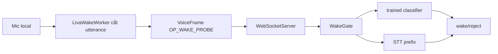

# Wake word — kiến trúc và giới hạn sản phẩm

[⬆ Mục lục](../README.md) · [Voice runtime](voice.md) · [Wake benchmark](../05-chat-luong/wake-benchmark.md)

## 1. Trạng thái sản phẩm

- Câu đầy đủ bắt đầu bằng “Hey Liva” hoạt động trên đường beta hiện tại.
- Artifact `wake_liva_en_v2.onnx` đã train xong và vượt gate tổng hợp; “Hey Liva” đứng riêng
  vẫn cần nghiệm thu bằng giọng thật trên mic mục tiêu trước khi quảng bá là production-ready.
- Không được hạ threshold để che lỗi model: việc đó mở lại false-positive.
- UX beta phải hướng dẫn “Hey Liva” kèm lệnh cho tới khi classifier cá nhân vượt acceptance gate.
- Toolchain train, trang thu mẫu chủ động và benchmark corpus đã có. Artifact v2 cũ đạt recall
  91,82% và FPPH 0,0773 tại threshold 0,58 trên 25,88 giờ validation tổng hợp; gate giọng thật
  và máy mục tiêu vẫn mở. Artifact này chưa được cá nhân hóa và không được coi là bản phát hành
  cho câu gọi đứng riêng.

Trạng thái capability do `experience.wake-word` trong `docs/_data/capabilities.json` sở hữu.

## 2. Đường thực thi



- UI gửi probe qua `liva-ui/src/composables/useVoicePipeline.ts#sendWakeProbe`.
- Wire opcode thuộc `liva-native-core/src/webrtc/frame.rs#OP_WAKE_PROBE`.
- Quyết định ở core được cấu hình tại `liva-native-core/src/wake.rs#WakeGate::from_env`.
- Chuẩn hóa transcript trước so cụm từ tại
  `liva-native-core/src/wake.rs#normalize_for_match`.
- Classifier ONNX được dựng tại `liva-native-core/src/wake_model.rs#TrainedWakeDetector::new`.

Browser worker chỉ cắt câu và quản lý lifecycle; nó không được tự quyết định wake bằng RMS.
Sàn utterance hiện là 500 ms: đoạn giọng 320 ms bị loại trước STT, trong khi câu gọi
khoảng 640 ms vẫn đi qua.

## 3. Modes và cấu hình

`liva-native-core/src/wake.rs#WakeGate::from_env` hỗ trợ:

| Mode            | Hành vi                                       |
| --------------- | --------------------------------------------- |
| `off`           | không gate bằng wake; đây là mặc định runtime |
| `asr_prefix`    | STT rồi so với danh sách phrase               |
| `trained_model` | chỉ dùng classifier ONNX                      |
| `hybrid`        | classifier hoặc STT phrase                    |

Các cấu hình chính:

- `LIVA_WAKE_PHRASES`: mặc định chỉ có đúng `hey liva`; CSV chỉ dành cho ghi đè thử nghiệm;
- `LIVA_WAKE_WINDOW_SECS`: cửa sổ tỉnh, mặc định 45 giây;
- `LIVA_WAKE_MODEL_PATHS`: classifier ONNX; để trống thì tự dùng
  `models/wake_liva_en_v2.onnx` và kiểm SHA-256 theo manifest;
- `LIVA_WAKE_THRESHOLD`: ngưỡng classifier, mặc định 0,58.

## 4. Ranh giới an toàn

- Không gửi mic liên tục chỉ vì classifier thiếu hoặc lỗi.
- Fallback ASR chỉ nhận wake phrase ở đầu utterance (cho phép `hey` đứng trước phrase tùy chỉnh);
  không tìm chuỗi ở giữa tám từ đầu như bản cũ.
- Thiếu classifier trong `trained_model` phải fail rõ; `hybrid` được phép rơi về tầng STT với cảnh báo.
- Path model đi qua resource resolver của runtime Tauri.
- Stop pipeline phải vô hiệu startup đang chờ quyền mic và terminate worker.
- Không quảng cáo “Hey Liva” trần trước khi đạt recall/FPPH trên giọng người dùng.
- Từ 31/07/2026, UX beta dùng câu đầy đủ bắt đầu bằng `Hey Liva` và regression gate
  `scripts/wake-ux-copy.test.mjs` khóa copy trên README, widget và trang thử microphone.
- Corpus giọng nằm trong `data/wake-enrollment/` và output train nằm trong
  `tools/wakeword/work/`; cả hai bị Git bỏ qua vì audio là dữ liệu sinh trắc học và
  output có thể rất lớn.

## 5. Kiểm chứng

```powershell
# Kiểm tra toolchain/config/hardware
powershell -ExecutionPolicy Bypass -File scripts/train-wakeword.ps1 -Action Doctor

# Thu mẫu bằng trang liva-ui/public/wake-word-test.html, rồi benchmark model
npm run wake:benchmark -- --model models/wake_liva_en_v2.onnx `
  --positive data/wake-enrollment/positive `
  --negative data/wake-enrollment/negative `
  --report tools/wakeword/work/wake_liva_en_v2-report.json

# E2E qua gateway thật
node scripts/e2e-wake-probe.mjs <file.wav> 8002
```

Benchmark và probe dùng cùng quy ước: exit `0` là đạt/wake, exit `2` là không
đạt/reject. Runner benchmark ghi recall, FPPH, thời lượng negative corpus và SHA-256
model. Kết quả chất lượng thuộc [Wake benchmark](../05-chat-luong/wake-benchmark.md).

Toolchain pin cả commit LiveKit và PyTorch CUDA trong `tools/wakeword/toolchain.json`.
`Doctor`, `Train` và `Eval` fail-closed nếu `torch.cuda.is_available()` là false để tránh
vô tình chạy production corpus hàng chục nghìn clip trên CPU.

### 5.1. Train có personalization

`Train`, `Personalize` và `All` không còn chạy pipeline tổng hợp thuần. Trình tự bắt buộc là:

1. tạo đủ corpus tổng hợp theo cấu hình;
2. kiểm tra tối thiểu 20 WAV thật PCM mono 16 kHz/16-bit;
3. tách recording gốc 80/20 trước khi nhân bản, sau đó đưa 10.000 bản vào train và 1.000
   bản vào test để upstream tạo augmentation khác nhau;
4. augment → extract feature → train → export → eval.

Các file được chèn dùng dải tên riêng `clip_800000…849999` cho train và
`clip_850000…899999` cho test. Script chỉ xóa lại đúng dải này khi chạy lại; corpus tổng hợp
không bị đụng tới. Manifest cục bộ nằm cạnh output model.

```powershell
# Sau khi đã thu ít nhất 20 mẫu vào data/wake-enrollment/positive
powershell -ExecutionPolicy Bypass -File scripts/train-wakeword.ps1 -Action Personalize

# Hoặc đọc WAV từ một thư mục khác
powershell -ExecutionPolicy Bypass -File scripts/train-wakeword.ps1 -Action Personalize `
  -EnrollmentDir C:\duong-dan\toi\wav
```

### 5.2. Quyết định về mã nguồn mở

Ba hướng đã được đối chiếu bằng PoC cục bộ ngày 31/07/2026:

| Hướng                                  |                                           Kết quả trên corpus thử | Quyết định                        |
| -------------------------------------- | ----------------------------------------------------------------: | --------------------------------- |
| sherpa-onnx KWS GigaSpeech             |                                          recall 30,5%; 92,87 FPPH | Không tích hợp                    |
| sherpa-onnx KWS zh-en                  |                                         recall 27,5%; 123,83 FPPH | Không tích hợp                    |
| rustpotter personalized                | recall 60% ở ngưỡng mặc định; khi ép recall 100% thì 1.866,5 FPPH | Không tích hợp                    |
| LiveKit/openWakeWord + enrollment thật |                                   chưa có corpus giọng người dùng | Giữ kiến trúc, bắt buộc train lại |

Hai probe Rust nằm tách khỏi Cargo workspace chính vì sherpa-onnx dùng ORT API 27 trong khi
native core đang nhúng API 17; liên kết trực tiếp sẽ gây xung đột ABI trên Windows. Probe là
bằng chứng tái lập, không phải dependency runtime.

## 6. Việc tiếp theo

1. Giữ “Hey Liva” kèm lệnh làm UX beta.
2. Thu tối thiểu 20 positive bằng trang enrollment, chạy `-Action Personalize`, và thu ít nhất
   một giờ negative trên máy mục tiêu.
3. Benchmark artifact personalized trên corpus giọng thật độc lập và lưu report có model hash.
4. Chỉ đổi UX mặc định sang “Hey Liva” trần sau khi corpus mic mục tiêu cũng đạt recall ≥90%
   và FPPH ≤1; kết quả tổng hợp không thay thế phép đo này.
