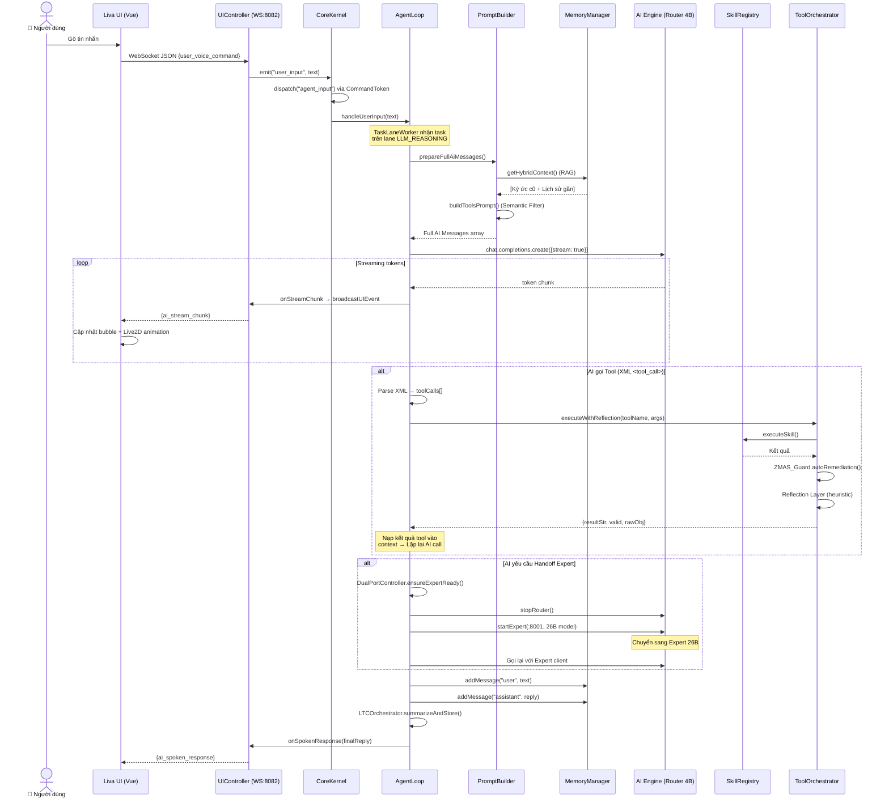
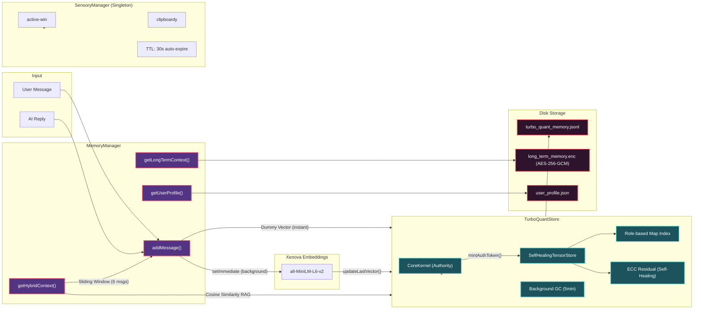
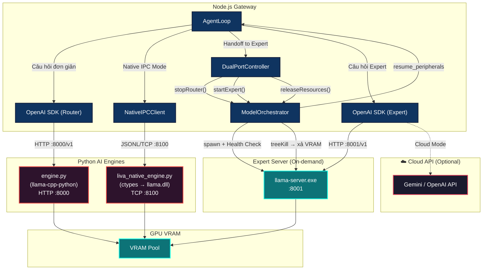
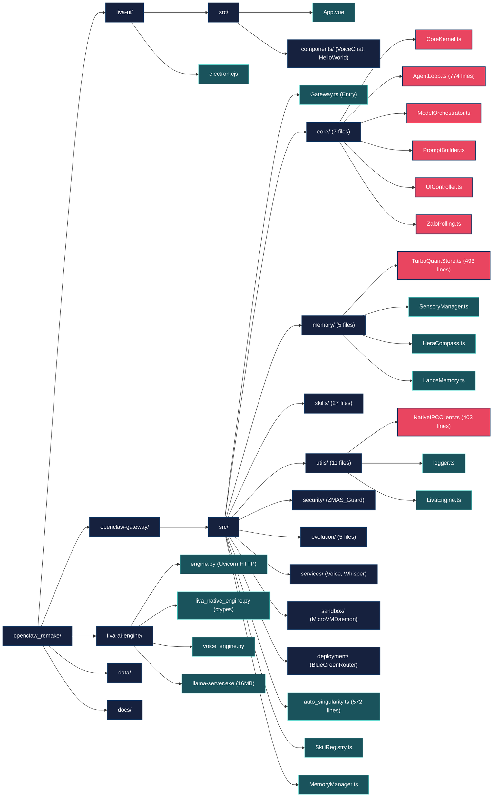
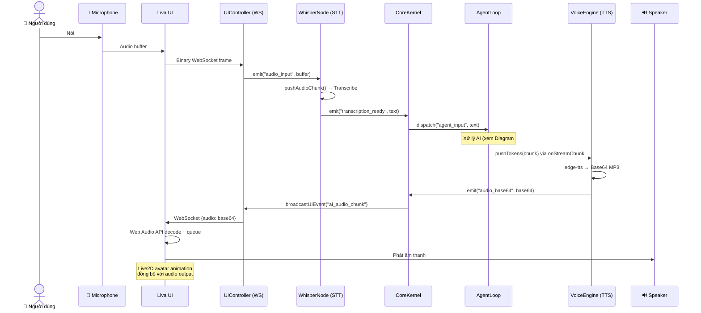
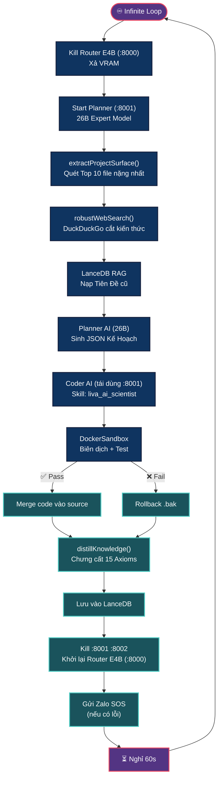

# 🏗️ LIVA — Codebase Architecture Diagram

> Mở file này trong VS Code, chuột phải → **"Preview Mermaid"** để xem sơ đồ trực quan.

---

## 1. Tổng Quan Kiến Trúc Hệ Thống (System Overview)

```mermaid
graph TD
    User([👤 Người dùng])

    subgraph UI ["🖥️ liva-ui (Vue 3 + Electron)"]
        AppVue["App.vue"]
        VoiceChat["VoiceChat.vue"]
        Live2D["Live2D Avatar (PIXI.js)"]
        AudioPlayer["Web Audio API"]
    end

    subgraph GW ["⚙️ openclaw-gateway (Node.js TypeScript)"]
        Gateway["Gateway.ts (Entry Point)"]
        
        subgraph Core ["🧠 Core"]
            CoreKernel["CoreKernel"]
            AgentLoop["AgentLoop"]
            ModelOrchestrator["ModelOrchestrator"]
            PromptBuilder["PromptBuilder"]
            UIController["UIController (WebSocket:8082)"]
            ZaloPolling["ZaloPolling"]
            TelemetryProfiler["TelemetryProfiler"]
        end

        subgraph SubAgents ["🤖 Sub-Agents (trong AgentLoop)"]
            DualPort["DualPortController"]
            ToolOrch["ToolExecutionOrchestrator"]
            LTCOrch["LTCOrchestrator"]
            TaskLaneWorker["TaskLaneWorker (Pub/Sub)"]
        end

        subgraph Memory ["💾 Memory"]
            MemoryManager["MemoryManager"]
            TurboQuantStore["TurboQuantStore"]
            SensoryManager["SensoryManager"]
            HeraCompass["HeraCompass"]
            LanceMemory["LanceMemory"]
        end

        subgraph Skills ["🔧 Skills (27 plugins)"]
            WebSearch["WebSearch"]
            WebBrowser["WebBrowser"]
            SendZaloRPA["SendZaloRPA"]
            SendZaloBot["SendZaloBot"]
            ReadEmails["ReadEmails"]
            ExecuteCommand["ExecuteCommand"]
            GitSync["GitSyncProject"]
            AIScientist["AIScientist"]
            PlanWriter["PlanWriter"]
            ReportWriter["ReportWriter"]
            FileOps["Read/Write/Delete Files"]
            GoogleDocs["Google Docs/Sheets"]
            OtherSkills["...và nhiều skill khác"]
        end

        subgraph Security ["🔒 Security"]
            ZMASGuard["ZMAS_Guard"]
        end

        subgraph Evolution ["🧬 Evolution"]
            DarwinianEvolver["DarwinianEvolver"]
            LearningLog["LearningLog"]
            QualityChecker["QualityChecker"]
            WebResearchAgent["WebResearchAgent"]
            StructuredExtractor["StructuredExtractor"]
        end

        subgraph Infra ["🏭 Infrastructure"]
            SkillRegistry["SkillRegistry"]
            NativeIPCClient["NativeIPCClient (TCP:8100)"]
            ShieldGuard["ShieldGuard"]
            DockerSandbox["DockerSandbox"]
            BlueGreenRouter["BlueGreenRouter"]
            VoiceRelay["VoiceRelay"]
            PluginSDK["PluginSDK"]
        end

        subgraph Services ["🎙️ Services"]
            VoiceEngine["VoiceEngine (edge-tts)"]
            WhisperNode["WhisperNode (STT)"]
        end

        AutoSingularity["auto_singularity.ts (Tự Tiến Hóa)"]
    end

    subgraph Engine ["🐍 liva-ai-engine (Python)"]
        EnginePy["engine.py (llama-cpp-python/Uvicorn)"]
        NativeEngine["liva_native_engine.py (ctypes CFFI)"]
        VoiceEnginePy["voice_engine.py (edge-tts)"]
        LlamaDLL["llama.dll (CUDA GPU)"]
    end

    subgraph Models ["🧊 AI Models (E:/AI_Models)"]
        RouterModel["Gemma 4 E4B (Router 4B)"]
        ExpertModel["Gemma 4 26B (Expert)"]
    end

    %% === Luồng chính ===
    User -->|"Gõ/Nói"| AppVue
    AppVue -->|"WebSocket :8082"| UIController
    UIController -->|"emit user_input"| CoreKernel
    CoreKernel -->|"dispatch agent_input"| AgentLoop

    %% === Zalo Input ===
    User -->|"Nhắn Zalo"| ZaloPolling
    ZaloPolling -->|"emit zalo_incoming"| CoreKernel

    %% === AgentLoop xử lý ===
    AgentLoop --> PromptBuilder
    AgentLoop --> DualPort
    AgentLoop --> ToolOrch
    AgentLoop --> LTCOrch
    AgentLoop --> TaskLaneWorker

    PromptBuilder --> MemoryManager
    PromptBuilder --> SensoryManager

    ToolOrch --> SkillRegistry
    ToolOrch --> ZMASGuard
    LTCOrch --> MemoryManager

    %% === AI Inference ===
    AgentLoop -->|"OpenAI SDK / HTTP :8000"| EnginePy
    AgentLoop -->|"JSONL/TCP :8100"| NativeIPCClient
    NativeIPCClient -->|"TCP Socket"| NativeEngine
    NativeEngine -->|"ctypes CFFI"| LlamaDLL
    EnginePy --> RouterModel
    DualPort --> ModelOrchestrator
    ModelOrchestrator -->|"spawn llama-server :8001"| ExpertModel
    ModelOrchestrator -->|"Health Check :8000"| EnginePy

    %% === Memory ===
    MemoryManager --> TurboQuantStore
    TurboQuantStore -->|"Xenova Embedding"| MemoryManager

    %% === Skills ===
    SkillRegistry --> WebSearch
    SkillRegistry --> WebBrowser
    SkillRegistry --> SendZaloRPA
    SkillRegistry --> ExecuteCommand
    SkillRegistry --> AIScientist
    SkillRegistry --> FileOps

    %% === Voice Pipeline ===
    AppVue -->|"Binary Audio"| UIController
    UIController -->|"emit audio_input"| WhisperNode
    WhisperNode -->|"transcription_ready"| CoreKernel
    AgentLoop -->|"onStreamChunk"| VoiceEngine
    VoiceEngine -->|"audio_base64"| UIController
    UIController -->|"WebSocket"| AudioPlayer

    %% === Output ===
    AgentLoop -->|"onStreamChunk"| CoreKernel
    CoreKernel -->|"broadcastUIEvent"| UIController
    UIController -->|"WebSocket"| AppVue
    AppVue --> Live2D

    %% === Singularity ===
    AutoSingularity -->|"Hot-Swap VRAM"| ModelOrchestrator
    AutoSingularity --> SkillRegistry
    AutoSingularity --> LanceMemory
    AutoSingularity --> DarwinianEvolver

    %% === Styling ===
    classDef ui fill:#1a1a2e,stroke:#e94560,stroke-width:2px,color:#fff
    classDef core fill:#0f3460,stroke:#16213e,stroke-width:2px,color:#fff
    classDef memory fill:#533483,stroke:#e94560,stroke-width:2px,color:#fff
    classDef skill fill:#1a535c,stroke:#4ecdc4,stroke-width:2px,color:#fff
    classDef engine fill:#2d132c,stroke:#ee4540,stroke-width:2px,color:#fff
    classDef model fill:#0d7377,stroke:#14ffec,stroke-width:2px,color:#fff
    classDef security fill:#6a0572,stroke:#ab4e68,stroke-width:2px,color:#fff

    class AppVue,VoiceChat,Live2D,AudioPlayer ui
    class Gateway,CoreKernel,AgentLoop,ModelOrchestrator,PromptBuilder,UIController,ZaloPolling,TelemetryProfiler core
    class MemoryManager,TurboQuantStore,SensoryManager,HeraCompass,LanceMemory memory
    class WebSearch,WebBrowser,SendZaloRPA,SendZaloBot,ReadEmails,ExecuteCommand,GitSync,AIScientist,PlanWriter,ReportWriter,FileOps,GoogleDocs,OtherSkills skill
    class EnginePy,NativeEngine,VoiceEnginePy,LlamaDLL engine
    class RouterModel,ExpertModel model
    class ZMASGuard,ShieldGuard security
```

---

## 2. Luồng Xử Lý Tin Nhắn (Message Flow)

---

## 3. Kiến Trúc Bộ Nhớ (Memory Architecture)

---

## 4. Dual-Port AI Engine (Router ↔ Expert)

---

## 5. Cấu Trúc Thư Mục (Directory Map)

---

## 6. Voice Pipeline (Giọng Nói ↔ AI)

---

## 7. Auto-Singularity (Chu Kỳ Tự Tiến Hóa)

---

## Chú Thích Màu Sắc

| Màu | Ý nghĩa |
|-----|---------|
| 🔴 Đỏ viền | File cốt lõi quan trọng nhất |
| 🔵 Xanh dương | Core Gateway modules |
| 🟣 Tím | Memory / Storage layer |
| 🟢 Xanh lá | Skills / Plugins |
| 🟤 Nâu đỏ | Python AI Engine |
| 🔵 Cyan | GPU / Model layer |

---

## Thống Kê Nhanh

| Thành phần | Số file | Ghi chú |
|-----------|---------|---------|
| **openclaw-gateway/src/core/** | 7 file | Lõi xử lý chính |
| **openclaw-gateway/src/skills/** | 27 file | Plugin kỹ năng |
| **openclaw-gateway/src/memory/** | 5 file | Bộ nhớ đa tầng |
| **openclaw-gateway/src/utils/** | 11 file | Tiện ích hạ tầng |
| **openclaw-gateway/src/evolution/** | 5 file | Tự tiến hóa |
| **liva-ai-engine/** | 3 file chính | Python inference |
| **liva-ui/src/** | 3 file | Vue + Electron |
| **Tổng Lines of Code** | ~5000+ | Không kể node_modules |
