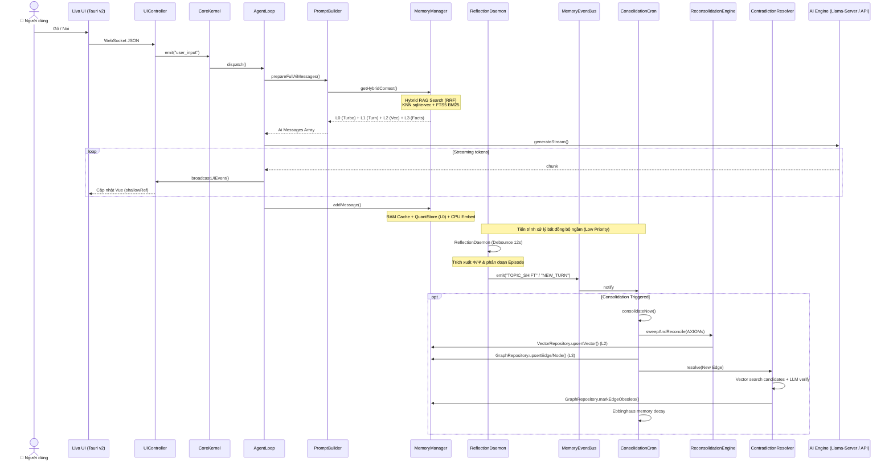
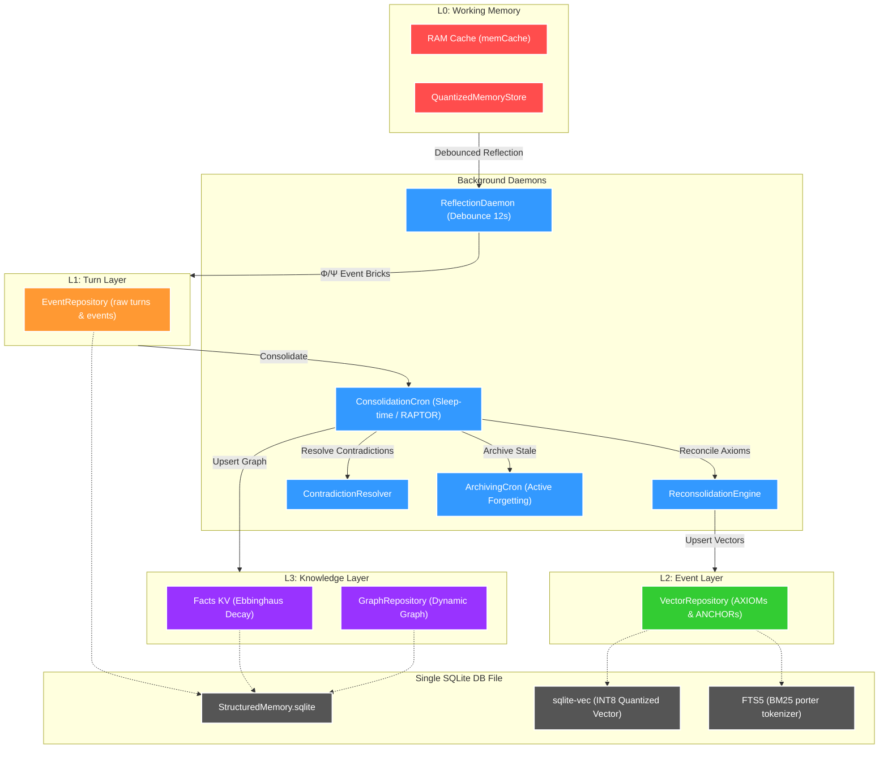
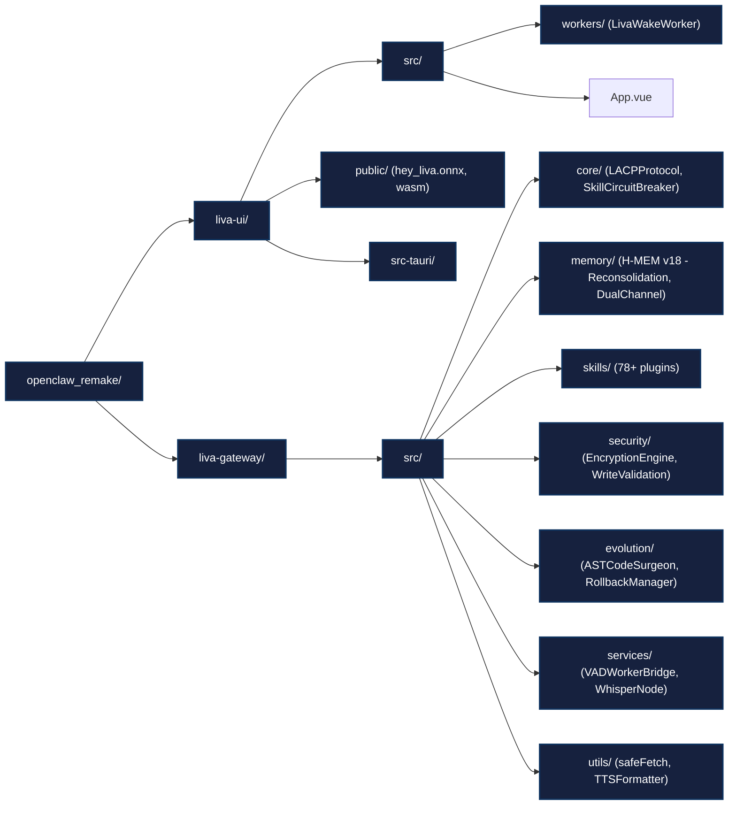

# 🏗️ LIVA — Codebase Architecture Diagram (v26 Enterprise-Ready)

> Mở file này trong VS Code, chuột phải → **"Preview Mermaid"** để xem sơ đồ trực quan. Cập nhật mới nhất bao gồm kiến trúc H-MEM v18, LACP Protocol, và Zero-VRAM Edge Offloading.

---

## 1. Tổng Quan Kiến Trúc Hệ Thống (System Overview)

```mermaid
graph TD
    User([👤 Người dùng])

    subgraph UI ["🖥️ liva-ui (Vue 3 + Tauri v2 / Rust)"]
        AppVue["App.vue"]
        LivaWakeWorker["LivaWakeWorker (ONNX/WASM Wake-word)"]
        AudioPlayer["Web Audio API"]
        TauriCore["Tauri OS WebView (Transparent Widget)"]
    end

    subgraph GW ["⚙️ openclaw-gateway (Node.js TypeScript)"]
        Gateway["Gateway.ts (Entry Point)"]
        
        subgraph Core ["🧠 Core"]
            CoreKernel["CoreKernel"]
            AgentLoop["AgentLoop"]
            ModelOrchestrator["ModelOrchestrator (Local/Cloud/Hybrid)"]
            PromptBuilder["PromptBuilder"]
            UIController["UIController (WebSocket:8082)"]
            LACPProtocol["LACPProtocol (2PC Transaction)"]
            SkillCircuitBreaker["SkillCircuitBreaker"]
            PreemptiveVramMutex["PreemptiveVramMutex"]
        end

        subgraph Memory ["💾 LIVA-UHM (H-MEM v18)"]
            MemoryManager["MemoryManager"]
            StructuredMemory["StructuredMemory (node:sqlite)"]
            TurboQuantStore["TurboQuantStore (L0)"]
            EventRepository["EventRepository (L1 Turn Layer)"]
            VectorRepository["VectorRepository (L2 Event / sqlite-vec)"]
            GraphRepository["GraphRepository (L3 Graph / SQLite)"]
            DualChannelSegmenter["DualChannelSegmenter"]
            ReconsolidationEngine["ReconsolidationEngine"]
            ContradictionResolver["ContradictionResolver"]
            ConsolidationCron["ConsolidationCron"]
            ArchivingCron["ArchivingCron (Active Forgetting)"]
            ReflectionDaemon["ReflectionDaemon (Φ/Ψ Extractor)"]
            MemoryEventBus["MemoryEventBus"]
            SemanticCache["SemanticCache (Fuzzy RAM Cache)"]
            EncryptionEngine["EncryptionEngine (AES-256-GCM)"]
        end

        subgraph Skills ["🔧 Skills (78+ plugins)"]
            LocalMCPServer["LocalMCPServer (In-process MCP)"]
            SkillRegistry["SkillRegistry"]
            AIScientist["AIScientist"]
            SystemAudit["SystemAudit"]
        end

        subgraph Security ["🔒 Security Guardrails"]
            ZMASGuard["ZMAS_Guard"]
            ShieldGuard["ShieldGuard"]
            WriteValidationGate["WriteValidationGate"]
        end

        subgraph Evolution ["🧬 Singularity Pipeline"]
            EvolutionPipeline["EvolutionPipeline (DAG)"]
            ASTCodeSurgeon["ASTCodeSurgeon (ts-morph)"]
            MicroVMDaemon["MicroVMDaemon (isolated-vm/WASI)"]
            RollbackManager["RollbackManager (Physical Snapshot)"]
        end

        subgraph Infra ["🏭 Infrastructure"]
            MCPClientManager["MCPClientManager"]
            NativeIPCClient["NativeIPCClient"]
            VRAMGuard["VRAMGuard (AppWatcher)"]
            EmbeddingWorker["EmbeddingWorker (onnxruntime-node)"]
        end

        subgraph Services ["🎙️ Services"]
            VoiceEngine["VoiceEngine (Edge-TTS)"]
            KokoroVoice["KokoroVoiceEngine (Fallback)"]
            WhisperNode["WhisperNode (STT)"]
            VADBridge["VADWorkerBridge (Silero ONNX)"]
        end
    end

    subgraph Engine ["⚙️ liva-ai-engine (C++ / Python)"]
        LlamaServer["llama-server (C++ :8000)"]
    end

    subgraph Models ["🧊 AI Models"]
        SingleExpertModel["Single Expert Model (100% VRAM)"]
    end

    %% === Luồng chính ===
    User -->|"Nói/Gõ"| AppVue
    AppVue -->|"ONNX Phát hiện Hey Liva"| LivaWakeWorker
    LivaWakeWorker -->|"WebSocket"| UIController
    UIController -->|"emit"| CoreKernel
    CoreKernel -->|"dispatch"| AgentLoop

    %% === Cấu trúc Core ===
    AgentLoop --> PromptBuilder
    AgentLoop --> SkillCircuitBreaker
    SkillCircuitBreaker --> SkillRegistry
    AgentLoop --> LACPProtocol
    PromptBuilder --> MemoryManager

    %% === LIVA UHM Memory ===
    MemoryManager --> StructuredMemory
    MemoryManager --> SemanticCache
    StructuredMemory --> TurboQuantStore
    StructuredMemory --> EventRepository
    StructuredMemory --> VectorRepository
    StructuredMemory --> GraphRepository
    StructuredMemory --> EncryptionEngine
    ReflectionDaemon --> MemoryEventBus
    MemoryEventBus --> ConsolidationCron
    ConsolidationCron --> ReconsolidationEngine
    ConsolidationCron --> ContradictionResolver
    ConsolidationCron --> GraphRepository
    ContradictionResolver --> GraphRepository
    ArchivingCron --> VectorRepository
    ArchivingCron --> GraphRepository
    DualChannelSegmenter --> ReconsolidationEngine
    ReconsolidationEngine --> VectorRepository

    %% === AI Inference ===
    AgentLoop -->|"PreemptiveVramMutex"| ModelOrchestrator
    ModelOrchestrator -->|"spawn & health"| LlamaServer
    LlamaServer --> SingleExpertModel

    %% === LACP Transaction ===
    LACPProtocol -->|"2PC Prepare/Commit"| AgentLoop

    %% === Auto Singularity ===
    EvolutionPipeline --> ASTCodeSurgeon
    EvolutionPipeline --> MicroVMDaemon
    EvolutionPipeline --> RollbackManager

    %% === Styling ===
    classDef ui fill:#1a1a2e,stroke:#e94560,stroke-width:2px,color:#fff
    classDef core fill:#0f3460,stroke:#16213e,stroke-width:2px,color:#fff
    classDef memory fill:#533483,stroke:#e94560,stroke-width:2px,color:#fff
    classDef skill fill:#1a535c,stroke:#4ecdc4,stroke-width:2px,color:#fff
    classDef engine fill:#2d132c,stroke:#ee4540,stroke-width:2px,color:#fff
    classDef model fill:#0d7377,stroke:#14ffec,stroke-width:2px,color:#fff
    classDef security fill:#6a0572,stroke:#ab4e68,stroke-width:2px,color:#fff

    class AppVue,LivaWakeWorker,AudioPlayer,TauriCore ui
    class Gateway,CoreKernel,AgentLoop,ModelOrchestrator,PromptBuilder,UIController,LACPProtocol,PreemptiveVramMutex,SkillCircuitBreaker core
    class MemoryManager,StructuredMemory,TurboQuantStore,EventRepository,VectorRepository,DualChannelSegmenter,ReconsolidationEngine,EncryptionEngine memory
    class LocalMCPServer,SkillRegistry,AIScientist,SystemAudit skill
    class LlamaServer engine
    class SingleExpertModel model
    class ZMASGuard,ShieldGuard,WriteValidationGate security
```

---

## 2. Luồng Xử Lý Tin Nhắn & Bộ Nhớ (Message Flow & Reconsolidation)

---

## 3. Kiến Trúc Bộ Nhớ H-MEM v18 (HiGMem Phase 3)

---

## 4. Bốn Trụ Cột Tối Ưu UX & Phần Cứng (Ambient Cognitive OS)

1. **Preemptive VRAM Yielding (`VRAMGuard`)**: 
   - Dò tìm game/render app nặng qua OS metrics. 
   - Tự động kill `llama-server` giải phóng 100% VRAM. Tự động mượn Cloud API làm fallback. Tái kích hoạt local khi app tắt.
2. **Semantic Action Cache L0.5**: 
   - `SemanticRouter` dùng vector cache để tra cứu các action cố định (ví dụ bật/tắt đèn). Bỏ qua LLM call (0ms latency, zero VRAM).
3. **On-Demand Screen Awareness**: 
   - Không stream liên tục gây nghẽn. Chỉ kích hoạt hàm chụp màn hình bằng Tauri WebView sang Cloud Vision khi người dùng dùng deictic words ("cái này", "đoạn code trên màn hình").
4. **Wake-Word Edge Offloading (`LivaWakeWorker`)**:
   - `hey_liva.onnx` (5KB) chạy ngầm trực tiếp trên Vue 3 bằng WebAssembly. Micro bật 24/7 nhưng **chỉ gửi audio lên Gateway khi wake-word khớp**. Backend CPU/GPU usage là 0% lúc im lặng.

---

## 5. Cấu Trúc Thư Mục Cốt Lõi (Directory Map)

