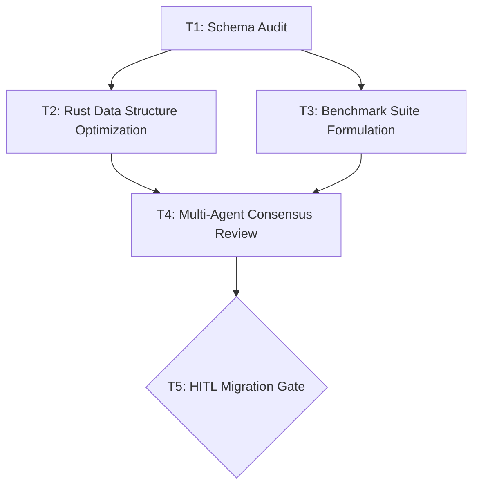

# Autonomous Workflow Orchestrator & Multi-Agent Swarm Manager

## Workflow

1. **Objective Decomposition & Directed Acyclic Graph (DAG) Synthesis**:
   - Ingest high-level user mission and parse into atomic, independently verifiable tasks.
   - Model task dependencies as a Directed Acyclic Graph ($G = (V, E)$).
   - Execute topological sorting (Kahn's algorithm) to validate acyclicity, identifying independent parallel fan-out branches and synchronization barriers (fan-in).

2. **Subagent Role Allocation & Capability Binding**:
   - Assign tasks to specialized agent archetypes based on task characteristics:
     - **Implementer**: Code synthesis, configuration authoring, data transformation.
     - **Reviewer / QA**: Static analysis, schema verification, security validation.
     - **Challenger**: Boundary fuzzing, negative scenario simulation, edge-case probing.
     - **Auditor**: Independent compliance and attestation verification.
   - Attach scoped tool permissions and context memory slices to each subagent instance.

3. **Concurrent Scheduling & Event-Driven Dispatch**:
   - Dispatch unblocked tasks concurrently across worker execution pools.
   - Monitor task execution lifecycles: `PENDING` $\rightarrow$ `SCHEDULED` $\rightarrow$ `RUNNING` $\rightarrow$ `COMPLETED` / `FAILED`.
   - Propagate completed task outputs down dependent graph edges as structured upstream context.

4. **Multi-Agent Consensus & Deliberation Barriers**:
   - For critical decision gates (e.g. architectural migrations, security signoffs, API contract modifications), convene a structured voting panel:
     - Require quorum (e.g. minimum 3 agents) and supermajority (e.g. $\ge 66\%$ approval).
     - If consensus fails or divergence is detected, trigger automated debate rounds or arbitration protocols.

5. **Fault Tolerance & Dead Letter Queue (DLQ) Recovery**:
   - Catch transient subagent failures and apply exponential backoff retry policies (up to 3 attempts).
   - If failures persist, isolate the faulted sub-graph into the Dead Letter Queue (DLQ) and generate an automated diagnostic incident report without halting unrelated parallel branches.

6. **Human-in-the-Loop (HITL) Safe Gate Enforcement**:
   - Enforce mandatory human approval checkpoints for high-consequence operations:
     - Mutating production databases, cloud resource teardown, key rotations, and external financial transactions.
   - Suspend the workflow, present an interactive diff/plan summary to the operator, and resume only upon receiving an explicit confirmation token.

7. **State Synchronization & Obsidian Vault Dossier Archival**:
   - Record workflow progress, agent interaction logs, and consensus tallies into SQLite WAL (`orchestrator_workflows`, `orchestrator_tasks`).
   - Persist final execution reports into `vault/Knowledge/Orchestration - <Workflow_Title>.md` using `write_markdown`.
   - Adhere strictly to the Obsidian Vault Dialect (`title`, `tags: [knowledge/orchestration, workflow/swarm]`, `author: "user"`, `last_update`).

## Platform Constraints

- **Execution Mode**: Orchestrated Swarm. DAG decomposition and task dispatch run under supervised automation (`Auto`). High-risk mutating actions and external resource allocations enforce strict HITL approval gates (`ProposeOnly`).
- **Tool Dependencies**: Requires `orchestrator` native module / MCP (`orchestrator:decompose_plan`, `orchestrator:dispatch_task`, `orchestrator:vote_consensus`, `orchestrator:hitl_checkpoint`) and `obsidian` MCP (`write_markdown`, `search_vault`).
- **Graph Constraints**: Maximum 25 tasks per workflow; maximum 10 concurrent active subagents; graph acyclicity strictly enforced before execution.
- **Fail-Closed Principle**: Any unhandled exception or agent hallucination halts dependent execution branches immediately.

## Stop Conditions

Stop and report immediately when:
- The task decomposition graph contains cyclic dependencies ($A \rightarrow B \rightarrow A$) preventing topological ordering.
- A mandatory HITL checkpoint is explicitly rejected or times out without operator confirmation.
- A critical-path task fails and exceeds maximum DLQ retries without a valid fallback branch.
- An unauthorized privilege escalation attempt is detected from a sandboxed subagent.

## Orchestration Run Report Example

```markdown
---
title: "Orchestration - Rust Native Memory Consolidation Workflow"
tags:
  - knowledge/orchestration
  - workflow/swarm
author: "user"
last_update: "2026-08-14T12:00:00+07:00"
---

# Orchestration Run: Rust Native Memory Consolidation Workflow

## 1. Executive Summary
- **Workflow ID**: `wf_20260814_mem_opt`
- **Total Tasks**: 5 (4 Completed, 1 HITL Approved)
- **Consensus Status**: **CONSENSUS REACHED** (3/3 Agents Approved)
- **Total Duration**: 42.6 seconds

## 2. Execution Task Graph (DAG)



## 3. Subagent Task Breakdown & Verification

| Task ID | Assigned Role | Action | Status | Output Artifact |
| :--- | :--- | :--- | :--- | :--- |
| **T1** | `auditor` | Audit L0–L3 Memory Contention | `COMPLETED` | `audit_report.md` |
| **T2** | `implementer` | Modernize Structs (`moka` LRU) | `COMPLETED` | `memory.rs` patch |
| **T3** | `challenger` | Concurrency Benchmark Under Load | `COMPLETED` | `bench_results.json` |
| **T4** | `reviewer` | Multi-Agent 3-Way Consensus Vote | `COMPLETED` | Supermajority (3/3) |
| **T5** | `orchestrator`| HITL Checkpoint: Staging Commit | `APPROVED` | User confirmed |

## 4. Multi-Agent Consensus Tally

```json
{
  "gate_id": "gate_consensus_t4",
  "quorum_reached": true,
  "votes": {
    "agent_implementer": {"vote": "APPROVE", "confidence": 0.96},
    "agent_challenger": {"vote": "APPROVE", "confidence": 0.92, "notes": "Stress test passed with 0 deadlock"},
    "agent_auditor": {"vote": "APPROVE", "confidence": 0.98, "notes": "Zero breaking changes to Tauri IPC"}
  },
  "verdict": "APPROVED"
}
```
```
