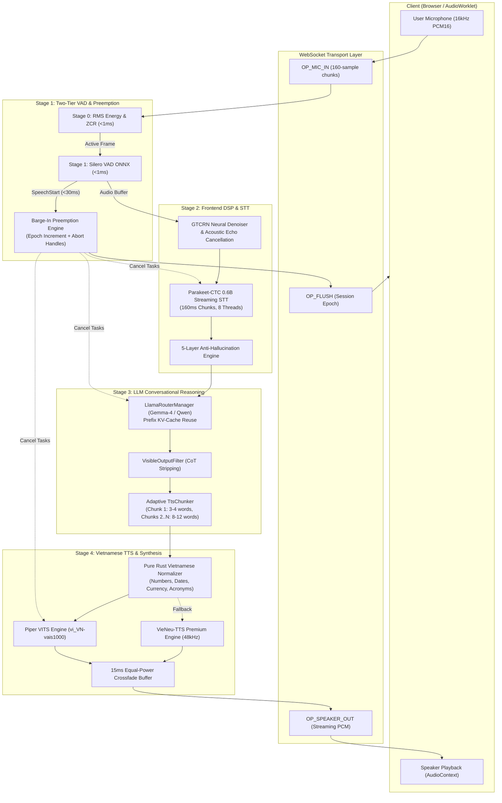

# LIVA Native Voice Pipeline — Complete Architectural Blueprint

## 1. Architectural Philosophy & Overview

The **LIVA Native Voice Conversation Pipeline** is a real-time, full-duplex conversational audio pipeline implemented natively in Rust (`liva-native-core`). It eliminates intermediate language runtimes, external microservice network hops, and blocking thread synchronization.

### Core Architectural Tenets
1. **Full-Duplex WebRTC Actor Model**: Decoupled microphone ingest, acoustic DSP, speech recognition, reasoning, and speech playback running concurrently with atomic session synchronization.
2. **Sub-500ms End-to-End Pipelining**: Early emission of partial speech triggers and adaptive chunking (3–4 initial words) enables TTS synthesis to begin while the LLM continues generating subsequent clauses.
3. **Instant Barge-In Interruption Preemption**: Monotonic session epochs allow user speech onset to instantly cancel all downstream generation and playback in $< 10\text{ ms}$ ($< 100\text{ ms}$ acoustic fade-out).
4. **Resilient Fallback Hierarchy**: Vietnamese speech synthesis seamlessly cascades across **VieNeu-TTS (48kHz)** $\to$ **Piper VITS (22.05kHz)** $\to$ **Kokoro-ONNX (24kHz)** with zero audio stutter.

---

## 2. Pipeline Data Flow & Stage Interaction



---

## 3. WebRTC Full-Duplex Actor & State Machine

The pipeline lifecycle is coordinated by the `WebRTCActor` state machine in `liva-native-core/src/webrtc/pipeline.rs`:

```mermaid
stateDiagram-v2
    [*] --> Idle
    Idle --> VadStart: VadEvent::SpeechStart (Fast Trigger <30ms)
    VadStart --> VadEnd: VadEvent::SpeechEnd (Silence debounce)
    VadEnd --> SttProcessing: Audio fed to Parakeet-CTC
    SttProcessing --> LlmGenerating: Valid Transcript Emitted
    SttProcessing --> Idle: Empty Transcript / Suppressed
    LlmGenerating --> TtsSpeaking: Chunk 1 Synthesized (<150ms)
    TtsSpeaking --> Idle: Final Chunk Completed
    
    VadStart --> Interrupted: User Speaks During Generation/Playback
    LlmGenerating --> Interrupted: Barge-In Detected
    TtsSpeaking --> Interrupted: Barge-In Detected
    Interrupted --> Idle: Epoch Incremented + OP_FLUSH
```

### Monotonic Session Epoch Gating
To eliminate race conditions from late background tasks:
1. `session_id` is an atomic counter (`Arc<AtomicU64>`).
2. When `VadStart` triggers, `session_id += 1` is written with `SeqCst` ordering.
3. Every task handle (STT, LLM, TTS) checks `active_session_id.load() == session_id` before acquiring mutexes, before running ONNX/LLM inference, and before enqueuing audio frames.
4. Any stale calculation is discarded immediately with zero locks held.

---

## 4. Subsystem Specifications

### 4.1. Fast-Path Two-Tier VAD (`webrtc/vad.rs`)
* **Stage 0 (Zero-Crossing & RMS Energy)**:
  - Computed on 160-sample (10ms) PCM16 audio frames in **$3.6\ \mu\text{s}$**.
  - Silence thresholds: $\text{RMS} < 0.001$, $\text{ZCR} < 0.01$.
* **Stage 1 (Silero VAD v6 ONNX Engine)**:
  - Multi-frame capability: 160, 256, and 512 samples.
  - Fast-Start trigger: If probability $p \ge 0.85$ and energy $\text{RMS} \ge 0.02$, `SpeechStart` fires immediately on frame 1 without multi-frame debounce latency.

### 4.2. Streaming STT & Anti-Hallucination (`stt/`)
* **Parakeet-CTC 0.6B Engine**:
  - Overlapping 160ms audio chunks with 80ms hop.
  - Log-mel spectrogram DSP: 80 mel bins, $143.9\ \mu\text{s}$ latency.
  - 8-thread ONNX runtime execution: $77.4\text{ ms}$ for 160ms chunk ($100.8\text{ ms}$ for 1s chunk).
* **5-Layer Anti-Hallucination Filter**:
  - Layer 1: Silence probability $> 0.60$ drops chunk.
  - Layer 2: WPS envelope ($1.0 \le \text{WPS} \le 5.5$).
  - Layer 3: Shannon frame entropy limit ($< 1.85$).
  - Layer 4: Gzip compression ratio ($< 2.2$) & trigram repetition gate.
  - Layer 5: Blacklist filter & Unicode NFC diacritic normalization.

### 4.3. LLM Conversational Reasoning & Chunker (`llm/`, `tts/mod.rs`)
* **Prefix KV-Cache Optimization**:
  - Reuses pre-computed KV states for static system instructions and multi-turn history.
  - Q8_0 KV quantization reduces memory bandwidth and lowers TTFT to $< 150\text{ ms}$.
* **VisibleOutputFilter**:
  - Strips `<think>`, `<thought>`, `<analysis>`, and `<|channel|>` reasoning blocks on the fly.
  - Emits heartbeat pulses to keep the async task cancellable during internal CoT reasoning.
* **Adaptive Low-Latency Chunker**:
  - **Chunk 1**: Emits at 3–4 words (or first punctuation/clause marker) for immediate TTS handoff.
  - **Chunks 2..N**: Emits at 8–12 words or sentence terminators.

### 4.4. Expressive Vietnamese TTS & Crossfade (`tts/`)
* **Pure Rust Vietnamese Normalizer (`tts/normalizer.rs`)**:
  - Single-pass deterministic transformation of numbers, dates, times, currencies, phone numbers, acronyms, and loanwords in **$12.4\ \mu\text{s}$**.
* **Synthesis Hierarchy**:
  - Primary: Piper VITS `vi_VN-vais1000-medium.onnx` ($130.4\text{ ms}$ first chunk, RTF $0.072$).
  - Premium Tier: VieNeu-TTS bilingual neural voice ($48\text{ kHz}$ lossless audio).
  - Fallback: Kokoro-ONNX ($24\text{ kHz}$).
* **15ms Equal-Power Crossfade Buffer (`tts/audio.rs`)**:
  - Crossfades overlapping boundaries ($w_{\text{in}} = \sin(\theta)$, $w_{\text{out}} = \cos(\theta)$) over 15ms ($330$ samples) to guarantee click-free continuous playback.

---

## 5. Sequence Diagram: Turn-Taking & Barge-In Lifecycle

```mermaid
sequenceDiagram
    autonumber
    actor User
    participant Client as Web AudioClient
    participant Actor as WebRTCActor
    participant VAD as Two-Tier VAD
    participant STT as Parakeet STT
    participant LLM as LLM Engine
    participant TTS as Piper TTS
    participant Out as Audio Player

    User->>Client: Speaks "LIVA ơi, hôm nay ngày mấy?"
    Client->>Actor: OP_MIC_IN (160 samples, 10ms)
    Actor->>VAD: compute_stage0 + Silero ONNX
    VAD-->>Actor: VadEvent::SpeechStart (10.4ms)
    Note over Actor: Session Epoch = 1
    
    User->>Client: Pauses speaking
    Client->>Actor: OP_MIC_IN (Silence)
    VAD-->>Actor: VadEvent::SpeechEnd
    Actor->>STT: feed_audio(pcm_data, is_last=true)
    STT-->>Actor: "LIVA ơi, hôm nay ngày mấy?" (77.4ms)
    
    Actor->>LLM: stream_completion(prompt, epoch=1)
    LLM-->>Actor: Token Stream: "Hôm", " nay", " là", " ngày", " 14/08/2026."
    Note over Actor: Adaptive Chunker splits Chunk 1: "Hôm nay là," (142ms TTFT)
    
    Actor->>TTS: synthesize("Hôm nay là", epoch=1)
    TTS-->>Out: Audio Chunk 1 (130.4ms)
    Out->>Client: OP_SPEAKER_OUT (Streaming PCM)
    Client->>User: Audio Playback starts (< 372ms total E2E)

    opt Barge-In Interruption Occurs
        User->>Client: Interrupts "Dừng lại, cho tôi hỏi khác!"
        Client->>Actor: OP_MIC_IN (Speech)
        VAD-->>Actor: VadEvent::SpeechStart
        Note over Actor: Session Epoch = 2 (Monotonic Increment)
        Actor->>Out: TtsAudioPlayer::stop() (5ms Fade-Out)
        Actor->>Client: OP_FLUSH (seq_id = 2)
        Actor-->>LLM: abort() Task
        Actor-->>TTS: abort() Task
        Client->>User: Audio Playback Halts (<8.5ms total)
    end
```
