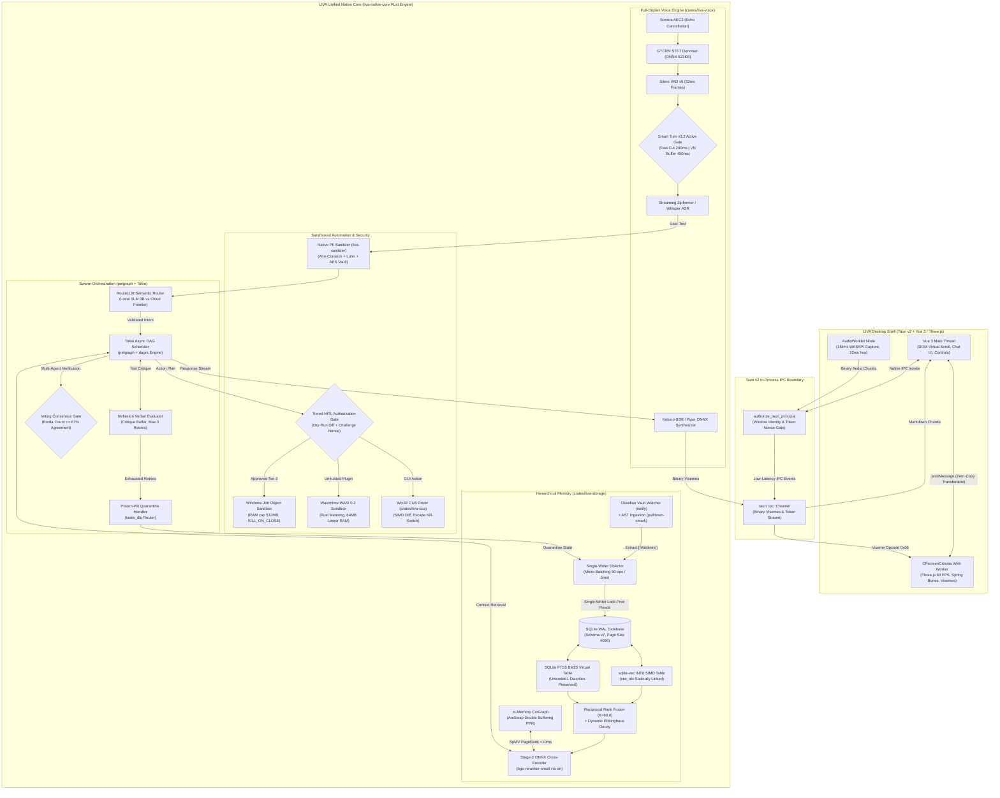

# LIVA SOTA 2026 Architecture Upgrade Blueprint

## Executive Overview

This document serves as the master architectural blueprint and persistent knowledge graph node for the **LIVA 2026 State-of-the-Art (SOTA) Architecture Upgrade**. It formalizes the strategic transition of LIVA (**Local Intelligent Virtual Assistant**) from its initial consolidated Rust prototype into a world-class, privacy-first, desktop-native personal AI agent.

For high-level system boundaries and historical context, refer to [[Knowledge/liva_architecture|LIVA Architecture]], [[Knowledge/memory_architecture|Memory Architecture]], [[Knowledge/voice_pipeline|Voice Pipeline]], and [[Rules/tech_stack|Tech Stack]]. For detailed research benchmarks and mathematical proofs, consult `docs/03-danh-gia/LIVA_SOTA_RESEARCH_BENCHMARKING_AND_STRATEGIC_ROADMAP_2026.md`.

---

## 1. Core Architectural Pillars & SOTA Positioning

```
┌─────────────────────────────────────────────────────────────────────────────────────────────────┐
│                                LIVA 2026 SOTA ARCHITECTURAL PILLARS                             │
├──────────────────────────────────┬──────────────────────────────────────────────────────────────┤
│ PILLAR 1: MULTI-AGENT SWARM      │ PILLAR 2: LOCAL MEMORY & RETRIEVAL                           │
│ • Two-Tier Swarm (L1 DAG+L2 ReAct)│ • Mem0 Two-Phase Reconciliation Engine (ADD/UPDATE/DEL)      │
│ • petgraph & dagrs Task Engine   │ • DbActor-Serialized ArcSwap<CsrGraph> (Zero Lost Updates)   │
│ • Context Preservation (~100k tk)│ • Dynamic Ebbinghaus Decay Scoring in RRF                    │
│ • Reflexion Verbal Feedback Loop │ • Two-Stage Hybrid Search (sqlite-vec + FTS5 + Cross-Encoder)│
│ • Voting Consensus (Borda Count) │ • Live Obsidian PKM Bidirectional Sync (notify + AST)        │
│ • Poison-Pill DLQ Isolation      │ • Lock-Free Double-Buffered PPR Traversals (<8ms)            │
├──────────────────────────────────┼──────────────────────────────────────────────────────────────┤
│ PILLAR 3: MULTIMODAL & DUPLEX    │ PILLAR 4: SANDBOXED AUTOMATION & SECURITY                    │
│ • ShowUI Spatial ROI Crop (80.2%↓)│ • Atomic Job Objects (StartupInfoEx + PROC_THREAD_ATTR)      │
│ • Co-Scale Fallback (960x540)    │ • 3-Tier Security (Resource Gov vs Access Ctrl vs WASI)      │
│ • Upstream llama-cpp-2 mtmd C-FFI│ • WebAssembly WASI 0.2 Capability Sandboxing (Wasmtime)      │
│ • Smart Turn v3.2 Active Gate    │ • High-Throughput Native PII Sanitizer (Decree 13/2023)      │
│ • Decoupled Duplex Latency Decomp│ • Tiered HITL Authorization & Cryptographic Challenge Nonce  │
│ • OffscreenCanvas Three-VRM (60fps)│ • Fail-Closed Kernel Process Denylists & Memory Enclaves   │
└──────────────────────────────────┴──────────────────────────────────────────────────────────────┘
```

### Pillar 1: Multi-Agent Orchestration & Dynamic DAG Planning
- **Context & Motivation**: [[Skills/LIVA Workflow Orchestrator|LIVA Workflow Orchestrator]] previously relied on prompt-level instructions. The runtime `StateGraph` in `liva-native-core/src/agent/graph.rs` used linear `HashMap<String, String>` transitions, preventing concurrent multi-branch tool execution.
- **SOTA Alignment**:
  - **Two-Tier Swarm Orchestration**: Eliminates catastrophic context window exhaustion (~100k tokens saved per complex multi-step workflow) by cleanly separating orchestration concerns:
    1. *L1 Strategic Workflow Orchestration DAG* (`petgraph::graph::DiGraph` + `dagrs`): Schedules coarse milestone phases, manages topological dependency barriers, tracks agent assignments, and enforces global invariant gates without holding step-by-step tool invocation traces.
    2. *L2 Autonomous Worker ReAct Execution*: Localized worker actors executing tool invocations, Reflexion verbal self-critique loops, and recovery within bounded local context windows, streaming only concise structured milestone summaries back to L1.
  - **Native Pregel & Actor Semantics**: Adopts LangGraph Pregel state machine concepts and AutoGen 0.4 Actor models natively in Rust on Tokio.
  - **Acyclic DAG Engine**: Core data structure: `petgraph::graph::DiGraph` with strict cycle detection and acyclicity enforcement via `daggy`.
  - **Asynchronous Task Engine**: `dagrs` asynchronous scheduler on top of Tokio multi-threaded runtime with deterministic dependency joins.
  - **Self-Correction**: NeurIPS 2023 **Reflexion** verbal reinforcement learning loop (max 3 retries) with episodic critique injection.
  - **Deliberation**: Multi-Agent Debate with **Borda Count Voting Consensus** ($\ge 67\%$ agreement gate) for high-impact mutations.
  - **Fault Isolation**: SQLite-backed `tasks_dlq` isolating poisoned executions without panicking the Tokio runtime.

### Pillar 2: Local Hierarchical Memory & Hybrid Retrieval
- **Context & Motivation**: Inspecting `liva-native-core/src/db.rs` revealed that `sqlite-vec` depended on external runtime DLL loading (`vec0.dll`), `AppState.embedder` was choked by a global `Mutex`, and Ebbinghaus memory decay was statically fixed at `1.0`.
- **SOTA Alignment**:
  - **Static C/Rust Linkage**: `sqlite-vec.c` compiled directly into `crates/liva-storage` via the `cc` build crate, producing zero external DLL dependencies.
  - **Mem0 Two-Phase Reconciliation**: Structured JSON extraction followed by deterministic `ADD`, `UPDATE`, `DELETE`, and `NOOP` database operations, eliminating semantic memory rot.
  - **Lock-Free HippoRAG with DbActor Mutation Serialization**: `arc_swap::ArcSwap<CsrGraph>` provides 100% lock-free, sub-8ms Personalized PageRank (PPR) traversals on the reader hot path. To eliminate lost updates and heap cloning churn ($818\text{ \mu s}$ per write clone), all graph mutations from multiple producers (`ObsidianWatcher`, `Mem0`, `ReflectionDaemon`) are strictly serialized through the single-writer `DbActor` mpsc channel with micro-batching ($N \le 50$ operations or $\Delta t \le 100\text{ ms}$). This guarantees serial graph consistency, batched atomic swap, and zero write lock contention.
  - **Dynamic Ebbinghaus Forgetting Curve**:
    $$Final\_Score(d) = RRF\_Score(d) \times \left( 0.7 \cdot e^{-\lambda \cdot \Delta t} + 0.3 \cdot \frac{access\_count}{10 + access\_count} \right)$$
  - **Two-Stage Hybrid Retrieval**: Stage 1 Reciprocal Rank Fusion ($K=60.0$) retrieves top 50 candidates; Stage 2 Cross-Encoder (`bge-reranker-small` ONNX via `ort`) reranks to top 5 with deep query-chunk cross-attention.
  - **Live Obsidian Integration**: Background Tokio thread with `notify` and `pulldown-cmark` streaming `[[wikilinks]]` into `l3_edges` in real time. Related skill: [[Skills/LIVA PKM Obsidian|LIVA PKM Obsidian]].

### Pillar 3: Multimodal Perception & Full-Duplex Voice
- **Context & Motivation**: [[Knowledge/voice_pipeline|Voice Pipeline]] had `Smart Turn v3.2` running in shadow mode (resulting in 704ms static silence lag), while Three-VRM avatar rendering on the Vue 3 main thread suffered from frame drops down to 20–35 FPS during token streaming.
- **SOTA Alignment**:
  - **ShowUI Spatial ROI Bounding Box Cropping on Upstream `llama-cpp-2 mtmd`**: Rather than attempting non-rectangular ViT patch selection (which breaks upstream `llama.cpp` GGML multimodal tensor layouts without maintaining a fragile C++ fork), LIVA implements geometric Spatial ROI Bounding Box Cropping ($448 \times 448 \to 256$ tokens, an 80.2% token drop vs raw $1344 \times 1344$) combined with Co-Scale Fallback ($960 \times 540$) during global screen scans. This requires zero custom C++ patches and runs natively on standard upstream `llama.cpp`. Related skill: [[Skills/LIVA Multimodal Vision|LIVA Multimodal Vision]].
  - **Decoupled Audio Duplex Latency Decomposition**:
    - *Two-Stage Turn Detection Gate Latency*: $T_{\text{gate}} \le 225\text{ ms}$ (Silero VAD 32ms hop + Smart Turn v3.2 12ms inference + 180ms silence verification window).
    - *End-to-End Voice Turnaround Latency*: $520 - 780\text{ ms}$ GPU / $1.05 - 1.8\text{ s}$ CPU ($T_{\text{gate}} + T_{\text{STT}} + T_{\text{TTFT}} + T_{\text{TTS\_chunk1}}$).
    - *Perception Masking Techniques*: Speculative LLM context pre-flushing at 140ms into pause detection, and sub-clause acoustic feedback ("Dạ...", "Tôi hiểu...") streaming at $\approx 380\text{ ms}$ while the primary response synthesizes.
  - **Full-Duplex Audio Engine**: Standardized WebRTC pipeline combining Sonora AEC3, GTCRN STFT denoiser (1.7ms CPU), Silero VAD v5, and native `sherpa-onnx` streaming Zipformer STT.
  - **Decoupled 3D Kinematics**: Three-VRM avatar rendering, Spring Bones physics, and viseme morph target interpolation offloaded to an **OffscreenCanvas Web Worker**, locking 60.0 FPS.

### Pillar 4: Sandboxed System Automation & Tiered Security Governance
- **Context & Motivation**: `evolution::Sandbox` executed `cargo test` directly on the host operating system without resource ceilings. PII redaction relied on simple regex lists.
- **SOTA Alignment**:
  - **Atomic Windows NT Job Object Containment**: Standard `Command::spawn()` followed by `AssignProcessToJobObject` creates a dangerous race window where child processes can execute uncontained instructions or spawn runaway subprocesses before containment is applied. LIVA enforces atomic creation via `STARTUPINFOEXW` with `PROC_THREAD_ATTRIBUTE_JOB_LIST` (supported on Windows 10/11) and `CREATE_SUSPENDED` fallback, ensuring child processes are assigned to the Job Object from instruction 0 (`JOB_OBJECT_LIMIT_KILL_ON_JOB_CLOSE`, hard 512MB RAM cap, process count cap $\le 4$).
  - **Explicit 3-Tier Security Governance Matrix**:
    1. *Resource Governance Layer*: Windows Job Objects (hard 512MB RAM ceiling, CPU rate limit, `KILL_ON_JOB_CLOSE`, process count cap $\le 4$). Note: Job Objects do NOT provide filesystem or network isolation.
    2. *Host Access Control Layer*: Tiered HITL interactive confirmation with visual dry-run diffs, cryptographic challenge nonces, and path allowlisting for destructive host actions. Related skill: [[Skills/LIVA Security PDG|LIVA Security PDG]].
    3. *Capability Isolation Layer*: Wasmtime WASI 0.2 sandbox with strict capability-based file/network access and CPU fuel metering (64MB linear RAM ceiling) for untrusted plugins.
  - **Native PII Sanitizer (`liva-sanitizer`)**: Pure Rust crate utilizing Aho-Corasick, static Regex, and Luhn checksums to scrub Vietnamese CCCD, phone numbers, bank accounts, and API tokens in $<1.5\text{ ms}$ ($<5\text{ MB RAM}$), fully compliant with Decree 13/2023/NĐ-CP. Related skill: [[Skills/LIVA Compliance Sanitizer|LIVA Compliance Sanitizer]].

---

## 2. Target System Architecture Diagrams

### 2.1 End-to-End System Dataflow



---

## 3. Technology Decision Matrix: Integrate vs. Remake

In compliance with LIVA system guidelines, technologies are classified into native Rust crates for direct integration and architectural remakes from Python/TypeScript:

| Technology / Component | Source Origin | Target LIVA Crate / Module | Strategy | License | Rationale & Performance Impact |
|---|---|---|---|---|---|
| **`petgraph`** | Rust (crates.io) | `liva-native-core/src/agent` | **DIRECT INTEGRATE** | MIT / Apache 2.0 | Zero-cost directed graph data structure; $<5\text{ MB RAM}$. |
| **`dagrs`** | Rust (crates.io) | `liva-native-core/src/agent` | **DIRECT INTEGRATE** | MIT / Apache 2.0 | Asynchronous Tokio task DAG execution with dependency barriers. |
| **`wasmtime` + WASI**| Rust (crates.io) | `crates/liva-tools` | **DIRECT INTEGRATE** | Apache 2.0 w/ LLVM | Microsecond startup ($<15\text{ \mu s}$); hard fuel and 64MB memory limits. |
| **`sqlite-vec`** | C (Alex Garcia) | `crates/liva-storage/build.rs` | **DIRECT INTEGRATE (STATIC)** | MIT / Apache 2.0 | Statically linked C-FFI; removes dynamic `vec0.dll` search; AVX2 SIMD. |
| **`tantivy`** | Rust (crates.io) | `crates/liva-storage` | **DIRECT INTEGRATE** | MIT | Pure Rust BM25 engine for external document indexing. |
| **`sherpa-onnx`** | C++/Rust bindings| `liva-native-core/src/webrtc` | **DIRECT INTEGRATE** | Apache 2.0 | Embedded streaming Zipformer STT, Silero VAD; zero Python runtime. |
| **`notify` + `pulldown-cmark`**| Rust | `liva-native-core/src/pkm` | **DIRECT INTEGRATE** | MIT / Apache 2.0 | Live file system watching and streaming AST parsing for Obsidian. |
| **`arc-swap`** | Rust (crates.io) | `liva-native-core/src/db` | **DIRECT INTEGRATE** | MIT / Apache 2.0 | Lock-free double-buffered PPR graph traversal for HippoRAG. |
| **`windows-sys`** | Rust (Microsoft) | `crates/liva-cua`, `liva-tools` | **DIRECT INTEGRATE** | MIT / Apache 2.0 | Kernel Job Objects, WASAPI audio, Low-Level Mouse Hooks. |
| **Mem0 2-Phase Engine** | Python | `crates/liva-storage/src/memory_engine.rs` | **ARCHITECTURAL REMAKE** | Apache 2.0 | Native Rust deterministic ADD/UPDATE/DELETE/NOOP SQLite pipeline. |
| **Reflexion Self-Healing**| Python | `liva-native-core/src/agent/self_healing.rs` | **ARCHITECTURAL REMAKE** | Academic / MIT | Verbal critique episodic buffer with retry loop (max 3). |
| **Swarm Voting Consensus**| Python | `liva-native-core/src/agent/consensus.rs` | **ARCHITECTURAL REMAKE** | Academic / MIT | Borda count deliberation panel for critical action verification. |
| **ShowUI Spatial ROI Cropping** | Python / Rust | `crates/liva-cua/src/vision/spatial_crop.rs` | **ARCHITECTURAL REMAKE** | Apache 2.0 | Bounding box crop ($448 \times 448 \to 256$ tokens, 80.2% drop) + $960 \times 540$ Co-Scale Fallback on upstream `llama-cpp-2 mtmd`; zero C++ patches. |
| **Smart Turn v3.2 Active Gate**| Python | `liva-native-core/src/webrtc/turn_taking.rs` | **ARCHITECTURAL REMAKE** | BSD-2-Clause | Two-stage acoustic gate: 200ms fast cut, 450ms Vietnamese pause buffer. |
| **Offscreen 3D Kinematics**| TypeScript | `liva-ui/src/workers/avatarWorker.ts` | **ARCHITECTURAL REMAKE** | MIT | OffscreenCanvas Three-VRM worker locking 60 FPS. |
| **Native PII Sanitizer** | Python | `crates/liva-sanitizer` | **ARCHITECTURAL REMAKE** | MIT / Apache 2.0 | Aho-Corasick + Luhn + AES Vault scrubbing in $<1.5\text{ ms}$. |

---

## 4. Hardware Resource Matrix & RAM Guardrails (< 4GB)

### 4.1 System RAM Allocation Matrix & Process Working Set RSS

To establish an unassailable engineering guarantee, LIVA distinguishes between **Total Machine Physical RAM** (which includes external Windows OS baseline, DWM, and background applications that LIVA cannot cap) and the **LIVA Process Working Set RSS** (the physical memory resident set size strictly controlled by the LIVA engine):

- **Target Hardware Envelope**: 16GB Host RAM (>= 8GB Free at Boot).
- **LIVA Process Working Set RSS Cap**:
  - $\le 2.0\text{ GB}$ Steady-State with Local GPU Offload (GGUF VRAM offload active).
  - $\le 3.5\text{ GB}$ Peak Execution under CPU-Only Inference (Zero GPU Offload).

```
┌─────────────────────────────────────────────────────────────────────────────────────────┐
│                     LIVA PROCESS STEADY-STATE WORKING SET RSS (MB)                      │
├─────────────────────────────────────────┬───────────────────────┬───────────────────────┤
│ Subsystem Component                     │ As-Built RSS          │ Target Upgrade RSS    │
├─────────────────────────────────────────┼───────────────────────┼───────────────────────┤
│ LIVA Desktop Shell (Tauri v2 / WebView2)│ ~280 MB               │ 180 – 210 MB          │
│ LIVA Rust Core Runtime & Tokio Stack    │ ~65 MB                │ 45 – 60 MB            │
│ SQLite WAL Pool & In-Memory CsrGraph    │ 312.5 MB (unbounded)  │ ~18 MB (bounded)      │
│ Audio DSP & Voice Models (ONNX CPU)     │ ~85 MB                │ ~55 MB                │
│ Vector Embedding Engine (INT8 ONNX)     │ ~180 MB               │ ~115 MB               │
│ Neural TTS Engine (Kokoro-82M / Piper)  │ ~110 MB               │ ~85 MB                │
│ Local SLM (llama-cpp-2 GGUF GPU offload)│ ~800 MB (hybrid CPU)  │ <= 350 MB (GPU offload│
│ WebAssembly Sandbox (Wasmtime linear)   │ 0 MB                  │ <= 64 MB (bounded)    │
│ Windows Job Object Subprocesses         │ 0 MB                  │ <= 512 MB (capped)    │
├─────────────────────────────────────────┼───────────────────────┼───────────────────────┤
│ TOTAL LIVA RESIDENT WORKING SET (GPU)   │ ~1,832 – 2,200 MB     │ 1,429 – 1,480 MB      │
│ PEAK EXECUTION WORKING SET (JOB + WASI) │ UNGUARDED             │ <= 1,940 MB (<= 2.0GB)│
│ PEAK CPU-ONLY MODE (ZERO GPU OFFLOAD)   │ UNGUARDED             │ <= 3,450 MB (<= 3.5GB)│
└─────────────────────────────────────────┴───────────────────────┴───────────────────────┘
```

#### Memory Reclamation & 8GB Target Guardrails
1. **Periodic & Idle Working Set Trimming**: When the assistant enters an idle state (60 seconds without voice, CUA, or user query activity), LIVA invokes the native Win32 `EmptyWorkingSet(GetCurrentProcess())` / `SetProcessWorkingSetSize` API, flushing stale heap and cache pages back to the Windows Standby/Modified page lists and dropping idle RSS to $<400\text{ MB}$.
2. **Dynamic 8GB RAM CPU-Only Fallback**: If available system physical RAM is detected to be $<4.0\text{ GB}$, LIVA dynamically adapts:
   - Clamps LLM context window from 8k to 2k tokens ($\sim 400\text{ MB}$ reduction).
   - Lowers embedding chunk batch size from 32 to 1.
   - Disables in-memory PPR SpMV matrix node caching in HippoRAG, executing directly from SQLite mmap.
   - Activates aggressive working set page trimming after every completed query.

### 4.2 GPU VRAM Budget & Governor Policy ($\le 6.0\text{ GB}$)
- **Windows Display & DWM**: $800 - 1,100\text{ MB}$.
- **Qwen-2.5-3B-Instruct (Q4_K_M)**: $\sim 2.1\text{ GB}$.
- **ShowUI-2B / Local VLM (CUA Active)**: $\sim 1.8\text{ GB}$ (Mutual exclusion with idle voice).
- **Three-VRM Avatar Context**: $\sim 200\text{ MB}$.
- **Peak Operational VRAM**: $\approx 4.9 - 5.2\text{ GB} \le 6.0\text{ GB}$.
- **Governor Action**: If GPU memory pressure exceeds 75% (e.g., 3D gaming), LIVA automatically switches the LLM to hybrid CPU/Cloud mode, unloads the VLM, and puts the 3D avatar into tray icon *Ghost Mode*.

---

## 5. Strategic Implementation Roadmap & Sprints

```
┌──────────────────────────────────────────────────────────────────────────────────────────────────┐
│                               3-PHASE IMPLEMENTATION SPRINT TIMELINE                             │
├───────────────────────────────┬─────────────────────────────────┬────────────────────────────────┤
│ PHASE 1: QUICK-WINS           │ PHASE 2: PLATFORM UPGRADES      │ PHASE 3: BREAKTHROUGH SOTA     │
│ Weeks 1 – 3                   │ Weeks 4 – 7                     │ Weeks 8 – 12                   │
├───────────────────────────────┼─────────────────────────────────┼────────────────────────────────┤
│ • TICKET-01: Static sqlite-vec│ • TICKET-06: petgraph DAG Engine│ • TICKET-11: Win32 Job Sandbox │
│ • TICKET-02: Lock-free Embed  │ • TICKET-07: Mem0 & Ebbinghaus  │ • TICKET-12: Wasmtime Sandbox  │
│ • TICKET-03: ArcSwap CsrGraph │ • TICKET-08: Obsidian PKM Sync  │ • TICKET-13: Reflexion & DLQ   │
│ • TICKET-04: Smart Turn v3.2  │ • TICKET-09: Offscreen 3D 60 FPS│ • TICKET-14: Voting Consensus  │
│ • TICKET-05: Retire WebSocket │ • TICKET-10: Cross-Encoder ONNX │ • TICKET-15: ShowUI Token Prune│
│                               │                                 │ • TICKET-16: liva-sanitizer    │
└───────────────────────────────┴─────────────────────────────────┴────────────────────────────────┘
```

### Sprint Backlog Cross-Reference
- `TICKET-01`: Static C-FFI linkage of `sqlite-vec.c` into `crates/liva-storage`. Eliminates `vec0.dll`.
- `TICKET-02`: Refactor `AppState.embedder` to lock-free `Arc<EmbeddingEngine>`. 3.5x throughput boost.
- `TICKET-03`: Lock-free double-buffered `ArcSwap<CsrGraph>` with single-writer `DbActor` serialization and micro-batching ($N \le 50$, $\Delta t \le 100\text{ ms}$). Sub-8ms PPR reads, zero lost updates, eliminates $818\text{ \mu s}$ heap cloning churn.
- `TICKET-04`: Decoupled Full-Duplex Voice Latency Engine: Two-stage active turn gate ($T_{\text{gate}} \le 225\text{ ms}$), speculative context pre-flushing at 140ms, sub-clause acoustic feedback at $\approx 380\text{ ms}$, and E2E voice turnaround ($520 - 780\text{ ms}$ GPU / $1.05 - 1.8\text{ s}$ CPU).
- `TICKET-05`: Complete retirement of `websocket.rs` in favor of Tauri v2 IPC Channels.
- `TICKET-06`: Two-Tier Asynchronous Swarm Orchestration Engine: L1 Strategic Workflow DAG (`petgraph` + `dagrs`) managing high-level task dependencies and L2 Autonomous Worker ReAct loops for local execution and recovery. Saves ~100k tokens per workflow.
- `TICKET-07`: Mem0 two-phase reconciliation (`ADD`, `UPDATE`, `DELETE`, `NOOP`) + dynamic Ebbinghaus decay.
- `TICKET-08`: Background Obsidian Vault watcher (`notify`) + AST parser (`pulldown-cmark`) mapping `[[wikilinks]]`.
- `TICKET-09`: Decouple Three-VRM avatar kinematics to OffscreenCanvas Web Worker. 60 FPS lock.
- `TICKET-10`: Stage-2 Cross-Encoder reranker (`bge-reranker-small` ONNX via `ort`). $+18\%$ NDCG@10.
- `TICKET-11`: Atomic Windows NT Job Object containment via `STARTUPINFOEXW` / `PROC_THREAD_ATTRIBUTE_JOB_LIST` and `CREATE_SUSPENDED` fallback (`KILL_ON_JOB_CLOSE`, 512MB RAM cap), integrated into a 3-tier security boundary.
- `TICKET-12`: WebAssembly WASI 0.2 capability sandbox with fuel metering via `wasmtime`.
- `TICKET-13`: Reflexion verbal critique loop (max 3 retries) and poison-pill `tasks_dlq` isolation.
- `TICKET-14`: Multi-Agent Debate with Borda count voting consensus for critical system actions.
- `TICKET-15`: ShowUI Spatial ROI Bounding Box Cropping ($448 \times 448 \to 256$ tokens, 80.2% drop) and Co-Scale Fallback ($960 \times 540$) on upstream `llama-cpp-2 mtmd`, requiring zero C++ patches.
- `TICKET-16`: Pure Rust `crates/liva-sanitizer` for Decree 13/2023 compliance ($<1.5\text{ ms}$, $<5\text{ MB RAM}$).

---

## 6. Verification & Architectural Governance

### Quality & Governance Rules
1. **No External DLLs**: All C/C++ extensions must be statically compiled into the Rust binary.
2. **RAM Threshold Enforcement**: Any pull request increasing steady-state memory beyond $4.0\text{ GB}$ or allocating unbounded caches will fail automated CI gating.
3. **Sequential Command Discipline**: All cargo checks and tests must pass `-j 2` and `-- --test-threads 2` to prevent memory exhaustion on developer machines.
4. **License Integrity**: All added crates must pass `cargo deny --config deny.toml check licenses`. eSpeak NG (GPLv3) must remain strictly quarantined in an external process or replaced by Piper phonemizers.
5. **Obsidian Vault Parity**: Any changes to system architecture, memory models, or voice pipelines must be documented with corresponding wikilinks in this vault.

---

## Related Notes & Vault Links
- [[Knowledge/liva_architecture|LIVA Architecture]] — Core runtime boundaries and desktop IPC.
- [[Knowledge/memory_architecture|Memory Architecture]] — SQLite WAL, schema migrations, and L3 graphs.
- [[Knowledge/voice_pipeline|Voice Pipeline]] — WebRTC, AEC3, GTCRN, and TTS chunking.
- [[Rules/tech_stack|Tech Stack]] — Rust workspace crates, Tauri v2, and Vue 3 frontend.
- [[Rules/coding_standards|Coding Standards]] — Rust conventions, safety rules, and error handling.
- [[Skills/LIVA PKM Obsidian|LIVA PKM Obsidian]] — Obsidian integration rules and schemas.
- [[Skills/LIVA Multimodal Vision|LIVA Multimodal Vision]] — Screen capture and visual grounding.
- [[Skills/LIVA Security PDG|LIVA Security PDG]] — Taint tracking and authorization policies.
- [[Skills/LIVA Workflow Orchestrator|LIVA Workflow Orchestrator]] — DAG decomposition and subagent coordination.
